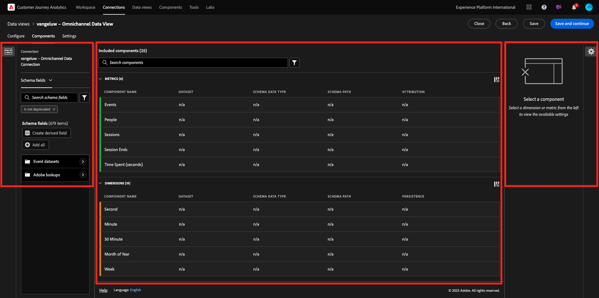
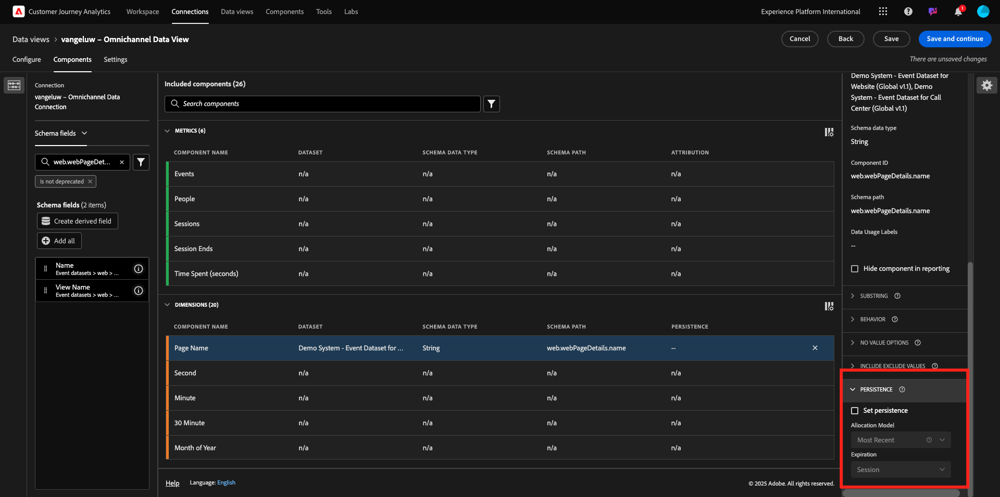

# 4.1.3 Création d’une vue de données

## Objectifs

- Présentation de l’interface utilisateur des vues de données
- Comprendre les paramètres de base de la définition de visite
- Comprendre l’attribution et la persistance dans une vue de données

## Vue de données 4.1.3.1

Une fois la connexion établie, vous pouvez passer à l’influence de la visualisation. Une différence entre Adobe Analytics et CJA réside dans le fait que CJA a besoin d’une Vue de données pour nettoyer et préparer les données avant la visualisation.

Une vue de données est similaire au concept des suites de rapports virtuelles dans Adobe Analytics, où vous définissez des définitions de visite adaptées au contexte, un filtrage et également la manière dont les composants sont appelés.

Vous aurez besoin d’au moins une vue de données par connexion. Cependant, pour certains cas d’utilisation, il est préférable d’avoir plusieurs vues de données pour la même connexion, dans le but de donner des informations différentes à différentes équipes.
Si vous souhaitez que votre entreprise devienne axée sur les données, vous devez adapter la manière dont les données sont vues dans chaque équipe. Voici quelques exemples :

- Mesures UX uniquement pour l’équipe de conception UX
- Utilisez les mêmes noms pour les indicateurs clés de performance et les mesures pour les Google Analytics que pour le Customer Journey Analytics afin que l’équipe d’analyse numérique ne puisse parler qu’une seule langue.
- Vue de données filtrée pour afficher, par exemple, les données d’un seul marché, d’une seule marque ou uniquement pour les appareils mobiles.

Dans l’écran **Connexions**, cochez la case en regard de la connexion que vous venez de créer. Cliquez sur **Créer une vue de données**.

Vous serez redirigé vers le workflow **Créer une vue de données**.

## Définition de la vue de données 4.1.3.2

Vous pouvez maintenant configurer les définitions de base pour votre vue de données.

Le **Connexion** créé dans l’exercice précédent est déjà sélectionné. Votre connexion est nommée `--aepUserLdap-- – Omnichannel Data Connection`.

Attribuez ensuite un nom à votre vue de données en suivant cette convention d’affectation de nom : `--aepUserLdap-- – Omnichannel Data View`.

Saisissez la même valeur pour la description : `--aepUserLdap-- – Omnichannel Data View`.

| Nom | Description | Identifiant externe |
| ----------------- |-------------|-------------| 
| `--aepUserLdap-- – Omnichannel Data View` | `--aepUserLdap-- – Omnichannel Data View` | `--aepUserLdap--123` |

Pour le **fuseau horaire**, sélectionnez le fuseau horaire **heure de Greenwich ; Monrovia, Casablanca [GMT]**. C&#39;est un contexte très intéressant, car certaines entreprises opèrent dans des pays et des zones géographiques différents. Attribuer le bon fuseau horaire pour chaque pays évitera les erreurs de données habituelles telles que croire qu&#39;au Pérou, par exemple, la majorité de la population achète des t-shirts à 4 heures du matin.

Vous pouvez également modifier le nom des mesures principales (Personne, Session et Événement). Cela n’est pas obligatoire, mais certains clients préfèrent utiliser Personnes, Visites et Accès au lieu de Personne, Session et Événements (convention de nommage par défaut de Customer Journey Analytics).

Les paramètres suivants doivent maintenant être configurés :

Cliquez sur **Enregistrer et continuer**.

Cliquez sur **Enregistrer**.

## 4.1.3.3 des composants de vue de données

Dans cet exercice, vous allez configurer les composants dont vous avez besoin pour analyser les données et les visualiser à l’aide d’Analysis Workspace. Dans cette interface utilisateur, il existe trois zones principales :

- Côté gauche : composants disponibles à partir des jeux de données sélectionnés
- Milieu : composants ajoutés à la vue de données
- Côté droit : paramètres des composants

Vous devez maintenant faire glisser et déposer les composants dont vous avez besoin pour l’analyse dans le **Composants ajoutés**. Pour ce faire, vous devez sélectionner les composants dans le menu de gauche, puis les faire glisser et les déposer sur la zone de travail au milieu.

Commençons par le premier composant : **Name (web.webPageDetails.name)**. Recherchez ce composant, puis faites-le glisser et déposez-le sur la zone de travail.

Ce composant est le nom de la page, comme vous pouvez le déduire à la lecture des `(web.webPageDetails.name)` du champ de schéma.

Toutefois, l’utilisation du nom **Name** n’est pas la meilleure convention de nommage pour qu’un utilisateur chargé de la conception de parcours puisse rapidement comprendre cette dimension.

Changeons le nom en **Nom de la page**. Cliquez sur le composant et renommez-le dans la zone **Paramètres des composants**.

Les **paramètres de persistance** sont très importants. Le concept des evars et des prop n’existe pas dans CJA, mais les paramètres de persistance rendent possible un comportement similaire.

Si vous ne modifiez pas ces paramètres, CJA interprétera la dimension en tant que **Prop** (niveau d’accès). Nous pouvons également modifier la Persistance pour que la dimension devienne **eVar** (conservez la valeur dans le parcours).

Si vous ne connaissez pas les eVars et les props, vous pouvez [en savoir plus à leur sujet dans la documentation](https://experienceleague.adobe.com/docs/analytics/landing/an-key-concepts.html).

Laissons le Nom de page en tant que prop. Par conséquent, vous n’avez pas besoin de modifier les **paramètres de persistance**.

| Nom du composant à rechercher | Nouveau nom | Paramètres de persistance |
| ----------------- |-------------| --------------------| 
| Nom (web.webPageDetails.name) | Nom de la page |          |

Sélectionnez ensuite la dimension **phoneNumber** et déposez-la sur la zone de travail. Le nouveau nom doit être **Numéro de téléphone**.

Enfin, modifions les paramètres de persistance, car le numéro de mobile doit persister au niveau de l’utilisateur.

Pour modifier la Persistance, faites défiler l’écran vers le bas dans le menu de droite et ouvrez l’onglet **Persistance** :

Cochez la case pour modifier les paramètres de persistance. Sélectionnez **Le dernier** et la portée **Personne (intervalle du compte rendu des performances)** car nous nous préoccupons uniquement du dernier numéro de mobile de cette personne. Si le client ne renseigne pas le mobile lors de prochaines visites, cette valeur sera toujours renseignée.

| Nom du composant à rechercher | Nouveau nom | Paramètres de persistance |
| ----------------- |-------------| --------------------| 
| phoneNumber | Numéro de téléphone | Fenêtre De Compte Rendu Des Performances Des Personnes La Plus Récente |

Le composant suivant est `web.webPageDetails.pageViews.value`.

Dans le menu de gauche, recherchez `web.webPageDetails.pageViews.value`. Effectuez un glisser-déposer de cette mesure sur la zone de travail.

Remplacez le nom par **Pages vues** sous **Paramètres des composants**.

| Nom du composant à rechercher | Nouveau nom | Paramètres d’attribution |
| ----------------- |-------------| --------------------| 
| web.webPageDetails.pageViews.value | Pages vues |         |

Pour les paramètres d’attribution, vous n’avez rien à modifier.

Remarque : les paramètres de persistance sur les mesures peuvent également être modifiés dans Analysis Workspace. Dans certains cas, vous pouvez choisir de le définir ici pour éviter aux utilisateurs professionnels d’avoir à réfléchir au meilleur modèle de persistance.

Ensuite, vous devrez configurer de nombreuses Dimensions et mesures, comme indiqué dans le tableau ci-dessous.

### DIMENSIONS

| Nom du composant à rechercher | Nouveau nom | Paramètres de persistance |
| ----------------- |-------------| --------------------| 
| brandName | Nom de la marque | La Plus Récente, Session |
| sentiment d&#39;appel | Sentiment D’Appel |          |
| identifiant de l&#39;appel | Type d’interaction d’appel |          |
| callTopic | Rubrique d&#39;appel | La Plus Récente, Session |
| ecid | ECID | Fenêtre De Compte Rendu Des Performances Des Personnes La Plus Récente |
| E-mail | ID d’e-mail | Fenêtre De Compte Rendu Des Performances Des Personnes La Plus Récente |
| Type de paiement | Type de paiement |          |
| Méthode d’ajout du produit | Méthode d’ajout du produit | La Plus Récente, Session |
| Type d’événement | Type d’événement |         |
| Nom (productListItems.name) | Nom du produit |         |
| SKU | SKU (session) | La Plus Récente, Session |
| Identifiant de transaction | Identifiant de transaction |         |
| URL (web.webPageDetails.URL) | URL |         |
| Agent utilisateur | Agent utilisateur | La Plus Récente, Session |

### MESURES

| Nom du composant à rechercher | Nouveau nom | Paramètres d’attribution |
| ----------------- |-------------| --------------------| 
| Quantité | Quantité |          |
| commerce.order.priceTotal | Chiffre d’affaires |         |

Votre configuration doit alors ressembler à ceci. N’oubliez pas d’**Enregistrer** votre vue de données. Cliquez donc sur **Enregistrer** maintenant.

## 4.1.3.4 des mesures calculées

Bien que vous ayez organisé tous les composants dans la vue de données, vous devez encore en adapter certains, afin que les utilisateurs professionnels soient prêts à commencer leur analyse.

Souvenez-vous que vous n’avez pas spécifiquement intégré de mesures telles que Ajouter au panier, consultation de produit ou achats dans la vue de données.
Cependant, vous disposez d’une dimension appelée : **Type d’événement**. Vous pouvez donc dériver ces types d’interaction en créant 3 mesures calculées.

Commençons par la première mesure : **consultations de produits**.

Sur le côté gauche, recherchez **Type d’événement** et sélectionnez la dimension. Faites-la ensuite glisser dans la zone de travail **Composants inclus**.
Cliquez pour sélectionner la nouvelle mesure **Type d’événement**.

Remplacez maintenant le nom et la description du composant par les valeurs suivantes :

| Nom du composant | Description du composant |
| ----------------- |-------------| 
| Consultations produits | Consultations produits |

Maintenant, permet de compter uniquement les événements **Vues des produits**. Pour ce faire, faites défiler l’écran vers le bas sur le **Paramètres des composants** jusqu’à afficher **Inclure/Exclure les valeurs**. Veillez à activer l’option **Définir les valeurs d’inclusion/exclusion**.

Comme vous souhaitez uniquement comptabiliser les **vues de produits**, spécifiez **commerce.productViews** sous les critères.

Votre mesure calculée est maintenant prête.

Répétez ensuite le même processus pour les événements **Ajouter au panier** et **Achat**.

### Ajouter au panier

Effectuez d’abord un glisser-déposer de la même dimension **Type d’événement**.

Une fenêtre contextuelle s’affiche pour signaler un champ dupliqué, car nous utilisons la même variable. Cliquez sur **Ajouter quand même** :

Suivez à présent le même processus que pour les consultations de produits liées à la mesure :
- Modifiez d’abord le nom et la description.
- Enfin, ajoutez **commerce.productListAdds** comme critère pour comptabiliser uniquement les ajouts au panier.

| Nom | Description | Critères |
| ----------------- |-------------| -------------|
| Ajouter au panier | Ajouter au panier | commerce.productListAdds |

### Achats

Effectuez d’abord un glisser-déposer de la même dimension **Type d’événement** que pour les deux mesures précédentes.

Une fenêtre contextuelle s’affiche pour signaler un champ dupliqué, car nous utilisons la même variable. Cliquez sur **Ajouter quand même** :

À présent, suivez le même processus que pour les mesures Consultations de produit et Ajout au panier :
- Modifiez d’abord le nom et la description.
- Enfin, ajoutez **commerce.purchases** comme critères pour comptabiliser uniquement les ajouts aux paniers

| Nom | Description | Critères |
| ----------------- |-------------| -------------|
| Achats | Achats | commerce.purchases |

Votre configuration finale devrait alors ressembler à ceci. Cliquez sur **Enregistrer et continuer**.

## Paramètres de la vue de données 4.1.3.5

Vous devriez être redirigé vers cet écran :

Dans cet onglet, vous pouvez modifier certains paramètres importants pour modifier la manière dont les données sont traitées. Commençons par définir le **délai d’expiration de la session** sur 30 minutes. Grâce à la date et à l’heure de chaque événement d’expérience, vous pouvez étendre le concept d’une session sur tous les canaux. Par exemple, que se passe-t-il si un client appelle le centre d’appels après avoir consulté le site Web ? L’utilisation de temporisations de session personnalisées offre une grande flexibilité dans le choix d’une session et de la manière dont cette session fusionnera les données.

Dans cet onglet, vous pouvez modifier d’autres éléments, tels que le filtrage des données à l’aide d’un segment/filtre. Vous n&#39;aurez pas besoin de faire cela dans cet exercice.

Une fois que vous avez terminé, cliquez sur **Enregistrer et terminer**.

>[!NOTE]
>
>Vous pouvez revenir à cette vue de données par la suite et modifier les paramètres et les composants à tout moment. Les modifications auront une incidence sur l’affichage des données historiques.

Vous pouvez maintenant passer à la partie visualisation et analyse !

Étape suivante : [4.1.4 Préparation des données en Customer Journey Analytics ](./ex4.md)

[Retour au module 4.1](./customer-journey-analytics-build-a-dashboard.md)

[Revenir à tous les modules](./../../../overview.md)
