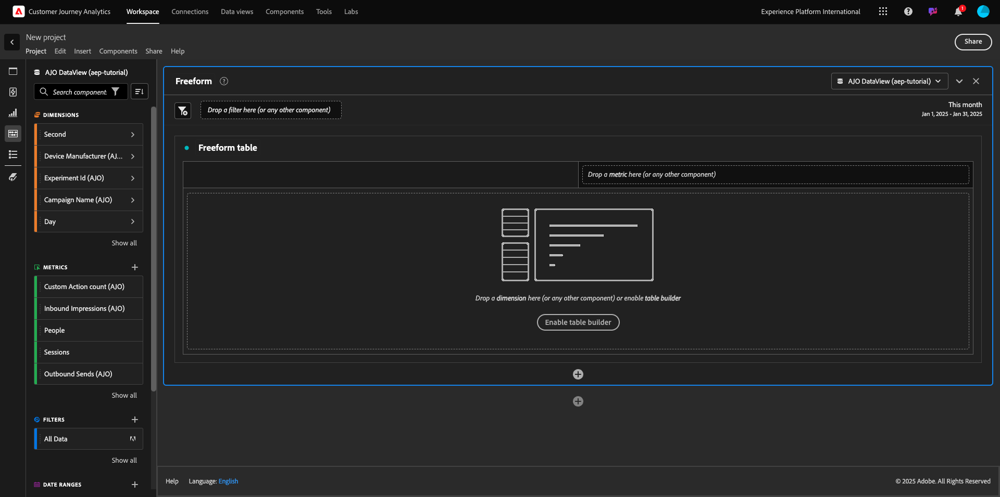
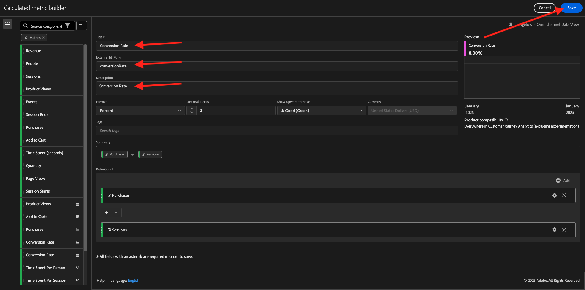

# 4.1.4 Préparation des données dans Analysis Workspace

## Objectifs

- Présentation de l’interface utilisateur d’Analysis Workspace dans CJA
- Présentation des concepts de préparation des données dans Analysis Workspace
- Découvrez comment effectuer des calculs de données

## 4.1.4.1 Interface utilisateur d’Analysis Workspace dans CJA

Analysis Workspace supprime toutes les limites types d’un rapport Analytics unique. Il offre un canevas robuste et flexible pour créer des projets d’analyse personnalisés. Faites glisser un nombre indéfini de tableaux de données, de visualisations et de composants (dimensions, mesures, segments et granularités temporelles) vers un projet. Créez instantanément des ventilations et des segments, des cohortes pour analyse, ainsi que des alertes, comparez des segments, analysez les flux et les abandons, et traitez et planifiez des rapports pour les partager avec n’importe qui dans votre entreprise.

Customer Journey Analytics ajoute cette solution aux données de Platform. Nous vous recommandons vivement de regarder cette vidéo de présentation de quatre minutes :

>[!VIDEO](https://video.tv.adobe.com/v/35109?quality=12&learn=on)

Si vous n’avez jamais utilisé Analysis Workspace auparavant, nous vous recommandons vivement de regarder cette vidéo :

>[!VIDEO](https://video.tv.adobe.com/v/26266?quality=12&learn=on)

### Créer un projet

Il est maintenant temps de créer votre premier projet CJA. Accédez à l’onglet Projets dans CJA.
Cliquez sur **Créer**.

Vous verrez alors ceci. Sélectionnez **Projet vierge**, puis cliquez sur **Créer**.

Vous verrez alors un projet vide.

Tout d’abord, veillez à sélectionner la bonne vue de données dans le coin supérieur droit de votre écran. Dans cet exemple, la vue de données à sélectionner est `vangeluwe - Omnichannel Data View`.

Ensuite, vous allez enregistrer votre projet et lui donner un nom. Vous pouvez utiliser la commande suivante pour enregistrer :

| SE | Couper court |
| ----------------- |-------------| 
| Windows | Ctrl + S |
| Mac | Commande + S |

Vous verrez cette fenêtre contextuelle :

Utilisez cette convention d’affectation des noms :

| Nom | Description |
| ----------------- |-------------| 
| `--aepUserLdap-- - Omnichannel Analysis` | `--aepUserLdap-- - Omnichannel Analysis` |

Cliquez ensuite sur **Enregistrer**.

## 4.1.4.2 Mesures calculées

Bien que nous ayons organisé tous les composants dans la vue de données, vous devez tout de même en adapter certains, afin que les utilisateurs professionnels soient prêts à commencer leur analyse. En outre, durant toute analyse, vous pouvez créer une mesure calculée pour approfondir les résultats des insights.

Par exemple, nous allons créer un **taux de conversion** calculé à l’aide de la mesure/de l’événement **Achats** que nous avons défini dans la vue de données.

### Taux de conversion

Commençons par ouvrir le créateur de mesures calculées. Cliquez sur **+** pour créer votre première mesure calculée dans Analysis Workspace.

Le **créateur de mesures calculées** s’affiche :

Recherchez l’élément **Achats** dans la liste des mesures dans le menu de gauche. Sous **Metrics**, cliquez sur **Tout afficher**

Faites maintenant glisser la mesure **Achats** et déposez-la dans la définition de mesure calculée.

En règle générale, le taux de conversion correspond à **Conversions/sessions**. Alors faisons le même calcul dans le canevas de définition de mesure calculée. Recherchez la mesure **Sessions** et faites-la glisser et déposez-la dans le créateur de définitions, sous l’événement **Achats** .

Notez que l’opérateur de division est automatiquement sélectionné.

Le taux de conversion est généralement représenté en pourcentage. Donc, changeons le format en pourcentage et sélectionnons aussi 2 décimales.

Enfin, modifiez le nom et la description de la mesure calculée :

| Titre | Description |
| ----------------- |-------------| 
| Taux de conversion | Taux de conversion |

Vous verrez ce qui suit sur votre écran :

N’oubliez pas de **Enregistrer** la mesure calculée.

## 4.1.4.3 Dimensions calculées : filtres (segmentation) et plages de dates

### Filtres : Dimensions calculées

Les calculs ne sont pas destinés uniquement aux mesures. Avant de commencer une analyse, il est également intéressant de créer quelques **Dimensions calculées**. Cela signifiait simplement **segments** dans Adobe Analytics. En Customer Journey Analytics, ces segments sont appelés **Filtres**.

La création de filtres permet aux utilisateurs professionnels de commencer l’analyse avec des dimensions calculées importantes. Cela permettra d’automatiser certaines tâches et d’aider à l’étape d’adoption. Voici quelques exemples :

1. Média, Média Payé,
2. Visites nouvelles ou renouvelées
3. Clients avec panier abandonné

Ces filtres peuvent être créés avant ou pendant la partie analyse (ce que vous allez faire lors de l’exercice suivant).

### Plages de dates : Dimensions d’heures calculées

Les Dimensions de temps sont un autre type de dimensions calculées. Certains d’entre eux sont déjà créés, mais vous avez également la possibilité de créer vos propres Dimensions de temps personnalisées lors de la phase de préparation des données.

Ces Dimensions de temps calculé nous aideront les analystes et les utilisateurs professionnels à mémoriser des dates importantes et à les utiliser pour filtrer et modifier l’heure de création de rapports. Questions et doutes typiques qui nous viennent à l&#39;esprit lorsque nous faisons de l&#39;analyse :

- Quand était le Black Friday l&#39;année dernière ? 21e-29e ?
- Quand avons-nous dirigé cette campagne télévisée en décembre ?
- De quand à quand avons-nous réalisé les ventes d&#39;été 2018 ? Je veux le comparer à 2019. Au fait, connaissez-vous les jours exacts de 2019 ?

Vous avez maintenant terminé l’exercice de préparation des données à l’aide de CJA Analysis Workspace.

Étape suivante : [4.1.5 Visualisation à l’aide de Customer Journey Analytics](./ex5.md)

[Revenir au module 4.1](./customer-journey-analytics-build-a-dashboard.md)

[Revenir à tous les modules](./../../../overview.md)
