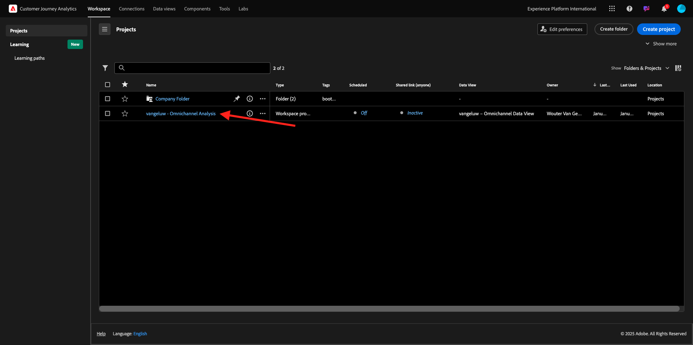
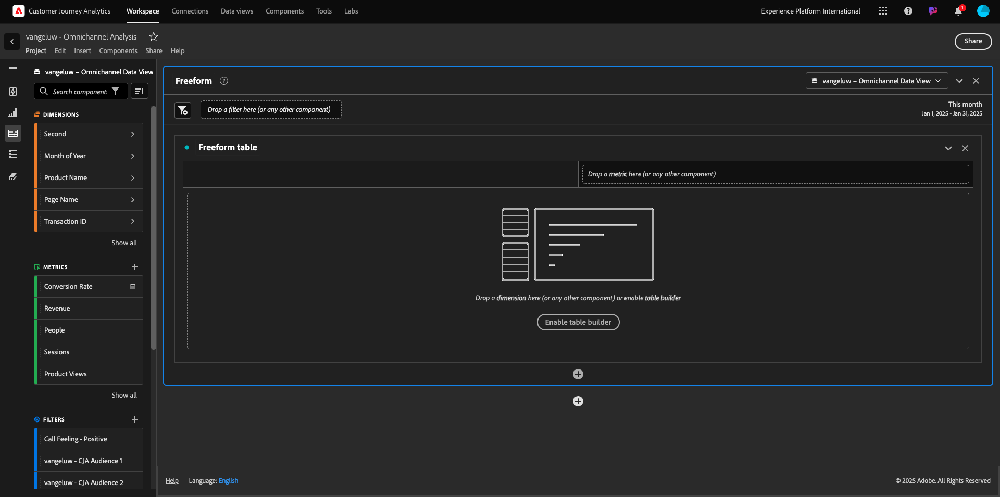
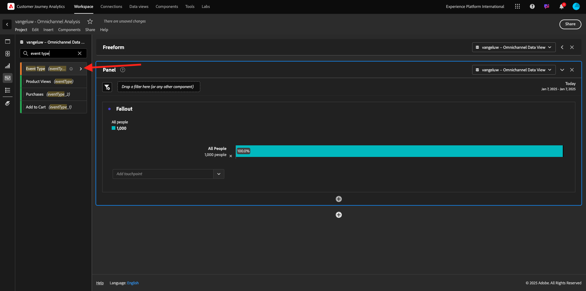
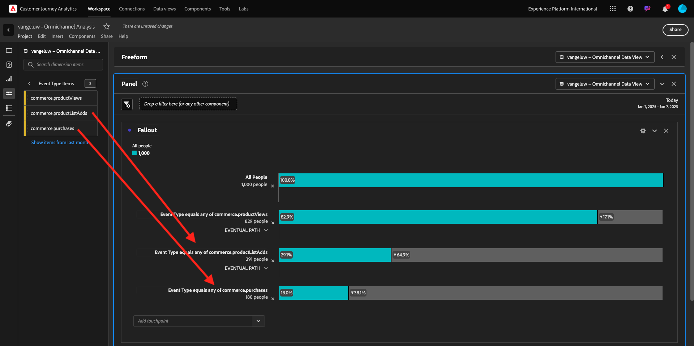
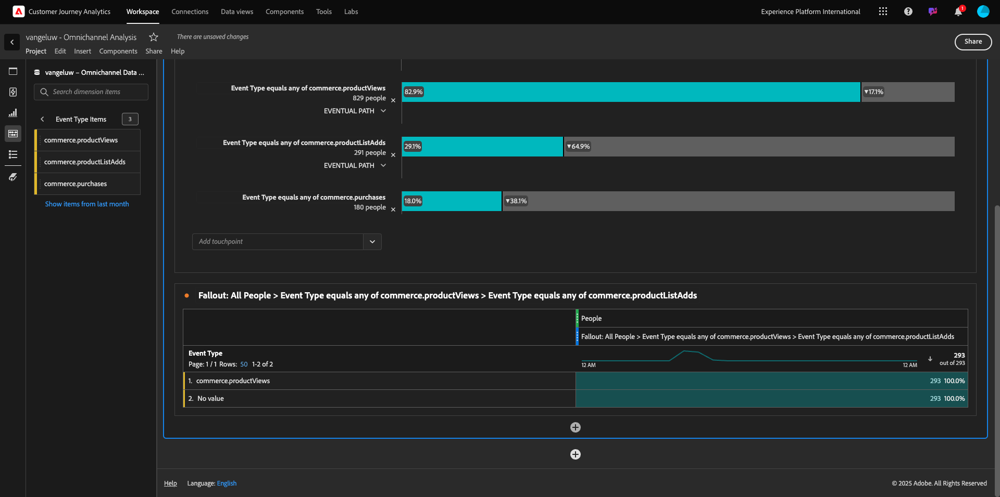
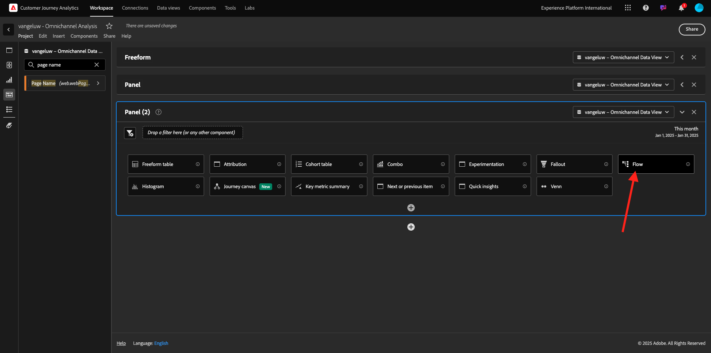
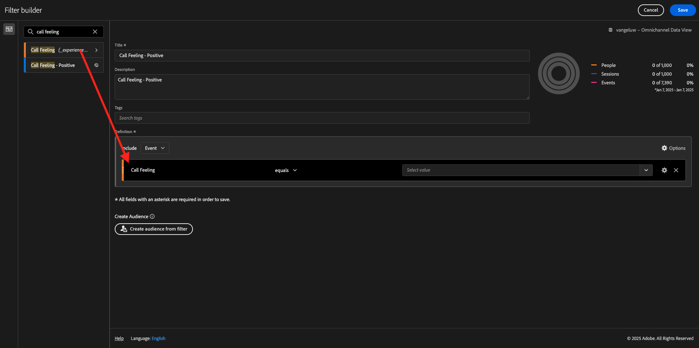

# 4.1.5 Visualisation à l’aide de Customer Journey Analytics

## Objectifs

- Présentation de l’interface utilisateur d’Analysis Workspace
- Découvrez certaines fonctionnalités qui rendent Analysis Workspace si différent.
- Découvrez comment effectuer des analyses dans CJA à l’aide d’Analysis Workspace

## Contexte

Dans ces exercices, vous utiliserez Analysis Workspace dans CJA pour analyser les consultations de produits, les entonnoirs de produits, l’attrition, etc.

Nous allons couvrir certaines des requêtes effectuées dans Module 7 - Query Service afin que vous puissiez voir à quel point il est facile d’exécuter les mêmes requêtes et plus encore, mais sans utiliser SQL et en ne vous fiant qu’à la philosophie de glisser-déposer d’Analysis Workspace.

Nous allons utiliser le projet que vous avez créé dans [4.1.4 Préparation des données dans Analysis Workspace](./ex4.md), accédez donc à [https://analytics.adobe.com](https://analytics.adobe.com).

Cliquez pour ouvrir le `--aepUserLdap-- - Omnichannel Analysis` de votre projet.

Une fois votre projet ouvert et la Vue de données `--aepUserLdap-- - Omnichannel Analysis` sélectionnée, vous êtes prêt à commencer à créer vos premières visualisations.

## Combien de consultations de produits avons-nous par jour ?

Tout d’abord, vous devez sélectionner les dates appropriées pour analyser les données. Accédez à la liste déroulante Calendrier sur le côté droit de la zone de travail. Cliquez dessus et sélectionnez la période applicable.

Dans le menu de gauche (zone Composants), recherchez la Mesure calculée **Vues des produits**. Sélectionnez-la et faites-la glisser et déposez-la dans la zone de travail, en haut à droite dans le tableau à structure libre.

La dimension **Jour** sera automatiquement ajoutée pour créer votre premier tableau. Vous pouvez maintenant voir la réponse à votre question à la volée.

Cliquez ensuite avec le bouton droit de la souris sur le résumé des mesures. Cliquez sur **Visualiser**.

Cliquez sur **Ligne**.

Vos produits sont affichés en fonction de l’heure.

Vous pouvez modifier la portée temporelle au jour le jour en cliquant sur **Paramètres** dans la visualisation.

Cliquez sur le point en regard de **Ligne** pour **Gérer la Source de données**.

Cliquez ensuite sur **Verrouiller la sélection** et sélectionnez **Éléments sélectionnés** pour verrouiller cette visualisation afin qu’elle affiche toujours une chronologie des consultations de produits.

## Top 5 des produits consultés

Quels sont les 5 produits les plus consultés ?

N’oubliez pas d’enregistrer le projet de temps en temps.

| SE | Raccourci |
| ----------------- |-------------| 
| Windows | Ctrl+S |
| Mac | Commande + S |

Commençons par trouver les 5 produits les plus consultés. Dans le menu de gauche, recherchez la Dimension **Nom du produit** - .

Effectuez maintenant un glisser-déposer **Nom du produit** pour remplacer la dimension **Jour** :

Ce sera le résultat. Sélectionnez les 4 noms de produit pour afficher la mise à jour de la visualisation.

Ensuite, essayez de ventiler l’un des produits par nom de marque. Recherchez **brandName** et faites-le glisser sous le premier nom de produit.

Procédez ensuite à une répartition à l’aide de l’agent utilisateur. Recherchez **Agent utilisateur** et faites-le glisser sous le nom de la marque.

Vous verrez alors ceci :

Enfin, vous pouvez ajouter d’autres visualisations. Sur le côté gauche, sous visualisations, recherchez `Donut`. Prenez `Donut`, faites-le glisser et déposez-le sur la zone de travail sous la visualisation **Ligne**.

Ensuite, dans le tableau , sélectionnez les 5 premières lignes **Agent utilisateur** de la répartition que nous avons effectuée sous **Google Pixel XL 32 Go Black Smartphone** > **Signal Citi**. Lors de la sélection des 3 lignes, maintenez le bouton **Ctrl** (sous Windows) ou le bouton **Commande** (sous Mac) enfoncé. Le graphique en anneau est mis à jour.

Vous pouvez même adapter la conception pour qu’elle soit plus lisible, en réduisant légèrement le graphique **Ligne** et le graphique **Anneau** afin qu’ils puissent s’adapter l’un à l’autre :

Cliquez sur le point en regard de **Anneau** pour **Gérer la Source de données**.
Cliquez ensuite sur **Verrouiller la sélection** pour verrouiller cette visualisation afin qu’elle affiche toujours une chronologie des consultations de produits.

Pour en savoir plus sur les visualisations à l’aide d’Analysis Workspace, cliquez ici :

- [https://experienceleague.adobe.com/docs/analytics/analyze/analysis-workspace/visualizations/freeform-analysis-visualizations.html](https://experienceleague.adobe.com/docs/analytics/analyze/analysis-workspace/visualizations/freeform-analysis-visualizations.html)
- [https://experienceleague.adobe.com/docs/analytics/analyze/analysis-workspace/visualizations/t-sync-visualization.html](https://experienceleague.adobe.com/docs/analytics/analyze/analysis-workspace/visualizations/t-sync-visualization.html)

## Entonnoir d’interaction du produit, de la consultation à l’achat

Il existe de nombreuses façons de résoudre cette question. L’une d’elles consiste à utiliser le type d’interaction de produit et à l’utiliser sur un tableau à structure libre. Vous pouvez également utiliser une **visualisation des abandons**. Utilisons le dernier exemple, car nous voulons visualiser et analyser en même temps.

Fermez le panneau actuel en cliquant ici :

Ajoutez maintenant un nouveau panneau vierge en cliquant sur **+ Ajouter un panneau vierge**.

Cliquez sur la visualisation **Abandon**.

Sélectionnez la même période que dans l’exercice précédent.

Tu verras ça.

Recherchez la dimension **Type d’événement** sous les composants sur le côté gauche. Cliquez sur la flèche pour ouvrir la dimension.

Tous les types d’événements disponibles s’affichent.

Sélectionnez l’élément **commerce.productViews** et glissez-déposez-le sur le champ **Ajouter un point de contact** à l’intérieur de la **Visualisation des abandons**.

Faites de même avec **commerce.productListAdds** et **commerce.purchases** et déposez-les dans le champ **Ajouter un point de contact** à l’intérieur de la **Visualisation des abandons**. Voici à quoi ressemblera désormais votre visualisation :

On peut faire beaucoup de choses ici. Quelques exemples : comparer au fil du temps, comparer chaque étape par appareil ou comparer par fidélité. Cependant, si vous souhaitez analyser des éléments intéressants, comme les raisons pour lesquelles les clients n’achètent pas après avoir ajouté un article dans leur panier, nous pouvons utiliser le meilleur outil de CJA : un clic droit.

Cliquez avec le bouton droit sur le point de contact **commerce.productListAdds**. Cliquez ensuite sur **Répartir les abandons à ce point de contact**.

Un nouveau tableau à structure libre sera créé pour analyser ce que les personnes ont fait si elles n’ont pas acheté.

Modifiez le **Type d’événement** par **Nom de page**, dans le nouveau tableau à structure libre, pour voir les pages vers lesquelles ils se dirigent au lieu de la page de confirmation d’achat.

## Que font les visiteurs sur le site avant d&#39;accéder à la page Annuler le service ?

Encore une fois, il existe de nombreuses façons d’effectuer cette analyse. Utilisons l’analyse de flux pour commencer la partie de découverte.

Fermez le panneau actuel en cliquant ici, puis ajoutez un nouveau panneau vierge en cliquant sur **+ Ajouter un panneau vierge**.

Cliquez sur la visualisation **Flux**.

Tu verras ça. Sélectionnez la même période que dans l’exercice précédent. Cliquez sur **Appliquer**.

Recherchez la dimension **Nom de la page** sous les composants sur le côté gauche et cliquez sur la flèche pour ouvrir la dimension.

Toutes les pages sont consultées. Recherchez le nom de la page : **Annuler le service**.
Effectuez un glisser-déposer **Annuler le service** dans la visualisation de flux du champ central. Cliquez sur **Créer**.

Vous verrez alors ceci :

Examinons maintenant si les clients qui ont visité la page **Annuler le service** sur le site web ont également appelé le centre d’appel et quel en a été le résultat.

Sous les dimensions, revenez en arrière et recherchez **Type d’interaction d’appel**.
Effectuez un glisser-déposer **Type d’interaction d’appel** pour remplacer la première interaction à droite dans la **Visualisation de flux**.

Le ticket d’assistance des clients qui ont appelé le centre d’appel s’affiche maintenant après avoir consulté la page **Annuler le service**.

Ensuite, sous les dimensions, recherchez **Sentiment d’appel**.  Faites-la glisser pour remplacer la première interaction à droite dans la **Visualisation de flux**.

Vous verrez alors ceci :

Comme vous pouvez le constater, nous avons exécuté une analyse omnicanale à l’aide de la visualisation des flux . Grâce à cela, nous avons constaté que certains clients qui envisageaient d&#39;annuler leur service avaient un sentiment positif après avoir appelé le centre d&#39;appels. Avons-nous peut-être changé d&#39;avis avec une promotion?

## Comment les clients disposant d’un contact Callcenter positif se comportent-ils par rapport aux principaux indicateurs de performance clés ?

Segmentons d’abord les données pour n’obtenir que les utilisateurs qui ont des appels **positifs**. Dans CJA, les segments sont appelés Filtres. Accédez à Filtres dans la zone des composants (sur le côté gauche) et cliquez sur **+**.

Dans le créateur de filtres, attribuez un nom au filtre

| Nom | Description |
| ----------------- |-------------| 
| Sensation d’appel - Positif | Sensation d’appel - Positif |

Sous les composants (dans le Créateur de filtres), recherchez **Sentiment d’appel** et glissez-déposez-le dans la Définition du Créateur de filtres.

Sélectionnez maintenant **positif** comme valeur du filtre.

Modifiez la portée pour qu’elle soit de niveau **Personne**. Cliquez sur **Enregistrer**.

Tu seras de retour ici. Si ce n’est pas encore fait, fermez le panneau précédent et ajoutez un nouveau panneau vierge en cliquant sur **+ Ajouter un panneau vierge**.

Sélectionnez la même période que dans l’exercice précédent. Cliquez sur **Appliquer**.

Cliquez sur **Tableau à structure libre**.

Maintenant, glissez-déposez le filtre que vous venez de créer.

Il est temps d’ajouter des mesures. Commencez par **Consultations produits**. Effectuez un glisser-déposer dans le tableau à structure libre. Vous pouvez également supprimer la mesure **Événements**.

Faites de même avec **Personnes**, **Ajouter au panier** et **Achats**. Vous finirez avec une table comme celle-ci.

Grâce à la première analyse de flux, une nouvelle question est venue à l&#39;esprit. Nous avons donc décidé de créer ce tableau et de comparer certains indicateurs de performance clés à un segment pour répondre à cette question. Comme vous pouvez le constater, le délai d’obtention des informations est beaucoup plus court que si vous utilisiez SQL ou d’autres solutions de BI.

## Récapitulatif de Customer Journey Analytics et Analysis Workspace

Comme vous l’avez appris dans cet atelier, Analysis Workspace regroupe les données de tous les canaux pour analyser l’ensemble du parcours client. En outre, n’oubliez pas que vous pouvez importer les données dans le même espace de travail qui n’est pas assemblé au parcours.
Il peut s’avérer très utile d’importer des données déconnectées dans votre analyse pour donner un contexte au parcours. Par exemple, les données NPS, les questionnaires, les événements Facebook Ads ou les interactions hors ligne (non identifiées).

Étape suivante : [Résumé et avantages](./summary.md)

[Retour au module 4.1](./customer-journey-analytics-build-a-dashboard.md)

[Revenir à tous les modules](./../../../overview.md)
