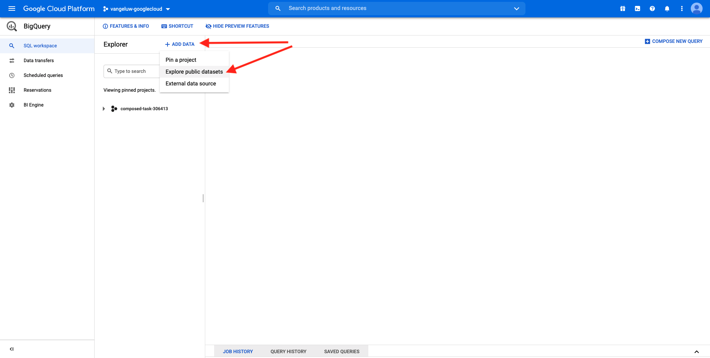

# 4.2.1 Création de votre compte Google Cloud Platform

## Objectifs

- Création de votre compte Google Cloud Platform
- Familiarisez-vous avec la console Google Cloud Platform
- Créer et préparer votre projet BigQuery

## 4.2.1.1 Pourquoi connecter Google BigQuery à Adobe Experience Platform pour obtenir des données Google Analytics

Google Cloud Platform (GCP) est une suite de services de cloud computing publics proposés par Google. Google Cloud Platform comprend un éventail de services hébergés pour le développement d’ordinateurs, de stockage et d’applications qui s’exécutent sur du matériel Google.

BigQuery est l’un de ces services et il est toujours inclus avec Google Analytics 360. Les données Google Analytics sont fréquemment échantillonnées lorsque nous tentons d’en obtenir directement (API par exemple). C’est pourquoi Google inclut BigQuery pour obtenir des données non échantillonnées, de sorte que les marques puissent effectuer des analyses avancées à l’aide de SQL et bénéficier de la puissance de GCP.

Les données Google Analytics sont chargées quotidiennement dans BigQuery à l’aide d’un mécanisme par lots. Par conséquent, il n’est pas logique d’utiliser cette intégration GCP/BigQuery pour les cas d’utilisation de la personnalisation et de l’activation en temps réel.

Si une marque souhaite proposer des cas d’utilisation de personnalisation en temps réel basés sur des données de Google Analytics, elle peut collecter ces données sur le site web à l’aide de Google Tag Manager, puis les diffuser en temps réel vers Adobe Experience Platform.

Le connecteur GCP/BigQuery Source doit être utilisé pour...

- effectuez le suivi de tous les comportements des clients sur le site web et chargez ces données dans Adobe Experience Platform pour les cas d’utilisation d’analyse, de science des données et de personnalisation qui ne nécessitent pas d’activation en temps réel.
- charger des données historiques Google Analytics dans Adobe Experience Platform, à nouveau pour des cas d’utilisation d’analyse et de science des données ;

## 4.2.1.2 Création de votre compte Google

Pour obtenir un compte Google Cloud Platform, vous avez besoin d’un compte Google.

## 4.2.1.3 Activation de votre compte Google Cloud Platform

Maintenant que vous disposez de votre compte Google, vous pouvez créer un environnement Google Cloud Platform. Pour ce faire, accédez à [https://console.cloud.google.com/](https://console.cloud.google.com/).

Sur la page suivante, acceptez les conditions générales.

Cliquez ensuite sur **Sélectionner un projet**.

Cliquez sur **NEW PROJECT**.

Nommez votre projet selon cette convention d’affectation des noms :

| Convention | Exemple |
| ----------------- |-------------| 
| `--aepUserLdap---googlecloud` | delaiglecloud |

Cliquez sur **Créer**.

Patientez jusqu’à ce que la notification située en haut à droite de l’écran vous indique que la création est terminée. Cliquez ensuite sur **Afficher le projet**.

Ensuite, accédez à la barre de recherche en haut de l’écran et saisissez **BigQuery**. Sélectionnez le premier résultat.

Vous serez alors redirigé vers la console BigQuery et un message contextuel s’affichera.

**Cliquez sur Terminé**.

L’objectif de ce module est d’obtenir des données Google Analytics dans Adobe Experience Platform. Pour ce faire, nous avons besoin de données factices dans un jeu de données Google Analytics pour commencer.

Cliquez sur **Ajouter des données** dans le menu de gauche, puis sur **Explorer les jeux de données publics**.

Vous verrez alors cette fenêtre :

Saisissez le terme de recherche **Google Analytics Sample** dans la barre de recherche et sélectionnez le premier résultat.

L’écran suivant contient une description du jeu de données. Cliquez sur **AFFICHER LE JEU DE DONNÉES**.

Vous serez ensuite redirigé vers BigQuery où vous verrez ce jeu de données **bigquery-public-data** sous **Explorateur**.

Dans **Explorateur**, vous devriez maintenant voir plusieurs tables. N&#39;hésitez pas à les explorer. Accédez à `google_analytics_sample`.

Cliquez pour ouvrir la table `ga_sessions`.

Avant de poursuivre l’exercice suivant, écrivez les éléments suivants dans un fichier texte distinct sur votre ordinateur :

| Informations d’identification | Attribution d&#39;un nom | Exemple |
| ----------------- |-------------| -------------|
| Nom du projet | `--aepUserLdap---googlecloud` | vangeluw-googlecloud |
| Identifiant de projet | random | composé-tâche-306413 |

Vous pouvez trouver votre nom de projet et votre ID de projet en cliquant sur le **nom du projet** dans la barre de menu supérieure :

Votre ID de projet s’affiche alors sur le côté droit :

Vous pouvez maintenant passer à l’exercice 12.2 où vous allez vous salir les mains en interrogeant des données Google Analytics.

Étape suivante : [4.2.2 Créez votre première requête dans BigQuery](./ex2.md)

[Revenir au module 4.2](./customer-journey-analytics-bigquery-gcp.md)

[Revenir à tous les modules](./../../../overview.md)
