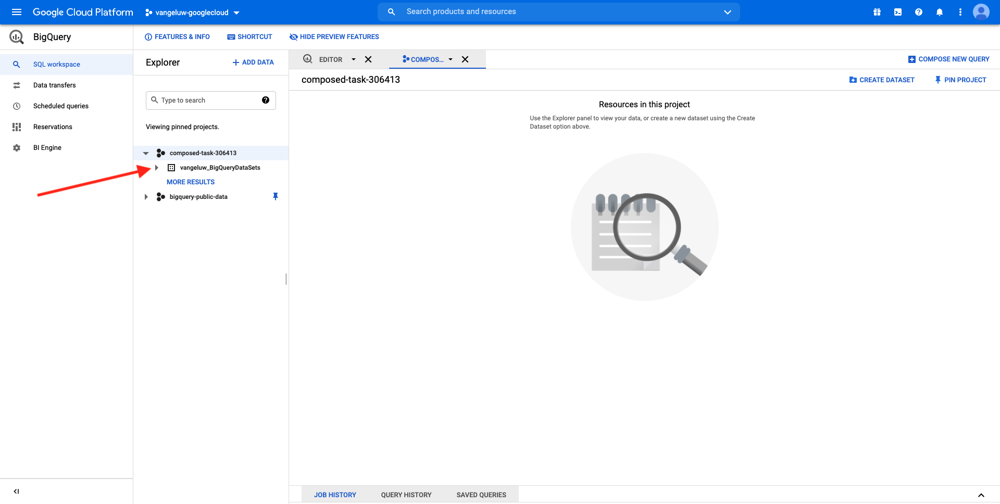
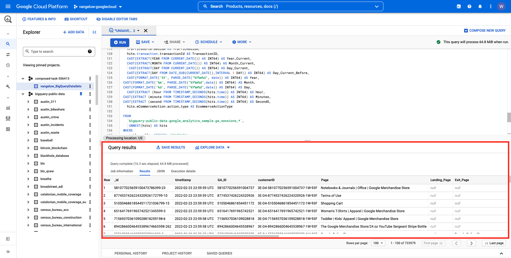
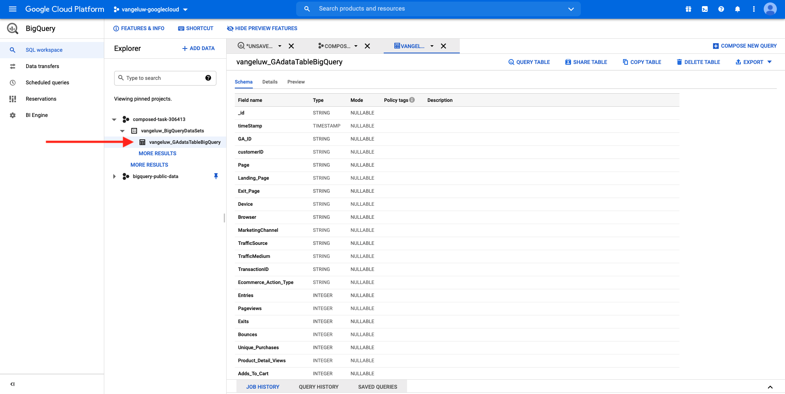

# 4.2.2 Création de votre première requête dans BigQuery

## Objectifs

- Exploration de l’interface utilisateur de BigQuery
- Création d’une requête SQL dans BigQuery
- Enregistrer les résultats de votre requête SQL dans un jeu de données dans BigQuery

## Contexte

Lorsque les données Google Analytics se trouvent dans BigQuery, les dimensions, les mesures et d’autres variables sont toutes imbriquées. En outre, les données Google Analytics sont chargées quotidiennement dans différentes tables. Cela signifie que tenter de connecter directement des tables Google Analytics dans BigQuery à Adobe Experience Platform est très difficile et pas une bonne idée.

La solution à ce problème consiste à transformer les données Google Analytics en un format lisible pour faciliter l’ingestion dans Adobe Experience Platform.

## 4.2.2.1 Création d’un jeu de données pour enregistrer de nouveaux tableaux BigQuery

Accédez à la [console BigQuery](https://console.cloud.google.com/bigquery).


Dans **Explorateur**, votre ID de projet s’affiche. Cliquez sur votre ID de projet (ne cliquez pas sur le jeu de données **bigquery-public-data**).


Vous pouvez voir qu&#39;il n&#39;y a pas encore de jeu de données, alors créons-en un maintenant.
Cliquez sur **CRÉER UN JEU DE DONNÉES**.


Sur le côté droit de l’écran, le menu **Créer un jeu de données** s’affiche.


Pour l’ **identifiant du jeu de données**, utilisez la convention d’affectation des noms ci-dessous. Pour les autres champs, conservez les paramètres par défaut.

| Attribution d&#39;un nom | Exemple |
| ----------------- | ------------- | 
| `--demoProfileLdap--_BigQueryDataSets` | vangeluw_BigQueryDataSets |


Cliquez ensuite sur **Créer un jeu de données**.


Vous serez alors de retour dans la console BigQuery avec votre jeu de données créé.



## 4.2.2.2 Création de votre première requête SQL BigQuery

Vous allez ensuite créer votre première requête dans BigQuery. L’objectif de cette requête est de prendre les exemples de données des Google Analytics et de les transformer afin qu’ils puissent être ingérés dans Adobe Experience Platform. Accédez à l’onglet **EDITOR**.


Copiez la requête SQL suivante et collez-la dans cet éditeur de requêtes. N’hésitez pas à lire la requête et à comprendre la syntaxe BigQuery Google Analytics.


```sql
SELECT
  CONCAT(fullVisitorId, CAST(hitTime AS String), '-', hitNumber) AS _id,
  TIMESTAMP(DATETIME(Year_Current, Month_Current, Day_Current, Hour, Minutes, Seconds)) AS timeStamp,
  fullVisitorId as GA_ID,
  -- Fake CUSTOMER ID
  CONCAT('3E-D4-',fullVisitorId, '-1W-93F' ) as customerID,
  Page,
  Landing_Page,
  Exit_Page,
  Device,
  Browser,
  MarketingChannel,
  TrafficSource,
  TrafficMedium,
  -- Enhanced Ecommerce
  TransactionID,
  CASE
      WHEN EcommerceActionType = '2' THEN 'Product_Detail_Views'
      WHEN EcommerceActionType = '3' THEN 'Adds_To_Cart'
      WHEN EcommerceActionType = '4' THEN 'Product_Removes_From_Cart'
      WHEN EcommerceActionType = '5' THEN 'Product_Checkouts'
      WHEN EcommerceActionType = '6' THEN 'Product_Refunds'
    ELSE
    NULL
  END
     AS Ecommerce_Action_Type,
  -- Entrances (metric)
  SUM(CASE
      WHEN isEntrance = TRUE THEN 1
    ELSE
    0
  END
    ) AS Entries,
    
--Pageviews (metric)
    COUNT(*) AS Pageviews,
    
 -- Exits 
    SUM(
    IF
      (isExit IS NOT NULL,
        1,
        0)) AS Exits,
        
 --Bounces
   SUM(CASE
      WHEN isExit = TRUE AND isEntrance = TRUE THEN 1
    ELSE
    0
  END
    ) AS Bounces,
        
  -- Unique Purchases (metric)
  COUNT(DISTINCT TransactionID) AS Unique_Purchases,
  -- Product Detail Views (metric)
  COUNT(CASE
      WHEN EcommerceActionType = '2' THEN fullVisitorId
    ELSE
    NULL
  END
    ) AS Product_Detail_Views,
  -- Product Adds To Cart (metric)
  COUNT(CASE
      WHEN EcommerceActionType = '3' THEN fullVisitorId
    ELSE
    NULL
  END
    ) AS Adds_To_Cart,
  -- Product Removes From Cart (metric)
  COUNT(CASE
      WHEN EcommerceActionType = '4' THEN fullVisitorId
    ELSE
    NULL
  END
    ) AS Product_Removes_From_Cart,
  -- Product Checkouts (metric)
  COUNT(CASE
      WHEN EcommerceActionType = '5' THEN fullVisitorId
    ELSE
    NULL
  END
    ) AS Product_Checkouts,
  -- Product Refunds (metric)
  COUNT(CASE
      WHEN EcommerceActionType = '7' THEN fullVisitorId
    ELSE
    NULL
  END
    ) AS Product_Refunds
  FROM (
  SELECT
    -- Landing Page (dimension)
    CASE
      WHEN hits.isEntrance = TRUE THEN hits.page.pageTitle
    ELSE NULL
  END
    AS Landing_page,
    
        -- Exit Page (dimension)
    CASE
      WHEN hits.isExit = TRUE THEN hits.page.pageTitle
    ELSE
    NULL
  END
    AS Exit_page,
    
    hits.page.pageTitle AS Page,
    hits.isEntrance,
    hits.isExit,
    hits.hitNumber as hitNumber,
    hits.time as hitTime,
    date as Fecha,
    fullVisitorId,
    visitStartTime,
    device.deviceCategory AS Device,
    device.browser AS Browser,
    channelGrouping AS MarketingChannel,
    trafficSource.source AS TrafficSource,
    trafficSource.medium AS TrafficMedium,
    hits.transaction.transactionId AS TransactionID,
    CAST(EXTRACT(YEAR FROM CURRENT_DATE()) AS INT64) AS Year_Current,
    CAST(EXTRACT(MONTH FROM CURRENT_DATE()) AS INT64) AS Month_Current,
     CAST(EXTRACT(DAY FROM CURRENT_DATE()) AS INT64) AS Day_Current,
    CAST(EXTRACT(DAY FROM DATE_SUB(CURRENT_DATE(),INTERVAL 1 DAY)) AS INT64) AS Day_Current_Before,
    CAST(FORMAT_DATE('%Y', PARSE_DATE("%Y%m%d", date)) AS INT64) AS Year,
  CAST(FORMAT_DATE('%m', PARSE_DATE("%Y%m%d",date)) AS INT64) AS Month,
  CAST(FORMAT_DATE('%d', PARSE_DATE("%Y%m%d",date)) AS INT64) AS Day,
    CAST(EXTRACT (hour FROM TIMESTAMP_SECONDS(hits.time)) AS INT64) AS Hour,
  CAST(EXTRACT (minute FROM TIMESTAMP_SECONDS(hits.time)) AS INT64) AS Minutes,
  CAST(EXTRACT (second FROM TIMESTAMP_SECONDS(hits.time)) AS INT64) AS SecondS,
    hits.eCommerceAction.action_type AS EcommerceActionType
  
  FROM
    `bigquery-public-data.google_analytics_sample.ga_sessions_*`,
     UNNEST(hits) AS hits
  WHERE
    _table_suffix BETWEEN '20170101'
    AND '20170331'
    AND totals.visits = 1
    AND hits.type = 'PAGE'
    )
    
GROUP BY
  1,
  2,
  3,
  4,
  5,
  6,
  7,
  8,
  9,
  10,
  11,
  12,
  13,
  14
    
  ORDER BY 2 DESC
```

Lorsque vous êtes prêt, cliquez sur **Exécuter** pour exécuter la requête :


L’exécution de la requête peut prendre quelques minutes.

Une fois la requête en cours d’exécution terminée, vous verrez la sortie ci-dessous dans le **Résultats de la requête**.



## 4.2.2.3 Enregistrer les résultats de votre requête BigQuery SQL

L’étape suivante consiste à enregistrer la sortie de votre requête en cliquant sur le bouton **ENREGISTRER LES RÉSULTATS** .


Pour l’emplacement de votre sortie, sélectionnez **BigQuery table**.


Une nouvelle fenêtre contextuelle s’affiche alors, dans laquelle votre **nom du projet** et le **nom du jeu de données** sont prérenseignés. Le nom du jeu de données doit être le jeu de données que vous avez créé au début de cet exercice, avec cette convention d’affectation des noms :

| Attribution d&#39;un nom | Exemple |
| ----------------- | ------------- | 
| `--demoProfileLdap--_BigQueryDataSets` | `vangeluw_BigQueryDataSets` |

Vous devez maintenant saisir un nom de tableau. Utilisez cette convention d’affectation des noms :

| Attribution d&#39;un nom | Exemple |
| ----------------- |------------- | 
| `--demoProfileLdap--_GAdataTableBigQuery` | `vangeluw_GAdataTableBigQuery` |


Cliquez sur **SAVE**.

Il peut s’écouler un certain temps avant que les données ne soient prêtes dans le tableau que vous avez créé. Au bout de quelques minutes, actualisez le navigateur. Vous devriez ensuite voir dans votre jeu de données la table `--demoProfileLdap--_GAdataTableBigquery` sous **Explorateur** dans votre projet BigQuery.



Vous pouvez maintenant poursuivre l’exercice suivant, où vous connecterez ce tableau à Adobe Experience Platform.

Étape suivante : [4.2.3 Connexion de GCP et BigQuery à Adobe Experience Platform](./ex3.md)

[Revenir au module 4.2](./customer-journey-analytics-bigquery-gcp.md)

[Revenir à tous les modules](./../../../overview.md)
