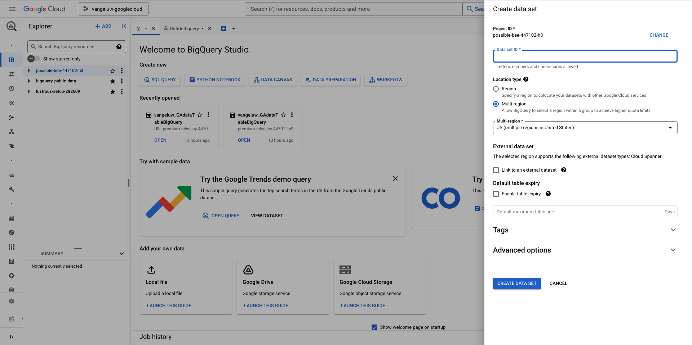

# 4.2.2 Création de votre première requête dans BigQuery

## Objectifs

- Explorer l’interface utilisateur de BigQuery
- Créer une requête SQL dans BigQuery
- Enregistrer les résultats de votre requête SQL dans un jeu de données dans BigQuery

## Contexte

Lorsque les données Google Analytics se trouvent dans BigQuery, les dimensions, mesures et autres variables sont toutes imbriquées. En outre, les données des Google Analytics sont chargées quotidiennement dans différentes tables. Cela signifie qu’essayer de connecter directement des tables de Google Analytics au sein de BigQuery à Adobe Experience Platform est très difficile et n’est pas une bonne idée.

La solution à ce problème consiste à transformer les données des Google Analytics en un format lisible pour faciliter l’ingestion dans Adobe Experience Platform.

## 4.2.2.1 Créer un jeu de données pour enregistrer de nouveaux tableaux BigQuery

Accédez à la [console BigQuery](https://console.cloud.google.com/bigquery).


Dans **Explorateur**, votre ID de projet s’affiche. Cliquez sur votre ID de projet (ne cliquez pas sur le jeu de données **bigquery-public-data**).


Comme vous pouvez le constater, il n’y a pas encore de jeu de données. Créons-en un maintenant.
Cliquez sur la **3...**, puis sur **CRÉER UN JEU DE DONNÉES**.


Sur le côté droit de l’écran, le menu **Créer un jeu de données** s’affiche.



Pour l’**ID du jeu de données**, utilisez la convention de nommage ci-dessous. Pour les autres champs, veuillez conserver les paramètres par défaut.

| Attribution d&#39;un nom | Exemple |
| ----------------- | ------------- | 
| `--aepUserLdap--_BigQueryDataSet` | vangeluw_BigQueryDataSet |

Cliquez sur **CRÉER UN JEU DE DONNÉES**.


Vous serez ensuite de retour dans la console BigQuery avec votre jeu de données créé.


## 4.2.2.2 Créer votre première requête SQL BigQuery

Ensuite, vous allez créer votre première requête dans BigQuery. L’objectif de cette requête est de prendre les données d’exemple des Google Analytics et de les transformer afin qu’elles puissent être ingérées dans Adobe Experience Platform. Accédez à l’onglet **Requête sans titre**.


Copiez la requête SQL suivante et collez-la dans cet éditeur de requêtes. N’hésitez pas à lire la requête et à comprendre la syntaxe BigQuery Google Analytics.


```sql
SELECT
  CONCAT(fullVisitorId, CAST(hitTime AS String), '-', hitNumber) AS _id,
  TIMESTAMP(DATETIME(Year_Current, Month_Current, Day_Current, Hour, Minutes, Seconds)) AS timeStamp,
  fullVisitorId as GA_ID,
  -- Fake CUSTOMER ID
  CONCAT('3E-D4-',fullVisitorId, '-1W-93F' ) as customerID,
  Page,
  Landing_Page,
  Exit_Page,
  Device,
  Browser,
  MarketingChannel,
  TrafficSource,
  TrafficMedium,
  -- Enhanced Ecommerce
  TransactionID,
  CASE
      WHEN EcommerceActionType = '2' THEN 'Product_Detail_Views'
      WHEN EcommerceActionType = '3' THEN 'Adds_To_Cart'
      WHEN EcommerceActionType = '4' THEN 'Product_Removes_From_Cart'
      WHEN EcommerceActionType = '5' THEN 'Product_Checkouts'
      WHEN EcommerceActionType = '6' THEN 'Product_Refunds'
    ELSE
    NULL
  END
     AS Ecommerce_Action_Type,
  -- Entrances (metric)
  SUM(CASE
      WHEN isEntrance = TRUE THEN 1
    ELSE
    0
  END
    ) AS Entries,
    
--Pageviews (metric)
    COUNT(*) AS Pageviews,
    
 -- Exits 
    SUM(
    IF
      (isExit IS NOT NULL,
        1,
        0)) AS Exits,
        
 --Bounces
   SUM(CASE
      WHEN isExit = TRUE AND isEntrance = TRUE THEN 1
    ELSE
    0
  END
    ) AS Bounces,
        
  -- Unique Purchases (metric)
  COUNT(DISTINCT TransactionID) AS Unique_Purchases,
  -- Product Detail Views (metric)
  COUNT(CASE
      WHEN EcommerceActionType = '2' THEN fullVisitorId
    ELSE
    NULL
  END
    ) AS Product_Detail_Views,
  -- Product Adds To Cart (metric)
  COUNT(CASE
      WHEN EcommerceActionType = '3' THEN fullVisitorId
    ELSE
    NULL
  END
    ) AS Adds_To_Cart,
  -- Product Removes From Cart (metric)
  COUNT(CASE
      WHEN EcommerceActionType = '4' THEN fullVisitorId
    ELSE
    NULL
  END
    ) AS Product_Removes_From_Cart,
  -- Product Checkouts (metric)
  COUNT(CASE
      WHEN EcommerceActionType = '5' THEN fullVisitorId
    ELSE
    NULL
  END
    ) AS Product_Checkouts,
  -- Product Refunds (metric)
  COUNT(CASE
      WHEN EcommerceActionType = '7' THEN fullVisitorId
    ELSE
    NULL
  END
    ) AS Product_Refunds
  FROM (
  SELECT
    -- Landing Page (dimension)
    CASE
      WHEN hits.isEntrance = TRUE THEN hits.page.pageTitle
    ELSE NULL
  END
    AS Landing_page,
    
        -- Exit Page (dimension)
    CASE
      WHEN hits.isExit = TRUE THEN hits.page.pageTitle
    ELSE
    NULL
  END
    AS Exit_page,
    
    hits.page.pageTitle AS Page,
    hits.isEntrance,
    hits.isExit,
    hits.hitNumber as hitNumber,
    hits.time as hitTime,
    date as Fecha,
    fullVisitorId,
    visitStartTime,
    device.deviceCategory AS Device,
    device.browser AS Browser,
    channelGrouping AS MarketingChannel,
    trafficSource.source AS TrafficSource,
    trafficSource.medium AS TrafficMedium,
    hits.transaction.transactionId AS TransactionID,
    CAST(EXTRACT(YEAR FROM CURRENT_DATE()) AS INT64) AS Year_Current,
    CAST(EXTRACT(MONTH FROM CURRENT_DATE()) AS INT64) AS Month_Current,
     CAST(EXTRACT(DAY FROM CURRENT_DATE()) AS INT64) AS Day_Current,
    CAST(EXTRACT(DAY FROM DATE_SUB(CURRENT_DATE(),INTERVAL 1 DAY)) AS INT64) AS Day_Current_Before,
    CAST(FORMAT_DATE('%Y', PARSE_DATE("%Y%m%d", date)) AS INT64) AS Year,
  CAST(FORMAT_DATE('%m', PARSE_DATE("%Y%m%d",date)) AS INT64) AS Month,
  CAST(FORMAT_DATE('%d', PARSE_DATE("%Y%m%d",date)) AS INT64) AS Day,
    CAST(EXTRACT (hour FROM TIMESTAMP_SECONDS(hits.time)) AS INT64) AS Hour,
  CAST(EXTRACT (minute FROM TIMESTAMP_SECONDS(hits.time)) AS INT64) AS Minutes,
  CAST(EXTRACT (second FROM TIMESTAMP_SECONDS(hits.time)) AS INT64) AS SecondS,
    hits.eCommerceAction.action_type AS EcommerceActionType
  
  FROM
    `bigquery-public-data.google_analytics_sample.ga_sessions_*`,
     UNNEST(hits) AS hits
  WHERE
    _table_suffix BETWEEN '20170101'
    AND '20170331'
    AND totals.visits = 1
    AND hits.type = 'PAGE'
    )
    
GROUP BY
  1,
  2,
  3,
  4,
  5,
  6,
  7,
  8,
  9,
  10,
  11,
  12,
  13,
  14
    
  ORDER BY 2 DESC
```

Lorsque vous êtes prêt, cliquez sur **Exécuter** pour exécuter la requête :


L’exécution de la requête peut prendre quelques minutes.

Une fois l’exécution de la requête terminée, la sortie ci-dessous s’affiche dans les **Résultats de la requête**.


## 4.2.2.3 Enregistrer les résultats de votre requête SQL BigQuery

L’étape suivante consiste à enregistrer la sortie de votre requête en cliquant sur le bouton **ENREGISTRER LES RÉSULTATS**.


Sélectionnez **Tableau BigQuery** comme emplacement de sortie.


Une nouvelle fenêtre contextuelle s’affiche, dans laquelle vos **Nom du projet** et **Nom du jeu de données** sont pré-renseignés. Le nom du jeu de données doit correspondre au jeu de données que vous avez créé au début de cet exercice, avec cette convention d’affectation de nom :

| Attribution d&#39;un nom | Exemple |
| ----------------- | ------------- | 
| `--aepUserLdap--_BigQueryDataSet` | `vangeluw_BigQueryDataSet` |

Vous devez maintenant saisir un nom de table. Veuillez utiliser cette convention de nommage :

| Attribution d&#39;un nom | Exemple |
| ----------------- |------------- | 
| `--aepUserLdap--_GAdataTableBigQuery` | `vangeluw_GAdataTableBigQuery` |

Cliquez sur **ENREGISTRER**.


Cela peut prendre un certain temps avant que les données ne soient prêtes dans le tableau que vous avez créé. Au bout de quelques minutes, actualisez le navigateur. Vous devriez ensuite voir dans votre jeu de données la table `--aepUserLdap--_GAdataTableBigquery` sous **Explorer** dans votre projet BigQuery.


Vous pouvez maintenant passer à l’exercice suivant, au cours duquel vous allez connecter ce tableau à Adobe Experience Platform.

Étape suivante : [4.2.3 Connecter GCP et BigQuery à Adobe Experience Platform](./ex3.md)

[Retour au module 4.2](./customer-journey-analytics-bigquery-gcp.md)

[Revenir à tous les modules](./../../../overview.md)
