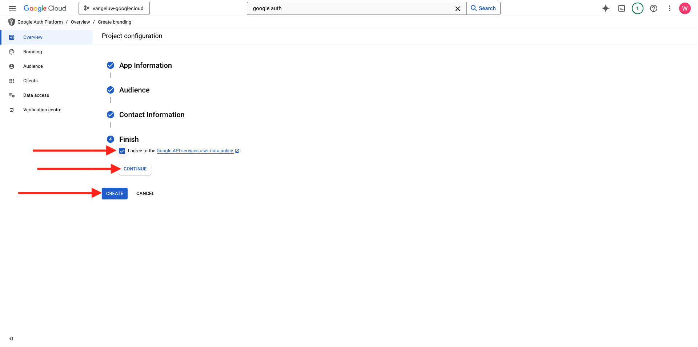
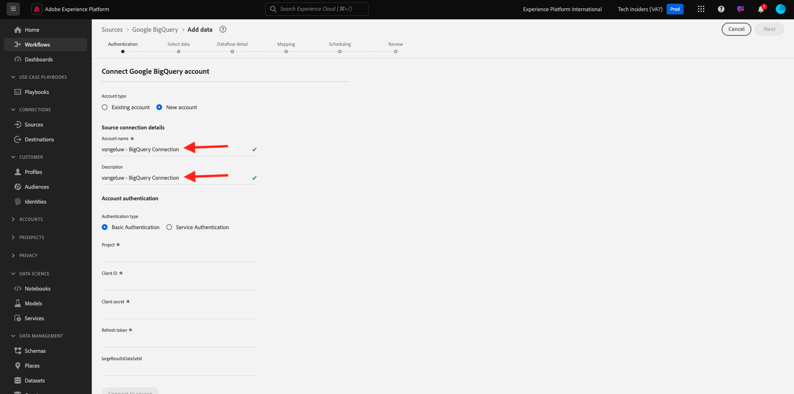

# 4.2.3 Connexion de GCP et BigQuery à Adobe Experience Platform

## Objectifs

- Explorer l’API et les services dans Google Cloud Platform
- Familiarisez-vous avec le laboratoire OAuth pour tester les API Google
- Création de votre première connexion BigQuery dans Adobe Experience Platform

## Contexte

Adobe Experience Platform fournit un connecteur dans **Sources** qui vous aidera à importer des jeux de données BigQuery dans Adobe Experience Platform. Ce connecteur de données repose sur l’API BigQuery Google. Par conséquent, il est important de préparer correctement votre plateforme cloud Google et votre environnement BigQuery pour recevoir des appels API de Adobe Experience Platform.

Pour configurer le connecteur Source BigQuery dans Adobe Experience Platform, vous aurez besoin des 4 valeurs suivantes :

- projet
- clientId
- clientSecret
- refreshToken

Jusqu’à présent, vous n’avez que le premier, le **ID de projet**. Cette valeur **ID de projet** est un identifiant aléatoire généré par Google lors de la création de votre projet BigQuery au cours de l&#39;exercice 12.1.

Copiez l&#39;ID du projet dans un fichier texte séparé.

| Informations d’identification | Attribution d&#39;un nom | Exemple |
| ----------------- |-------------| -------------|
| ID de projet | random | possible-bee-447102-h3 |

Vous pouvez vérifier votre ID de projet à tout moment en cliquant sur votre **Nom du projet** dans la barre de menu supérieure :

Votre ID de projet s’affiche sur le côté droit :

Dans cet exercice, vous apprendrez à obtenir les 3 autres champs obligatoires :

- clientId
- clientSecret
- refreshToken

## Plateforme d’authentification 4.2.3.1 Google

Pour commencer, revenez à la page d’accueil de Google Cloud Platform. Pour cela, il vous suffit de cliquer sur le logo en haut à gauche de votre écran.

Une fois que vous êtes sur la page d’accueil, recherchez **Google Auth Platform** dans la barre de recherche. Cliquez sur le premier résultat pour l’ouvrir.

La page d’accueil **Plateforme d’authentification Google** s’affiche maintenant. GET Cliquez sur **DÉMARRÉ**.

Pour le **Nom de l’application**, utilisez ce qui suit :

| Attribution d&#39;un nom | Exemple |
| ----------------- |-------------| 
| `--aepUserLdap-- - AEP BigQuery Connector` | vangeluw - Connecteur AEP BigQuery |

Sélectionnez votre adresse e-mail pour le champ **E-mail de support utilisateur**.

Cliquez sur **SUIVANT**.

Sélectionnez **Externe** et cliquez sur **SUIVANT**.

Saisissez votre adresse e-mail et cliquez sur **SUIVANT**.

Cochez la case et cliquez sur **CONTINUER**. Cliquez ensuite sur **CRÉER**.

## 4.2.3.2 Créer un client OAuth

Cliquez sur **CRÉER UN CLIENT OAUTH**.

Tu verras ça.

Sélectionnez **Application web**.

Plusieurs nouveaux champs s’affichent. Vous devez maintenant saisir le **Nom** de l’identifiant client OAuth et également saisir le **URI de redirection autorisés**.

Pour le champ **Nom**, utilisez la commande suivante :

| Champ | Valeur | Exemple |
| ----------------- |-------------| -------------| 
| Nom | ldap - Connecteur AEP BigQuery | vangeluw - Connecteur BigQuery Platform |

Cliquez sur **+ AJOUTER UN URI** sous **URI de redirection autorisés**. Ajoutez le nouvel URI ci-dessous.

| Champ | Valeur |
| ----------------- |-------------| 
| URI de redirection autorisés | https://developers.google.com/oauthplayground |

Le champ **URI de redirection autorisés** est très important, car vous en aurez besoin ultérieurement pour obtenir le RefreshToken dont vous avez besoin pour terminer la configuration du connecteur Source BigQuery dans Adobe Experience Platform.

Cliquez sur **Créer**.

Votre identifiant client OAuth est maintenant créé. Cliquez dessus pour afficher votre identifiant client et votre secret client.

Les valeurs de l’ID client et du secret client s’affichent alors.

Copiez ces deux champs et collez-les dans un fichier texte sur votre bureau. Vous pouvez toujours accéder à ces informations d’identification ultérieurement, mais il est plus facile de les enregistrer dans un fichier texte à côté de votre ID de projet BigQuery.

En résumé, pour la configuration du connecteur Source BigQuery dans Adobe Experience Platform, vous disposez déjà des valeurs suivantes :

| Informations d’identification du connecteur BigQuery | Valeur |
| ----------------- |-------------| 
| ID de projet | votre propre ID de projet (par exemple,: possible-bee-447102-h3) |
| clientid | votreid client |
| clientsecret | votresecret client |

Ensuite, vous devez publier votre application OAuth. Accédez à **Audience** et cliquez sur **PUBLISH APP**.

Cliquez sur **CONFIRMER**.

Il vous manque toujours le **refreshToken**. refreshToken est obligatoire pour des raisons de sécurité. Dans le monde des API, les jetons expirent généralement toutes les 24 heures. Le **refreshToken** est donc nécessaire pour actualiser le jeton de sécurité toutes les 24 heures, afin que votre configuration de connecteur Source puisse continuer à se connecter à Google Cloud Platform et BigQuery.

## 4.2.3.3 de l’API BigQuery et refreshToken

Il existe de nombreuses façons d’obtenir un refreshToken pour accéder aux API de Google Cloud Platform. L’une de ces options consiste, par exemple, à utiliser Postman.
Cependant, Google a créé quelque chose de plus facile à tester et à lire avec ses API, un outil appelé **Playground OAuth 2.0**.

Pour accéder au terrain de jeu **OAuth 2.0**, rendez-vous sur [https://developers.google.com/oauthplayground](https://developers.google.com/oauthplayground).

Vous verrez ensuite la page d’accueil du **terrain de jeu OAuth 2.0**.

Cliquez sur l’icône **engrenage** en haut à droite de l’écran. Assurez-vous que vos paramètres sont identiques à ceux de l’image ci-dessus.

Cochez la case **Utiliser vos propres informations d’identification OAuth**

Deux champs s’affichent.

Veuillez remplir les champs suivant ce tableau :

| Paramètres de l’API Playground | Vos informations d’identification d’API Google |
| ----------------- |-------------| 
| ID client OAuth | votre propre identifiant client (dans le fichier texte sur votre bureau) ; |
| Secret client OAuth | votre propre secret client (dans le fichier texte sur votre bureau) ; |

Une fois vos informations d’identification renseignées, cliquez sur **Fermer**.

Dans le menu de gauche, vous pouvez voir toutes les API Google disponibles. Recherchez **API BigQuery v2** et cliquez dessus pour l’ouvrir.

Sélectionnez ensuite la portée comme indiqué dans l’image ci-dessous. Vous devez cliquer sur chacune des API disponibles et une coche s’affiche pour chaque API sélectionnée.

Cliquez ensuite sur **Autoriser les API**.

Cliquez sur l’adresse e-mail que vous avez utilisée pour configurer GCP et BigQuery.

Un gros avertissement s’affiche alors : **Cette application n’est pas vérifiée**. Cela se produit car votre connecteur BigQuery Platform n&#39;a pas encore été officiellement examiné, de sorte que Google ne sait pas s&#39;il s&#39;agit d&#39;une application authentique ou non.

Cliquez sur **Avancé**.

Cliquez ensuite sur **Accéder à —aepUserLdap— - Connecteur AEP BigQuery (non sécurisé)**.

Une invite de sécurité s’affiche alors pour demander l’accès. Cliquez sur **Tout sélectionner**.

Faites défiler vers le bas et cliquez sur **Continuer**.

Vous allez maintenant être renvoyé au terrain de jeu OAuth 2.0 et vous verrez ceci. Cliquez sur **Code d’autorisation d’Exchange pour les jetons**.

Au bout de quelques secondes, la vue **Étape 2 - Code d’autorisation d’Exchange pour les jetons** se ferme automatiquement et vous verrez **Étape 3 - Configurer la requête pour l’API**.

Vous devez revenir à **Code d’autorisation d’Exchange étape 2 pour les jetons**, alors cliquez sur **Code d’autorisation d’Exchange étape 2 pour les jetons** pour visualiser à nouveau le **Jeton d’actualisation**.

Le jeton **Actualiser** s’affiche maintenant.

Copiez le **jeton d’actualisation** et collez-le dans le fichier texte sur votre bureau avec les autres informations d’identification du connecteur Source BigQuery :

| Informations d’identification du connecteur Source BigQuery | Valeur |
| ----------------- |-------------| 
| ID de projet | votre propre ID de projet aléatoire (par exemple,: apt-Summer-273608) |
| clientid | votreid client |
| clientsecret | votresecret client |
| refreshtoken | votrerefreshtoken |

Configurez ensuite votre connecteur Source dans Adobe Experience Platform.

## 4.2.3.5 - Connecter Platform à votre propre tableau BigQuery

Connectez-vous à Adobe Experience Platform en accédant à cette URL : [https://experience.adobe.com/platform](https://experience.adobe.com/platform).

Une fois connecté, vous accédez à la page d’accueil de Adobe Experience Platform.

Avant de continuer, vous devez sélectionner un **sandbox**. Le sandbox à sélectionner est nommé ``--aepSandboxName--``. Après avoir sélectionné la sandbox appropriée, la modification d’écran s’affiche et vous êtes maintenant dans votre sandbox dédiée.

Dans le menu de gauche, accédez à Sources. Vous verrez ensuite la page d’accueil **Sources**. Dans le menu **Sources**, cliquez sur **Bases de données**. Cliquez sur la carte **BigQuery Google**. Cliquez ensuite sur **Configurer**.

Vous devez maintenant créer une nouvelle connexion.

Cliquez sur **Nouveau compte**. Vous devez maintenant remplir tous les champs ci-dessous, en fonction de la configuration que vous avez effectuée dans GCP et BigQuery.

Commençons par nommer la connexion :

Veuillez utiliser cette convention de nommage :

| Informations d’identification du connecteur BigQuery | Valeur | Exemple |
| ----------------- |-------------| -------------| 
| Nom de compte | `--aepUserLdap-- - BigQuery Connection` | vangeluw - Connexion BigQuery |
| Description | `--aepUserLdap-- - BigQuery Connection` | vangeluw - Connexion BigQuery |

Voici ce que vous obtiendrez :

Ensuite, renseignez les détails de l’API GCP et BigQuery **Authentification du compte** que vous avez stockés dans un fichier texte sur votre bureau :

| Informations d’identification du connecteur BigQuery | Valeur |
| ----------------- |-------------| 
| ID de projet | votre propre ID de projet aléatoire (par exemple,: possible-bee-447102-h3) |
| clientId | … |
| clientSecret | … |
| refreshToken | … |

Les détails de votre **authentification de compte** doivent maintenant ressembler à ceci. Cliquez sur **Connexion à la source**.

Si les détails de votre **Authentification du compte** ont été correctement renseignés, vous devriez maintenant voir une confirmation visuelle indiquant que la connexion fonctionne correctement, en affichant la confirmation **Connecté**. Cliquez sur **Suivant**.

Le jeu de données BigQuery que vous avez créé dans l’exercice précédent s’affiche maintenant.

Bravo ! Dans l’exercice suivant, vous allez charger des données à partir de ce tableau et les mapper à un schéma et à un jeu de données dans Adobe Experience Platform.

Étape suivante : [4.2.4 Charger des données de BigQuery dans Adobe Experience Platform](./ex4.md)

[Retour au module 4.2](./customer-journey-analytics-bigquery-gcp.md)

[Revenir à tous les modules](./../../../overview.md)
