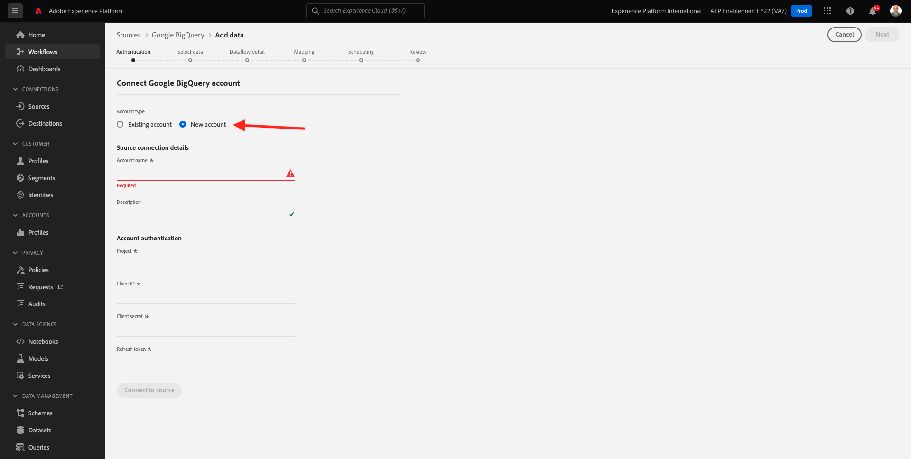

# 4.2.3 Connexion de GCP et BigQuery à Adobe Experience Platform

## Objectifs

- Exploration des API et services dans Google Cloud Platform
- Familiarisez-vous avec OAuth Playground pour le test des API Google
- Créer votre première connexion BigQuery dans Adobe Experience Platform

## Contexte

Adobe Experience Platform fournit un connecteur dans **Sources** qui vous aidera à importer des jeux de données BigQuery dans Adobe Experience Platform. Ce connecteur de données est basé sur l’API Google BigQuery. Par conséquent, il est important de préparer correctement votre Google Cloud Platform et votre environnement BigQuery pour recevoir les appels d’API de Adobe Experience Platform.

Pour configurer le connecteur Source BigQuery dans Adobe Experience Platform, vous aurez besoin des 4 valeurs suivantes :

- project
- clientId
- clientSecret
- refreshToken

Jusqu&#39;à présent, vous n&#39;avez que le premier, l&#39;**ID de projet**. Cette valeur **ID de projet** est un ID aléatoire généré par Google lorsque vous avez créé votre projet BigQuery pendant l’exercice 12.1.

Copiez l’ID de projet dans un fichier texte séparé.

| Informations d’identification | Attribution d&#39;un nom | Exemple |
| ----------------- |-------------| -------------|
| Identifiant de projet | random | composé-tâche-306413 |

Vous pouvez vérifier votre ID de projet à tout moment en cliquant sur le **Nom du projet** dans la barre de menu supérieure :

L’ID de projet s’affiche sur le côté droit :

Dans cet exercice, vous apprendrez à obtenir les 3 autres champs obligatoires :

- clientId
- clientSecret
- refreshToken

## 4.2.3.1 API et services cloud Google

Pour commencer, revenez à la page d’accueil de Google Cloud Platform. Pour ce faire, cliquez simplement sur le logo dans le coin supérieur gauche de votre écran.

Une fois que vous êtes sur la page d’accueil, accédez au menu de gauche et cliquez sur **APIs &amp; Services**, puis sur **Tableau de bord**.

La page d’accueil **APIs &amp; Services** s’affiche désormais.

Sur cette page, vous pouvez voir l’utilisation de vos différentes connexions API Google. Pour configurer une connexion API afin que Adobe Experience Platform puisse lire à partir de BigQuery, vous devez suivre les étapes suivantes :

- Tout d’abord, vous devez créer un écran de consentement OAuth pour activer les authentifications futures. Pour des raisons de sécurité de Google, un être humain doit également effectuer la première authentification, avant qu’un accès programmatique ne soit autorisé.
- Deuxièmement, vous avez besoin des informations d’identification API (clientId et clientSecret) qui seront utilisées pour l’authentification API et l’accès à votre connecteur BigQuery.

## 4.2.3.2 Écran de consentement OAuth

Commençons par créer l’écran de consentement OAuth. Dans le menu de gauche de la page d&#39;accueil **APIs &amp; Services**, cliquez sur l&#39;**écran de consentement OAuth**.

Vous verrez alors :

Sélectionnez le Type d’utilisateur : **External**. Cliquez ensuite sur **CREATE**.

Vous serez alors sur la fenêtre **Configuration de l’écran de consentement OAuth** .

La seule chose à faire ici est de saisir le nom de l&#39;écran de consentement dans le champ **Nom de l&#39;application** et de sélectionner l&#39;**email d&#39;assistance utilisateur**. Pour le Nom de l’application, utilisez cette convention d’affectation des noms :

| Attribution d&#39;un nom | Exemple |
| ----------------- |-------------| 
| `--aepUserLdap-- - AEP BigQuery Connector` | vangeluw - AEP BigQuery Connector |

Faites ensuite défiler l’écran vers le bas jusqu’à ce que vous puissiez voir les **coordonnées du développeur** et que vous renseignez une adresse électronique.

Cliquez sur **ENREGISTRER ET CONTINUER**.

Vous verrez alors ceci. Cliquez sur **ENREGISTRER ET CONTINUER**.

Vous verrez alors ceci. Cliquez sur **ENREGISTRER ET CONTINUER**.

Vous verrez alors ceci. Cliquez sur **RETOUR AU TABLEAU DE BORD**.

Vous verrez alors ceci. Cliquez sur **PUBLISH APP**.

Cliquez sur **CONFIRMER**.

Vous verrez alors ceci.

À l’étape suivante, vous allez terminer la configuration de l’API et obtenir vos informations d’identification d’API.

## 4.2.3.3 Informations d’identification de l’API Google : secret client et identifiant client

Dans le menu de gauche, cliquez sur **Credentials** (Informations d’identification). Vous verrez alors :

Cliquez sur le bouton **+ CREATE CREDENTIALS** .

Vous verrez 3 options. Cliquez sur l’ **ID client OAuth** :

Dans l&#39;écran suivant, sélectionnez **Application Web**.

Plusieurs nouveaux champs s’affichent. Vous devez maintenant saisir le **nom** de l’ID client OAuth et également saisir les **URI de redirection autorisés**.

Suivez cette convention d’affectation des noms :

| Champ | Valeur | Exemple |
| ----------------- |-------------| -------------| 
| Nom | ldap - AEP BigQuery Connector | vangeluw - Platform BigQuery Connector |
| URI de redirection autorisés | https://developers.google.com/oauthplayground | https://developers.google.com/oauthplayground |

Le champ **URI de redirection autorisés** est un champ très important, car vous en aurez besoin plus tard pour obtenir le RefreshToken, vous devez terminer la configuration du connecteur Source BigQuery dans Adobe Experience Platform.

Avant de poursuivre, vous devez appuyer physiquement sur le bouton **Entrée** après avoir saisi l’URL pour stocker la valeur dans le champ **URI de redirection autorisés** . Si vous ne cliquez pas sur le bouton **Entrer** , vous rencontrerez des problèmes à un stade ultérieur, dans le **terrain de lecture OAuth 2.0**.

Cliquez ensuite sur **Créer** :

Votre ID client et votre secret client s’affichent désormais.

Copiez ces deux champs et collez-les dans un fichier texte sur votre bureau. Vous pouvez toujours accéder à ces informations d’identification ultérieurement, mais il est plus facile de les enregistrer dans un fichier texte en regard de votre ID de projet BigQuery.

Lors de la récupération de la configuration de votre connecteur BigQuery Source dans Adobe Experience Platform, vous disposez déjà des valeurs suivantes :

| Informations d’identification de BigQuery Connector | Valeur |
| ----------------- |-------------| 
| Identifiant de projet | votre propre ID de projet (ex.: component-task-306413) |
| clientid | yourclientid |
| cilentsecret | yourclientsecret |

**refreshToken** vous manque toujours. Pour des raisons de sécurité, l’attribut refreshToken est obligatoire. Dans le monde des API, les jetons expirent généralement toutes les 24 heures. Par conséquent, **refreshToken** est nécessaire pour actualiser le jeton de sécurité toutes les 24 heures, de sorte que la configuration de votre connecteur Source puisse continuer à se connecter à Google Cloud Platform et à BigQuery.

## 4.2.3.4 API BigQuery et refreshToken

Il existe de nombreuses façons d’obtenir un jeton d’actualisation pour accéder aux API Google Cloud Platform. L’une de ces options est l’utilisation de Postman, par exemple.
Cependant, Google a créé quelque chose de plus facile à tester et à lire avec ses API, un outil appelé **OAuth 2.0 Playground**.

Pour accéder à **OAuth 2.0 Playground**, rendez-vous sur [https://developers.google.com/oauthplayground](https://developers.google.com/oauthplayground).

Vous verrez ensuite la page d’accueil **OAuth 2.0 Playground**.

Cliquez sur l’icône **engrenage** en haut à droite de l’écran :

Assurez-vous que vos paramètres sont identiques à ce que vous pouvez voir dans l’image ci-dessus.

Vérifiez deux fois que les paramètres sont entièrement sûrs.

Une fois que vous avez terminé, cochez la case **Utiliser vos propres informations d’identification OAuth**

Deux champs doivent s’afficher et vous avez la valeur pour eux.

Renseignez les champs suivants du tableau :

| Paramètres de l’API de terrain de lecture | Vos informations d’identification d’API Google |
| ----------------- |-------------| 
| ID client OAuth | votre propre identifiant client (dans le fichier texte de votre bureau) ; |
| Secret client OAuth | votre propre secret client (dans le fichier texte de votre bureau) |

Copiez l’**ID client** et le **Secret client** du fichier texte que vous avez créé sur votre bureau.

Une fois que vous avez rempli vos informations d’identification, veuillez cliquer sur **Fermer**

Dans le menu de gauche, vous pouvez voir toutes les API Google disponibles. Recherchez **BigQuery API v2**.

Sélectionnez ensuite la portée comme indiqué dans l’image ci-dessous :

Une fois que vous les avez sélectionnés, un bouton bleu devrait s’afficher, qui indique **Autoriser les API**. Cliquez dessus.

Sélectionnez le compte Google que vous avez utilisé pour configurer GCP et BigQuery.

Un avertissement peut s’afficher : **Cette application n’est pas vérifiée**. Cela se produit car votre Platform BigQuery Connector n’a pas encore été officiellement validé. Google ne sait donc pas s’il s’agit d’une application authentique ou non. Vous devez ignorer cette notification.

Cliquez sur **Avancé**.

Cliquez ensuite sur **Aller à ldap - AEP BigQuery Connector (non sécurisé)**.

Vous serez redirigé vers notre écran de consentement OAuth que vous avez créé.

Si vous utilisez l’authentification à deux facteurs (2FA), saisissez le code de vérification qui vous a été envoyé.

Google va maintenant vous montrer huit invites **Autorisation** différentes. Cliquez sur **Autoriser** pour les huit demandes d’autorisation. (Il s’agit d’une procédure qui doit être suivie et confirmée une fois par un être humain réel, avant que l’API autorise les demandes programmatiques).

Là encore, **huit fenêtres contextuelles différentes** ne s’afficheront pas. Vous devez cliquer sur **Autoriser** pour toutes les fenêtres.

Après les huit demandes d’autorisation, cet aperçu s’affiche. Cliquez sur **Autoriser** pour terminer le processus.

Après le dernier clic de **Autoriser**, vous serez renvoyé à OAuth 2.0 Playground et vous verrez ceci :

Cliquez sur **Exchange le code d’autorisation pour les jetons**.

Au bout de quelques secondes, la vue **Étape 2 - Exchange le code d’autorisation des jetons** se ferme automatiquement et vous verrez **Étape 3 - Configurer la requête à l’API**.

Vous devez revenir au **code d’autorisation d’Exchange de l’étape 2 pour les jetons**. Cliquez donc de nouveau sur **Code d’autorisation d’Exchange de l’étape 2 pour les jetons** pour visualiser le **jeton d’actualisation**.

Vous allez maintenant voir le **jeton d’actualisation**.

Copiez le **jeton d’actualisation** et collez-le dans le fichier texte de votre bureau avec les autres informations d’identification du connecteur Source BigQuery :

| Informations d’identification du connecteur Source BigQuery | Valeur |
| ----------------- |-------------| 
| Identifiant de projet | votre propre ID de projet aléatoire (par exemple,: apt-summer-273608) |
| clientid | yourclientid |
| cilentsecret | yourclientsecret |
| refreshtoken | yourrefreshtoken |

Ensuite, configurez votre connecteur Source dans Adobe Experience Platform.

## 4.2.3.5 - Connecter Platform à votre propre table BigQuery

Connectez-vous à Adobe Experience Platform en accédant à cette URL : [https://experience.adobe.com/platform](https://experience.adobe.com/platform).

Une fois connecté, vous accédez à la page d’accueil de Adobe Experience Platform.

Avant de continuer, vous devez sélectionner un **sandbox**. L’environnement de test à sélectionner est nommé ``--aepSandboxName--``. Après avoir sélectionné l’environnement de test approprié, l’écran change et vous êtes désormais dans votre environnement de test dédié.

Dans le menu de gauche, accédez à Sources. Vous verrez ensuite la page d’accueil **Sources**. Dans le menu **Sources**, cliquez sur **Bases de données**. Cliquez sur la carte **Google BigQuery** . Cliquez ensuite sur **Configurer** ou **+ Configurer**.

Vous devez maintenant créer une connexion.

Cliquez sur **Nouveau compte**. Vous devez maintenant renseigner tous les champs ci-dessous, en fonction de la configuration que vous avez effectuée dans GCP et BigQuery.

Commençons par nommer la connexion :

Utilisez cette convention d’affectation des noms :

| Informations d’identification de BigQuery Connector | Valeur | Exemple |
| ----------------- |-------------| -------------| 
| Nom de compte | `--aepUserLdap-- - BigQuery Connection` | vangeluw - Connexion à BigQuery |
| Description | `--aepUserLdap-- - BigQuery Connection` | vangeluw - Connexion à BigQuery |

Ce qui devrait vous donner quelque chose comme ceci :

Ensuite, renseignez les détails de l’API GCP et BigQuery **Authentification du compte** que vous avez stockés dans un fichier texte sur votre bureau :

| Informations d’identification de BigQuery Connector | Valeur |
| ----------------- |-------------| 
| Identifiant de projet | votre propre ID de projet aléatoire (par exemple,: apt-summer-273608) |
| clientId | … |
| clientSecret | … |
| refreshToken | … |

Votre **Authentification du compte**-détails doit maintenant ressembler à ceci :

Après avoir renseigné tous ces champs, cliquez sur **Se connecter à la source**.

Si les détails de votre **authentification de compte** ont été correctement renseignés, vous devriez maintenant voir une confirmation visuelle que la connexion fonctionne correctement, en affichant la confirmation **Connecté**.

Maintenant que votre connexion est créée, veuillez cliquer sur **Suivant** :

Le jeu de données BigQuery que vous avez créé lors de l’exercice 12.2 s’affiche désormais.

Bien joué ! Dans l’exercice suivant, vous allez charger des données de cette table et les mapper à un schéma et à un jeu de données dans Adobe Experience Platform.

Étape suivante : [4.2.4 Chargement de données de BigQuery dans Adobe Experience Platform](./ex4.md)

[Revenir au module 4.2](./customer-journey-analytics-bigquery-gcp.md)

[Revenir à tous les modules](./../../../overview.md)
