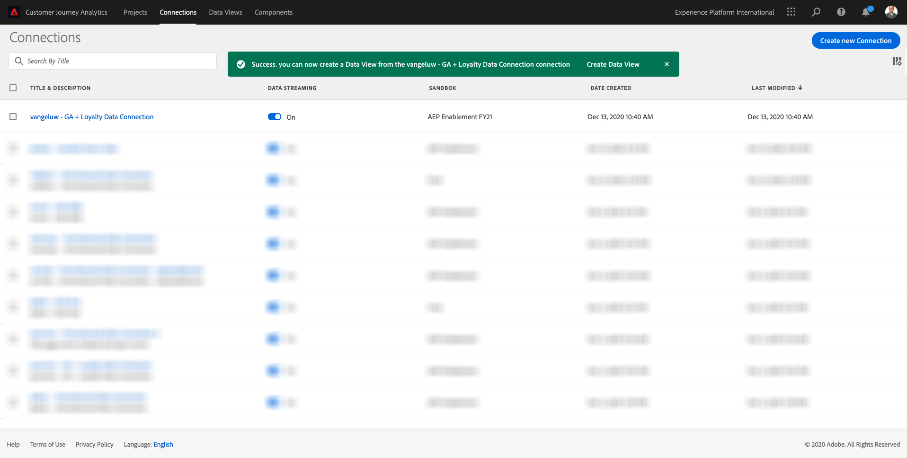
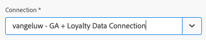
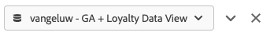
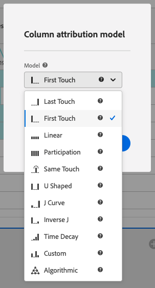
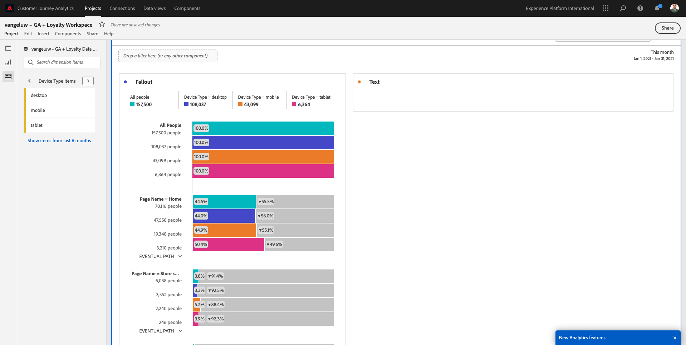

# 4.2.5 Analyse des données des Google Analytics à l’aide de Customer Journey Analytics

## Objectifs

- Connecter notre jeu de données BigQuery à Customer Journey Analytics (CJA)
- Connectez et rejoignez des Google Analytics avec les données de fidélité.
- Familiarisez-vous avec l’interface utilisateur de CJA

## 4.2.5.1 Création d’une connexion

Accédez à [analytics.adobe.com](https://analytics.adobe.com) pour accéder à Customer Journey Analytics.

Sur la page d’accueil du Customer Journey Analytics, accédez à **Connexions**.

Ici, vous pouvez voir toutes les différentes connexions établies entre CJA et Platform. Ces connexions ont le même objectif que les suites de rapports dans Adobe Analytics. Cependant, la collecte des données est totalement différente. Toutes les données proviennent des jeux de données Adobe Experience Platform.

Cliquez sur **Créer une connexion**.

Vous verrez ensuite l’interface utilisateur **Créer une connexion**.

Tout d’abord, vous devez sélectionner l’environnement de test correct à utiliser. Dans le menu des environnements de test, sélectionnez votre environnement de test, qui doit être `--aepSandboxName--`. Dans cet exemple, l’environnement de test à utiliser est **AEP Enablement FY21**.

Après avoir sélectionné votre environnement de test, les jeux de données disponibles seront mis à jour.

Dans le menu de gauche, vous pouvez voir tous les jeux de données Adobe Experience Platform disponibles. Recherchez le jeu de données `Demo System - Event Dataset for BigQuery (Global v1.1)`. Cliquez sur **+** pour ajouter le jeu de données à cette connexion.

Après l’avoir ajouté, le jeu de données s’affiche dans la connexion.

Vous devez maintenant sélectionner l’ **ID de personne**. Assurez-vous que l’ID de personne **loyaltyId** est sélectionné.

Vous allez maintenant enrichir les données d’interaction du site web Google Analytics avec un autre jeu de données Adobe Experience Platform.

Recherchez le jeu de données `Demo System - Profile Dataset for Loyalty (Global v1.1)` et ajoutez-le à cette connexion.

Vous verrez alors :

Pour fusionner les deux jeux de données, vous devez sélectionner un **ID de personne** contenant le même type d’ID. Le jeu de données `Demo System - Profile Dataset for Loyalty (Global v1.1)` utilise **loyaltyId** comme ID de personne, qui contient le même type d’ID que `Demo System - Event Dataset for BigQuery (Global v1.1)`, qui utilise également **loyaltyId** comme ID de personne.

Cliquez sur **Suivant**.

Vous verrez alors :

Ici, vous devez donner un nom à votre connexion.

Utilisez cette convention d’affectation des noms : `ldap - GA + Loyalty Data Connection`.

Exemple : `vangeluw - GA + Loyalty Data Connection`

Avant de terminer, veuillez également activer **Importer automatiquement toutes les nouvelles données pour tous les nouveaux jeux de données de cette connexion, à partir d’aujourd’hui.** comme dans l’image ci-dessous.

Cela lancera un flux de données de Adobe Experience Platform vers CJA toutes les 60 minutes, mais avec de gros volumes de données, cela peut prendre jusqu’à 24 heures.

Vous devez également renvoyer les données historiques. Cochez donc la case **Importer toutes les données existantes** et sélectionnez **moins de 1 million** sous **Nombre moyen d&#39;événements quotidiens**.

Après avoir créé votre **connexion**, il peut s’écouler quelques heures avant que vos données ne soient disponibles dans CJA.

Cliquez sur **Enregistrer** et accédez à l’exercice suivant.

Vous verrez alors votre connexion dans la liste des connexions disponibles.

## 4.2.5.2 Création d’une vue de données

Une fois votre connexion établie, vous pouvez maintenant influencer la visualisation. La différence entre Adobe Analytics et CJA réside dans le fait que CJA a besoin d’une vue de données afin de nettoyer et de préparer les données avant la visualisation.

Une vue de données est similaire au concept des suites de rapports virtuelles dans Adobe Analytics, où vous définissez des définitions de visite contextuelles, le filtrage, ainsi que la manière dont les composants sont appelés.

Vous aurez besoin d’au moins une vue de données par connexion. Cependant, dans certains cas d’utilisation, il est conseillé d’avoir plusieurs vues de données pour la même connexion, dans le but de fournir des informations différentes à différentes équipes.

Si vous souhaitez que votre entreprise soit axée sur les données, vous devez adapter la manière dont les données sont vues dans chaque équipe. Quelques exemples :

- Mesures UX uniquement pour l’équipe de conception de l’expérience utilisateur
- Utilisez les mêmes noms pour les indicateurs de performance clés et les mesures pour les Google Analytics que pour les Customer Journey Analytics afin que l’équipe d’analyse numérique ne parle qu’une seule langue.
- vue de données filtrée pour afficher par exemple les données pour 1 marché uniquement, 1 marque ou uniquement pour les périphériques mobiles.

Sur l’écran **Connexions**, cochez la case en regard de la connexion que vous venez de créer.

Cliquez maintenant sur **Créer une vue de données**.

Vous serez redirigé vers le workflow **Créer une vue de données**.

Vous pouvez maintenant configurer les définitions de base de votre vue de données. Il s’agit par exemple du fuseau horaire, du délai d’expiration de la session ou du filtrage de la vue de données (la partie segmentation est similaire aux suites de rapports virtuelles dans Adobe Analytics).

La **connexion** que vous avez créée dans l’exercice précédent est déjà sélectionnée. Votre connexion est nommée `ldap - GA + Loyalty Data Connection`.

Attribuez ensuite un nom à votre vue de données suivant cette convention d’affectation des noms : `ldap - GA + Loyalty Data View`.

Saisissez la même valeur pour la description : `ldap - GA + Loyalty Data View`.

Avant toute analyse ou visualisation, nous devons créer une vue de données avec tous les champs, dimensions et mesures et leurs paramètres d’attribution.

| Champ | Convention d’appellation | Exemple |
| ----------------- |-------------|-------------|  
| Nommer la connexion | ldap - GA + Loyalty Data View | vangeluw - GA + Loyalty Data View |
| Description | ldap - GA + Loyalty Data View | vangeluw - GA + Loyalty Data View |

Cliquez sur **Enregistrer et continuer**.

Vous pouvez désormais ajouter des composants à votre vue de données. Comme vous pouvez le constater, certaines mesures et dimensions sont ajoutées automatiquement.

Ajoutez les composants suivants à la vue de données :

| Nom du composant | Type de composant | Chemin du composant |
| -----------------|-----------------|-----------------|
| level | Dimension | _experienceplatform.loyaltyDetails.level |
| points | Mesure | _experienceplatform.loyaltyDetails.points |
| commerce.checkouts.value | Mesure | commerce.checkouts.value |
| commerce.productListRemovals.value | Mesure | commerce.productListRemovals.value |
| commerce.productListAdds | Mesure | commerce.productListAdds |
| commerce.productViews.value | Mesure | commerce.productViews.value |
| commerce.purchases.value | Mesure | commerce.purchases.value |
| web.webPageDetails.pageViews | Mesure | web.webPageDetails.pageViews |
| Identifiant de transaction | Dimension | commerce.order.payments.transactionID |
| channel.mediaType | Dimension | channel.mediaType |
| channel.typeAtSource | Dimension | channel.typeAtSource |
| Code de suivi | Dimension | marketing.trackingCode |
| gaid | Dimension | _experienceplatform.identification.core.gaid |
| web.webPageDetails.name | Dimension | web.webPageDetails.name |
| Type d’événement | Dimension | eventType |
| Fournisseur | Dimension | environment.browserDetails.vendor |
| Identifiant | Dimension | _id |
| Date et heure | Dimension | date et heure |
| Type | Dimension | device.type |
| loyaltyId | Dimension | _experienceplatform.identification.core.loyaltyId |

Vous obtiendrez alors ce qui suit :

Ensuite, vous devez modifier le nom convivial de certaines des mesures et dimensions ci-dessus afin que vous puissiez facilement les utiliser lors de la création de votre analyse. Pour ce faire, sélectionnez la mesure ou la dimension et mettez à jour le champ **Nom** comme indiqué dans l’image ci-dessous.

| Nom d’origine du composant | Nom d’affichage |
| -----------------|-----------------|
| level | Niveau de fidélité |
| points | Points de fidélité |
| commerce.checkouts.value | Passages en caisse |
| commerce.productListRemovals.value | Retraits du panier |
| commerce.productListAdds | Ajouts au panier |
| commerce.productViews.value | Consultations produits |
| commerce.purchases.value | Achats |
| web.webPageDetails.pageViews | Pages vues |
| channel.mediaType | Medium de trafic |
| channel.typeAtSource | Source de trafic |
| Code de suivi | Canal marketing |
| gaid | Identifiant Google Analytics |
| Nom | Titre de la page |
| Fournisseur | Navigateur |
| Type | Type d’appareil |
| loyaltyId | ID de fidélité |

Vous aurez alors quelque chose comme ceci :

Ensuite, vous devez apporter quelques modifications au contexte Personne et Session pour certains de ces composants en modifiant les **paramètres d’attribution**.

Veuillez modifier les **paramètres d’attribution** pour les composants ci-dessous :

| Composant |
| -----------------|
| Source de trafic |
| Canal marketing |
| Navigateur |
| Medium de trafic |
| Type d’appareil |
| Identifiant Google Analytics |
| ID de fidélité |
| Niveau de fidélité |
| Points de fidélité |

Pour ce faire, sélectionnez le composant, cliquez sur **Utiliser le modèle d’attribution personnalisé** et définissez le **modèle** sur **Dernière touche** et l’**expiration** sur **Personne (fenêtre de création de rapports)**. Répétez cette opération pour tous les composants mentionnés ci-dessus.

Après avoir apporté les modifications aux paramètres d’attribution pour tous les composants mentionnés ci-dessus, vous devriez avoir cette vue :

Votre vue de données est maintenant configurée. Cliquez sur **Enregistrer**.

Vous êtes maintenant prêt à analyser les données Google Analytics dans Adobe Analytics Analysis Workspace. Passons à l&#39;exercice suivant.

## 4.2.5.3 Création d’un projet

En Customer Journey Analytics, accédez à **Projets**.

Vous verrez alors :

Créez un projet en cliquant sur **Créer un projet**.

Vous disposez désormais d’un projet vierge :

Tout d’abord, enregistrez votre projet et donnez-lui un nom. Vous pouvez utiliser la commande suivante pour enregistrer :

| SE | Couper court |
| ----------------- |-------------| 
| Windows | Ctrl + S |
| Mac | Commande + S |

Vous verrez cette fenêtre contextuelle :

Utilisez cette convention d’affectation des noms :

| Nom | Description |
| ----------------- |-------------| 
| ldap - GA + Loyalty Workspace | ldap - GA + Loyalty Workspace |

Cliquez ensuite sur **Enregistrer le projet**.

Veillez ensuite à sélectionner la vue de données correcte dans le coin supérieur droit de votre écran. Il s’agit de la vue de données que vous avez créée lors de l’exercice précédent, avec la convention d’affectation des noms `ldap - GA + Loyalty Data View`. Dans cet exemple, la vue de données à sélectionner est `ldap - GA + Loyalty Data View`.

### 12.5.3.1 Tableaux à structure libre

Les tableaux à structure libre fonctionnent plus ou moins comme des tableaux croisés dynamiques dans Excel. Vous sélectionnez un élément dans la barre de gauche, puis vous le faites glisser dans la structure libre et vous obtenez un rapport de tableau.

Les tableaux à structure libre sont pratiquement illimités. Vous pouvez faire (presque) n’importe quoi, ce qui est très utile par rapport aux Google Analytics (car cet outil présente certaines limites en termes d’analyse). C’est l’une des raisons pour lesquelles charger des données Google Analytics dans un autre outil d’analyse.

Voici deux exemples dans lesquels vous devez utiliser SQL, BigQuery et un certain temps pour répondre à des questions simples qui ne sont pas possibles dans l’interface utilisateur Google Analytics ou dans Google Data Studio :

- Combien de personnes arrivent au passage en caisse à partir du navigateur Safari divisé par canal marketing ? Vérifiez que la mesure de passage en caisse est filtrée par le navigateur Safari. Nous avons simplement fait glisser et déposé la variable Browser = Safari en haut de la colonne de passage en caisse.

- En tant qu’analyste, je constate que le canal Social Marketing a de faibles conversions. J’utilise l’attribution Dernière touche par défaut, mais qu’en est-il de la Première touche ? Placez le pointeur de la souris sur une mesure pour afficher les paramètres de la mesure. Je peux y sélectionner le modèle d’attribution que je souhaite. Vous pouvez effectuer l’attribution dans GA (et non dans data Studio) en tant qu’activité autonome, mais vous ne pouvez pas avoir d’autres mesures ou dimensions non liées à l’analyse d’attribution dans le même tableau.

Répondons à ces questions et à d’autres questions avec Analysis Workspace dans CJA.

Tout d’abord, sélectionnez la période appropriée (**53 dernières semaines complètes**) sur le côté droit du panneau.

Cliquez ensuite sur **Appliquer** pour appliquer la période. Souvenez-vous de cette étape pour les exercices suivants.

>[!NOTE]
>
>Si vous venez de créer la **connexion aux données** et la **vue de données**, vous devrez peut-être attendre quelques heures. CJA a besoin d’un certain temps pour renvoyer les données historiques lorsqu’il y a une énorme quantité d’enregistrements de données.

Effectuons un glisser-déposer de certaines dimensions et mesures pour analyser les canaux marketing. Commencez par utiliser la dimension **Canal marketing** et faites-la glisser sur la zone de travail de la **table à structure libre**. (Cliquez sur **Tout afficher** si la mesure ne s’affiche pas immédiatement dans le menu Mesures).

Vous verrez alors :

Vous devez ensuite ajouter les mesures au tableau à structure libre. Vous devez ajouter ces mesures : **Personnes**, **Sessions**, **Consultations produits**, **Passages en caisse**, **Achats**, **Taux de conversion** (Mesure calculée).

Pour ce faire, vous devez créer la mesure calculée **Taux de conversion**. Pour ce faire, cliquez sur l’icône **+** en regard de Mesures :

Pour nommer la mesure calculée, utilisez **Taux de conversion**. Faites ensuite glisser les mesures **purchase** et **Sessions** sur la zone de travail. Définissez **Format** sur **Pourcentage** et **Nombre de décimales** sur **2**. Enfin, cliquez sur **Enregistrer**.

Ensuite, pour utiliser toutes ces mesures dans la **table à structure libre**, faites-les glisser une par une sur la **table à structure libre**. Voir l’exemple ci-dessous.

Vous finirez avec une table comme celle-ci :

Comme mentionné ci-dessus, les **tables à structure libre** vous donnent la liberté d’effectuer une analyse approfondie. Vous pouvez, par exemple, sélectionner une autre Dimension pour ventiler une mesure spécifique dans le tableau.

Par exemple, accédez à dimensions et recherchez et sélectionnez la variable **Browser**.

Vous verrez ensuite un aperçu des valeurs disponibles pour cette Dimension.

Sélectionnez la Dimension **Safari** et faites-la glisser au-dessus d’une mesure, par exemple **Passages en caisse**. Vous verrez alors :

Cela vous a permis de répondre à une question potentielle que vous aviez : combien de personnes arrivent sur la page de passage en caisse via Safari, divisée par Canal marketing ?

Répondons maintenant à la question Attribution.

Recherchez la mesure **Achat** dans le tableau.

Passez la souris sur la mesure pour afficher une icône **Paramètres**. Cliquez dessus.

Un menu contextuel s’affiche. Cochez la case correspondant au **modèle d’attribution autre que par défaut**.

Dans la fenêtre contextuelle qui s’affiche, vous pouvez facilement modifier les modèles d’attribution et l’intervalle de recherche en amont (ce qui est assez complexe à réaliser avec SQL).

Sélectionnez **Première touche** comme modèle d’attribution.

Sélectionnez **Personne** pour la fenêtre de recherche en amont.

Cliquez maintenant sur **Apply**.

Vous pouvez désormais constater que le modèle d’attribution pour cette mesure spécifique est désormais Première touche.

Vous pouvez effectuer autant de ventilation que vous le souhaitez, sans limites de types de variable, de segments, de dimension ou de périodes.

La possibilité de joindre n’importe quel jeu de données à partir de Adobe Experience Platform pour enrichir les données numériques sur le comportement des Google Analytics est un élément encore plus spécial. Par exemple, les données hors ligne, du centre d’appel, de fidélité ou de gestion de la relation client.

Pour présenter cette fonctionnalité, nous allons configurer votre première ventilation qui combine les données hors ligne avec les données en ligne. Sélectionnez la dimension **Loyalty Level** et faites-la glisser sur n’importe quel **canal marketing**, par exemple, **Recherche organique** :

Ensuite, analysons le **Type de périphérique** utilisé par les clients qui sont venus sur le site à l’aide de la **recherche organique** avec un **niveau de fidélité** qui est **Bronze**. Prenez la Dimension **Type de périphérique** et faites-la glisser sur **Bronze**. Vous verrez alors :

Vous pouvez constater que pour votre première ventilation, le niveau de fidélité est utilisé. Cette dimension provient d’un jeu de données et d’un schéma différents de celui que vous avez utilisé pour le connecteur BigQuery. L’ID de personne **loyaltyID** (Demo System - Event Schema for BigQuery (Global v1.1)) et **loyaltyID** (Demo System - Profile Schema for Loyalty (Global v1.1)) correspondent les uns aux autres. Par conséquent, vous pouvez combiner les événements d’expérience des Google Analytics avec les données de profil du schéma de fidélité.

Nous pouvons continuer à fractionner les lignes avec des segments ou des périodes spécifiques (par exemple pour refléter des campagnes télévisées particulières) afin de poser des questions au Customer Journey Analytics et d’obtenir les réponses en déplacement.

Obtenir le même résultat final avec SQL, puis un outil de visualisation tiers est un défi. Surtout quand vous posez des questions et que vous essayez d&#39;obtenir les réponses à la volée. Customer Journey Analytics n’a pas ce défi et permet aux analystes de données d’interroger les données de manière flexible et en temps réel.

## 4.2.5.3.2 Analyse des entonnoirs ou des abandons

Les entonnoirs sont un excellent mécanisme pour comprendre les principales étapes d’un parcours client. Ces étapes peuvent également provenir d’interactions hors ligne (par exemple, à partir du centre d’appels), puis vous pouvez les combiner à des points de contact numériques dans le même entonnoir.

Customer Journey Analytics vous permet de faire ça et bien plus encore. Si vous vous souvenez du module 13, nous avons pu cliquer avec le bouton droit de la souris et réaliser des actions comme :

- Analyser l’emplacement des utilisateurs après une étape d’abandon
- Création d’un segment à partir de n’importe quel point de l’entonnoir
- Affichage des tendances à n’importe quelle étape dans une visualisation de graphique linéaire

Voyons une autre chose que vous pouvez faire : Comment est mon entonnoir de Parcours client ce mois-ci par rapport au mois précédent ? Qu’en est-il des mobiles par rapport aux ordinateurs de bureau ?

Vous allez créer deux panneaux ci-dessous :

- Analyse des entonnoirs (janvier)
- Analyse des entonnoirs (février)

Vous verrez que nous comparons un entonnoir sur différentes périodes (janvier et février) fractionnées par type de périphérique.

Ce type d’analyse n’est pas possible dans l’interface utilisateur Google Analytics ou est très limité. CJA ajoute donc beaucoup de valeur aux données capturées par les Google Analytics.

Pour créer votre première visualisation des abandons. Fermez le panneau actuel pour en commencer un nouveau.

Examinez le côté droit du panneau et cliquez sur la flèche pour le fermer.

Cliquez ensuite sur **+** pour créer un panneau.

Sélectionnez maintenant la visualisation **Abandons**.

En tant qu’analyste, imaginez que vous souhaitiez comprendre ce qui se passe avec votre principal entonnoir de commerce électronique : Accueil > Recherche interne > Détails du produit > Passage en caisse > Achat.

Commençons par ajouter de nouvelles étapes à l’entonnoir. Pour ce faire, ouvrez la dimension **Nom de page**.

Vous verrez ensuite toutes les pages disponibles qui ont été visitées.

Faites glisser **Home** et déposez-le à la première étape.

Pour la deuxième étape, utilisez l’**résultats de la recherche de magasin**

Vous devez maintenant ajouter des actions de commerce électronique. Dans les Dimensions, recherchez la dimension **Type d’événement** de Dimension. Cliquez sur pour ouvrir la dimension.

Sélectionnez **Product_Detail_Views** et faites-le glisser et déposez-le à l’étape suivante.

Sélectionnez **Product_Checkouts** et faites-le glisser et déposez-le à l’étape suivante.

Redimensionnez votre visualisation Abandons.

Votre visualisation Abandons est maintenant prête.

Pour commencer à analyser et documenter les insights, il est toujours préférable d’utiliser une visualisation **Texte**. Pour ajouter une visualisation **Texte**, cliquez sur l’icône **Graphique** dans le menu de gauche pour afficher toutes les visualisations disponibles. Faites ensuite glisser la visualisation **Texte** sur la zone de travail. Redimensionnez et déplacez-le pour qu’il ressemble à l’image ci-dessous.

Redimensionnez-le pour l’adapter au tableau de bord :

Les visualisations d’abandons permettent également des ventilations. Utilisez la dimension **Type de périphérique** en l’ouvrant, puis faites glisser certaines des valeurs sur l’une d’elles sur la visualisation :

Vous obtiendrez une visualisation plus avancée :

Customer Journey Analytics vous permet de faire ça et bien plus encore. En cliquant avec le bouton droit de la souris sur un emplacement de l’abandon, vous pouvez...

- Analyser où vont les utilisateurs d’une étape d’abandon
- Création d’un segment à partir de n’importe quel point de l’entonnoir
- Déterminer la tendance d’une étape dans une visualisation en ligne
- Comparez visuellement n’importe quel entonnoir à différentes périodes de temps.

Par exemple, cliquez avec le bouton droit de la souris dans une étape de l’abandon pour afficher certaines de ces options d’analyse.

## 4.2.5.3.3 Analyse et visualisation des flux

Si vous souhaitez effectuer une analyse de flux avancée à l’aide de Google Analytics, vous devez utiliser SQL pour extraire les données, puis utiliser une solution tierce pour la partie de visualisation. Customer Journey Analytics aidera avec ça.

Au cours de cette étape, vous allez configurer une analyse de flux pour répondre à cette question : quels sont les principaux canaux de contribution avant une page d’entrée spécifique ?  En tant qu’analyste, vous pouvez découvrir le flux de l’utilisateur vers la page d’entrée avec les deux dernières touches des canaux marketing par deux glisser-déposer et un clic.

D’autres questions auxquelles Customer Journey Analytics peut vous aider à répondre :

- Quelle est la principale combinaison de canaux avant une page d’entrée spécifique ?
- Qu’est-ce qui entraîne un utilisateur à quitter la session lorsqu’il arrive à Product_Checkout ? Où sont les étapes précédentes ?

Commençons avec un panneau vierge pour répondre à ces questions. Fermez le panneau actuel et cliquez sur **+**.

Sélectionnez maintenant la visualisation **Flux** .

Configuration d’une analyse des flux de canaux marketing à plusieurs chemins. Faites glisser et déposez la dimension **Canal marketing** sur la zone **Dimensions d’accès**.

Vous pouvez maintenant voir les premiers chemins d’entrée :

Cliquez sur le premier chemin pour l’explorer.

Vous pouvez désormais voir le chemin suivant (Canal marketing).

Faisons une troisième analyse. Cliquez sur la première option du nouveau chemin, **Referral**.

Vous devriez maintenant voir la visualisation comme ceci :

Complétons les choses. Imaginez que vous souhaitiez analyser la page d’entrée après deux chemins marketing ? Pour ce faire, vous pouvez utiliser une dimension secondaire pour modifier le dernier chemin. Recherchez la dimension **Nom de page** et faites-la glisser comme suit :

Vous verrez maintenant ceci :

Faisons une autre analyse de flux. Cette fois, vous analyserez ce qui s’est passé après un point de sortie spécifique. D’autres solutions d’Analytics nécessitent l’utilisation de SQL/ETL, et encore, un outil de visualisation tiers pour obtenir le même résultat.

Apportez une nouvelle **visualisation Flux** au panneau.

Vous obtiendrez alors ce qui suit :

Recherchez la Dimension **Type d’événement** et faites-la glisser et déposez-la dans la zone **Quitter la dimension**.

Vous pouvez maintenant voir quels **Event Type**-chemins ont conduit les clients à la sortie.

Examinons ce qui s’est passé avant la sortie de l’action de passage en caisse. Cliquez sur le chemin **Product_Checkouts** :

Un nouveau chemin d’action s’affiche avec certaines données qui ne sont pas pertinentes.

Analysons plus loin ! Recherchez la Dimension **Nom de page** et faites-la glisser sur le nouveau chemin d’accès généré.

Vous disposez maintenant d’une analyse avancée du flux effectuée en minutes. Vous pouvez cliquer sur les différents chemins pour voir comment ils se connectent depuis la sortie vers les étapes précédentes.

Vous disposez désormais d’un kit puissant pour analyser les entonnoirs et explorer les chemins d’accès du comportement des clients sur les points de contact numériques, mais également hors ligne.

N&#39;oubliez pas d&#39;enregistrer vos modifications !

## 4.2.5.4 Partage du projet

>[!IMPORTANT]
>
>Le contenu ci-dessous est conçu comme FYI : vous n’avez **PAS** à partager votre projet avec n’importe qui d’autre.

FYI - Vous pouvez partager ce projet avec des collègues afin de collaborer ou d’analyser ensemble les questions commerciales.

Étape suivante : [Résumé et avantages](./summary.md)

[Revenir au module 4.2](./customer-journey-analytics-bigquery-gcp.md)

[Revenir à tous les modules](./../../../overview.md)
