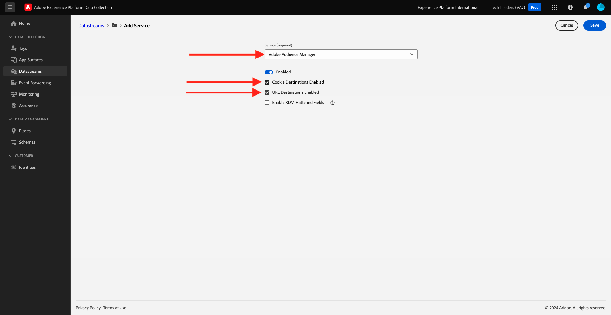

# 1.1.5 - Mise en oeuvre d’Adobe Analytics et de Adobe Audience Manager

## Contexte

Vous savez maintenant que les données XDM circulent sur Platform. Vous allez en savoir plus sur XDM dans [Module 2](./../module1.2/data-ingestion.md), ainsi que sur la création de votre propre schéma pour suivre les variables personnalisées. Pour l’instant, vous allez examiner ce qui se passe lorsque vous définissez votre flux de données pour transférer des données vers Analytics et l’Audience Manager.

## 1.1.5.1 Variables de mappage dans Analytics

Adobe Experience Platform [!DNL Web SDK] mappe automatiquement certaines valeurs, ce qui rend une nouvelle mise en oeuvre d’Analytics via le SDK Web aussi rapide que possible. Les variables mappées automatiquement sont répertoriées [ici](https://experienceleague.adobe.com/docs/experience-platform/edge/data-collection/adobe-analytics/automatically-mapped-vars.html#data-collection).

Pour les données XDM qui ne sont pas automatiquement mappées à [!DNL Adobe Analytics], vous pouvez utiliser [données contextuelles](https://experienceleague.adobe.com/docs/analytics/implementation/vars/page-vars/contextdata.html?lang=fr) pour correspondre à votre [schéma](https://experienceleague.adobe.com/docs/experience-platform/xdm/schema/composition.html?lang=fr). Ensuite, il peut être mappé sur [!DNL Analytics] à l’aide de [règles de traitement](https://experienceleague.adobe.com/docs/analytics/admin/admin-tools/processing-rules/processing-rules-configuration/t-processing-rules.html) pour renseigner les variables [!DNL Analytics]. Les données contextuelles et les règles de traitement seront des concepts familiers à ceux qui ont travaillé avec Analytics dans le passé, mais ne vous souciez pas des détails pour l’instant s’ils s’agit de nouveaux concepts.

Vous pouvez également utiliser un ensemble d’actions et de listes de produits par défaut pour envoyer ou récupérer des données avec l’AEP [!DNL Web SDK]. Pour ce faire, voir [Produits](https://experienceleague.adobe.com/docs/experience-platform/edge/data-collection/collect-commerce-data.html?lang=en#data-collection).

### Données contextuelles

Pour être utilisées par [!DNL Analytics], les données XDM sont aplaties à l’aide de la notation par points et mises à disposition sous la forme `contextData`. La liste suivante de paires de valeurs présente un exemple de `context data` :

```javascript
{
    "bh": "900",
    "bw": "1680",
    "c": "24",
    "c.a.d.key.[0]": "value1",
    "c.a.d.key.[1]": "value2",
    "c.a.d.object.key1": "value1",
    "c.a.d.object.key2.[0]": "value2",
    "c.a.x.environment.browserdetails.javascriptenabled": "true",
    "c.a.x.environment.type": "browser",
    "cust_hit_time_gmt": "1579781427",
    "g": "http://example.com/home",
    "gn": "home",
    "j": "1.8.5",
    "k": "Y",
    "s": "1680x1050",
    "tnta": "218287:1:0|0,218287:1:0|2,218287:1:0|1,218287:1:0|32767,218287:1:01,218287:1:0|0,218287:1:0|1,218287:1:0|0,218287:1:0|1",
    "user_agent": "Mozilla/5.0 AppleWebKit/537.36 Safari/537.36",
    "v": "Y"
}
```

### Règles de traitement

Toutes les données collectées par le réseau Edge sont accessibles via les [règles de traitement](https://experienceleague.adobe.com/docs/analytics/admin/admin-tools/processing-rules/processing-rules-configuration/t-processing-rules.html). Dans [!DNL Analytics], vous pouvez utiliser des règles de traitement pour incorporer des données contextuelles dans des variables [!DNL Analytics].

## 1.1.5.2 Audience Manager sur l’Edge Network Experience Platform

Le transfert côté serveur n’est pas un nouveau concept d’Audience Manager, et le même processus que précédemment s’applique. Vous pouvez également synchroniser les identités.

## 1.1.5.3 Vérifiez votre flux de données pour envoyer des données à Adobe Analytics.

Si vous souhaitez envoyer les données collectées par le SDK Web à Adobe Analytics et Adobe Audience Manager, procédez comme suit.

Accédez à [https://experience.adobe.com/launch/](https://experience.adobe.com/launch/) et à **Datastreams**.

Dans le coin supérieur droit de votre écran, sélectionnez le nom de votre environnement de test, qui doit être `--aepSandboxName--`. Ouvrez votre flux de données spécifique, appelé `--aepUserLdap-- - Demo System Datastream`.


Vous verrez alors ceci. Pour activer Adobe Analytics, cliquez sur **+Ajouter un service**.


Vous verrez alors ceci. Sélectionnez le service **Adobe Analytics**, après lequel vous devez ajouter la suite de rapports dans Adobe Analytics pour envoyer des données. Dans ce tutoriel, cela n’a pas de portée. Cliquez sur **Annuler**.


## 1.1.5.4 Vérifiez votre flux de données pour envoyer des données à Adobe Audience Manager.

Vous verrez alors ceci. Pour activer Adobe Audience Manager, cliquez sur **+Ajouter un service**.


Vous verrez alors ceci. Sélectionnez le service **Adobe Audience Manager** après lequel vous pouvez décider d’activer ou de désactiver les destinations de cookie Adobe Audience Manager et/ou les destinations d’URL. Dans ce tutoriel, cette configuration est hors de portée. Cliquez sur **Annuler**.



Étape suivante : [1.1.6 Mise en oeuvre d’Adobe Target](./ex6.md)

[Revenir au module 1.1](./data-ingestion-launch-web-sdk.md)

[Revenir à tous les modules](./../../../overview.md)
