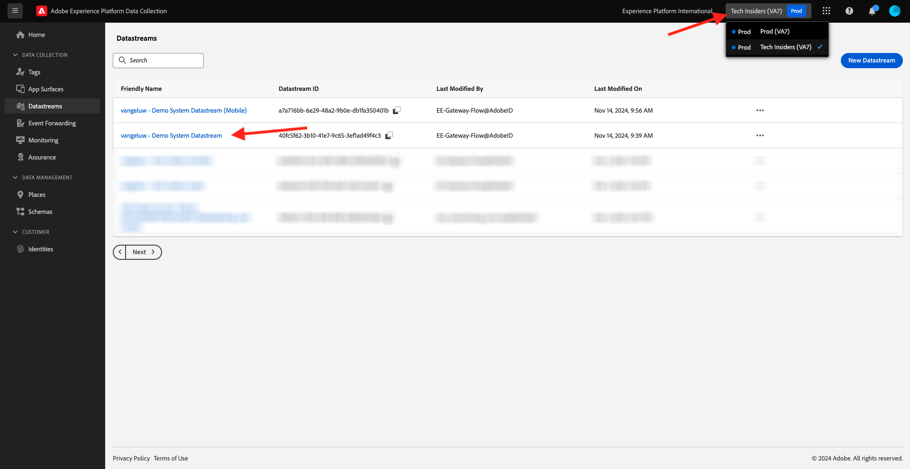
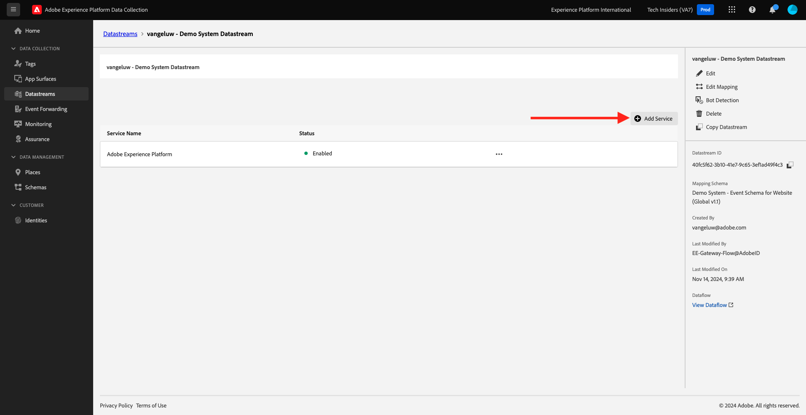

# 1.1.6 Mise en oeuvre d’Adobe Target

## 1.1.6.1 Mise à jour de la matrice de données pour utiliser Adobe Target

Si vous souhaitez envoyer des données collectées par le SDK Web à Adobe Target et obtenir une réponse d’Adobe Target avec une expérience personnalisée pour chaque client, procédez comme suit.

Accédez à [https://experience.adobe.com/launch/](https://experience.adobe.com/launch/) et à **Datastreams**.

Dans le coin supérieur droit de votre écran, sélectionnez le nom de votre environnement de test, qui doit être `--aepSandboxName--`. Ouvrez votre flux de données spécifique, appelé `--aepUserLdap-- - Demo System Datastream`.

Vous verrez alors ceci. Pour activer Adobe Target, cliquez sur **+Ajouter un service**.

Vous verrez alors ceci. Sélectionnez le service **Adobe Target**, après lequel vous pouvez éventuellement fournir des informations supplémentaires. Pour l’instant, il n’est pas nécessaire d’enregistrer cette opération. Cliquez donc sur **Annuler**.

Étape suivante : [1.1.7 Exigences de schéma XDM dans Adobe Experience Platform](./ex7.md)

[Revenir au module 1.1](./data-ingestion-launch-web-sdk.md)

[Revenir à tous les modules](./../../../overview.md)
