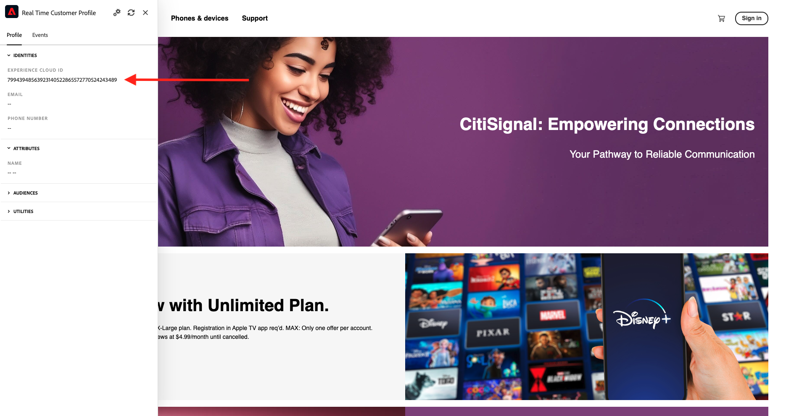
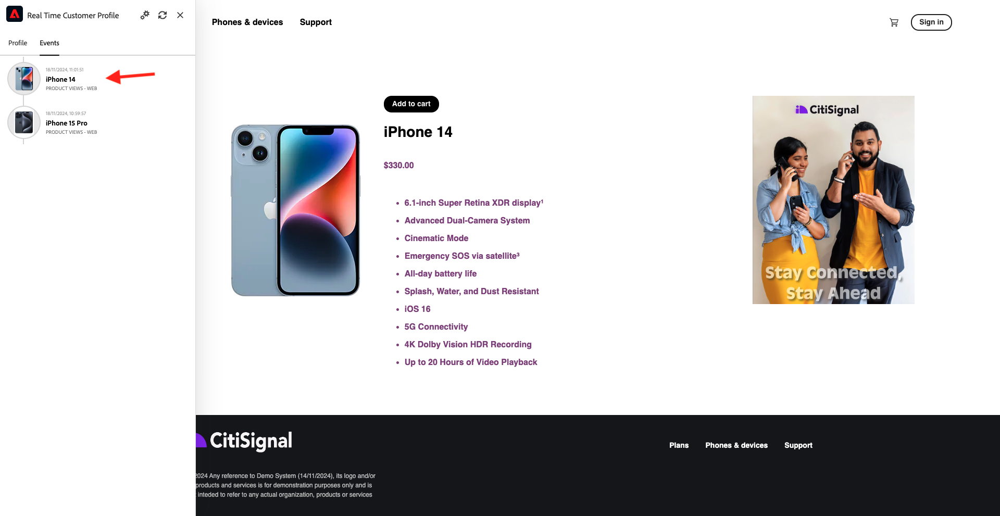
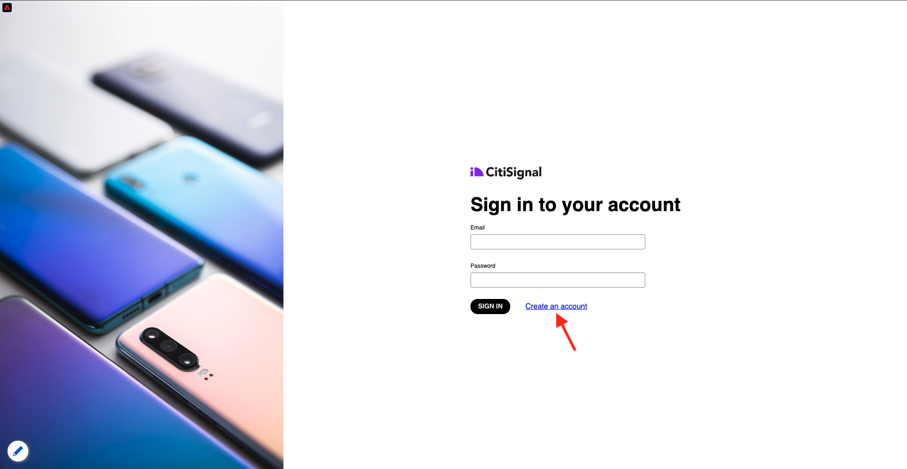

# 1.2.1 De inconnu à connu sur le site web

## Contexte

Le parcours de l’inconnu au connu est l’un des sujets les plus importants parmi les marques de nos jours, tout comme le parcours client de l’acquisition à la rétention.

Adobe Experience Platform joue un rôle énorme dans ce parcours. Platform est le cerveau de la communication, le système d&#39;enregistrement de l&#39;expérience.

Platform est un environnement dans lequel le mot **customer** est plus large que le simple **known**-clients. C&#39;est une chose très importante à mentionner lorsque vous parlez aux marques : un visiteur inconnu sur le site web est également un client du point de vue de Platform et, en tant que tel, tout le comportement en tant que visiteur inconnu est également envoyé à Platform. Grâce à cette approche, lorsque ce client devient un client connu, une marque peut également visualiser ce qui s’est passé avant ce moment. Cela s’avère utile du point de vue de l’attribution et de l’optimisation de l’expérience.

## Que vas-tu faire ?

Vous allez désormais ingérer des données dans Adobe Experience Platform et ces données seront liées à des identifiants tels que des ECID et des adresses électroniques. L’objectif est de comprendre le contexte commercial de ce que vous êtes sur le point de faire du point de vue de la configuration. Au cours de l’exercice suivant, vous allez commencer à configurer tout ce dont vous avez besoin pour rendre possible l’ingestion de données dans votre propre environnement de test.

### Flux de Parcours client

Accédez à [https://dsn.adobe.com](https://dsn.adobe.com). Une fois connecté avec votre Adobe ID, vous verrez ceci. Cliquez sur les 3 points **..** dans le projet de votre site web, puis cliquez sur **Modifier**.

Vous verrez alors votre site web de démonstration ouvert. Sélectionnez l’URL et copiez-la dans le presse-papiers.

Ouvrez une nouvelle fenêtre de navigateur incognito.

Collez l’URL de votre site web de démonstration, que vous avez copiée à l’étape précédente. Vous serez alors invité à vous connecter à l’aide de votre Adobe ID.

Sélectionnez le type de compte et procédez à la connexion.

Votre site web est alors chargé dans une fenêtre de navigateur incognito. Pour chaque démonstration, vous devez utiliser une fenêtre de navigateur incognito actualisée pour charger l’URL de votre site web de démonstration.

Cliquez sur l’icône représentant un logo d’Adobe dans le coin supérieur gauche de votre écran pour ouvrir la visionneuse de profils.

Consultez le panneau Visionneuse de profils et Real-time Customer Profile avec l’**identifiant Experience Cloud** comme identifiant principal pour ce client actuellement inconnu.

Vous pouvez également voir tous les événements d’expérience collectés en fonction du comportement du client. La liste est actuellement vide, mais elle va bientôt changer.

Accédez à la catégorie de produits **Phones &amp; devices** . Cliquez ensuite sur le produit **iPhone 15 Pro**.

Vous verrez ensuite la page des détails du produit. Un événement d’expérience de type **Consultation produit** a maintenant été envoyé à Adobe Experience Platform à l’aide de l’implémentation du SDK Web que vous avez examinée dans le module précédent.

Ouvrez le panneau Fournisseur de la visionneuse et observez vos **Événements d’expérience**.

Revenez à la page de catégorie **Téléphone et appareils** et cliquez sur un autre produit. Un autre événement d’expérience a été envoyé à Adobe Experience Platform.

Ouvrez le panneau Visionneuse de profils . Vous verrez désormais 2 événements d’expérience de type **Consultation produit**. Bien que le comportement soit anonyme, avec le consentement approprié en place, nous pouvons suivre chaque clic et le stocker dans Adobe Experience Platform. Une fois que le client anonyme sera connu, nous pourrons fusionner automatiquement tout comportement anonyme avec le profil de connaissance.

Cliquez sur **Se connecter** pour accéder à la page S’inscrire/Se connecter.

Cliquez sur **CRÉER UN COMPTE**.

Renseignez vos détails et cliquez sur **Enregistrer** après quoi vous serez redirigé vers la page précédente.

Ouvrez le panneau Visionneuse de profils et accédez à Real-time Customer Profile. Dans le panneau Visionneuse de profils, toutes vos données personnelles doivent s’afficher, comme les identifiants de téléphone et d’adresse électronique que vous venez d’ajouter.

Dans le panneau Visionneuse de profils, accédez à Événements d’expérience. Vous verrez les 2 produits que vous avez déjà consultés dans le panneau Visionneuse de profils . Ces deux événements sont désormais également connectés à votre profil &quot;connu&quot;.

Vous avez désormais ingéré des données dans Adobe Experience Platform et vous les avez liées à des identifiants tels que des ECID et des adresses électroniques. Le but est de comprendre le contexte commercial de ce que vous êtes sur le point de faire. Dans l’exercice suivant, vous allez commencer à configurer tout ce dont vous avez besoin pour rendre possible l’ingestion de données.

Étape suivante : [1.2.2 Configuration des schémas et définition des identifiants](./ex2.md)

[Revenir au module 1.2](./data-ingestion.md)

[Revenir à tous les modules](../../../overview.md)
