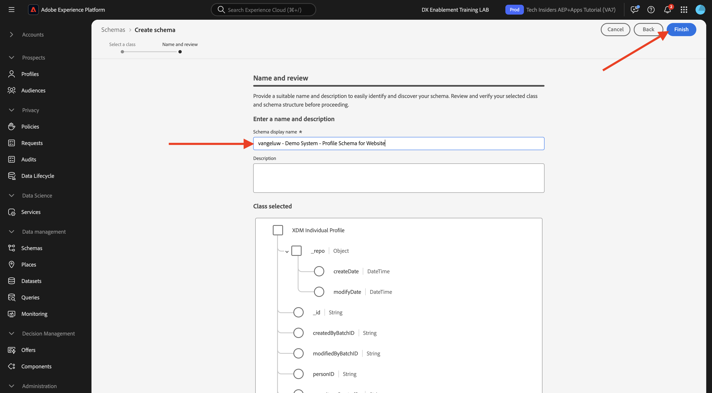
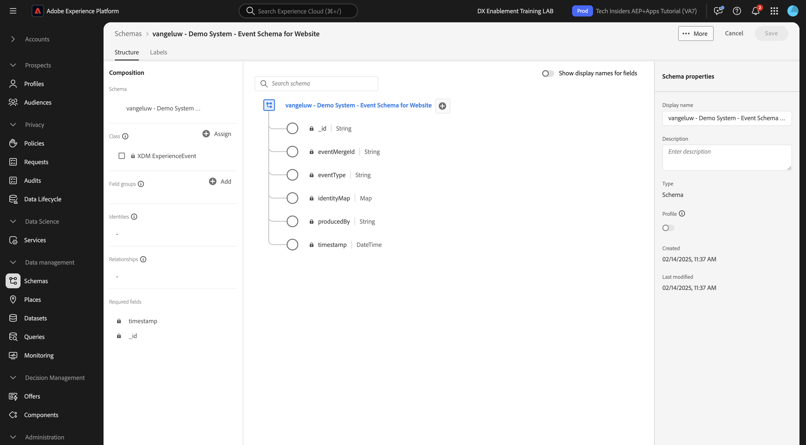

# 1.2.2 Configuration des schémas et définition des identifiants

Dans cet exercice, vous allez passer en revue la configuration des schémas XDM requis pour classer les informations de profil et le comportement des clients. Dans chaque schéma XDM, vous verrez également qu’un identifiant principal est défini pour lier toutes les informations relatives au client ou à la cliente.

## Histoire

Avant de commencer à configurer le schéma XDM et à définir les identifiants, vous devez réfléchir au contexte commercial de ce que nous essayons de faire :

- Vous voulez des données
- Vous souhaitez lier des données à un client
- Vous souhaitez créer un profil client en temps réel progressif

Nous voulons capturer deux types de données :

- Qui est ce client ?
- Que fait ce client ?

Cependant, la question **Qui est ce client ?** est une question très ouverte qui a de nombreuses réponses. Lorsque votre organisation souhaite obtenir une réponse à cette question, vous recherchez des informations démographiques telles que le prénom, le nom et l’adresse. Mais aussi pour des informations de contact telles qu’une adresse e-mail ou un numéro de téléphone mobile. Et aussi pour des informations liées à la langue, OptIn/OptOut et peut-être même Profile Pictures. Enfin, ce que vous devez vraiment savoir, c’est comment nous identifierons ce client dans les différents systèmes utilisés par votre entreprise.

Il en va de même pour la question **Que fait ce client ?**. C&#39;est une question très ouverte qui comporte de nombreuses réponses. Lorsque votre entreprise souhaite obtenir une réponse à cette question, vous recherchez toute interaction qu’un client a eue avec l’une de vos propriétés en ligne et hors ligne. Quelles pages ou quels produits ont été visités ? Ce client a-t-il ajouté un produit à son panier ou même acheté un article ? Quel appareil et quel navigateur ont été utilisés pour parcourir le site Web ? Quel type d’informations ce client recherche-t-il et comment pouvons-nous les utiliser pour configurer et offrir une expérience agréable à ce client ? Enfin, ce que nous devons vraiment savoir, c’est comment nous identifierons ce client dans les différents systèmes que votre entreprise utilisera.

## Qui est ce client ?

Capture la réponse à **Qui est ce client ?La** de votre organisation s’effectue via la page Connexion/Enregistrement.

Du point de vue du schéma, nous l’envisageons comme une **classe**. La question : **Qui est ce client ?** est quelque chose que nous définissons dans la classe **[!UICONTROL XDM Individual Profile]**.

Ainsi, lorsque vous créez un schéma XDM pour capturer la réponse à la question **Qui est ce client ?**, tout d’abord, vous devez créer et définir 1 schéma qui référence la classe **[!UICONTROL XDM Individual Profile]**.

Pour spécifier le type de réponses qui peuvent être données à cette question, vous devez définir [!UICONTROL Groupes de champs]. [!UICONTROL Groupes de champs] sont des extensions de la classe de profil et ont des configurations très spécifiques. Par exemple, les informations démographiques telles que le prénom, le nom, le genre et l’anniversaire font partie du [!UICONTROL groupe de champs] : **[!UICONTROL détails démographiques]**.

Ensuite, votre entreprise doit décider comment identifier ce client. Dans le cas de votre organisation, l’identifiant principal d’un client connu peut être un identifiant client spécifique, comme une adresse e-mail. Mais, techniquement, il existe d’autres moyens d’identifier un client dans votre entreprise, comme l’utilisation d’un numéro de téléphone mobile.
Dans cet atelier, nous définirons l’adresse e-mail comme identifiant principal et le numéro de téléphone comme identifiant secondaire.

Enfin, il est important de distinguer le canal sur lequel les données ont été capturées. Dans ce cas, nous parlerons des enregistrements de sites Web et le schéma qui doit être défini doit refléter **où** les données d’enregistrement ont été capturées. Le canal jouera également un rôle important dans l’influence des données capturées. Par conséquent, il est recommandé de définir des schémas pour chaque combinaison de canal, d’identifiant principal et de type de données collectées.

Sur la base de ce qui précède, les schémas ont été créés dans Adobe Experience Platform.

Connectez-vous à Adobe Experience Platform en accédant à cette URL : [https://experience.adobe.com/platform](https://experience.adobe.com/platform).

Une fois connecté, vous accédez à la page d’accueil de Adobe Experience Platform.

Avant de continuer, vous devez sélectionner un **sandbox**. Le sandbox à sélectionner est nommé ``--aepSandboxName--``. Après avoir sélectionné la sandbox appropriée, la modification d’écran s’affiche et vous êtes maintenant dans votre sandbox dédiée.

Dans Adobe Experience Platform, cliquez sur **[!UICONTROL Schémas]** dans le menu situé dans la partie gauche de l’écran. La liste des [!UICONTROL schémas] disponibles s’affiche. Vous devez créer un schéma. Pour créer un schéma, cliquez sur **[!UICONTROL + Créer un schéma]**.

Sélectionnez **Manuel** puis cliquez sur **Sélectionner**.

Ensuite, sélectionnez **Profil individuel** et cliquez sur **Suivant**.

Saisissez le nom de votre schéma comme suit : `--aepUserLdap-- - Demo System - Profile Schema for Website`. Cliquez sur **Terminer**.

Un nouveau schéma est maintenant créé.

Vous devez maintenant définir ce qu’est une réponse à la question **Qui est ce client ?** devrait ressembler à ceci.
Dans le cadre de l’introduction de ce Lab, nous avons remarqué la nécessité des attributs suivants pour définir un client :

- Informations démographiques telles que le prénom, le nom et l’adresse
- Coordonnées telles qu’une adresse personnelle, une adresse e-mail ou un numéro de téléphone mobile
- Autres informations liées à la langue, OptIn/OptOut et peut-être même les photos de profil.
- Identifiant de Principal pour un client

Pour que ces informations fassent partie de votre schéma, vous devez ajouter les [!UICONTROL groupes de champs] suivants à votre schéma :

- Détails démographiques (Informations démographiques)
- Coordonnées Personnelles (Coordonnées)
- Détails relatifs au consentement et aux préférences (autres informations)
- Groupe de champs d’identification de profil personnalisé de votre entreprise (identifiants Principal et Secondaire)

Cliquez sur le bouton **+Ajouter** sous **Groupes de champs**.

Dans l’écran **[!UICONTROL Ajouter un groupe de champs]**, sélectionnez les [!UICONTROL Groupe de champs] **[!UICONTROL Détails démographiques]**, **[!UICONTROL Coordonnées personnelles]** et **[!UICONTROL Détails de consentement et de préférence]**.

Cliquez sur le bouton **[!UICONTROL Ajouter des groupes de champs]** pour ajouter le [!UICONTROL groupe de champs] à votre schéma.

Voici ce que vous devez savoir :

Ensuite, vous avez besoin d’un nouveau [!UICONTROL Groupe de champs] pour capturer le **[!UICONTROL Identifiant]** utilisé pour la collecte de données. Comme vous l&#39;avez vu dans l&#39;exercice précédent, il y a un concept d&#39;identificateurs. Un identifiant de Principal est le plus important, car toutes les données collectées seront liées à cet identifiant.

Vous allez à présent créer votre propre [!UICONTROL groupe de champs] personnalisé et, par conséquent, étendre le [!UICONTROL schéma XDM] pour répondre aux besoins de votre propre organisation.

Cliquez sur **[!UICONTROL + Ajouter]** sous **Groupes de champs** pour commencer à ajouter un [!UICONTROL Groupe de champs].

Au lieu de réutiliser un [!UICONTROL Groupe de champs] existant, vous allez maintenant créer votre propre [!UICONTROL Groupe de champs]. Pour ce faire, sélectionnez **[!UICONTROL Créer un groupe de champs]**.

Vous devez maintenant fournir un **[!UICONTROL Nom d’affichage]** et un **[!UICONTROL Description]** pour votre nouveau [!UICONTROL Groupe de champs].

Comme nom pour notre schéma, nous utiliserons ceci :
`--aepUserLdap-- - Profile Identification Field Group`

Cliquez sur le bouton **[!UICONTROL Ajouter des groupes de champs]** pour ajouter le [!UICONTROL groupe de champs] nouvellement créé à votre schéma.

Vous avez maintenant mis en place cette structure de schéma.

Votre nouveau [!UICONTROL Groupe de champs] est toujours vide. Vous devez donc maintenant ajouter des champs à ce [!UICONTROL Groupe de champs].
Dans la liste [!UICONTROL Groupe de champs], cliquez sur votre [!UICONTROL Groupe de champs] personnalisé.

Plusieurs nouveaux boutons s’affichent à présent.

Au niveau supérieur de votre schéma, cliquez sur le bouton **[!UICONTROL + Ajouter un champ]**.

Après avoir cliqué sur le bouton **[!UICONTROL + Ajouter un champ]** , un nouveau champ sans titre s’affiche désormais dans votre schéma.

Vous devez maintenant saisir les informations de ce nouveau champ, en utilisant ces définitions d’objet :

- Nom du champ : **`--aepUserLdap--_identification`**
- Nom d’affichage : **`--aepUserLdap--_identification`**
- Type : **[!UICONTROL objet]**
- Groupe de champs : **`--aepUserLdap-- - Profile Identification Field Group`**

Cliquez sur **Appliquer**.

Un nouvel objet s’affiche désormais dans votre schéma, qui représente un **[!UICONTROL objet]** personnalisé dans le schéma et qui est nommé en fonction de votre identifiant client Adobe Experience Platform. Votre identifiant de client Adobe Experience Platform est `--aepTenantId--` et il est unique pour chaque instance AEP.

Vous allez maintenant ajouter un 3 nouvel objet fields sous ce client, dans l’objet **identification** que vous venez de créer. Pour commencer à ajouter chacun de ces 3 champs, cliquez sur l’icône **+** sous **identification** pour chaque champ.

Utilisez les informations ci-dessous pour créer ces 3 nouveaux champs sous l’objet **[!UICONTROL identification]** :

- ecid :
   - Nom du champ : **`--aepUserLdap--_ecid`**
   - Nom d’affichage : **`--aepUserLdap--ecid`**
   - Type : **[!UICONTROL String]**
   - Groupe de champs : **`--aepUserLdap-- - Profile Identification Field Group`**

- emailId
   - Nom du champ : **`--aepUserLdap--_emailId`**
   - Nom d’affichage : **`--aepUserLdap--_emailId`**
   - Type : **[!UICONTROL String]**
   - Groupe de champs : **`--aepUserLdap-- - Profile Identification Field Group`**

- mobile
   - Nom du champ : **`--aepUserLdap--_mobilenr`**
   - Nom d’affichage : **`--aepUserLdap--_mobilenr`**
   - Type : **[!UICONTROL String]**
   - Groupe de champs : **`--aepUserLdap-- - Profile Identification Field Group`**

Voici à quoi chaque champ doit ressembler après votre configuration initiale de champ.

- `--aepUserLdap--_mobilenr`

Pour enregistrer votre champ, faites défiler l’écran vers le bas dans la **[!UICONTROL Propriétés du champ]** jusqu’à ce que le bouton **[!UICONTROL Appliquer]** s’affiche. Cliquez sur le bouton **[!UICONTROL Appliquer]**.

- `--aepUserLdap--_ecid`

N’oubliez pas de faire défiler l’écran vers le bas et de cliquer sur **Appliquer**.

- `--aepUserLdap--_emailId`

N’oubliez pas de faire défiler l’écran vers le bas et de cliquer sur **Appliquer**.

Chaque champ est défini comme type **[!UICONTROL Chaîne]** et vous allez maintenant configurer ces champs en tant qu’**[!UICONTROL Identités]**. Pour ce schéma, nous supposons qu’un client sera toujours identifié par son adresse e-mail, ce qui signifie que vous devez configurer le champ **[!UICONTROL emailId]** comme identifiant **[!UICONTROL principal]** et les autres champs comme identifiants normaux.

Vos 3 champs doivent maintenant être définis comme des champs **[!UICONTROL Identity]**.

Pour commencer à définir ces champs en tant que champs **[!UICONTROL d]** identité), procédez comme suit :

- Sélectionnez l’**`--aepUserLdap--_emailId`** du champ.
- Sur le côté droit, dans les propriétés du champ, faites défiler l’écran vers le bas jusqu’à afficher **[!UICONTROL Identité]**. Cochez la case **[!UICONTROL Identité]**.

- Cochez maintenant la case **[!UICONTROL Identité de Principal]**.

- Enfin, sélectionnez l’espace de noms **[!UICONTROL E-mail]** dans la liste des **[!UICONTROL Espaces de noms]**. Un espace de noms est utilisé par le graphique d’identités dans Adobe Experience Platform pour classer les identifiants dans les espaces de noms et définir la relation entre ces espaces de noms. Cliquez sur **[!UICONTROL Appliquer]** pour enregistrer vos modifications.

Vous devez ensuite définir les autres champs pour **`--aepUserLdap--_ecid`** et **`--aepUserLdap--_mobilenr`** comme identifiants standard.

Sélectionnez l’**`--aepUserLdap--_ecid`** du champ. Sur le côté droit, dans les propriétés du champ, faites défiler l’écran vers le bas jusqu’à afficher **[!UICONTROL Identité]**. Cochez la case **[!UICONTROL Identité]**.
Sélectionnez ensuite l’espace de noms **[!UICONTROL ECID]** dans la liste des **[!UICONTROL Espaces de noms]**.
Cliquez sur **[!UICONTROL Appliquer]** pour enregistrer vos modifications.

Sélectionnez l’**`--aepUserLdap--_mobilenr`** du champ. Sur le côté droit, dans les propriétés du champ, faites défiler l’écran vers le bas jusqu’à afficher **[!UICONTROL Identité]**. Cochez la case **[!UICONTROL Identité]**.
Sélectionnez l’espace de noms **[!UICONTROL Téléphone]** dans la liste des **[!UICONTROL Espaces de noms]**.
Cliquez sur **[!UICONTROL Appliquer]** pour enregistrer vos modifications.

L’objet **[!UICONTROL identification]** doit maintenant ressembler à ceci, avec les 3 champs d’identification affichant désormais également une icône **[!UICONTROL empreinte]** pour indiquer qu’ils ont été définis comme identifiants.

Cliquez sur **[!UICONTROL Enregistrer]** pour enregistrer vos modifications.

La dernière chose à faire ici est d&#39;activer le schéma à lier au **[!UICONTROL Profil]**.
En activant votre schéma pour Profil, vous vous assurez que toutes les données envoyées à Adobe Experience Platform par rapport à ce schéma feront partie de l’environnement de profil client en temps réel, qui garantit que toutes ces données peuvent être utilisées en temps réel pour les requêtes, la segmentation et l’activation.

Pour ce faire, sélectionnez le nom de votre schéma.

Dans l’onglet de droite de votre schéma, cliquez sur le bouton **[!UICONTROL Profile]**, actuellement désactivé.

Activez le [!UICONTROL Profil] - basculez en cliquant dessus.

Cliquez sur **[!UICONTROL Activer]** pour activer ce schéma pour Profil.

Votre schéma est maintenant configuré pour faire partie du [!UICONTROL profil client en temps réel]. Cliquez sur **[!UICONTROL Enregistrer]** pour enregistrer le schéma.

## Que fait ce client ?

Capturer la réponse à la question **Que fait ce client ?** pour votre organisation est effectuée par le biais, par exemple, d’une consultation produit sur une page produit.

Du point de vue du schéma, nous considérons cela comme une **[!UICONTROL classe]**. La question : **Que fait ce client ?** est quelque chose que nous avons défini dans la classe **[!UICONTROL ExperienceEvent]**.

Ainsi, lorsque vous créez un [!UICONTROL schéma XDM] pour capturer la réponse à **Que fait ce client ?**, tout d’abord, vous devez créer et définir 1 schéma qui référence la classe **[!UICONTROL ExperienceEvent]**.

Pour spécifier le type de réponses qui peuvent être données à cette question, vous devez définir [!UICONTROL  Groupe de champs ]. Les [!UICONTROL groupes de champs] sont des extensions de la classe [!UICONTROL ExperienceEvent] et possèdent des configurations très spécifiques. Par exemple, les informations sur le type de produits qu’un client a consultés ou ajoutés à son panier font partie des [!UICONTROL Détails du groupe de champs] **Commerce**.

Ensuite, votre entreprise doit décider de la manière dont vous identifierez le comportement de ce client. Puisque nous parlons d’interactions sur un site web, il est possible que votre organisation connaisse le client, mais il est également possible qu’un visiteur inconnu et anonyme soit actif sur le site web. Nous ne pouvons donc pas utiliser un identifiant tel que l’adresse e-mail. Dans ce cas, votre organisation décidera probablement d’utiliser l’Experience Cloud ID  (ECID) comme identifiant principal.

Enfin, il est important de distinguer le canal sur lequel les données ont été capturées. Dans ce cas, nous parlerons des interactions du site web et du schéma qui doit être défini doit refléter **où** données d’interaction ont été capturées. Le canal jouera également un rôle important dans l’influence des données capturées. Par conséquent, il est recommandé de définir des schémas pour chaque combinaison de canal, d’identifiant principal et de type de données collectées.

En fonction de ce qui précède, vous devez configurer un schéma dans Adobe Experience Platform.

Une fois connecté, vous accédez à la page d’accueil de Adobe Experience Platform.

Avant de continuer, vous devez sélectionner un **[!UICONTROL sandbox]**. Le [!UICONTROL sandbox] à sélectionner est nommé ``--aepSandboxName--``. Après avoir sélectionné la sandbox appropriée, la modification d’écran s’affiche et vous êtes maintenant dans votre sandbox dédiée.

Dans Adobe Experience Platform, cliquez sur **[!UICONTROL Schémas]** dans le menu sur le côté gauche de l’écran et accédez à **Parcourir**. Vous devez créer un schéma. Pour créer un schéma, cliquez sur le bouton **[!UICONTROL + Créer un schéma]**.

Sélectionnez **Manuel** puis cliquez sur **Sélectionner**.

Sélectionnez **Événement d’expérience** et cliquez sur **Suivant**.

Saisissez un nom pour le schéma, comme suit : `--aepUserLdap-- - Demo System - Event Schema for Website`. Cliquez sur **Terminer**.

Un nouveau schéma est créé et vous pouvez configurer les données qui seront collectées par rapport à celui-ci.

Vous devez maintenant définir la réponse à la question **Que fait ce client ?** devrait ressembler à ceci.
Dans le cadre de l’introduction de ce Lab, nous avons remarqué la nécessité des attributs suivants pour définir ce qu’un client fait :

- Quelles pages ou quels produits ont été visités ?
- Ce client a-t-il ajouté un produit à son panier ou même acheté un article ?
- Quel appareil et quel navigateur ont été utilisés pour parcourir le site Web ?
- Quel type d’informations ce client recherche-t-il et comment pouvons-nous les utiliser pour configurer et offrir une expérience agréable à ce client ?
- Identifiant de Principal pour un client

Pour que ces informations fassent partie de votre schéma, vous devez ajouter le [!UICONTROL groupe de champs] suivant à votre schéma :

- ExperienceEvent AEP Web SDK
- Identification de profil personnalisée de votre entreprise [!UICONTROL Groupe de champs]

Cliquez sur **+ Ajouter** sous **Groupes de champs**.

Dans l’écran **[!UICONTROL Ajouter un groupe de champs]**, sélectionnez le [!UICONTROL Groupe de champs] **[!UICONTROL ExperienceEvent AEP Web SDK]**. Cliquez sur **[!UICONTROL Ajouter des groupes de champs]**.

Voici ce que vous obtiendrez :

Ensuite, vous devez créer un nouveau [!UICONTROL Groupe de champs] pour capturer le **[!UICONTROL Identifiant]** utilisé pour la collecte de données.

Vous allez à présent créer votre propre [!UICONTROL groupe de champs] personnalisé et, par conséquent, étendre le [!UICONTROL schéma XDM] pour répondre aux besoins de votre propre organisation.

Un [!UICONTROL groupe de champs] est lié à une [!UICONTROL classe], ce qui signifie que vous ne pouvez pas simplement réutiliser le [!UICONTROL groupe de champs] créé précédemment.

Cliquez sur le bouton **[!UICONTROL + Ajouter]** pour commencer à ajouter un [!UICONTROL Groupe de champs].

Au lieu de réutiliser un [!UICONTROL Groupe de champs] existant, vous allez maintenant créer votre propre [!UICONTROL Groupe de champs]. Sélectionnez **[!UICONTROL Créer un groupe de champs]** et saisissez le nom de votre groupe de champs, comme suit : `--aepUserLdap-- - ExperienceEvent Identification Field Group`.
Cliquez sur **Ajouter des groupes de champs**

Vous devriez maintenant avoir mis en place cette structure [!UICONTROL Schéma].

Votre nouveau [!UICONTROL Groupe de champs] est toujours vide. Vous devez donc maintenant ajouter des champs à ce groupe de champs.
Dans la liste [!UICONTROL Groupe de champs], cliquez sur votre [!UICONTROL Groupe de champs] personnalisé.

Plusieurs nouveaux boutons s’affichent à présent.

Au niveau supérieur de votre schéma, en regard de votre schéma - nom, cliquez sur le bouton **[!UICONTROL +]** .

Après avoir cliqué sur le bouton **+**, un nouveau champ sans titre s’affiche désormais dans votre schéma.

Utilisez ceci pour définir votre nouveau champ :

- Nom du champ : **`--aepUserLdap--_identification`**
- Nom d’affichage : **`--aepUserLdap--_identification`**
- Type : **[!UICONTROL objet]**
- Groupe de champs : `--aepUserLdap-- - ExperienceEvent Identification Field Group`

Cliquez sur **Appliquer**.

Votre nouveau champ est maintenant créé sous votre identifiant client Adobe Experience Platform. Votre identifiant client Adobe Experience Platform est `--aepTenantId--`.

Vous allez maintenant ajouter 1 nouveau champ sous l’objet **[!UICONTROL identification]**.

Cliquez sur le bouton **[!UICONTROL +]** en regard de l’objet **[!UICONTROL identification]** pour créer un champ.

Le champ ECID est défini sur le type **[!UICONTROL Chaîne]** et vous devez configurer ce champ en tant qu’**[!UICONTROL Identité]**. Pour le schéma **[!UICONTROL Système de démonstration - Schéma d’événement pour le site web]**, nous supposons qu’un client sera toujours identifié par son [!UICONTROL ECID], ce qui signifie que vous devez configurer le champ **[!UICONTROL ECID]** comme identifiant **principal**

Vous avez maintenant un champ vide. Vous devez configurer le champ ci-dessus comme indiqué.

- ecid :

   - Nom du champ : **`--aepUserLdap--_ecidweb`**
   - Nom d’affichage : **`--aepUserLdap--_ecidweb`**
   - Type : **[!UICONTROL String]**
   - Groupe de champs : `--aepUserLdap-- - ExperienceEvent Identification Field Group`

Voici à quoi le champ `--aepUserLdap--_ecidweb` doit ressembler après votre configuration de champ initiale :

Faites défiler vers le bas et cliquez sur **[!UICONTROL Appliquer]**.

Vous disposez désormais d’un nouveau champ, mais ce champ n’a pas encore été défini en tant que champ **[!UICONTROL Identity]**.

Pour commencer à définir ces champs en tant que champs **[!UICONTROL Identité]**, sélectionnez le **`--aepUserLdap--_ecidweb`** de champs.
Sur le côté droit, dans les propriétés du champ, faites défiler l’écran vers le bas jusqu’à afficher **[!UICONTROL Identité]**. Cochez la case **[!UICONTROL Identité]** et cochez la case **[!UICONTROL Identité du Principal]**.
Sélectionnez l’espace de noms **[!UICONTROL ECID]** dans la liste des **[!UICONTROL Espaces de noms]**.

Cliquez sur **[!UICONTROL Appliquer]** pour enregistrer vos modifications.

L’objet **[!UICONTROL identification]** doit maintenant ressembler à ceci, avec le champ ecid affichant désormais également une icône **empreinte** pour indiquer qu’ils ont été définis comme identifiants.
Cliquez sur **[!UICONTROL Enregistrer]** pour enregistrer vos modifications.

Il est important de noter que certains champs sont obligatoires lors de l’ingestion finale de données par rapport à ce schéma.
Par exemple, les champs **[!UICONTROL _id]** et **[!UICONTROL timestamp]** sont des champs obligatoires, imposés par la classe ExperienceEvent.

- _id doit contenir un id unique pour une ingestion de données spécifique
- la date et l’heure doivent être celles de cet accès, au format **`"YYYY-MM-DDTHH:MM:SSSZ"`**, comme par exemple : **`"2024-11-18T07:20:000Z"`**

Vous avez maintenant défini un schéma, lié les groupes de champs existants et nouvellement créés [!UICONTROL Field Groups] et défini des identifiants.

La dernière chose à faire ici est d&#39;activer le schéma à lier au **[!UICONTROL Profil]**.
En activant votre schéma pour [!UICONTROL Profil], vous vous assurez que toutes les données envoyées à Adobe Experience Platform par rapport à ce schéma feront partie du profil client en temps réel, ce qui garantit que toutes ces données peuvent être utilisées en temps réel pour les requêtes, la segmentation et l’activation.

Pour ce faire, cliquez sur le nom de votre schéma.

Dans l’onglet de droite de votre schéma, le bouton (bascule) **[!UICONTROL Profil] qui est actuellement désactivé s’affiche**. Cliquez sur le bouton [!UICONTROL Profil] - pour l’activer.

Ce message s&#39;affichera. Cliquez sur **[!UICONTROL Activer]** pour activer ce schéma pour Profil.

Votre schéma est maintenant configuré pour faire partie du profil client en temps réel.

Cliquez sur **[!UICONTROL Enregistrer]** pour enregistrer le schéma.

Vous avez maintenant terminé de créer des schémas qui sont activés pour être utilisés dans le profil client en temps réel.

Examinons les jeux de données dans l’exercice suivant.

Étape Suivante : [1.2.3 Configurer Des Jeux De Données](./ex3.md)

[Retour au module 1.2](./data-ingestion.md)

[Revenir à tous les modules](../../../overview.md)
