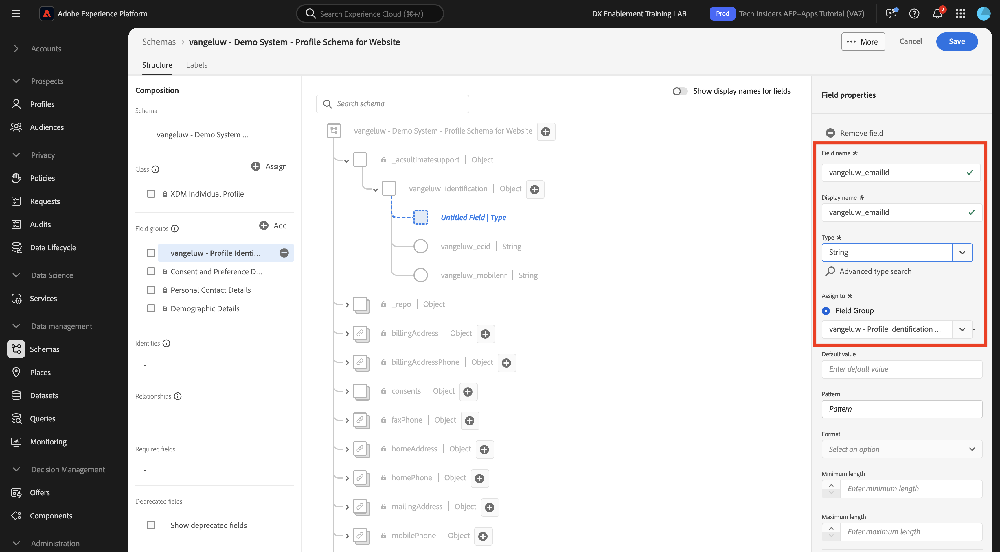
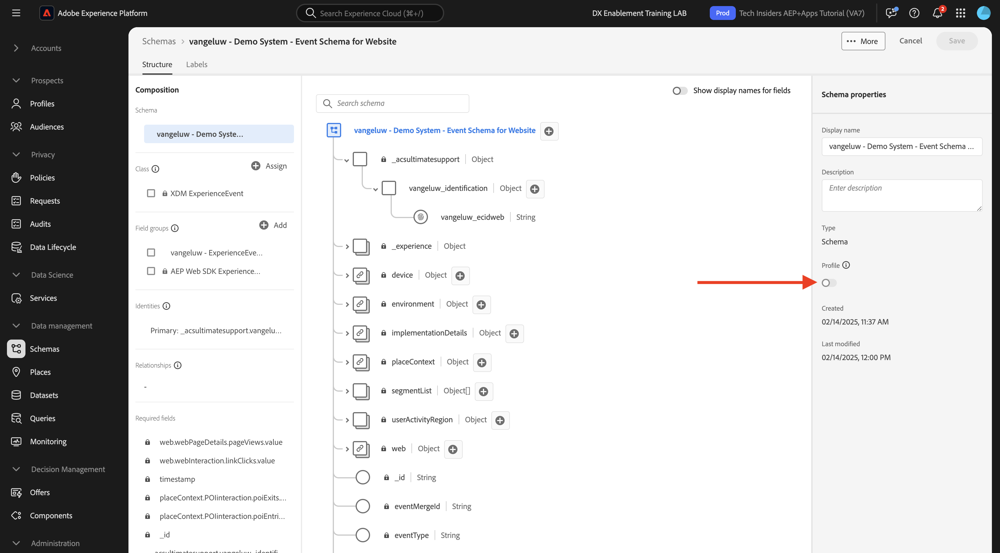

# 1.2.2 Configuration des schémas et définition d’identifiants

Dans cet exercice, vous allez configurer les schémas XDM requis pour classer les informations de profil et le comportement des clients. Dans chaque schéma XDM, vous devrez également configurer un identifiant principal pour lier toutes les informations à .

## Histoire

Avant de commencer à configurer des schémas XDM et de définir des identifiants de Principal, nous devons réfléchir au contexte d’entreprise de ce que nous essayons de faire :

- Vous voulez des données
- Vous souhaitez lier les données à un client
- Vous souhaitez créer un profil client en temps réel progressif

Il existe deux types de données que nous voulons capturer :

- Qui est ce client ?
- Que fait ce client ?

Cependant, la question **Qui est ce client ?** est une question très ouverte qui comporte de nombreuses réponses. Lorsque votre entreprise souhaite obtenir une réponse à cette question, vous recherchez des informations démographiques telles que le prénom, le nom et l’adresse. Mais également pour les coordonnées telles qu’une adresse électronique ou un numéro de téléphone mobile. Et aussi pour les informations liées à Langue, OptIn/OptOut et peut-être même les photos de profil. Et enfin, ce que vous avez vraiment besoin de savoir, c&#39;est comment nous allons identifier ce client dans les différents systèmes que votre entreprise utilise.

La même chose se produit pour la question **Que fait ce client ?**. C&#39;est une question très ouverte avec de nombreuses réponses. Lorsque votre entreprise souhaite obtenir une réponse à cette question, vous recherchez toute interaction qu’un client a eue avec l’une de vos propriétés en ligne et hors ligne. Quelles pages ou quels produits ont été consultés ? Ce client a-t-il ajouté un produit à son panier ou a-t-il même acheté un article ? Quel périphérique et navigateur a été utilisé pour parcourir le site web ? Quel type d’informations ce client recherche-t-il et comment pouvons-nous l’utiliser pour configurer et offrir une expérience agréable à ce client ? Et enfin, ce que nous avons vraiment besoin de savoir, c&#39;est comment nous allons identifier ce client dans les différents systèmes que votre entreprise va utiliser.

## 1.2.1.1 - Qui est ce client

Capture de la réponse à **Qui est ce client ?** pour votre entreprise est effectué via la page de connexion/enregistrement.

Du point de vue des schémas, nous considérons ceci comme une **classe**. Question : **Qui est ce client ?** est quelque chose que nous définissons dans la classe **[!UICONTROL XDM Individual Profile]**.

Ainsi, lorsque vous créez un schéma XDM pour capturer la réponse à **Qui est ce client ?**, tout d’abord, vous devrez créer et définir 1 schéma qui référence la classe **[!UICONTROL XDM Individual Profile]**.

Pour spécifier le type de réponses à donner à cette question, vous devez définir des [!UICONTROL groupes de champs]. [!UICONTROL Les groupes de champs] sont des extensions de la classe Profile et ont des configurations très spécifiques. Par exemple, des informations démographiques comme Prénom, Nom, Genre et Anniversaire font partie du [!UICONTROL Groupe de champs] : **[!UICONTROL Détails démographiques]**.

Deuxièmement, votre entreprise doit décider comment identifier ce client. Dans le cas de votre société, l’identifiant principal d’un client connu peut être un identifiant de client spécifique, comme une adresse électronique. Mais techniquement, il existe d&#39;autres moyens d&#39;identifier un client dans votre entreprise, comme utiliser un numéro de téléphone portable.
Dans ce laboratoire, nous définirons l&#39;adresse email comme identifiant principal et le numéro de téléphone comme identifiant secondaire.

Enfin, il est important de distinguer le canal sur lequel les données ont été capturées. Dans ce cas, nous parlerons des abonnements au site web et le schéma qui doit être défini doit refléter **où** les données d’enregistrement ont été capturées. Le canal aura également un rôle important à jouer pour influencer les données capturées. Il est donc recommandé de définir des schémas pour chaque combinaison de canal, d’identifiant principal et de type de données collectées.

En fonction de ce qui précède, vous devez configurer un schéma dans Adobe Experience Platform.

Connectez-vous à Adobe Experience Platform en accédant à cette URL : [https://experience.adobe.com/platform](https://experience.adobe.com/platform).

Une fois connecté, vous accédez à la page d’accueil de Adobe Experience Platform.

Avant de continuer, vous devez sélectionner un **sandbox**. L’environnement de test à sélectionner est nommé ``--module2sandbox--``. Pour ce faire, cliquez sur le texte **[!UICONTROL Production Prod]** dans la ligne bleue en haut de votre écran. Après avoir sélectionné l’environnement de test approprié, l’écran change et vous êtes désormais dans votre environnement de test dédié.

Dans Adobe Experience Platform, cliquez sur **[!UICONTROL Schémas]** dans le menu sur le côté gauche de votre écran. La liste des [!UICONTROL schémas] disponibles s’affiche.

Vous devez créer un nouveau schéma. Pour créer un nouveau schéma, cliquez sur le bouton **[!UICONTROL + Créer un schéma]** et sélectionnez **[!UICONTROL XDM Individual Profile]**.

Après avoir cliqué sur le bouton **[!UICONTROL + Créer un schéma]** , un nouveau schéma est créé et vous serez invité à sélectionner ou à créer des **groupes de champs**.

Vous devez maintenant définir quelle réponse à la question **Qui est ce client ?** doit ressembler à ça.
Dans l’introduction de ce laboratoire, nous avons noté la nécessité d’utiliser les attributs suivants pour définir un client :

- Informations démographiques telles que Prénom, Nom et Adresse
- Coordonnées telles qu’une adresse de domicile, une adresse électronique ou un numéro de téléphone mobile
- Autres informations liées à Langue, OptIn/OptOut et peut-être même les images de profil.
- Identifiant de Principal pour un client

Pour que ces informations fassent partie de votre schéma, vous devez ajouter les [!UICONTROL groupes de champs] suivants à votre schéma :

- Détails démographiques (informations démographiques)
- Coordonnées personnelles (coordonnées)
- Détails des préférences (autres informations)
- Groupe de champs d’identification de profil personnalisé de votre entreprise (identifiants de Principal et Secondaire)

Dans l’écran **[!UICONTROL Ajouter un groupe de champs]**, sélectionnez le [!UICONTROL groupe de champs] ****, les **[!UICONTROL coordonnées personnelles]** et les **[!UICONTROL détails de préférences]**.

Cliquez sur le bouton **[!UICONTROL Ajouter un groupe de champs]** pour ajouter le [!UICONTROL groupe de champs] à votre schéma.

Vous allez maintenant avoir ceci :

Ensuite, vous avez besoin d’un nouveau [!UICONTROL Groupe de champs] pour capturer l’ **[!UICONTROL identifiant]** utilisé pour la collecte de données. Comme vous l&#39;avez vu dans l&#39;exercice précédent, il y a un concept d&#39;identifiant de Principal et Secondaire. Un identifiant de Principal est le plus important, car toutes les données collectées seront liées à cet identifiant.

Vous allez maintenant créer votre propre [!UICONTROL Groupe de champs] personnalisé et, en tant que tel, vous allez étendre le [!UICONTROL schéma XDM] pour répondre aux besoins de votre propre entreprise.

Cliquez sur le bouton **[!UICONTROL + Ajouter]** pour commencer à ajouter un [!UICONTROL groupe de champs].

Au lieu de réutiliser un [!UICONTROL Groupe de champs] existant, vous allez maintenant créer votre propre [!UICONTROL Groupe de champs]. Pour ce faire, sélectionnez **[!UICONTROL Créer un groupe de champs]**.

Vous devez maintenant fournir un **[!UICONTROL nom d’affichage]** et une **[!UICONTROL description]** pour votre nouveau [!UICONTROL groupe de champs].

Pour le nom de notre schéma, nous utiliserons ceci :
`--demoProfileLdap-- - Profile Identification Field Group`

Par exemple, pour ldap **[!UICONTROL vangeluw]**, il doit s’agir du nom du schéma :

**[!UICONTROL vangeluw - Groupe de champs d’identification de profil]**

Cela devrait vous donner quelque chose comme ceci :

Cliquez sur le bouton **[!UICONTROL Ajouter un groupe de champs]** pour ajouter le [!UICONTROL groupe de champs] nouvellement créé à votre schéma.

Cette structure de schéma devrait maintenant être en place.

Votre nouveau [!UICONTROL Groupe de champs] est toujours vide. Vous devrez donc maintenant ajouter des champs à ce [!UICONTROL Groupe de champs].
Dans la liste [!UICONTROL Groupe de champs], cliquez sur votre [!UICONTROL Groupe de champs] personnalisé.

Plusieurs nouveaux boutons s’affichent désormais.

Au niveau supérieur de votre schéma, cliquez sur le bouton **[!UICONTROL + Ajouter un champ]** .

Après avoir cliqué sur le bouton **[!UICONTROL + Ajouter un champ]** , un nouvel **[!UICONTROL objet]** s’affiche désormais dans votre schéma. Cet objet représente un **[!UICONTROL objet]** personnalisé dans votre schéma et est nommé d’après votre ID de tenant Adobe Experience Platform. Votre ID de client Adobe Experience Platform est `--aepTenantId--`.

Vous allez maintenant ajouter un nouvel objet sous ce client. Pour ce faire, cliquez sur le champ **[!UICONTROL Nouveau champ]** sous l’objet client.

Utilisez les définitions d’objet suivantes :

- Nom du champ : **[!UICONTROL identification]**
- Nom d’affichage : **[!UICONTROL identification]**
- Type : **[!UICONTROL objet]**

Cliquez sur **[!UICONTROL Appliquer]** pour enregistrer vos modifications.

Après avoir cliqué sur **[!UICONTROL Appliquer]**, votre objet **[!UICONTROL identification]** s’affiche désormais dans le schéma.

Vous allez maintenant ajouter 3 nouveaux champs sous l’objet **[!UICONTROL identification]** :

- ecid :
   - Nom du champ : **[!UICONTROL ecid]**
   - Nom d’affichage : **[!UICONTROL ecid]**
   - Type : **[!UICONTROL String]**

- emailId
   - Nom du champ : **[!UICONTROL emailId]**
   - Nom d’affichage : **[!UICONTROL emailId]**
   - Type : **[!UICONTROL String]**

- mobilenr
   - Nom du champ : **[!UICONTROL mobilenr]**
   - Nom d’affichage : **[!UICONTROL mobilenr]**
   - Type : **[!UICONTROL String]**

Chaque champ sera défini comme de type **[!UICONTROL String]** et nous configurerons ces champs en tant que **[!UICONTROL Identités]**. Pour le schéma **[!UICONTROL Schéma d’enregistrement de site Web]**, nous supposons qu’un client sera toujours identifié par son adresse électronique, ce qui signifie que vous devez configurer le champ **[!UICONTROL emailId]** comme identifiant **[!UICONTROL principal]**, et les autres champs comme identifiants **[!UICONTROL secondaire]**.

Pour ajouter les champs, cliquez sur le bouton **[!UICONTROL +]** en regard de l’objet **[!UICONTROL identification]** .

Vous avez maintenant un champ vide. Vous devez configurer les 3 champs ci-dessus comme indiqué.

Voici comment chaque champ doit s’occuper de votre configuration initiale de champ.

Cliquez sur le bouton **[!UICONTROL +]** en regard de l’objet **[!UICONTROL identification]** pour créer un nouveau champ et remplir les champs comme indiqué.

- ecid

Pour enregistrer votre champ, faites défiler l’écran vers le bas dans les **[!UICONTROL Propriétés du champ]** jusqu’à ce que le bouton **[!UICONTROL Appliquer]** s’affiche. Cliquez sur le bouton **[!UICONTROL Appliquer]** .

Cliquez sur le bouton **[!UICONTROL +]** en regard de l’objet **[!UICONTROL identification]** pour créer un nouveau champ et remplir les champs comme indiqué.

- emailId

Pour enregistrer votre champ, faites défiler l’écran vers le bas dans les **[!UICONTROL Propriétés du champ]** jusqu’à ce que le bouton **[!UICONTROL Appliquer]** s’affiche. Cliquez sur le bouton **[!UICONTROL Appliquer]** .

Cliquez sur le bouton **[!UICONTROL +]** en regard de l’objet **[!UICONTROL identification]** pour créer un nouveau champ et remplir les champs comme indiqué.

- mobilenr

Pour enregistrer votre champ, faites défiler l’écran vers le bas dans les **[!UICONTROL Propriétés du champ]** jusqu’à ce que le bouton **[!UICONTROL Appliquer]** s’affiche. Cliquez sur le bouton **[!UICONTROL Appliquer]** .

Vous disposez désormais de 3 champs, mais ceux-ci n’ont pas encore été définis comme des champs **[!UICONTROL Identité]**.

Pour commencer à définir ces champs comme des champs **[!UICONTROL Identité]**, procédez comme suit :

- Sélectionnez le champ **[!UICONTROL emailId]**.
- Sur le côté droit, dans les propriétés du champ, faites défiler l’écran vers le bas jusqu’à ce que vous voyiez **[!UICONTROL Identité]**. Cochez la case correspondant à **[!UICONTROL Identity]**.

  

- Cochez maintenant la case correspondant à **[!UICONTROL Identité de Principal]**.

  

- Enfin, sélectionnez l’espace de noms **[!UICONTROL Email]** dans la liste des **[!UICONTROL Espaces de noms]**. Un espace de noms est utilisé par le graphique d’identités de Adobe Experience Platform pour classer les identifiants dans les espaces de noms et définir la relation entre ces espaces de noms.

  

- Enfin, cliquez sur **[!UICONTROL Appliquer]** pour enregistrer vos modifications.

  

Ensuite, vous devez définir les autres champs pour **[!UICONTROL ecid]** et **[!UICONTROL mobilenr]** comme identifiants secondaires.

- Sélectionnez le champ **[!UICONTROL ecid]**.
- Sur le côté droit, dans les propriétés du champ, faites défiler l’écran vers le bas jusqu’à ce que vous voyiez **[!UICONTROL Identité]**. Cochez la case correspondant à **[!UICONTROL Identity]**.

  

- Sélectionnez ensuite l’espace de noms **[!UICONTROL ECID]** dans la liste des **[!UICONTROL Espaces de noms]**. Un [!UICONTROL espace de noms] est utilisé par le graphique d’identités de Adobe Experience Platform pour classer les identifiants dans les espaces de noms et définir la relation entre ces espaces de noms.

  

- Cliquez sur **[!UICONTROL Appliquer]** pour enregistrer vos modifications.

  

- Sélectionnez le champ **[!UICONTROL mobilenr]**.
- Sur le côté droit, dans les propriétés du champ, faites défiler l’écran vers le bas jusqu’à ce que vous voyiez **[!UICONTROL Identité]**. Cochez la case correspondant à **[!UICONTROL Identity]**.

  

- Veillez à sélectionner l’espace de noms **[!UICONTROL Phone]** dans la liste des **[!UICONTROL Espaces de noms]**. Un espace de noms est utilisé par le graphique d’identités de Adobe Experience Platform pour classer les identifiants dans les espaces de noms et définir la relation entre ces espaces de noms.

  

- Cliquez sur **[!UICONTROL Appliquer]** pour enregistrer vos modifications.

  

L’objet **[!UICONTROL identification]** doit maintenant ressembler à ceci, les 3 champs d’identification affichant désormais également une icône **[!UICONTROL empreinte digitale]** pour indiquer qu’ils ont été définis comme des identifiants.

Attribuons maintenant un nom à votre schéma. Sélectionnez le champ **Schéma sans titre**.

Pour le nom de notre schéma, vous utiliserez ceci :

`--demoProfileLdap-- - Demo System - Profile Schema for Website`

Remplacez **[!UICONTROL ldap]** par votre ldap spécifique. Par exemple, pour ldap **[!UICONTROL vangeluw]**, il doit s’agir du nom du schéma :

**[!UICONTROL vangeluw - Système de démonstration - Schéma de profil pour le site web]**

Cela devrait vous donner quelque chose comme ceci :

Vous avez maintenant défini un schéma, lié les [!UICONTROL Groupes de champs] existants et nouvellement créés, et vous avez défini des identifiants.

Cliquez sur **[!UICONTROL Enregistrer]** pour enregistrer vos modifications.

La dernière chose à faire ici est d’activer le schéma à lier à **[!UICONTROL Profile]**.
En activant votre schéma pour Profile, vous vous assurez que toutes les données envoyées à Adobe Experience Platform par rapport à ce schéma feront partie de l’environnement Real-time Customer Profile, qui garantit que toutes ces données peuvent être utilisées en temps réel pour l’interrogation, la segmentation et l’activation.

Pour ce faire, sélectionnez le nom de votre schéma.

Dans l’onglet droit de votre schéma, vous verrez un **[!UICONTROL bouton bascule Profil]**, actuellement désactivé.

Activez le commutateur [!UICONTROL Profile] en cliquant dessus.

Ce message s’affiche :

Cliquez sur **[!UICONTROL Activer]** pour activer ce schéma pour Profile.

Votre schéma est maintenant configuré pour faire partie du [!UICONTROL profil client en temps réel].

Enfin, cliquez sur **[!UICONTROL Enregistrer]** pour enregistrer votre schéma.

### 1.2.1.2 - Que fait ce client

Capture de la réponse à la question **Que fait ce client ?** pour votre entreprise est effectué par le biais d’une consultation de produit sur une page de produits, par exemple.

Du point de vue du schéma, nous considérons ceci comme une **[!UICONTROL classe]**. Question : **Que fait ce client ?** est quelque chose que nous avons défini dans la classe **[!UICONTROL ExperienceEvent]**.

Ainsi, lorsque vous créez un [!UICONTROL schéma XDM] pour capturer la réponse à **Que fait ce client ?**, tout d’abord, vous devez créer et définir 1 schéma qui référence la classe **[!UICONTROL ExperienceEvent]**.

Pour spécifier le type de réponses à donner à cette question, vous devez définir [!UICONTROL Groupe de champs]. Les [!UICONTROL groupes de champs] sont des extensions de la classe [!UICONTROL ExperienceEvent] et ont des configurations très spécifiques. Par exemple, les informations sur le type de produits qu’un client a consulté ou ajouté à son panier font partie du [!UICONTROL Groupe de champs] **Détails de Commerce**.

Deuxièmement, votre entreprise doit décider comment vous identifierez le comportement de ce client. Puisque nous parlons d’interactions sur un site web, il est possible que votre entreprise connaisse le client, mais il est également possible qu’un visiteur anonyme inconnu soit actif sur le site web. Nous ne pouvons donc pas utiliser d&#39;identifiant comme adresse email. Dans ce cas, votre société décidera probablement d’utiliser l’ [!UICONTROL ID Experience Cloud (ECID)] comme identifiant principal.

Enfin, il est important de distinguer le canal sur lequel les données ont été capturées. Dans ce cas, nous parlerons des interactions avec le site web et le schéma à définir doit refléter **où** les données d’interaction ont été capturées. Le canal aura également un rôle important à jouer pour influencer les données capturées. Il est donc recommandé de définir des schémas pour chaque combinaison de canal, d’identifiant principal et de type de données collectées.

En fonction de ce qui précède, vous devez configurer un schéma dans Adobe Experience Platform.

Une fois connecté, vous accédez à la page d’accueil de Adobe Experience Platform.

Avant de continuer, vous devez sélectionner un **[!UICONTROL sandbox]**. L’ [!UICONTROL environnement de test] à sélectionner est nommé ``--module2sandbox--``. Pour ce faire, cliquez sur le texte **[!UICONTROL Production Prod]** dans la ligne bleue en haut de votre écran. Après avoir sélectionné l’environnement de test approprié, l’écran change et vous êtes désormais dans votre environnement de test dédié.

Dans Adobe Experience Platform, cliquez sur **[!UICONTROL Schémas]** dans le menu sur le côté gauche de votre écran.

Dans [!UICONTROL Schémas], vous verrez tous les schémas existants.

Vous devez créer un nouveau schéma. Pour créer un nouveau schéma, cliquez sur le bouton **[!UICONTROL + Créer un schéma]** et sélectionnez **[!UICONTROL XDM ExperienceEvent]**.

Après avoir cliqué sur le bouton **[!UICONTROL + Créer un schéma]** , un nouveau schéma est créé et vous serez invité à sélectionner ou à créer des **groupes de champs**.

Maintenant, vous devez définir quelle réponse à la question **Que fait ce client ?** doit ressembler à ça.
Dans l’introduction de ce laboratoire, nous avons noté la nécessité d’utiliser les attributs suivants pour définir ce qu’un client fait :

- Quelles pages ou quels produits ont été consultés ?
- Ce client a-t-il ajouté un produit à son panier ou a-t-il même acheté un article ?
- Quel périphérique et navigateur a été utilisé pour parcourir le site web ?
- Quel type d’informations ce client recherche-t-il et comment pouvons-nous l’utiliser pour configurer et offrir une expérience agréable à ce client ?
- Identifiant de Principal pour un client

Pour que ces informations fassent partie de votre schéma, vous devez ajouter le [!UICONTROL Groupe de champs] suivant à votre schéma :

- Informations web
- Informations commerciales
- Informations sur l’environnement
- [!UICONTROL Groupe de champs] de l’identification de profil personnalisée de votre entreprise (identifiants de Principal et Secondaire)

Dans l’écran **[!UICONTROL Ajouter un groupe de champs]**, sélectionnez les [!UICONTROL groupes de champs] ****, les **[!UICONTROL détails Commerce]** et les **[!UICONTROL détails de l’environnement]**.

Cliquez sur le bouton **[!UICONTROL Ajouter un groupe de champs]** pour ajouter le groupe de champs à votre schéma.

Vous obtiendrez alors ce qui suit :

Ensuite, vous devez créer un [!UICONTROL Groupe de champs] pour capturer l’ **[!UICONTROL identifiant]** utilisé pour la collecte de données. Comme vous l&#39;avez vu dans l&#39;exercice précédent, il y a un concept d&#39;identifiant de Principal et Secondaire. Un identifiant de Principal est le plus important, car toutes les données collectées seront liées à cet identifiant.

Vous allez maintenant créer votre propre [!UICONTROL Groupe de champs] personnalisé et, en tant que tel, vous allez étendre le [!UICONTROL schéma XDM] pour répondre aux besoins de votre propre entreprise.

Un [!UICONTROL groupe de champs] est lié à une [!UICONTROL classe], ce qui signifie que vous ne pouvez pas simplement réutiliser le [!UICONTROL groupe de champs] créé précédemment.

Cliquez sur le bouton **[!UICONTROL + Ajouter]** pour commencer à ajouter un [!UICONTROL groupe de champs].

Au lieu de réutiliser un [!UICONTROL Groupe de champs] existant, vous allez maintenant créer votre propre [!UICONTROL Groupe de champs]. Pour ce faire, sélectionnez **[!UICONTROL Créer un groupe de champs]**.

Vous devez maintenant fournir un **[!UICONTROL nom d’affichage]** et une **[!UICONTROL description]** pour votre nouveau groupe de champs.

Pour le nom de votre groupe de champs, utilisez ceci :

`--demoProfileLdap-- - ExperienceEvent Identification Field Group`

Par exemple, pour ldap **[!UICONTROL vangeluw]**, il doit s’agir du nom du schéma :

**[!UICONTROL vangeluw - Groupe de champs d’identification ExperienceEvent]**

Cela devrait vous donner quelque chose comme ceci :

Cliquez sur le bouton **[!UICONTROL Ajouter un groupe de champs]** pour ajouter le [!UICONTROL groupe de champs] nouvellement créé à votre schéma.

Cette [!UICONTROL structure de schéma] devrait maintenant être en place.

Votre nouveau [!UICONTROL Groupe de champs] est toujours vide. Vous devrez donc maintenant ajouter des champs à ce groupe de champs.
Dans la liste [!UICONTROL Groupe de champs], cliquez sur votre [!UICONTROL Groupe de champs] personnalisé.

Plusieurs nouveaux boutons s’affichent désormais.

Au niveau supérieur de votre schéma, en regard de votre schéma - nom, cliquez sur le bouton **[!UICONTROL +]** .

Après avoir cliqué sur le bouton **[!UICONTROL +]**, un nouvel **[!UICONTROL objet]** s’affiche désormais dans votre schéma. Cet objet représente un **[!UICONTROL objet]** personnalisé dans votre [!UICONTROL schéma] et est nommé d’après votre ID de tenant Adobe Experience Platform. Votre ID de client Adobe Experience Platform est `--aepTenantId--`.

Vous allez maintenant ajouter un nouvel objet sous ce client. Pour ce faire, cliquez sur le champ **[!UICONTROL Nouveau champ]** sous l’objet client.

Utilisez les définitions d’objet suivantes :

- Nom du champ : **[!UICONTROL identification]**
- Nom d’affichage : **[!UICONTROL identification]**
- Type : **[!UICONTROL objet]**

Faites défiler l’écran vers le bas et cliquez sur **[!UICONTROL Appliquer]** pour enregistrer vos modifications.

Après avoir cliqué sur **[!UICONTROL Appliquer]**, votre objet **[!UICONTROL identification]** s’affiche désormais dans le schéma.

Vous allez maintenant ajouter 1 nouveau champ sous l’objet **[!UICONTROL identification]** .

Cliquez sur le bouton **[!UICONTROL +]** en regard de l’objet **[!UICONTROL identification]** pour créer un champ.

Le champ ECID sera défini comme type **[!UICONTROL String]** et vous configurerez ce champ comme **[!UICONTROL Identity]**. Pour le schéma **[!UICONTROL Demo System - Event Schema for Website]**, nous supposons qu’un client sera toujours identifié par son [!UICONTROL ECID], ce qui signifie que vous devez configurer le champ **[!UICONTROL ECID]** comme identifiant **primary**

Vous avez maintenant un champ vide. Vous devez configurer le champ ci-dessus comme indiqué.

- ecid :

   - Nom du champ : **[!UICONTROL ecid]**
   - Nom d’affichage : **[!UICONTROL ecid]**
   - Type : **[!UICONTROL String]**

Voici comment le champ [!UICONTROL ecid] doit s’occuper de votre configuration initiale de champ :

Faites défiler l’écran vers le bas et cliquez sur **[!UICONTROL Apply]**.

Vous disposez désormais d’un nouveau champ, mais celui-ci n’a pas encore été défini comme un champ **[!UICONTROL Identité]**.

Pour commencer à définir ces champs comme des champs **[!UICONTROL Identité]**, procédez comme suit :

- Sélectionnez le champ **[!UICONTROL ecid]**.
- Sur le côté droit, dans les propriétés du champ, faites défiler l’écran vers le bas jusqu’à ce que vous voyiez **[!UICONTROL Identité]**. Cochez la case correspondant à **[!UICONTROL Identity]**.

- Cochez maintenant la case correspondant à **[!UICONTROL Identité de Principal]**.

- Enfin, sélectionnez l’espace de noms **[!UICONTROL ECID]** dans la liste des **[!UICONTROL Espaces de noms]**. Un [!UICONTROL espace de noms] est utilisé par le [!UICONTROL graphique d’identités] de Adobe Experience Platform pour classer les identifiants dans les espaces de noms et définir la relation entre ces espaces de noms.

  

- Enfin, cliquez sur **[!UICONTROL Appliquer]** pour enregistrer vos modifications.

  

L’objet **[!UICONTROL identification]** doit maintenant ressembler à ceci, avec le champ ecid qui affiche désormais également une icône **empreinte digitale** pour indiquer qu’ils ont été définis comme des identifiants.

Attribuons maintenant un nom à votre schéma. Sélectionnez le champ **Schéma sans titre**.

Pour le nom de notre schéma, nous utiliserons ceci :
`--demoProfileLdap-- - Demo System - Event Schema for Website`

Par exemple, pour ldap **[!UICONTROL vangeluw]**, il doit s’agir du nom du schéma :

**[!UICONTROL vangeluw - Système de démonstration - Schéma d’événement pour le site web]**

Cela devrait vous donner quelque chose comme ceci :

Cliquez sur **[!UICONTROL Enregistrer]** pour enregistrer vos modifications.

Il est important de noter que lors de l’ingestion finale de données par rapport à ce schéma, certains champs sont obligatoires.
Par exemple, les champs **[!UICONTROL _id]** et **[!UICONTROL timestamp]** sont des champs obligatoires.

- _id doit contenir un identifiant unique pour une ingestion de données spécifique.
- l’horodatage doit être l’horodatage de cet accès, au format **[!UICONTROL &quot;AAAA-MM-JJTHH:MM:SSSZ&quot;]**, par exemple : **[!UICONTROL &quot;2019-04-08T07:20:000Z&quot;]**

Vous avez maintenant défini un schéma, lié les [!UICONTROL Groupes de champs] existants et nouvellement créés, et vous avez défini des identifiants.

La dernière chose à faire ici est d’activer le schéma à lier à **[!UICONTROL Profile]**.
En activant votre schéma pour [!UICONTROL Profile], vous vous assurez que toutes les données envoyées à Adobe Experience Platform par rapport à ce schéma feront partie de Real-time Customer Profile, ce qui garantit que toutes ces données peuvent être utilisées en temps réel pour l’interrogation, la segmentation et l’activation.

Pour ce faire, sélectionnez le nom de votre schéma.

Dans l’onglet droit de votre schéma, vous verrez un bouton **[!UICONTROL Profile]**, actuellement désactivé.

Activez le commutateur [!UICONTROL Profile] en cliquant dessus.

Ce message s’affiche :

Cliquez sur **[!UICONTROL Activer]** pour activer ce schéma pour Profile.

Votre schéma est maintenant configuré pour faire partie de Real-time Customer Profile.

Enfin, cliquez sur **[!UICONTROL Enregistrer]** pour enregistrer votre schéma.

Vous avez maintenant terminé de créer des schémas qui sont activés pour être utilisés dans Real-time Customer Profile.

Regardons les jeux de données dans le prochain exercice.

Étape suivante : [1.2.3 Configuration de jeux de données](./ex3.md)

[Revenir au module 1.2](./data-ingestion.md)

[Revenir à tous les modules](../../../overview.md)
