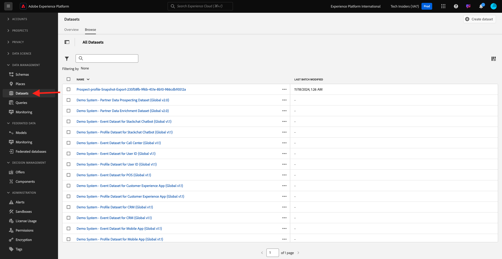
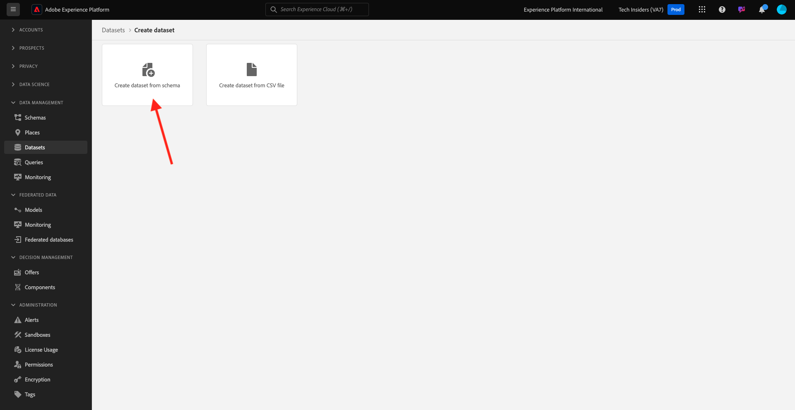

# 1.2.3 Configuration de jeux de données

Dans cet exercice, vous allez configurer des jeux de données pour capturer et stocker des informations de profil et le comportement des clients. Chaque jeu de données que vous créez dans utilise l’un des schémas que vous avez créés à l’étape précédente.

## Contexte

Après avoir défini la réponse aux questions **Qui est ce client ?** et **Que fait ce client ?** doit ressembler à , vous devez maintenant créer un compartiment qui utilise ces informations, pour recevoir et valider les données envoyées à Adobe Experience Platform.

## Création de jeux de données

Vous devez maintenant créer 2 jeux de données :

- 1 jeu de données pour capturer les informations qui répondent au **Qui est ce client ?** - question.
- 1 jeu de données pour capturer les informations qui répondent au **Que fait ce client ?** - question.

Connectez-vous à Adobe Experience Platform en accédant à cette URL : [https://experience.adobe.com/platform](https://experience.adobe.com/platform).

Une fois connecté, vous accédez à la page d’accueil de Adobe Experience Platform.

Avant de continuer, vous devez sélectionner un **[!UICONTROL sandbox]**. L’environnement de test à sélectionner est nommé ``--module2sandbox--``. Pour ce faire, cliquez sur le texte **[!UICONTROL Production Prod]** dans la ligne bleue en haut de votre écran. Après avoir sélectionné l’[!UICONTROL sandbox] approprié, vous verrez le changement d’écran et vous êtes désormais dans votre [!UICONTROL sandbox] dédié.

Dans Adobe Experience Platform, cliquez sur **[!UICONTROL Jeux de données]** dans le menu sur le côté gauche de votre écran.  Vous verrez alors :

Commençons par créer le jeu de données pour capturer les informations d’enregistrement du site web.

Vous devez créer un nouveau jeu de données. Pour créer un nouveau jeu de données, cliquez sur le bouton **[!UICONTROL + Créer un jeu de données]**.

Vous devez définir un jeu de données à partir du schéma que vous avez défini à l’étape précédente. Cliquez sur l’option **[!UICONTROL Créer un jeu de données à partir du schéma]** - .

Dans l’écran suivant, vous devez sélectionner le schéma que vous avez créé dans 1, `--aepUserLdap-- - Demo System - Profile Schema for Website`.

Cliquez sur **Suivant**.

Attribuons un nom à votre jeu de données.

Pour nommer votre jeu de données, utilisez ceci :

`--aepUserLdap-- - Demo System - Profile Dataset for Website`

Cliquez sur **Terminer**.

Vous verrez maintenant ceci :

Revenez à la présentation des [!UICONTROL jeux de données] . Le jeu de données que vous avez créé s’affiche désormais dans l’aperçu.

Vous allez ensuite configurer un deuxième jeu de données pour capturer les interactions avec le site web.

Cliquez sur **[!UICONTROL + Créer un jeu de données]**.

Vous devez définir un jeu de données à partir du schéma que vous avez défini à l’étape précédente. Cliquez sur l’option **[!UICONTROL Créer un jeu de données à partir du schéma]** - .

Dans l’écran suivant, vous devez sélectionner le schéma que vous avez créé précédemment, `--aepUserLdap-- - Demo System - Event Schema for Website`.

Cliquez sur **Suivant**.

Attribuons un nom à votre jeu de données.

Pour nommer notre jeu de données, utilisez ceci :

`--aepUserLdap-- - Demo System - Event Dataset for Website`

Cliquez sur **Terminer**.

Vous verrez alors :

Revenez à l’écran d’aperçu [!UICONTROL Jeux de données] .

Vous devez maintenant activer vos jeux de données pour faire partie de Adobe Experience Platform Real-time Customer Profile.

Ouvrez votre jeu de données `--aepUserLdap-- - Demo System - Profile Dataset for Website` en cliquant dessus.

Recherchez l’icône de basculement [!UICONTROL Profile] sur le côté droit de l’écran.
Cliquez sur le bouton d’activation/désactivation [!UICONTROL Profile] pour activer ce jeu de données pour [!UICONTROL Profile].

Cliquez sur **[!UICONTROL Activer]**.

Votre jeu de données est maintenant activé pour [!UICONTROL Profile].

Revenez à la présentation des jeux de données et ouvrez votre jeu de données `--aepUserLdap-- - Demo System - Event Dataset` pour le site web en cliquant dessus.

Recherchez l’icône de basculement [!UICONTROL Profile] sur le côté droit de l’écran. Cliquez sur la bascule [!UICONTROL Profile] pour activer [!UICONTROL Profile].

Cliquez sur **[!UICONTROL Activer]**.

Votre jeu de données est maintenant activé pour [!UICONTROL Profile].

Étape suivante : [1.2.4 Data Ingestion à partir de sources hors ligne](./ex4.md)

[Revenir au module 1.2](./data-ingestion.md)

[Revenir à tous les modules](../../../overview.md)
