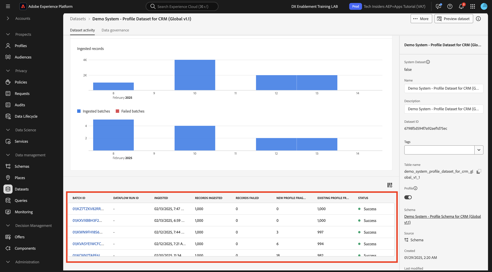
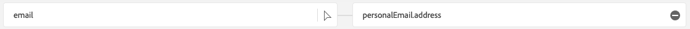

# 1.2.4 Ingestion de données à partir de sources hors ligne

Dans cet exercice, l’objectif est d’intégrer des données externes telles que les données CRM dans Platform.

## Objectifs d’apprentissage

- Découvrez comment générer des données de test
- Découvrez comment ingérer un fichier CSV
- Découvrez comment utiliser l’interface utilisateur web pour l’ingestion de données par le biais de workflows
- Présentation des fonctionnalités de gouvernance des données d’Experience Platform

## Ressources

- Mockaroo : [https://www.mockaroo.com/](https://www.mockaroo.com/)
- Adobe Experience Platform : [https://experience.adobe.com/platform/](https://experience.adobe.com/platform/)

## Tâche

- Créez un fichier CSV avec des données de démonstration. Ingérez le fichier CSV dans Adobe Experience Platform en utilisant les workflows disponibles.
- Présentation des options de gouvernance des données dans Adobe Experience Platform

## Création d’un jeu de données CRM à l’aide d’un outil de générateur de données

Pour cet exercice, vous avez besoin de 1000 lignes d’exemple de données CRM.

Ouvrez le modèle Mockaroo en accédant à [https://www.mockaroo.com/12674210](https://www.mockaroo.com/12674210).

Sur le modèle, vous remarquerez les champs suivants :

- identifiant
- first_name
- last_name
- adresse e-mail
- gender
- birthDate
- home_latitude
- home_longitude
- country_code
- ville
- pays

Tous ces champs ont été définis pour produire des données compatibles avec Platform.

Pour générer votre fichier CSV, cliquez sur le bouton **[!UICONTROL Générer les données]** qui crée et télécharge un fichier CSV avec 1 000 lignes de données de démonstration.

Ouvrez votre fichier CSV pour visualiser son contenu.

Une fois votre fichier CSV prêt, vous pouvez procéder à l’ingestion dans AEP.

### Vérification du jeu de données

Ouvrez [Adobe Experience Platform](https://experience.adobe.com/platform) et accédez à **[!UICONTROL Jeux de données]**.

Avant de continuer, vous devez sélectionner un **[!UICONTROL sandbox]**. L’environnement de test à sélectionner est nommé ``--aepSandboxName--``.

Dans Adobe Experience Platform, cliquez sur **[!UICONTROL Jeux de données]** dans le menu sur le côté gauche de votre écran.

Vous utiliserez un jeu de données partagé. Le jeu de données partagé a déjà été créé et s’appelle **[!UICONTROL Demo System - Profile Dataset for CRM (Global v1.1)]**. Cliquez dessus pour l’ouvrir.

Dans l’écran de présentation, vous pouvez voir trois informations principales.

Tout d’abord, le tableau de bord [!UICONTROL Activité du jeu de données] indique le nombre total d’enregistrements CRM dans le jeu de données et les lots ingérés, ainsi que leur état.

Ensuite, en faisant défiler la page vers le bas, vous pouvez vérifier quand des lots de données ont été ingérés, combien d’enregistrements ont été intégrés et également, si le lot a été intégré avec succès ou non. L’ **[!UICONTROL identifiant de lot]** est l’identifiant d’une tâche par lot spécifique, et l’ **[!UICONTROL identifiant de lot]** est important, car il peut être utilisé pour résoudre les problèmes liés à l’intégration d’un lot spécifique.

Enfin, l’onglet d’informations [!UICONTROL Jeu de données] affiche des informations importantes telles que l’[!UICONTROL identifiant du jeu de données] (à nouveau, importantes du point de vue de la résolution des problèmes), le nom du jeu de données et si le jeu de données a été activé pour Profile.

Le paramètre le plus important ici est le lien entre le jeu de données et le schéma. Le schéma définit les données qui peuvent être ingérées et leur aspect.

Dans ce cas, nous utilisons le **[!UICONTROL système de démonstration - schéma de profil pour le CRM (Global v1.1)]**, qui est mappé sur la classe de **[!UICONTROL Profil]** et a mis en oeuvre des extensions, également appelées groupes de champs.

En cliquant sur le nom du schéma, vous accédez à la présentation [!UICONTROL Schéma] où vous pouvez voir tous les champs qui ont été activés pour ce schéma.

Un descripteur principal personnalisé doit être défini pour chaque schéma. Dans le cas de notre jeu de données CRM, le schéma a défini que le champ **[!UICONTROL crmId]** doit être l’identifiant principal. Si vous souhaitez créer un schéma et le lier au [!UICONTROL profil client en temps réel], vous devez définir un [!UICONTROL groupe de champs] personnalisé qui fait référence à votre descripteur principal.

Vous pouvez également constater que notre identité principale se trouve dans `--aepTenantId--.identification.core.crmId`, liée à l’ [!UICONTROL espace de noms] de **[!UICONTROL Demo System - CRMID]**.

Chaque schéma et, en tant que tel, chaque jeu de données qui doit être utilisé dans le [!UICONTROL profil client en temps réel] doit comporter un [!UICONTROL identifiant de Principal]. Cet [!UICONTROL identifiant de Principal] est l’identifiant utilisateur de la marque d’un client dans ce jeu de données. Dans le cas d’un jeu de données CRM, il peut s’agir de l’adresse électronique ou de l’identifiant CRM. Dans le cas d’un jeu de données du centre d’appels, il peut s’agir du numéro de mobile d’un client.

Il est recommandé de créer un schéma distinct et spécifique pour chaque jeu de données et de définir le descripteur pour chaque jeu de données spécifiquement pour correspondre au fonctionnement des solutions actuelles utilisées par la marque.

### Utilisation d’un workflow pour mapper un fichier CSV à un schéma XDM

L’objectif de cet exercice est d’intégrer des données CRM dans AEP. Toutes les données ingérées dans Platform doivent être mappées sur le schéma XDM spécifique. Vous disposez actuellement d’un jeu de données CSV avec 1 000 lignes d’un côté et d’un jeu de données lié à un schéma de l’autre côté. Pour charger ce fichier CSV dans ce jeu de données, un mappage doit avoir lieu. Pour faciliter cet exercice de mappage, **[!UICONTROL Workflows]** est disponible dans Adobe Experience Platform.

Cliquez sur **[!UICONTROL Mapper CSV au schéma XDM]**, puis sur **[!UICONTROL Launch]** pour lancer le processus.

Sur l’écran suivant, vous devez sélectionner un jeu de données dans lequel ingérer votre fichier. Vous avez le choix entre sélectionner un jeu de données existant ou en créer un nouveau. Pour cet exercice, nous allons réutiliser un jeu existant : sélectionnez **[!UICONTROL Demo System - Profile Dataset for CRM (Global v1.1)]** comme indiqué ci-dessous et laissez les autres paramètres définis sur default.

Cliquez sur **Suivant**.

Faites glisser et déposez votre fichier CSV ou cliquez sur **[!UICONTROL Choisir les fichiers]** et accédez à votre ordinateur sur votre bureau et sélectionnez votre fichier CSV.

Après avoir sélectionné votre fichier CSV, il est téléchargé immédiatement. Un aperçu de votre fichier s’affiche en quelques secondes.

Cliquez sur **Suivant**.

Vous devez maintenant mapper les en-têtes de colonne de votre fichier CSV avec une propriété XDM dans votre **[!UICONTROL système de démonstration - jeu de données de profil pour la gestion de la relation client]**.

Adobe Experience Platform a déjà fait quelques propositions pour vous, en essayant de lier les [!UICONTROL attributs Source] aux [!UICONTROL champs de schéma cible].

Pour les [!UICONTROL mappages de schémas], Adobe Experience Platform a déjà tenté de lier des champs ensemble. Cependant, toutes les propositions de mappage ne sont pas correctes. Vous devez maintenant mettre à jour les **champs cibles** un par un.

#### birthDate

Le champ de schéma Source **birthDate** doit être lié au champ cible **person.birthDate**.

#### ville

Le champ de schéma Source **city** doit être lié au champ cible **homeAddress.city**.

#### pays

Le champ de schéma Source **country** doit être lié au champ cible **homeAddress.country**.

#### country_code

Le champ de schéma Source **country_code** doit être lié au champ cible **homeAddress.countryCode**.

#### adresse e-mail

Le champ de schéma Source **email** doit être lié au champ cible **personalEmail.address**.

#### crmid

Le champ de schéma Source **crmid** doit être lié au champ cible **`--aepTenantId--`.identification.core.crmId**.

#### first_name

Le champ de schéma Source **prénom** doit être lié au champ cible **person.name.firstName**.

#### gender

Le champ de schéma Source **gender** doit être lié au champ cible **person.gender**.

#### home_latitude

Le champ de schéma Source **home_latitude** doit être lié au champ cible **homeAddress._schema.latitude**.

#### home_longitude

Le champ de schéma Source **home_longitude** doit être associé au champ cible **homeAddress._schema.longitude**.

#### identifiant

Le champ de schéma Source **id** doit être lié au champ cible **_id**.

#### last_name

Le champ de schéma Source **last_name** doit être lié au champ cible **person.name.lastName**.

Vous devriez maintenant avoir ceci. Cliquez sur **Terminer**.

Après avoir cliqué sur **[!UICONTROL Terminer]**, vous verrez alors l’aperçu **Flux de données**, et après quelques minutes, vous pouvez actualiser votre écran pour voir si votre workflow s’est terminé avec succès. Cliquez sur le **nom du jeu de données Target**.

Vous verrez ensuite le jeu de données dans lequel votre ingestion a été traitée et vous verrez un [!UICONTROL identifiant de lot] qui vient d’être ingéré, avec 1 000 enregistrements ingérés et un état **[!UICONTROL Succès]**. Cliquez sur **[!UICONTROL Prévisualiser le jeu de données]**.

Vous verrez désormais un petit échantillon du jeu de données pour vous assurer que les données chargées sont correctes.

Une fois les données chargées, vous pouvez définir l’approche de gouvernance des données correcte pour notre jeu de données.

### Ajout de la gouvernance des données à votre jeu de données

Maintenant que vos données client sont ingérées, vous devez vous assurer que ce jeu de données est correctement géré pour l’utilisation et le contrôle des exportations. Cliquez sur l’onglet **[!UICONTROL Gouvernance des données]** et observez que vous pouvez définir plusieurs types de restrictions : Contrat, Identité et sensible, Écosystème partenaire et Personnalisé.

Limitons les données d’identité pour l’ensemble du jeu de données. Pointez sur le nom de votre jeu de données, puis cliquez sur l’icône en forme de crayon pour modifier les paramètres.

Accédez à **[!UICONTROL Identity Data]** et vous verrez que l’option **[!UICONTROL I2]** est cochée ; cela suppose que toutes les informations de ce jeu de données sont au moins indirectement identifiables pour la personne.

Cliquez sur **[!UICONTROL Enregistrer les modifications]**.

Dans un autre module, nous ferons une analyse approfondie du cadre de la gouvernance et des étiquettes des données.

Grâce à cela, vous avez correctement ingéré et classé les données CRM dans Adobe Experience Platform.

Étape suivante : [1.2.5 Data Landing Zone](./ex5.md)

[Revenir au module 1.2](./data-ingestion.md)

[Revenir à tous les modules](../../../overview.md)
