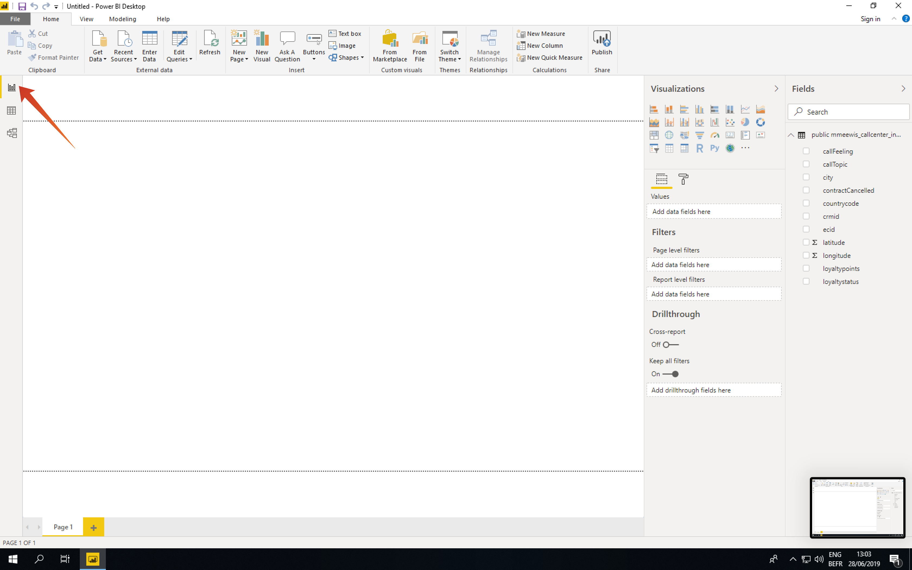

# 5.1.6 Query Service et Power BI

Ouvrez Microsoft Power BI Desktop.

Cliquez sur **Obtenir des données**.

Recherchez **postgres** (1), sélectionnez **Postgres** (2) dans la liste et **Connect** (3).

Accédez à Adobe Experience Platform, à **Requêtes** et à **Credentials**.

Sur la page **Credentials** dans Adobe Experience Platform, copiez l’**hôte** et collez-le dans le champ **Server**, copiez la **base de données** et collez-la dans le champ **Database** de PowerBI, puis cliquez sur OK (2).

>[!IMPORTANT]
>
>Veillez à inclure le port **:80** à la fin de la valeur Server, car Query Service n’utilise actuellement pas le port PostgreSQL par défaut de 5432.

Dans la boîte de dialogue suivante, renseignez le nom d’utilisateur et le mot de passe avec le nom d’utilisateur et le mot de passe trouvés dans les **informations d’identification** des requêtes dans Adobe Experience Platform.

Dans la boîte de dialogue Navigateur, placez votre **LDAP** dans le champ de recherche (1) pour localiser vos jeux de données CTAS et cochez la case en regard de chaque (2). Cliquez ensuite sur Charger (3).

Assurez-vous que l&#39;onglet **Rapport** (1) est sélectionné.

Sélectionnez la carte (1) et une fois qu’elle a été ajoutée à la zone de travail de création de rapports, agrandissez la carte (2).

Ensuite, nous devons définir les mesures et les dimensions. Pour ce faire, faites glisser les champs de la section **fields** sur les espaces réservés correspondants (situés sous **visualisations**) comme indiqué ci-dessous :

À titre de mesure, nous utiliserons un nombre de **customerId**. Faites glisser le champ **crmid** de la section **fields** vers l’espace réservé **Size** :

Enfin, pour effectuer une analyse **callTopic**, faites glisser le champ **callTopic** vers l’espace réservé **Filtres de niveau page** (vous devrez peut-être faire défiler la section **visualisations**) ;

Sélectionnez/désélectionnez **calltopics** pour enquêter :

Vous avez maintenant terminé cet exercice.

Étape suivante : [5.1.8 Query Service API](./ex8.md)

[Revenir au module 5.1](./query-service.md)

[Revenir à tous les modules](../../../overview.md)
