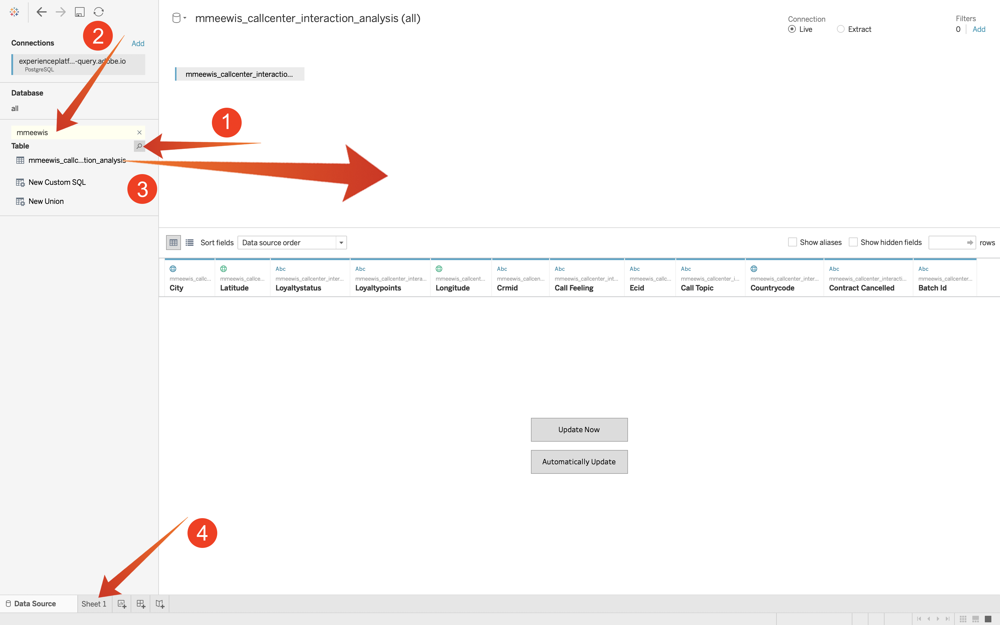
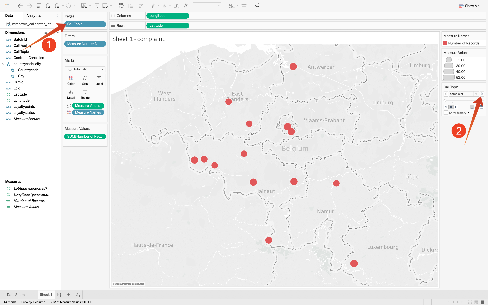

# 5.1.7 Query Service et Tableau

Ouvrez Tableau.

Dans **Se connecter à un serveur**, sélectionnez **PostgreSQL** :

Accédez à Adobe Experience Platform, à **Requêtes** et à **Credentials**.

Sur la page **Credentials** dans Adobe Experience Platform, copiez l’ **hôte** et collez-le dans le champ **Serveur**, copiez la **base de données** et collez-la dans le champ **Base de données** de Tableau, copiez le **port** et collez-le dans le champ **port** dans Tableau, faites de même **pour effectuer la même opération  14}Nom d’utilisateur** et **Mot de passe**. Cliquez ensuite sur **Se connecter**.

Connexion :

Cliquez sur Rechercher (1) et entrez votre **ldap** dans le champ de recherche, identifiez votre tableau à partir du jeu de résultats et faites-le glisser (3) sur l’emplacement nommé **Faire glisser les tables ici**. Lorsque vous avez terminé, cliquez sur **Feuille 1** (3).

Pour visualiser nos données sur la carte, nous devons convertir la longitude et la latitude en dimensions. Dans **Mesures**, sélectionnez **Latitude** (1), ouvrez la liste déroulante du champ et sélectionnez **Convertir en Dimension** (2). Faites de même pour la mesure **Longitude**.

Faites glisser la mesure **Longitude** vers les **Colonnes** et la **Latitude** vers **Lignes**. La carte de **Belgique** apparaîtra automatiquement avec des petits points représentant les villes dans l&#39;ensemble de données.

Sélectionnez **Mesurer les noms** (1), ouvrez la liste déroulante et sélectionnez **Ajouter à la feuille** (2) :

Vous disposez désormais d’une carte, avec des points de différentes tailles. La taille indique le nombre d’interactions du centre d’appels pour cette ville spécifique. Pour varier la taille des points, accédez au panneau de droite et ouvrez **Mesure des valeurs** (à l’aide de l’icône déroulante). Dans la liste déroulante, sélectionnez **Modifier les tailles**. Jouez avec des tailles différentes.

Pour afficher davantage les données par **rubrique d’appel**, faites glisser (1) la dimension **rubrique d’appel** sur **Pages**. Parcourez les différentes **rubriques d’appel** à l’aide de la **rubrique d’appel** (2) sur le côté droit de l’écran :

Vous avez maintenant terminé cet exercice.

Étape suivante : [5.1.8 Query Service API](./ex8.md)

[Revenir au module 5.1](./query-service.md)

[Revenir à tous les modules](../../../overview.md)
