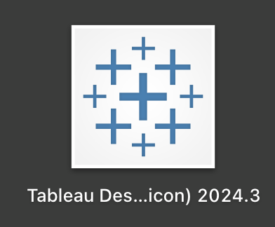
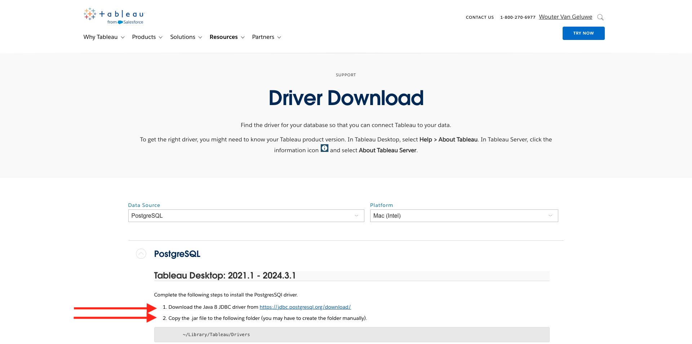
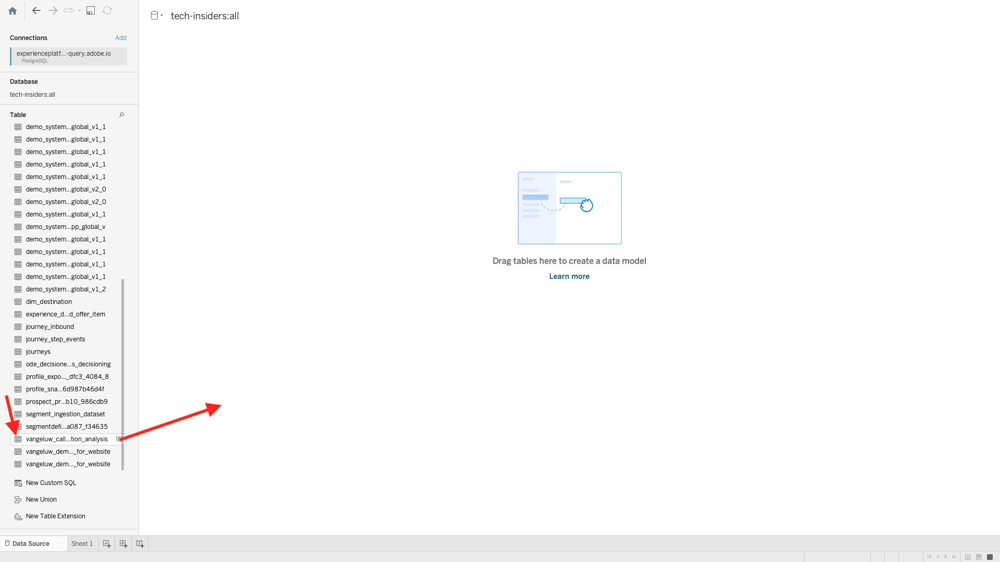

# 5.1.7 Query Service et Tableau

Ouvrez Tableau.

Dans **Se connecter à un serveur**, cliquez sur **Plus**, puis sur **PostgreSQL**.

Si vous n’avez pas encore utilisé PostgeSQL avec Tableau, vous pouvez le voir. Cliquez sur **Télécharger le pilote**.

Suivez les instructions pour télécharger et installer le pilote PostgreSQL.

Une fois que vous avez fini d’installer le pilote, quittez et redémarrez Tableau Desktop. Ensuite, après le redémarrage, accédez à nouveau à **Se connecter à un serveur**, cliquez sur **Plus**, puis cliquez de nouveau sur **PostgreSQL**.

Vous verrez alors ceci.

Accédez à Adobe Experience Platform, à **Requêtes** et à **Credentials**.

Sur la page **Credentials** dans Adobe Experience Platform, copiez l’ **hôte** et collez-le dans le champ **Serveur**, copiez la **base de données** et collez-la dans le champ **Base de données** de Tableau, copiez le **port** et collez-le dans le champ **port** dans Tableau, faites de même **pour effectuer la même opération  14&rbrace;Nom d’utilisateur** et **Mot de passe**. Cliquez ensuite sur **Se connecter**.

Dans la liste des tables disponibles, recherchez la table que vous avez créée lors de l’exercice précédent, appelée `--aepUserLdap--_callcenter_interaction_analysis`. Faites-le glisser sur la zone de travail.

Vous verrez alors ceci. Cliquez sur **Mettre à jour maintenant**.

Vous verrez alors les données d’AEP devenir disponibles dans Tableau. Cliquez sur **Feuille 1** pour commencer à utiliser les données.

Pour visualiser vos données sur la carte, vous devez convertir la longitude et la latitude en dimensions. Dans **Mesures**, cliquez avec le bouton droit de la souris sur **Latitude**, sélectionnez **Convertir en Dimension** dans le menu. Faites de même pour la mesure **Longitude**.

Faites glisser la mesure **Longitude** vers les **Colonnes** et la **Latitude** vers **Lignes**. La carte de **Belgique** apparaîtra automatiquement avec des petits points représentant les villes dans l&#39;ensemble de données.

Sélectionnez **Mesurer les noms**, cliquez sur **Ajouter à la feuille**.

Vous disposez désormais d’une carte, avec des points de différentes tailles. La taille indique le nombre d’interactions du centre d’appels pour cette ville spécifique. Pour varier la taille des points, accédez au panneau de droite et ouvrez **Mesure des valeurs** (à l’aide de l’icône déroulante). Dans la liste déroulante, sélectionnez **Modifier les tailles**. Jouez avec des tailles différentes.

Pour afficher davantage les données par **rubrique d’appel**, faites glisser la dimension **rubrique d’appel** sur **Pages**. Parcourez les différentes **rubriques d’appel** à l’aide de la **rubrique d’appel** sur le côté droit de l’écran :

Vous avez maintenant terminé cet exercice.

Étape suivante : [5.1.8 Query Service API](./ex8.md)

[Revenir au module 5.1](./query-service.md)

[Revenir à tous les modules](../../../overview.md)
