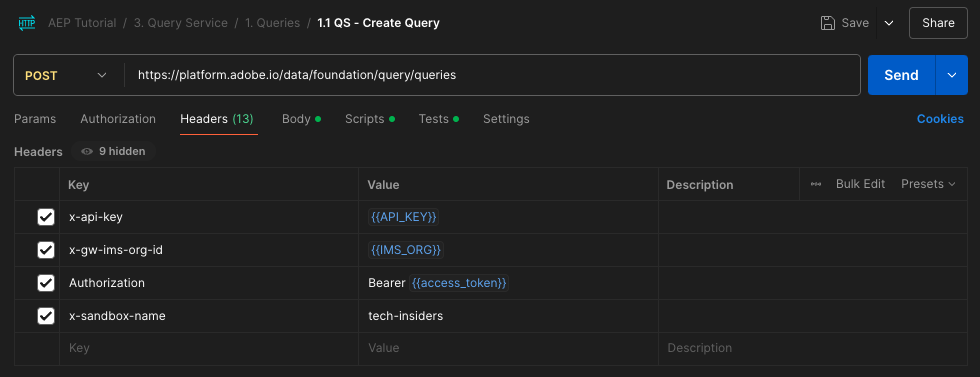

# 5.1.7 API Query Service

## Objectif

- Utilisez l’API Query Service pour gérer les modèles de requête et les plannings de requête.

## Contexte

Dans cet exercice, vous exécuterez des appels API pour gérer des modèles de requête et des plannings de requête à l’aide d’une collection Postman. Vous allez définir des modèles de requête, exécuter des requêtes standard et des requêtes CTAS. Une requête **CTAS** (créer une table comme requête sélectionnée) stocke son jeu de résultats dans un jeu de données explicite. Bien que les requêtes standard soient stockées dans un jeu de données implicite (ou généré par le système), qui est généralement exporté au format de fichier parquet.

## Documentation

- [Aide de Adobe Experience Platform Query Service](https://experienceleague.adobe.com/docs/experience-platform/query/api/getting-started.html?lang=fr)
- [API Query Service](https://www.adobe.io/apis/experienceplatform/home/api-reference.html#!acpdr/swagger-specs/qs-api.yaml)

## 5.1.7.1 API Query Service

L’API Query Service vous permet de gérer des requêtes non interactives par rapport au lac de données de Adobe Experience Platform.

Non interactif signifie qu’une demande d’exécution d’une requête n’entraîne pas de réponse immédiate. La requête sera traitée et son jeu de résultats sera stocké dans un jeu de données implicite ou explicite (CTAS : créer une table en tant que sélection).

## 5.1.7.2 Exemple de requête

Comme exemple de requête, vous utiliserez la première requête répertoriée dans [4.3 - Requêtes, requêtes, requêtes... et l&#39;analyse de la perte de clientèle](./ex3.md) :

Combien de consultations de produits avons-nous chaque jour ?

**SQL**

```sql
select date_format( timestamp , 'yyyy-MM-dd') AS Day,
       count(*) AS productViews
from   demo_system_event_dataset_for_website_global_v1_1
where  --aepTenantId--.demoEnvironment.brandName IN ('Luma Telco', 'Citi Signal')
and eventType = 'commerce.productViews'
group by Day
limit 10;
```

## 5.1.7.3 Requêtes

Ouvrez Postman sur votre ordinateur. Dans le cadre du module 3, vous avez créé un environnement Postman et importé une collection Postman. Suivez les instructions de l&#39;[exercice 2.1.3](./../../../modules/rtcdp-b2c/module2.1/ex3.md) au cas où vous ne l&#39;auriez pas encore fait.

Dans le cadre de la collection Postman que vous avez importée, un dossier **3 s&#39;affiche. Query Service**. Si ce dossier ne s’affiche pas, téléchargez à nouveau la [collection Postman](./../../../assets/postman/postman_profile.zip) et réimportez cette collection dans Postman comme indiqué dans l’ [exercice 2.1.3](./../../../modules/rtcdp-b2c/module2.1/ex3.md).


>[!NOTE]
>
>Pour le moment, seul le dossier **1 est disponible. Les requêtes** contiennent des requêtes. D’autres requêtes seront ajoutées à l’étape du calque.

Ouvrez ce dossier et découvrez les appels de l’API Query Service pour exécuter, surveiller et télécharger le jeu de résultats de la requête.

Un appel POST à [/query/query] avec la charge utile suivante déclenche l’exécution de notre requête ;

### 5.1.7.3.1 Créer une requête

Cliquez sur la requête nommée **1.1 QS - Create Query** et accédez à **Headers**. Vous verrez alors :



Concentrons-nous sur ce champ d’en-tête :

| Clé | Valeur |
| ----------- | ----------- |
| x-sandbox-name | `--module7sandbox--` |

>[!NOTE]
>
>Vous devez spécifier le nom de l’environnement de test Adobe Experience Platform que vous utilisez. Le champ d’en-tête **x-sandbox-name** doit être `--module7sandbox--`.

Accédez à la section **Body** de cette requête. Dans le **Body** de cette requête, les éléments suivants s’affichent :


```sql
{
    "name" : "ldap - QS API demo - Citi Signal - Product Views Per Day",
	"description": "ldap - QS API demo - Citi Signal - Product Views Per Day",
	"dbName": "module7:all",
	"sql": "select date_format( timestamp , 'yyyy-MM-dd') AS Day, count(*) AS productViews from demo_system_event_dataset_for_website_global_v1_1 where _experienceplatform.demoEnvironment.brandName IN ('Luma Telco', 'Citi Signal') and eventType = 'commerce.productViews' group by Day limit 10"
}
```

Attention : veuillez mettre à jour la variable **name** dans la requête ci-dessous en remplaçant **ldap** par votre **ldap** spécifique.

Après avoir ajouté votre **ldap** spécifique, le corps doit ressembler à ceci :

```json
{
    "name" : "vangeluw - QS API demo - Citi Signal - Product Views Per Day",
	"description": "vangeluw - QS API demo - Citi Signal - Product Views Per Day",
	"dbName": "module7:all",
	"sql": "select date_format( timestamp , 'yyyy-MM-dd') AS Day, count(*) AS productViews from demo_system_event_dataset_for_website_global_v1_1 where _experienceplatform.demoEnvironment.brandName IN ('Luma Telco', 'Citi Signal') and eventType = 'commerce.productViews' group by Day limit 10"
}
```

>[!NOTE]
>
>La clé **dbName** du corps JSON ci-dessus fait référence à l’environnement de test utilisé dans votre instance Adobe Experience Platform. Si vous utilisez l’environnement de test PROD, dbName doit être **prod:all**, si vous utilisez un autre environnement de test comme par exemple **module7**, dbName doit être égal à **module7:all**.

Cliquez ensuite sur le bouton bleu **Envoyer** pour créer le segment et en visualiser les résultats.


En cas de réussite, la requête du POST renvoie la réponse suivante :

```json
{
    "isInsertInto": false,
    "request": {
        "dbName": "module7:all",
        "sql": "select date_format( timestamp , 'yyyy-MM-dd') AS Day, count(*) AS productViews from demo_system_event_dataset_for_website_global_v1_1 where _experienceplatform.demoEnvironment.brandName IN ('Luma Telco', 'Citi Signal') and eventType = 'commerce.productViews' group by Day limit 10",
        "name": "vangeluw - QS API demo - Citi Signal - Product Views Per Day",
        "description": "vangeluw - QS API demo - Citi Signal - Product Views Per Day"
    },
    "clientId": "5a143b5ae4aa4631a1f3b09cd051333f",
    "state": "SUBMITTED",
    "rowCount": 0,
    "errors": [],
    "isCTAS": false,
    "version": 1,
    "id": "8f0d7f25-f7aa-493b-9792-290f884a7e5b",
    "elapsedTime": 0,
    "updated": "2021-01-20T13:23:13.951Z",
    "client": "API",
    "userId": "A3392DB95FFF08EE0A495E87@techacct.adobe.com",
    "created": "2021-01-20T13:23:13.951Z",
    "_links": {
        "self": {
            "href": "https://platform-va7.adobe.io/data/foundation/query/queries/8f0d7f25-f7aa-493b-9792-290f884a7e5b",
            "method": "GET"
        },
        "soft_delete": {
            "href": "https://platform-va7.adobe.io/data/foundation/query/queries/8f0d7f25-f7aa-493b-9792-290f884a7e5b",
            "method": "PATCH",
            "body": "{ \"op\": \"soft_delete\"}"
        },
        "cancel": {
            "href": "https://platform-va7.adobe.io/data/foundation/query/queries/8f0d7f25-f7aa-493b-9792-290f884a7e5b",
            "method": "PATCH",
            "body": "{ \"op\": \"cancel\"}"
        }
    }
}
```

L’ **état** actuel de la requête est **SUBMITTED**, une fois exécuté son état devient **SUCCESS**.

Vous pouvez également rechercher des requêtes envoyées via l’interface utilisateur de Adobe Experience Platform, ouvrir [Adobe Experience Platform](https://experience.adobe.com/#/@experienceplatform/platform/home), accéder à **Requêtes**, à **Journal** et sélectionner votre requête :


### 5.1.7.3.2 Obtention de requêtes

Cliquez sur la requête nommée **1.2 QS - Get Queries** et accédez à **Headers**. Vous verrez alors :


Concentrons-nous sur ce champ d’en-tête :

| Clé | Valeur |
| ----------- | ----------- |
| x-sandbox-name | `--module7sandbox--` |

>[!NOTE]
>
>Vous devez spécifier le nom de l’environnement de test Adobe Experience Platform que vous utilisez. Le champ d’en-tête **x-sandbox-name** doit être `--module7sandbox--`.

Accédez à **Params**. Vous verrez alors :


Le paramètre **orderby** vous permet de spécifier un ordre de tri en fonction de la propriété **created** . Notez le signe **&#39;-&#39;** devant created, ce qui signifie que l’ordre dans lequel la liste des requêtes est renvoyée utilisera la date de création dans l’ordre **descendant**. Votre requête doit figurer en haut de la liste.

Cliquez ensuite sur le bouton bleu **Envoyer** pour créer le segment et en visualiser les résultats.


En cas de réussite, la requête renvoie une réponse similaire à celle ci-dessous. L’ **état** de la réponse peut être **SUBMITTED**, **IN_PROGRESS** ou **SUCCESS**. Plusieurs minutes peuvent s’écouler avant que la requête n’ait un état **SUCCESS**. Vous pouvez répéter l’envoi de cette requête plusieurs fois jusqu’à ce que l’état **SUCCESS** s’affiche.

```json
{
    "queries": [
        {
            "isInsertInto": false,
            "request": {
                "dbName": "module7:all",
                "sql": "select date_format( timestamp , 'yyyy-MM-dd') AS Day, count(*) AS productViews from demo_system_event_dataset_for_website_global_v1_1 where _experienceplatform.demoEnvironment.brandName IN ('Luma Telco', 'Citi Signal') and eventType = 'commerce.productViews' group by Day limit 10",
                "name": "vangeluw - QS API demo - Citi Signal - Product Views Per Day",
                "description": "vangeluw - QS API demo - Citi Signal - Product Views Per Day"
            },
            "clientId": "5a143b5ae4aa4631a1f3b09cd051333f",
            "state": "SUCCESS",
            "rowCount": 1,
            "errors": [],
            "isCTAS": false,
            "version": 1,
            "id": "8f0d7f25-f7aa-493b-9792-290f884a7e5b",
            "elapsedTime": 217481,
            "updated": "2021-01-20T13:26:51.432Z",
            "client": "API",
            "userId": "A3392DB95FFF08EE0A495E87@techacct.adobe.com",
            "created": "2021-01-20T13:23:13.951Z",
            "_links": {
                "self": {
                    "href": "https://platform-va7.adobe.io/data/foundation/query/queries/8f0d7f25-f7aa-493b-9792-290f884a7e5b",
                    "method": "GET"
                },
                "soft_delete": {
                    "href": "https://platform-va7.adobe.io/data/foundation/query/queries/8f0d7f25-f7aa-493b-9792-290f884a7e5b",
                    "method": "PATCH",
                    "body": "{ \"op\": \"soft_delete\"}"
                },
                "referenced_datasets": [
                    {
                        "id": "60080ace62c49a19490c5870",
                        "href": "https://platform-va7.adobe.io/data/foundation/catalog/dataSets/60080ace62c49a19490c5870"
                    }
                ]
            }
        }
     ]
    },
    "version": 1
}
```

Lorsque l’état est **SUCCESS**, continuez avec la requête suivante.

### 5.1.7.3.3 Obtention de l’état de la requête

Cliquez sur la requête nommée **1.3 QS - Get Query Status** et accédez à **Headers**. Vous verrez alors :


Concentrons-nous sur ce champ d’en-tête :

| Clé | Valeur |
| ----------- | ----------- |
| x-sandbox-name | `--module7sandbox--` |

>[!NOTE]
>
>Vous devez spécifier le nom de l’environnement de test Adobe Experience Platform que vous utilisez. Le champ d’en-tête **x-sandbox-name** doit être `--module7sandbox--`.

Cliquez ensuite sur le bouton bleu **Envoyer** pour créer le segment et en visualiser les résultats.


En cas de réussite, la requête renvoie une réponse similaire à celle ci-dessous.

```json
{
    "isInsertInto": false,
    "request": {
        "dbName": "module7:all",
        "sql": "select date_format( timestamp , 'yyyy-MM-dd') AS Day, count(*) AS productViews from demo_system_event_dataset_for_website_global_v1_1 where _experienceplatform.demoEnvironment.brandName IN ('Luma Telco', 'Citi Signal') and eventType = 'commerce.productViews' group by Day limit 10",
        "name": "vangeluw - QS API demo - Citi Signal - Product Views Per Day",
        "description": "vangeluw - QS API demo - Citi Signal - Product Views Per Day"
    },
    "clientId": "5a143b5ae4aa4631a1f3b09cd051333f",
    "state": "SUCCESS",
    "rowCount": 1,
    "errors": [],
    "isCTAS": false,
    "version": 1,
    "id": "8f0d7f25-f7aa-493b-9792-290f884a7e5b",
    "elapsedTime": 217481,
    "updated": "2021-01-20T13:26:51.432Z",
    "client": "API",
    "userId": "A3392DB95FFF08EE0A495E87@techacct.adobe.com",
    "created": "2021-01-20T13:23:13.951Z",
    "_links": {
        "self": {
            "href": "https://platform-va7.adobe.io/data/foundation/query/queries/8f0d7f25-f7aa-493b-9792-290f884a7e5b",
            "method": "GET"
        },
        "soft_delete": {
            "href": "https://platform-va7.adobe.io/data/foundation/query/queries/8f0d7f25-f7aa-493b-9792-290f884a7e5b",
            "method": "PATCH",
            "body": "{ \"op\": \"soft_delete\"}"
        },
        "referenced_datasets": [
            {
                "id": "60080ace62c49a19490c5870",
                "href": "https://platform-va7.adobe.io/data/foundation/catalog/dataSets/60080ace62c49a19490c5870"
            }
        ]
    }
}
```

Lorsqu’une requête atteint l’état de **SUCCESS**, la réponse indique également le nombre de lignes récupérées par la requête via la propriété **rowCount** . Dans notre exemple, 10 lignes sont renvoyées par la requête. Voyons dans la section suivante comment récupérer les 10 lignes.

### 5.1.7.3.4 Récupération du résultat de la requête

La réponse **SUCCESS** ci-dessus inclut une propriété **referenced_datasets**, qui pointe vers le jeu de données implicite qui stocke le résultat de la requête. Pour accéder au résultat, nous utilisons sa propriété **href** ou **id** .

Cliquez sur la requête nommée **1.4 QS - Get Query Result** et accédez à **Headers**. Vous verrez alors :


Concentrons-nous sur ce champ d’en-tête :

| Clé | Valeur |
| ----------- | ----------- |
| x-sandbox-name | `--module7sandbox--` |

>[!NOTE]
>
>Vous devez spécifier le nom de l’environnement de test Adobe Experience Platform que vous utilisez. Le champ d’en-tête **x-sandbox-name** doit être `--module7sandbox--`.

Cliquez ensuite sur le bouton bleu **Envoyer** pour créer le segment et en visualiser les résultats.


La réponse de cette requête pointe vers les fichiers de jeu de données :

```json
{
    "60080ace62c49a19490c5870": {
        "name": "Demo System - Event Dataset for Website (Global v1.1)",
        "description": "Demo System - Event Dataset for Website (Global v1.1)",
        "enableErrorDiagnostics": false,
        "tags": {
            "adobe/siphon/partition/definition": [
                "day(timestamp, _ACP_DATE)",
                "identity(_ACP_BATCHID)"
            ],
            "aep/siphon/partitions": [
                "_ACP_DATE",
                "_ACP_BATCHID"
            ],
            "acp_granular_plugin_validation_flags": [
                "identity:enabled",
                "profile:enabled"
            ],
            "adobe/siphon/buffered-promotion-recency": [
                "live"
            ],
            "adobe/siphon/use-buffered-promotion": [
                "true"
            ],
            "adobe/pqs/table": [
                "demo_system_event_dataset_for_website_global_v1_1"
            ],
            "aep/siphon/expire-snapshot-timestamp": [
                "1611141272703"
            ],
            "acp_granular_validation_flags": [
                "requiredFieldCheck:enabled"
            ],
            "acp_validationContext": [
                "enabled"
            ],
            "adobe/siphon/table/format": [
                "iceberg"
            ],
            "unifiedProfile": [
                "enabled:true",
                "enabledAt:2021-01-20 10:49:51"
            ],
            "unifiedIdentity": [
                "enabled:true"
            ]
        },
        "namespace": "ACP",
        "state": "DRAFT",
        "imsOrg": "907075E95BF479EC0A495C73@AdobeOrg",
        "sandboxId": "62cd9f38-8529-4b05-8d9f-388529db0540",
        "lastBatchId": "01EWFQZ15XRNNB1FPKPW5ETRVP",
        "lastBatchStatus": "success",
        "lastSuccessfulBatch": "01EWFQZ15XRNNB1FPKPW5ETRVP",
        "version": "1.0.6",
        "created": 1611139790698,
        "updated": 1611149266031,
        "createdClient": "750e24ee855b4ac18ccc4f4817f96ee1",
        "createdUser": "3A260B485E909A170A495E76@techacct.adobe.com",
        "updatedUser": "acp_foundation_dataTracker@AdobeID",
        "viewId": "60080ace62c49a19490c5871",
        "fileDescription": {
            "persisted": true,
            "containerFormat": "parquet",
            "format": "parquet"
        },
        "files": "@/dataSets/60080ace62c49a19490c5870/views/60080ace62c49a19490c5871/files",
        "schemaMetadata": {
            "delta": [],
            "gdpr": []
        },
        "schemaRef": {
            "id": "https://ns.adobe.com/experienceplatform/schemas/d9b88a044ad96154637965a97ed63c7b20bdf2ab3b4f642e",
            "contentType": "application/vnd.adobe.xed-full+json;version=1"
        }
    }
}
```

>[!NOTE]
>
>D’autres exercices seront bientôt ajoutés pour vous aider à interagir avec l’API Query Service.

Étape suivante : [Résumé et avantages](./summary.md)

[Revenir au module 5.1](./query-service.md)

[Revenir à tous les modules](../../../overview.md)
