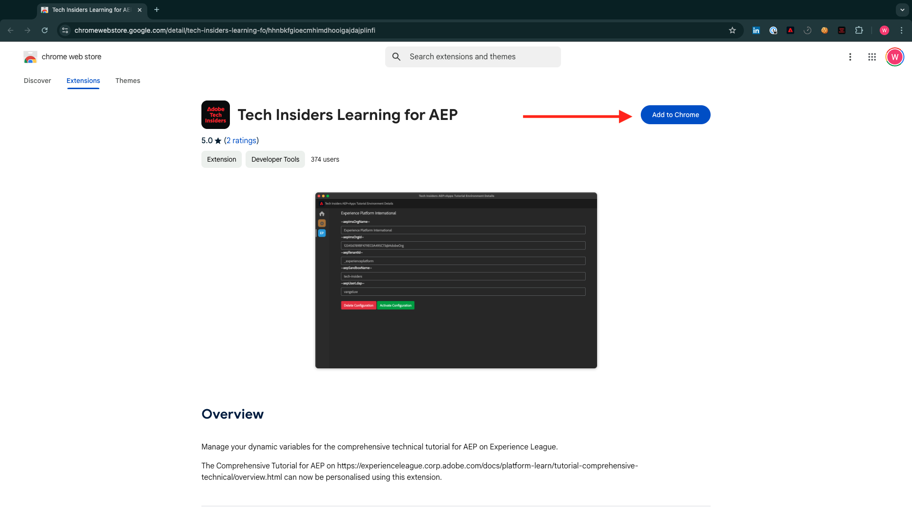

# 0.1 Installation de l’extension Chrome pour la documentation Experience League

## 0.1.1 Pourquoi avons-nous créé une extension Chrome ?

La documentation a été rendue générique afin d’être facilement réutilisée par n’importe qui, à l’aide de n’importe quelle instance Adobe Experience Platform.
En rendant la documentation réutilisable, les **variables d’environnement** ont été introduites dans la documentation, ce qui signifie que vous trouverez les **clés** ci-dessous dans la documentation. Chaque clé est une variable spécifique pour un environnement spécifique. L’extension Chrome la modifie pour vous et vous permet ainsi de copier facilement du code et du texte à partir des pages du tutoriel et de le coller dans les différentes interfaces utilisateur que vous utiliserez dans le cadre du tutoriel.

Vous trouverez ci-dessous un exemple de ces valeurs. Actuellement, ces valeurs ne peuvent pas encore être utilisées, mais dès que vous installez et activez l’extension Chrome, ces variables se transforment en texte &quot;normal&quot; que vous pouvez copier et réutiliser.

| Nom | Clé |
|:-------------:| :---------------:|
| Identifiant de l’organisation IMS AEP | `--aepImsOrgId--` |
| Identifiant du client AEP | `--aepTenantId--` |
| Nom du sandbox AEP | `--aepSandboxName--` |
| Protocole LDAP du profil du professeur | `--aepUserLdap--` |

Par exemple, dans la capture d’écran ci-dessous, vous pouvez voir une référence à `--aepTenantId--`.

Une fois l’extension installée, ce même texte sera automatiquement modifié pour refléter les valeurs spécifiques à votre instance.

L’extension vous permettra également de :

- S’inscrire au tutoriel

## 0.1.2 Installation de l’extension Chrome

Pour installer cette extension Chrome, ouvrez votre navigateur Chrome et accédez à : [https://chrome.google.com/webstore/detail/platform-learn-configurat/hhnbkfgioecmhimdhooigajdajplinfi/related?hl=en&amp;authuser=0](https://chrome.google.com/webstore/detail/platform-learn-configurat/hhnbkfgioecmhimdhooigajdajplinfi/related?hl=en&amp;authuser=0). Vous verrez alors ceci.

Cliquez sur **Ajouter à Chrome**.

Vous verrez alors ceci. Cliquez sur **Ajouter une extension**.

L’extension sera alors installée et une notification similaire s’affichera.

Dans le menu **extensions**, cliquez sur l’icône **pièce de puzzle** et épinglez l’extension **Platform Learn - Configuration** dans le menu d’extension.

## 0.1.2 Configuration de l’extension Chrome

Accédez à [https://experienceleague.adobe.com/docs/platform-learn/comprehensive-technical-tutorial-v22/overview.html?lang=en](https://experienceleague.adobe.com/docs/platform-learn/comprehensive-technical-tutorial-v22/overview.html?lang=en) et cliquez sur l’icône d’extension pour l’ouvrir.

Vous verrez alors cette fenêtre contextuelle. Cliquez sur l’icône **+** .

Saisissez votre nom et l’ID de configuration qui a été créé pour votre environnement Adobe Experience Platform. Cliquez sur **Créer**.

>[!IMPORTANT]
>
>Si vous êtes un employé d’Adobe : vous pouvez trouver l’identifiant de configuration à utiliser sur le référentiel Github interne (https://git.corp.adobe.com/vangeluw/platformenablement).
>
>Si vous êtes un partenaire en solutions Adobe, contactez votre contact en solutions ou envoyez un email **spphelp@adobe.com**.

Dans le menu de gauche de l’extension, une icône s’affiche avec vos initiales. Cliquez dessus. Vous verrez ensuite le mappage entre les **variables d’environnement** et vos valeurs d’instance Adobe Experience Platform spécifiques. Cliquez sur **Activer la configuration**.

Une fois la configuration activée, un point vert s’affiche en regard de vos initiales. Cela signifie que votre ID de configuration est maintenant actif. Plusieurs options de menu supplémentaires s’affichent également.

Vous disposez désormais de 2 options :

- Si vous êtes un utilisateur existant de l’activation avec une configuration existante, accédez à **0.1.3 Existant user - Login**
- Si vous êtes un nouvel utilisateur qui lance ce tutoriel pour la première fois, accédez à **0.1.4 Signup** et ignorez **0.1.3 Existing user - Login**

## 0.1.3 Utilisateur existant - Connexion

>[!IMPORTANT]
>
>L’exercice **0.1.3 Existant - Connexion** ne fonctionnera que si vous êtes déjà un utilisateur qui s’est inscrit à ce tutoriel.

Si vous êtes un utilisateur existant qui configure cette extension Chrome pour la première fois, cliquez sur l’icône violette dans le menu de gauche. Vous verrez alors ceci.

Remplissez les valeurs suivant vos besoins.

>[!IMPORTANT]
>
>**LDAP** est le champ le plus important : vous devez utiliser le même LDAP que celui utilisé lorsque vous vous êtes inscrit pour la première fois au tutoriel. Cela permet de vous assurer que votre progression est bien chargée. Si vous n&#39;êtes pas sûr de ce qu&#39;est votre ldap, regardez votre adresse email. Utilisez le texte situé avant le @-symbol dans votre adresse email en tant que LDAP. Si votre adresse email est **techinsiders@adobe.com**, le LDAP que vous saisissez ici doit être **vangeluw**).

Cliquez sur **OK**.

Après 30 secondes à 1 minute, votre écran change et vous revenez à **Home**, où vous verrez ceci :

Votre extension Chrome est maintenant configurée et vous pouvez désormais vérifier si tout fonctionne correctement.

## 0.1.4 Nouvel utilisateur - S’inscrire

>[!IMPORTANT]
>
>L’exercice **0.1.4 New user - Sign** est destiné aux nouveaux utilisateurs qui commencent ce tutoriel pour la première fois.

Si vous êtes un nouvel utilisateur qui s’inscrit pour la première fois à ce tutoriel, cliquez sur l’icône jaune dans le menu. Vous verrez alors ceci.

Renseignez les champs suivant vos besoins. Cliquez sur **Enregistrer**.

>[!IMPORTANT]
>
>**LDAP** est le champ le plus important. Si vous n&#39;êtes pas sûr de ce qu&#39;est votre ldap, regardez votre adresse email. Utilisez le texte situé avant le @-symbol dans votre adresse email en tant que LDAP. Si votre adresse email est **techinsiders@adobe.com**, le LDAP que vous saisissez ici doit être **vangeluw**).

Après 30 secondes à 1 minute, votre écran change et vous revenez à **Home**, où vous verrez ceci :

Votre extension Chrome est maintenant configurée et vous pouvez désormais vérifier si tout fonctionne correctement.

## 0.1.5 Vérification du contenu du tutoriel

Pour un test, accédez à [cette page](https://experienceleague.adobe.com/docs/platform-learn/comprehensive-technical-tutorial-v22/module4/ex3.html?lang=en).

Vous devriez maintenant constater que toutes les **variables d’environnement** ont été remplacées par leurs valeurs vraies, en fonction de l’ID de configuration dans l’extension Chrome.

Vous devriez maintenant avoir une vue similaire à celle ci-dessous, où les variables d’environnement `--aepTenantId--` ont été remplacées par votre identifiant de client réel, qui dans ce cas est **_experienceplatform**.

Étape suivante : [0.2 Utilisation du système de démonstration près de la configuration de la propriété cliente de collecte de données Adobe Experience Platform{1](./ex2.md)

[Revenir au module 0](./getting-started.md)

[Revenir à tous les modules](./../../../overview.md)
