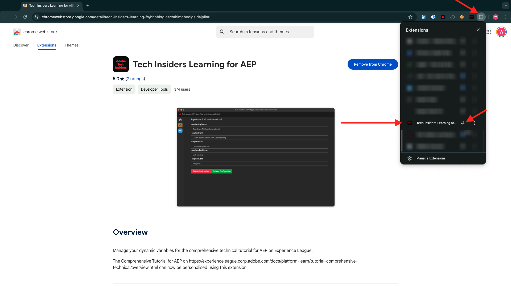
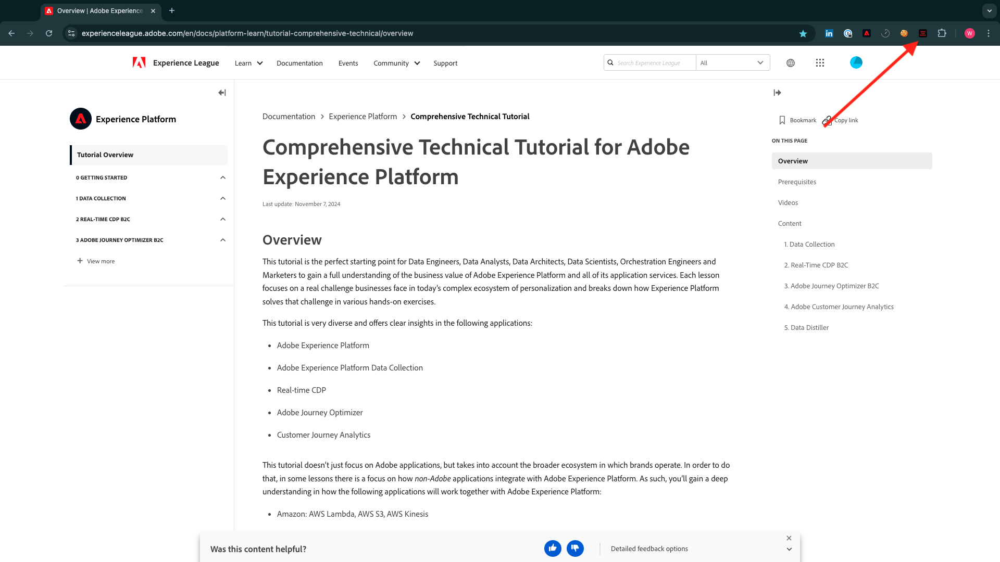
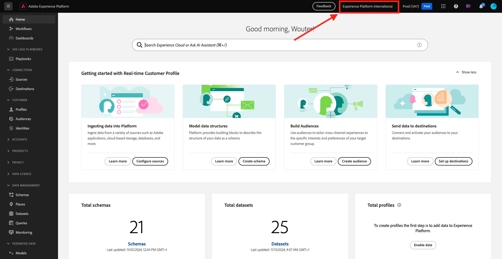
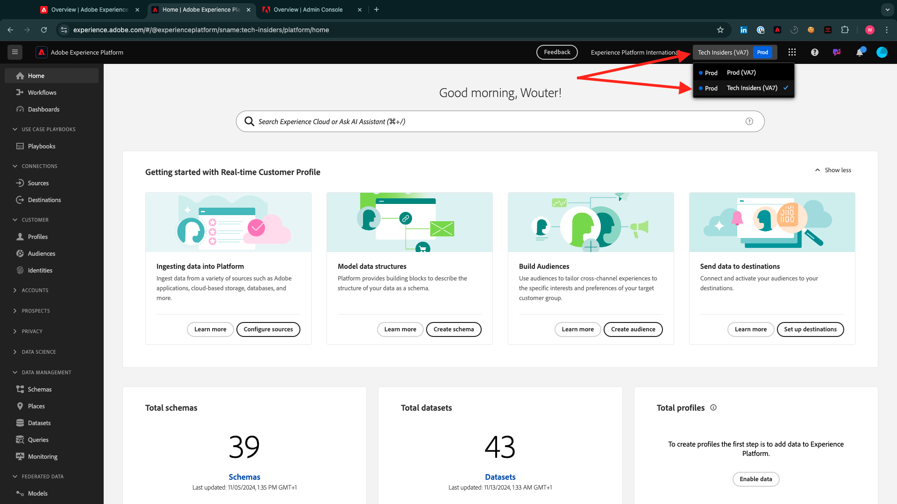

# Installation de l’extension Chrome pour la documentation Experience League

## À propos de l’extension Chrome

La documentation a été rendue générique afin d’être facilement réutilisée par n’importe qui, à l’aide de n’importe quelle instance Adobe Experience Platform.
Afin de rendre la documentation réutilisable, des **variables d’environnement** ont été introduites dans la documentation, ce qui signifie que vous trouverez les **espaces réservés** ci-dessous dans la documentation. Chaque espace réservé est une variable spécifique pour un environnement spécifique. L’extension Chrome la modifiera afin que vous puissiez facilement copier du code et du texte des pages du tutoriel et le coller dans les différentes interfaces utilisateur que vous utiliserez dans le cadre du tutoriel.

Vous trouverez ci-dessous un exemple de ces valeurs. Actuellement, ces valeurs ne peuvent pas encore être utilisées, mais dès que vous installez et activez l’extension Chrome, ces variables se transforment en texte normal que vous pouvez copier et réutiliser.

| Nom | Clé |
|:-------------:| :---------------:|
| Identifiant de l’organisation IMS AEP | `--aepImsOrgId--` |
| Identifiant du client AEP | `--aepTenantId--` |
| Nom du sandbox AEP | `--aepSandboxName--` |
| Protocole LDAP du profil du professeur | `--aepUserLdap--` |

Par exemple, dans la capture d’écran ci-dessous, vous pouvez voir une référence à `aepTenantId`.

Une fois l’extension installée, ce même texte sera automatiquement modifié pour refléter les valeurs spécifiques à votre instance.

## Installation de l’extension Chrome

Pour installer cette extension Chrome, ouvrez votre navigateur Chrome et accédez à : [https://chromewebstore.google.com/detail/tech-insiders-learning-fo/hhnbkfgioecmhimdhooigajdajplinfi](https://chromewebstore.google.com/detail/tech-insiders-learning-fo/hhnbkfgioecmhimdhooigajdajplinfi). Vous verrez alors ceci.

Cliquez sur **Ajouter à Chrome**.

Vous verrez alors ceci. Cliquez sur **Ajouter une extension**.

L’extension sera alors installée et une notification similaire s’affichera.

Dans le menu **extensions**, cliquez sur l’icône **pièce de puzzle** et épinglez l’extension **Platform Learn - Configuration** dans le menu d’extension.

## Configuration de l’extension Chrome

Accédez à [https://experienceleague.adobe.com/en/docs/platform-learn/tutorial-comprehensive-technical/overview](https://experienceleague.adobe.com/en/docs/platform-learn/tutorial-comprehensive-technical/overview) et cliquez sur l’icône d’extension pour l’ouvrir.

Vous verrez alors cette fenêtre contextuelle. Cliquez sur l’icône **+** .

Saisissez les valeurs indiquées ci-dessous, qui sont toutes liées à votre instance Adobe Experience Platform.

Si vous ne savez pas quelles valeurs saisir pour ces champs, suivez les instructions ci-dessous.

**Nom de l’organisation IMS AEP**

Lorsque vous vous connectez à votre instance Adobe Experience Platform sur [https://platform.adobe.com/](https://platform.adobe.com/), le nom de votre instance se trouve dans le coin supérieur droit de votre écran.

**ID de l’organisation IMS AEP**

L’identifiant de l’organisation IMS est l’identifiant unique de votre instance Adobe Experience Cloud. Il est référencé à plusieurs emplacements dans ce tutoriel.

Vous pouvez rechercher votre identifiant de l’organisation IMS de plusieurs manières. Si vous n’êtes pas sûr, contactez l’un des administrateurs système de votre instance pour trouver l’identifiant.

Vous pouvez la trouver en vous rendant sur [Admin Console](https://https://adminconsole.adobe.com/), où vous pouvez la trouver dans l’URL.

Vous pouvez également la trouver en accédant à **Data Management > Queries** dans le menu AEP, où vous pouvez la trouver sous **Nom d’utilisateur**.

Veillez à copier et coller la partie **@AdobeOrg** avec l&#39;ID.

**ID de tenant AEP**

Votre identifiant du tenant est l’identifiant unique de l’instance AEP de votre organisation. Lorsque vous vous connectez à votre instance Adobe Experience Platform sur [https://platform.adobe.com/](https://platform.adobe.com/), vous trouverez l’identifiant du client dans l’URL.

Lorsque vous la saisissez dans l’extension Chrome, vous devez vous assurer qu’un trait de soulignement est ajouté comme préfixe. Dans cet exemple, **experienceplatform** devient **_experienceplatform**.

**Nom de l’environnement de test AEP**

Le nom de votre environnement de test est le nom de l’environnement que vous utiliserez dans votre instance AEP. Lorsque vous vous connectez à votre instance Adobe Experience Platform sur [https://platform.adobe.com/](https://platform.adobe.com/), vous trouverez l’identifiant du client dans l’URL.

Avant de prendre le nom de l’environnement de test à partir de l’URL, vous devez vous assurer que vous vous trouvez dans l’environnement de test que vous devez utiliser pour ce tutoriel. Vous pouvez passer à l’environnement de test de droite en cliquant sur le menu de sélecteur d’environnement de test dans le coin supérieur droit de votre écran.

Dans cet exemple, le nom de l’environnement de test AEP est **tech-insiders**.

**Votre LDAP**

Il s’agit du nom d’utilisateur qui sera utilisé dans le cadre du tutoriel. Dans cet exemple, le LDAP est basé sur l&#39;adresse email de cet utilisateur. L&#39;adresse email est **vangeluw@adobe.com**, de sorte que le LDAP devient **vangeluw**.

Le protocole LDAP est utilisé pour s’assurer que la configuration que vous allez effectuer sera liée à vous et n’entrera pas en conflit avec d’autres utilisateurs qui utilisent peut-être la même instance et le même environnement de test que vous utilisez.

Vos valeurs devraient ressembler à celles-ci.
Enfin, cliquez sur **Créer**.

Dans le menu de gauche de l’extension, une nouvelle icône s’affiche avec les initiales de votre environnement. Cliquez dessus. Vous verrez ensuite le mappage entre les **variables d’environnement** et vos valeurs d’instance Adobe Experience Platform spécifiques. Cliquez sur **Activer la configuration**.

Une fois la configuration activée, un point vert s’affiche en regard des initiales de votre environnement. Cela signifie que votre environnement est désormais actif.

## Vérifier le contenu du tutoriel

Pour un test, accédez à [cette page](https://experienceleague.adobe.com/en/docs/platform-learn/tutorial-comprehensive-technical/datadistiller/module51/ex3).

Vous devriez maintenant constater que toutes les **variables d’environnement** ont été remplacées par leurs valeurs vraies, en fonction de l’environnement activé dans l’extension Chrome.

Vous devriez maintenant avoir une vue similaire à celle ci-dessous, où la variable d’environnement `aepTenantId` a été remplacée par votre identifiant réel de tenant AEP, qui dans ce cas est **_experienceplatform**.

Étape suivante : [Utiliser le système de démonstration en regard de la configuration de la propriété cliente de collecte de données Adobe Experience Platform](./ex2.md)

[Revenir à la prise en main](./getting-started.md)

[Revenir à tous les modules](./../../../overview.md)
