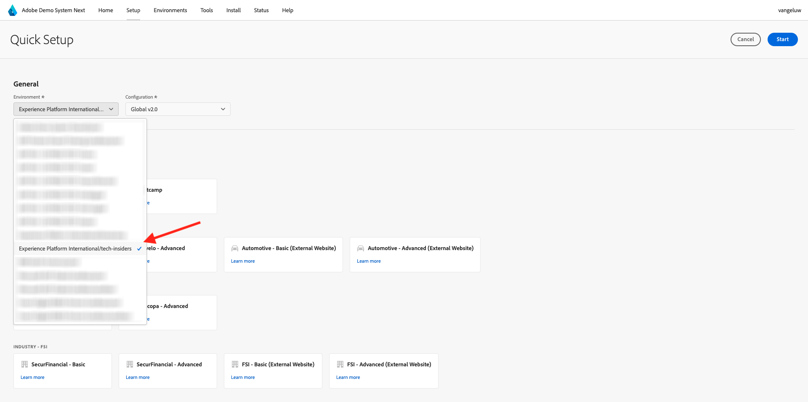

# Utilisez le système de démonstration suivant pour configurer la propriété de votre client de collecte de données Adobe Experience Platform

Afin de visualiser les enseignements de ce tutoriel et de vous permettre de tester votre configuration dans un environnement sûr, ce tutoriel utilise les outils Adobe Demo System Next. Pour tirer le meilleur parti de ce tutoriel, votre instance Adobe Experience Platform doit être configurée pour être intégrée à Demo System Next.

Une fois que vous avez accès à Demo System Next, procédez comme suit.

Accédez à [https://dsn.adobe.com/](https://dsn.adobe.com/) puis à **Configuration**.

Dans le menu déroulant **Environnement**, sélectionnez votre instance Adobe Experience Platform et votre sandbox.

Sélectionnez ensuite le paramètre prédéfini **Utilisateur du tutoriel AEP**.

Cliquez ensuite sur **Démarrer**.

Dans la fenêtre contextuelle, saisissez un nom pour vos propriétés de collecte de données et vos projets Experience Builder. Utilisez la convention de nommage suivante : **Système de démonstration (JJ/MM/AAAA)**. Pour information : votre LDAP sera ajouté automatiquement, vous n&#39;avez pas besoin de l&#39;ajouter vous-même.

Cliquez sur **Démarrer**.

Cette fenêtre contextuelle s’affiche, vous montrant la progression de la création des projets de votre site web et de votre application mobile, ainsi que vos propriétés de collecte de données.

Une fois le processus de configuration rapide terminé, vous aurez :

- 1 projet web, qui permet d&#39;utiliser un site web de démonstration avec une marque de démonstration telco
- 1 projet d’application mobile, qui permet d’utiliser une application mobile de démonstration avec une marque de démonstration telco
- 1 projet d’application CX, qui permet d’utiliser une application de centre d’appels avec une marque de démonstration de télécommunications.
- 1 Propriété de collecte de données pour le web que vous utiliserez pour collecter des données à partir du site web.
- 1 Propriété de collecte de données pour mobile que vous utiliserez pour collecter des données à partir de l’application mobile.

Gardez cet écran ouvert car vous en aurez besoin lors des étapes suivantes.

Étape suivante : [&#x200B; Créer votre flux de données &#x200B;](./ex3.md)

[Revenir à la prise en main](./getting-started.md)

[Revenir à tous les modules](./../../../overview.md)
