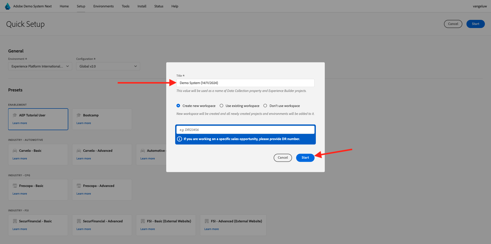

# Utilisation du système de démonstration en regard de la configuration de la propriété client de collecte de données Adobe Experience Platform

Afin de visualiser les leçons apprises dans ce tutoriel et de vous permettre de tester votre configuration dans un environnement sûr, ce tutoriel utilise les outils Demo System Next d’Adobe. Pour tirer le meilleur parti de ce tutoriel, votre instance AEP doit être configurée pour être intégrée à Demo System Next.

Une fois que vous avez accès à Demo System Next, procédez comme suit.

Accédez à [https://dsn.adobe.com/](https://dsn.adobe.com/) et accédez à **Configuration**.

Dans la liste déroulante **Environnement**, sélectionnez votre instance AEP et votre environnement de test.

Sélectionnez ensuite le paramètre prédéfini **AEP Tutorial User**.

Cliquez ensuite sur **Démarrer**.

Dans la fenêtre contextuelle, saisissez un nom pour vos propriétés de collecte de données et vos projets Experience Builder. Utilisez cette convention d’affectation des noms : **Demo System (DD/MM/YYYY)**. FYI : votre LDAP sera automatiquement ajouté, vous n’avez pas besoin de l’ajouter vous-même.

Cliquez sur **Démarrer**.

Vous verrez ensuite cette fenêtre contextuelle, qui vous montre la progression de la création de projets de site web et d’applications mobiles, ainsi que de vos propriétés de collecte de données.

Une fois le processus de configuration rapide terminé, vous aurez :

- 1 projet web, qui permet d’utiliser un site web de démonstration avec une marque de démonstration telco
- 1 projet d’application mobile, qui permet d’utiliser une application mobile de démonstration avec une marque de démonstration telco
- Projet d’application 1 CX, qui permet d’utiliser une application de centre d’appel avec une marque de démonstration telco
- 1 propriété Collecte de données pour le web, que vous utiliserez pour collecter des données à partir du site web
- 1 propriété Collecte de données pour mobile, que vous utiliserez pour collecter des données à partir de l’application mobile

Laissez cet écran ouvert, car vous en aurez besoin lors des étapes suivantes.

Étape suivante : [Créer votre flux de données](./ex3.md)

[Revenir à la prise en main](./getting-started.md)

[Revenir à tous les modules](./../../../overview.md)
