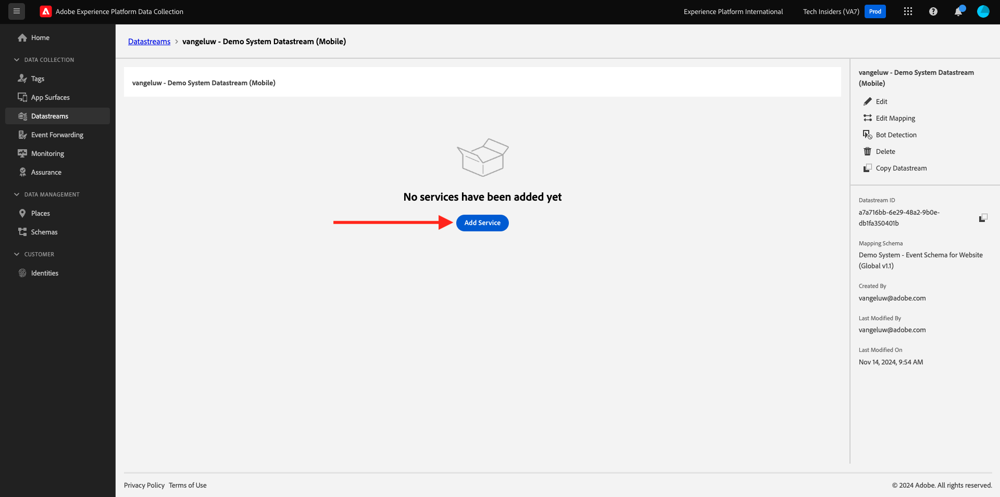

# Créer votre flux de données

Accédez à [https://experience.adobe.com/#/data-collection/](https://experience.adobe.com/#/data-collection/).

Dans le menu de gauche, cliquez sur **[!UICONTROL Balises]**. Après l’exercice précédent, vous disposez désormais de deux propriétés de collecte de données : une pour le web et une pour le mobile.

Ces propriétés sont presque prêtes à être utilisées, mais avant de pouvoir commencer à collecter des données à l’aide de ces propriétés, vous devez configurer un flux de données. Vous obtiendrez plus d’informations sur le concept d’un flux de données et sur ce qu’il signifie lors d’un exercice ultérieur dans le module de collecte de données.

Pour l&#39;instant, veuillez suivre ces étapes.

## Créer votre flux de données pour le Web

Cliquez sur **[!UICONTROL Datastreams]**.

Dans le coin supérieur droit de votre écran, sélectionnez le nom de votre environnement de test, qui doit être `--aepSandboxName--`.

Cliquez sur **[!UICONTROL New Datastream]**.

Pour le **[!UICONTROL nom]** et pour la description facultative, saisissez `--aepUserLdap-- - Demo System Datastream`. Pour **Mapping Schema**, sélectionnez **Demo System - Event Schema for Website (Global v1.1)**. Cliquez sur **Enregistrer**.

Vous verrez alors ceci. Cliquez sur **Ajouter un service**.

Sélectionnez le service **[!UICONTROL Adobe Experience Platform]** qui présentera des champs supplémentaires. Vous verrez alors ceci.

Pour le jeu de données d’événement, sélectionnez **Système de démonstration - Jeu de données d’événement pour le site web (Global v1.1)** et, pour le jeu de données de profil, sélectionnez **Système de démonstration - Jeu de données de profil pour le site web (Global v1.1)**. Cliquez sur **Enregistrer**.

Vous allez maintenant voir ceci.

C&#39;est tout pour le moment. Dans le [module 1.1](./../../../modules/datacollection/module1.1/data-ingestion-launch-web-sdk.md), vous en apprendrez plus sur le SDK Web et sur la configuration de toutes ses fonctionnalités.

Dans le menu de gauche, cliquez sur **[!UICONTROL Balises]**.

Filtrez les résultats de la recherche pour afficher vos deux propriétés de collecte de données. Ouvrez la propriété de **Web** en cliquant dessus.

Vous verrez alors ceci. Cliquez sur **Extensions**.

Cliquez d’abord sur l’extension SDK Web de Adobe Experience Platform, puis sur **Configurer**.

Vous verrez alors ceci. Faites un kook dans le menu **Datastreams** et assurez-vous que l’environnement de test approprié est sélectionné, qui dans votre cas doit être `--aepSandboxName--`.

Ouvrez la liste déroulante **Datastreams** et sélectionnez le Datastream que vous avez créé précédemment.

Assurez-vous d’avoir sélectionné votre **Datastream** dans les trois environnements différents. Cliquez ensuite sur **Enregistrer**.

Accédez à **Flux de publication**.

Cliquez sur **...** pour **Main**, puis cliquez sur **Modifier**.

Cliquez sur **Ajouter toutes les ressources modifiées**, puis sur **Enregistrer et créer pour le développement**.

Vos modifications sont en cours de publication et seront prêtes dans quelques minutes, après quoi vous verrez le point vert en regard de **Main**.

## Créer votre flux de données pour Mobile

Accédez à [https://experience.adobe.com/#/data-collection/](https://experience.adobe.com/#/data-collection/).

Cliquez sur **[!UICONTROL Datastreams]**.

Dans le coin supérieur droit de votre écran, sélectionnez le nom de votre environnement de test, qui doit être `--aepSandboxName--`.

Cliquez sur **[!UICONTROL New Datastream]**.

Pour le **[!UICONTROL nom convivial]** et pour la description facultative, saisissez `--aepUserLdap-- - Demo System Datastream (Mobile)`. Pour **Schéma de mappage**, sélectionnez **Système de démonstration - Schéma d’événement pour application mobile (Global v1.1)**. Cliquez sur **Enregistrer**.

Cliquez sur **[!UICONTROL Enregistrer]**.

Vous verrez alors ceci. Cliquez sur **Ajouter un service**.

Sélectionnez le service **[!UICONTROL Adobe Experience Platform]** qui présentera des champs supplémentaires. Vous verrez alors ceci.

Pour le jeu de données d’événement, sélectionnez **Système de démonstration - Jeu de données d’événement pour l’application mobile (Global v1.1)** et, pour le jeu de données de profil, sélectionnez **Système de démonstration - Jeu de données de profil pour l’application mobile (Global v1.1)**. Cliquez sur **Enregistrer**.

Vous verrez alors ceci.

Votre flux de données est maintenant prêt à être utilisé dans la propriété du client de collecte de données Adobe Experience Platform pour Mobile.

Accédez à **Balises** et filtrez les résultats de la recherche pour afficher vos deux propriétés de collecte de données. Ouvrez la propriété de **Mobile** en cliquant dessus.

Vous verrez alors ceci. Cliquez sur **Extensions**.

Cliquez sur l’extension **Adobe Experience Platform Edge Network**, puis sur **Configurer**.

Vous verrez alors ceci. Vous devez maintenant sélectionner l’environnement de test et le flux de données corrects que vous venez de configurer. L’environnement de test à utiliser est `--aepSandboxName--` et le flux de données est appelé `--aepUserLdap-- - Demo System Datastream (Mobile)`.

Pour le **domaine Edge Network**, utilisez le domaine par défaut.

Cliquez sur **Enregistrer** pour enregistrer vos modifications.

Accédez à **Flux de publication**.

Cliquez sur **...** en regard de **Main**, puis cliquez sur **Modifier**.

Cliquez sur **Ajouter toutes les ressources modifiées**, puis sur **Enregistrer et créer pour le développement**.

Vos modifications sont en cours de publication et seront prêtes dans quelques minutes, après quoi vous verrez le point vert en regard de **Main**.

Étape suivante : [Utiliser le site Web](./ex4.md)

[Revenir à la prise en main](./getting-started.md)

[Revenir à tous les modules](./../../../overview.md)
