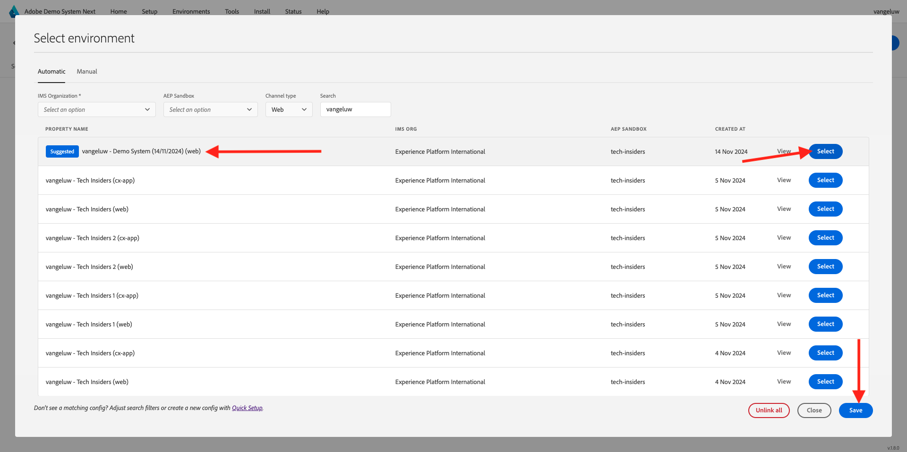

# Utiliser le site web

## Option 1 : continuer de l’exercice précédent

>[!NOTE]
>
>Si vous n’avez plus l’écran ci-dessous ouvert, accédez à l’option 2 à la place.

Après l’exercice précédent, vous avez obtenu ce résultat. Cliquez pour ouvrir le **projet Web Telco** qui a été créé pour vous.

Vous verrez alors ceci. Cliquez sur **Intégrations**.

Sur la page **Intégrations** , vous devez sélectionner la propriété Collecte de données qui a été créée dans l’exercice précédent. Pour ce faire, cliquez sur **Sélectionner un environnement**.

Cliquez sur **Sélectionner** sur la propriété de collecte de données qui a été créée à l’étape précédente, appelée `--aepUserLdap-- - Demo System (DD/MM/YYYY) (web)`.

Vous verrez alors ceci. Cliquez sur **Exécuter** pour ouvrir le site web de démonstration.

Vous verrez alors votre site web de démonstration ouvert. Sélectionnez l’URL et copiez-la dans le presse-papiers.

Ouvrez une nouvelle fenêtre de navigateur incognito.

Collez l’URL de votre site web de démonstration, que vous avez copiée à l’étape précédente. Vous serez alors invité à vous connecter à l’aide de votre Adobe ID.

Sélectionnez le type de compte et procédez à la connexion.

Votre site web est alors chargé dans une fenêtre de navigateur incognito. Pour chaque démonstration, vous devez utiliser une fenêtre de navigateur incognito actualisée pour charger l’URL de votre site web de démonstration.

## Option 2 : commencer par une nouvelle fenêtre de navigateur incognito

Si vous avez accidentellement fermé la fenêtre de votre navigateur ou pour les sessions suivantes, vous pouvez également accéder au projet de votre site web en accédant à [https://dsn.adobe.com/](https://dsn.adobe.com/). Une fois connecté avec votre Adobe ID, vous verrez ceci. Cliquez sur les 3 points **..** dans le projet de votre site web, puis cliquez sur **Modifier**.

Vous pouvez maintenant suivre le flux ci-dessous pour accéder au site web. Cliquez sur **Intégrations**.

Sur la page **Intégrations** , vous devez sélectionner la propriété Collecte de données qui a été créée dans l’exercice précédent. Pour ce faire, cliquez sur **Sélectionner un environnement**.

Cliquez sur **Sélectionner** sur la propriété de collecte de données qui a été créée à l’étape précédente, appelée `--aepUserLdap - Demo System (DD/MM/YYYY) (web)`.

Vous verrez alors ceci. Cliquez sur **Exécuter** pour ouvrir le site web de démonstration.

Vous verrez alors votre site web de démonstration ouvert. Sélectionnez l’URL et copiez-la dans le presse-papiers.

Ouvrez une nouvelle fenêtre de navigateur incognito.

Collez l’URL de votre site web de démonstration, que vous avez copiée à l’étape précédente. Vous serez alors invité à vous connecter à l’aide de votre Adobe ID.

Sélectionnez le type de compte et procédez à la connexion.

Votre site web est alors chargé dans une fenêtre de navigateur incognito. Pour chaque démonstration, vous devez utiliser une fenêtre de navigateur incognito actualisée pour charger l’URL de votre site web de démonstration.

Étape suivante : [Utilisation de l’application mobile](./ex5.md)

[Revenir à la prise en main](./getting-started.md)

[Revenir à tous les modules](./../../../overview.md)
