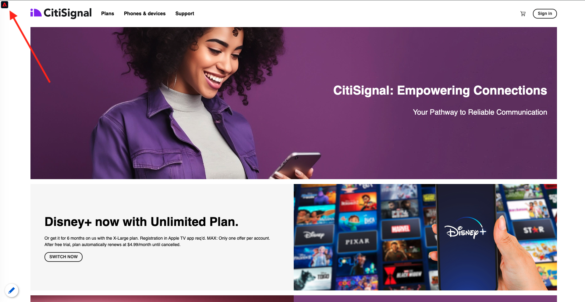
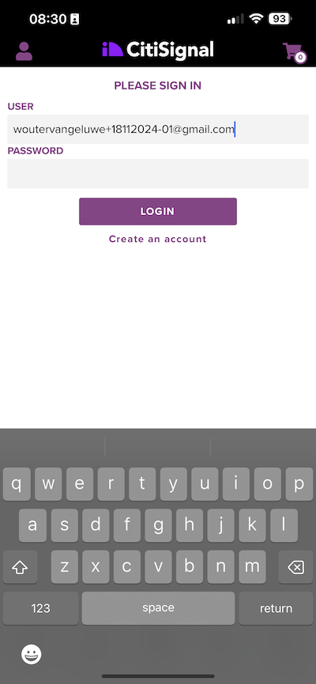
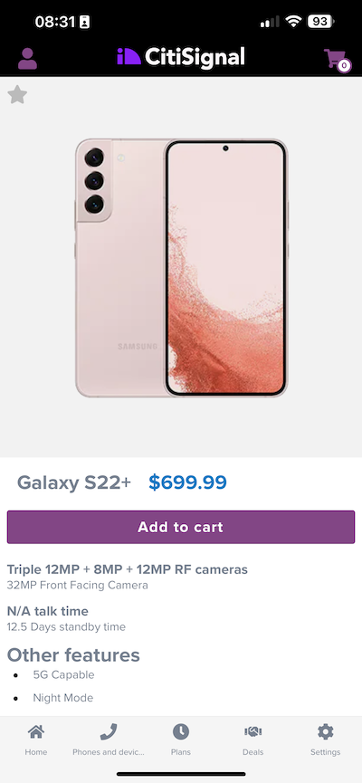

# 2.1.1 De inconnu à connu sur le site web

## Contexte

Le parcours de l’inconnu au connu est l’un des sujets les plus importants parmi les marques de nos jours, tout comme le parcours client de l’acquisition à la rétention.

Adobe Experience Platform joue un rôle énorme dans ce parcours. Platform est le cerveau de la communication, le &quot;système d&#39;enregistrement de l&#39;expérience&quot;.

Platform est un environnement dans lequel le mot client est plus large que les clients connus. Un visiteur inconnu du site web est également un client du point de vue de Platform et, en tant que tel, tout le comportement en tant que visiteur inconnu est également envoyé à Platform. Grâce à cette approche, lorsque ce visiteur devient finalement un client connu, une marque peut également visualiser ce qui s’est produit avant ce moment. Cela s’avère utile du point de vue de l’attribution et de l’optimisation de l’expérience.

## Flux de parcours client

Accédez à [https://dsn.adobe.com](https://dsn.adobe.com). Une fois connecté avec votre Adobe ID, vous verrez ceci. Cliquez sur les 3 points **...** dans le projet de votre site web, puis cliquez sur **Exécuter** pour l’ouvrir.

Vous verrez alors votre site web de démonstration ouvert. Sélectionnez l’URL et copiez-la dans le presse-papiers.

Ouvrez une nouvelle fenêtre de navigateur incognito.

Collez l’URL de votre site web de démonstration, que vous avez copiée à l’étape précédente. Vous serez alors invité à vous connecter à l’aide de votre Adobe ID.

Sélectionnez le type de compte et procédez à la connexion.

Votre site web est alors chargé dans une fenêtre de navigateur incognito. Pour chaque démonstration, vous devez utiliser une fenêtre de navigateur incognito actualisée pour charger l’URL de votre site web de démonstration.

Cliquez sur l’icône représentant un logo d’Adobe dans le coin supérieur gauche de votre écran pour ouvrir la visionneuse de profils.

Consultez le panneau Visionneuse de profils et Real-time Customer Profile avec l’**identifiant Experience Cloud** comme identifiant principal pour ce client actuellement inconnu.

Vous pouvez également voir tous les événements d’expérience collectés en fonction du comportement du client. La liste est actuellement vide, mais elle va bientôt changer.

Accédez à la catégorie de produits **Phones &amp; devices** . Cliquez ensuite sur le produit **iPhone 15 Pro**.

Vous verrez ensuite la page des détails du produit. Un événement d’expérience de type **Consultation produit** a maintenant été envoyé à Adobe Experience Platform à l’aide de l’implémentation du SDK Web que vous avez examinée dans le module 1.

Ouvrez le panneau Fournisseur de la visionneuse et observez vos **Événements d’expérience**.

Revenez à la page de catégorie **Téléphone et appareils** et cliquez sur un autre produit. Un autre événement d’expérience a été envoyé à Adobe Experience Platform. Ouvrez le panneau Visionneuse de profils . Vous verrez désormais 2 événements d’expérience de type **Consultation produit**. Bien que le comportement soit anonyme, avec le consentement approprié en place, vous pouvez suivre chaque clic et le stocker dans Adobe Experience Platform. Une fois que le client anonyme sera connu, nous pourrons fusionner automatiquement tout comportement anonyme avec le profil de connaissance.

Accédez à la page Enregistrer/Connexion . Cliquez sur **Se connecter**.

Cliquez sur **Créer un compte**.

Renseignez vos détails et cliquez sur **Enregistrer** après quoi vous serez redirigé vers la page précédente.

Ouvrez le panneau Visionneuse de profils et accédez à Real-time Customer Profile. Dans le panneau Visionneuse de profils, toutes vos données personnelles doivent s’afficher, comme les identifiants de téléphone et d’adresse électronique que vous venez d’ajouter.

Dans le panneau Visionneuse de profils, accédez à Événements d’expérience. Vous verrez les 2 produits que vous avez déjà consultés dans le panneau Visionneuse de profils . Ces deux événements sont désormais également connectés à votre profil &quot;connu&quot;.

Vous avez désormais ingéré des données dans Adobe Experience Platform et vous les avez liées à des identifiants tels que des ECID et des adresses électroniques. Le but est de comprendre le contexte commercial de ce que vous êtes sur le point de faire. Dans l’exercice suivant, vous allez commencer à configurer tout ce dont vous avez besoin pour rendre possible l’ingestion de données.

### Navigation dans l’application mobile

Après être devenu un client connu, il est temps de commencer à utiliser l’application mobile. Ouvrez l’application mobile sur votre iPhone, puis connectez-vous à l’application.

Si vous n’avez plus installé l’application ou si vous ne savez plus comment l’installer, veuillez consulter le lien suivant : [Utilisation de l’application mobile](../../gettingstarted/gettingstarted/ex5.md)

Après avoir installé l’application comme indiqué, la page d’entrée de l’application avec la marque Citi Signal chargée. Cliquez sur l’icône de compte dans la partie supérieure gauche de votre écran.

Dans l’écran de connexion, connectez-vous à l’aide de l’adresse électronique que vous avez utilisée sur le site web du bureau. Cliquez sur **Login**.

Accédez à l’écran d’accueil de l’application et cliquez pour ouvrir un produit.

Vous verrez ensuite la page des détails du produit.

Accédez à l’écran d’accueil de l’application et faites glisser le curseur vers la gauche de l’écran pour afficher le panneau Visionneuse de profils . Vous verrez ensuite le produit que vous venez de consulter dans la section **Événements d’expérience**, ainsi que toutes les consultations de produit de la session de site web précédente.

>[!NOTE]
>
>Il peut s’écouler quelques minutes avant que l’affichage consolidé ne s’affiche dans l’application et sur le site web.

Revenez à votre ordinateur de bureau et actualisez la page d’accueil, après laquelle vous verrez également le produit s’y afficher.

>[!NOTE]
>
>Il peut s’écouler quelques minutes avant que l’affichage consolidé ne s’affiche dans l’application et sur le site web.

Vous avez désormais ingéré des données dans Adobe Experience Platform et vous les avez liées à des identifiants tels que des ECID et des adresses électroniques. Le but de cet exercice était de comprendre le contexte commercial de ce que vous êtes sur le point de faire. Vous avez désormais créé un profil client en temps réel et multi-appareils. Au cours de l’exercice suivant, vous allez visualiser votre profil dans Adobe Experience Platform.

Étape suivante : [2.1.2 Visualiser votre propre profil client en temps réel - IU](./ex2.md)

[Revenir au module 2.1](./real-time-customer-profile.md)

[Revenir à tous les modules](../../../overview.md)
