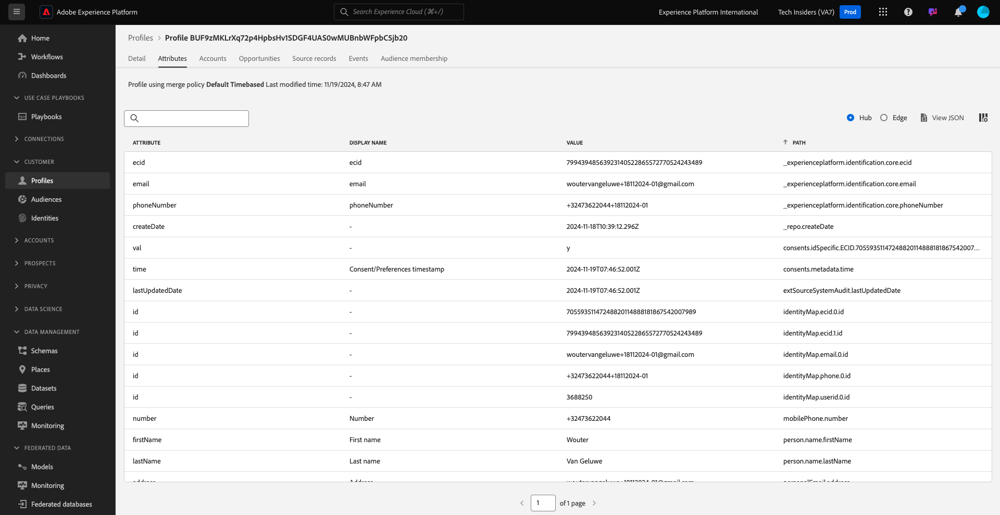
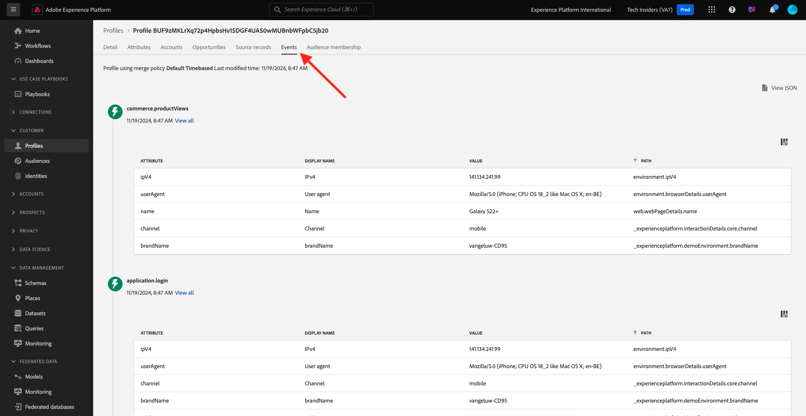

# 2.1.2 Visualisation de votre propre profil client en temps réel - interface utilisateur

Au cours de cet exercice, vous vous connecterez à Adobe Experience Platform et afficherez votre propre profil client en temps réel dans l’interface utilisateur.

## Contexte

Dans Real-time Customer Profile, toutes les données de profil s’affichent avec les données d’événement, ainsi que les appartenances à des segments existants. Les données affichées peuvent provenir de n’importe où, des applications d’Adobe et des solutions externes. Il s’agit de la vue la plus puissante de Adobe Experience Platform, le véritable système d’enregistrement d’expérience.

## Utilisation de la vue Profil client dans Adobe Experience Platform

Accédez à [Adobe Experience Platform](https://experience.adobe.com/platform). Une fois connecté, vous accédez à la page d’accueil de Adobe Experience Platform.

Avant de continuer, vous devez sélectionner un **sandbox**. L’environnement de test à sélectionner est nommé ``--aepSandboxName--``. Après avoir sélectionné l’[!UICONTROL sandbox] approprié, vous verrez le changement d’écran et vous êtes désormais dans votre [!UICONTROL sandbox] dédié.

Dans le menu de gauche, accédez à **Profils** et à **Parcourir**.

Dans le panneau Visionneuse de profils de votre site web, vous pouvez trouver plusieurs identités. Chaque identité est liée à un espace de noms.

Dans le panneau Visionneuse de profils, vous pouvez voir ces combinaisons d’identifiants et d’espaces de noms :

| Identité | Espace de noms |
|:-------------:| :---------------:|
| Identifiant Experience Cloud (ECID) | 79943948563923140522865572770524243489 |
| Identifiant Experience Cloud (ECID) | 70559351147248820114888181867542007989 |
| Email ID | woutervangeluwe+18112024-01@gmail.com |
| Identifiant du numéro de mobile | +32473622044+18112024-01 |

Avec Adobe Experience Platform, tous les identifiants sont également importants. Auparavant, l’ECID était l’identifiant le plus important dans le contexte de l’Adobe et tous les autres identifiants étaient liés à l’ECID dans une relation hiérarchique. Avec Adobe Experience Platform, ce n’est plus le cas, et chaque ID peut être considéré comme un identifiant principal.

En règle générale, l’identifiant principal dépend du contexte. Si vous demandez à votre centre d&#39;appels, **Quel est l&#39;identifiant le plus important ?** ils répondront probablement, **le numéro de téléphone !** Mais si vous demandez à votre équipe de gestion de la relation client, ils répondront **à l&#39;adresse email !** Adobe Experience Platform comprend cette complexité et la gère à votre place. Chaque application, qu’elle soit Adobe ou non, parlera avec Adobe Experience Platform en se référant à l’identifiant qu’elle considère comme principal. Et ça marche tout simplement.

Pour le champ **Identity namespace**, sélectionnez **Email** et pour le champ **Identity Value**, saisissez l’adresse électronique que vous avez utilisée pour l’enregistrement dans l’exercice précédent. Cliquez sur **Afficher**. Votre profil s’affiche alors dans la liste. Cliquez sur l’ **ID de profil** pour ouvrir votre profil.

Vous voyez maintenant un aperçu de quelques **attributs de profil** importants de votre profil client. Pour afficher tous les attributs de profil disponibles pour votre profil, cliquez sur **Attributs**.

Vous verrez alors une liste complète de tous les attributs.

Accédez à **Événements**, où vous pouvez voir les entrées pour chaque événement d’expérience lié à votre profil.

Enfin, accédez à l’option de menu **Appartenance à une audience**. Vous trouverez ici toutes les audiences admissibles pour ce client. La liste peut être actuellement vide, mais cela changera dans les modules suivants.

Maintenant que vous savez comment afficher le profil en temps réel d’un client en utilisant l’interface utilisateur de Adobe Experience Platform, faisons de même avec les API en utilisant Postman et l’Adobe I/O pour effectuer des requêtes contre les API de Adobe Experience Platform.

Étape suivante : [2.1.3 Visualiser votre propre profil client en temps réel - API](./ex3.md)

[Revenir au module 2.1](./real-time-customer-profile.md)

[Revenir à tous les modules](../../../overview.md)
