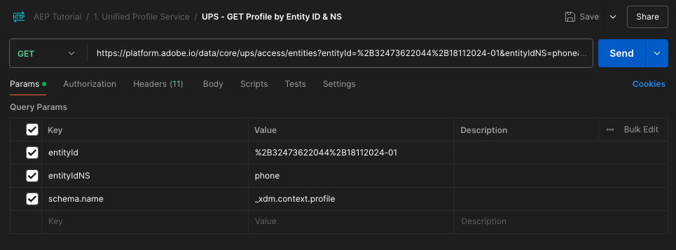
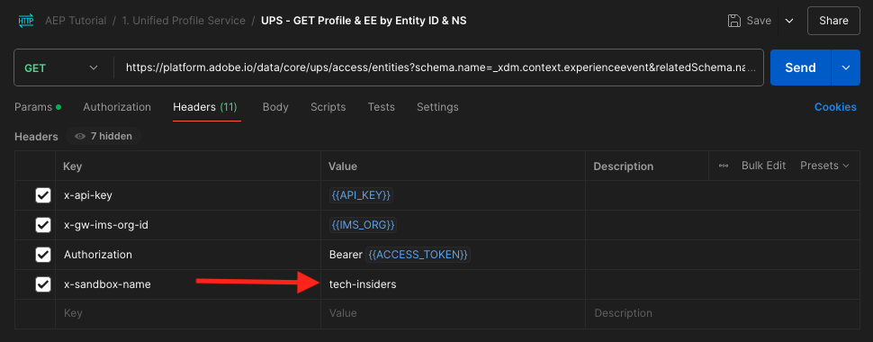

# 2.1.3 Visualiser votre propre profil client en temps réel - API

Au cours de cet exercice, vous utiliserez Postman et Adobe I/O pour interroger les API de Adobe Experience Platform afin d’afficher votre propre profil client en temps réel.

## Histoire

Dans Real-time Customer Profile, toutes les données de profil s’affichent avec les données d’événement, ainsi que les appartenances à des segments existants. Les données affichées peuvent provenir de n’importe où, des applications d’Adobe et des solutions externes. Il s’agit de la vue la plus puissante de Adobe Experience Platform, le système d’enregistrement d’expérience.

Le profil client en temps réel peut être utilisé par toutes les applications d’Adobe, mais également par des solutions externes comme les centres d’appels ou les applications client en magasin. Pour ce faire, connectez ces solutions externes aux API Adobe Experience Platform.

## 2.1.3.1 Vos identifiants

Dans le panneau Visionneuse de profils du site web, vous pouvez trouver plusieurs identités. Chaque identité est liée à un espace de noms.


Dans le panneau des rayons X, nous pouvons voir 4 combinaisons différentes d’identifiants et d’espaces de noms :

| Identité | Espace de noms |
|:-------------:| :---------------:|
| Identifiant Experience Cloud (ECID) | 12507560687324495704459439363261812234 |
| Email ID | woutervangeluwe+06022022-01@gmail.com |
| Identifiant du numéro de mobile | +32473622044+06022022-01 |

N’oubliez pas ces identifiants pour l’étape suivante.

En gardant ces identifiants à l’esprit, accédez à Postman.

## 2.1.3.2 Configuration de votre projet Adobe I/O

Dans cet exercice, vous utiliserez l’Adobe I/O de manière très intensive pour effectuer des requêtes sur les API de Platform. Suivez les étapes ci-dessous pour configurer l’Adobe I/O.

Accédez à [https://developer.adobe.com/console/home](https://developer.adobe.com/console/home)


Veillez à sélectionner l’instance Adobe Experience Platform appropriée dans le coin supérieur droit de votre écran. Votre instance est `--envName--`.


Cliquez sur **Créer un projet**.

 ou


Sélectionnez **+ Ajouter au projet** et sélectionnez **API**.


Vous verrez alors :


Cliquez sur l’icône **Adobe Experience Platform** .
/images/api2.png)

Cliquez sur **API Experience Platform**.


Cliquez sur **Suivant**.


Vous pouvez désormais choisir de faire en sorte qu’Adobe I/O génère votre paire de clés de sécurité ou de télécharger une paire existante.

Sélectionnez **Option 1 - Générer une paire de clés**.


Cliquez sur **Générer la paire de clés**.


Vous verrez un compteur pendant environ 30 secondes.


Vous verrez alors ceci, et votre paire de clés générée sera téléchargée sous la forme d’un fichier zip : **config.zip**.

Décompressez le fichier **config.zip** sur votre bureau. Il contient 2 fichiers :


- **certificate_pub.crt** est votre certificat de clé publique. Du point de vue de la sécurité, il s’agit du certificat librement utilisé pour configurer des intégrations à des applications en ligne.
- **private.key** est votre clé privée. Ça ne devrait jamais, jamais être partagé avec qui que ce soit. La clé privée est ce que vous utilisez pour vous authentifier à votre implémentation d’API et est censée être un secret. Si vous partagez votre clé privée avec n’importe qui, il peut accéder à votre implémentation et utiliser l’API pour ingérer des données malveillantes dans Platform et extraire toutes les données qui se trouvent dans Platform.


Veillez à enregistrer le fichier **config.zip** dans un emplacement sécurisé, car vous en aurez besoin pour les étapes suivantes et pour un accès futur aux API Adobe I/O et Adobe Experience Platform.

Cliquez sur **Suivant**.


Vous devez maintenant sélectionner le **profil(s) produit(s)** pour votre intégration.

Sélectionnez les profils de produit requis.

**FYI** : dans votre instance Adobe Experience Platform, les profils de produit auront un nom différent. Vous devez sélectionner au moins un profil de produit avec les droits d’accès appropriés, qui sont configurés dans Adobe Admin Console.


Cliquez sur **Enregistrer l’API configurée**.


Vous verrez un compteur pendant quelques secondes.


Et ensuite, vous verrez votre intégration.


Cliquez sur le bouton **Télécharger pour Postman** , puis sur **Compte de service (JWT)** pour télécharger un environnement Postman (attendez que l’environnement soit téléchargé, ce qui peut prendre quelques secondes).


Faites défiler l’écran jusqu’à ce que vous voyiez **Compte de service (JWT)**, où vous trouverez tous les détails de votre intégration utilisés pour configurer l’intégration avec Adobe Experience Platform.


Votre projet d’E/S a actuellement un nom générique. Vous devez donner un nom convivial à votre intégration. Cliquez sur **Projet 1** (ou un nom similaire) comme indiqué


Cliquez sur **Modifier le projet**.


Saisissez un nom et une description pour votre intégration. Par convention, nous utiliserons `AEP API --aepUserLdap--`. Remplacez ldap par votre ldap.
Par exemple, si votre ldap est vangeluw, le nom et la description de votre intégration deviennent vangeluw de l’API AEP.

Saisissez `AEP API --aepUserLdap--` comme **Titre du projet**. Cliquez sur **Enregistrer**.


L’intégration de votre Adobe I/O est maintenant terminée.


## 2.1.3.3 Authentification Postman à Adobe I/O

Accédez à [https://www.getpostman.com/](https://www.getpostman.com/).

Cliquez sur **Commencer**.


Ensuite, téléchargez et installez Postman.


Après l’installation de Postman, démarrez l’application.

Dans Postman, il existe deux concepts : Environnements et Collections.

- L’environnement contient toutes vos variables d’environnement qui sont plus ou moins cohérentes. Dans l’environnement, vous trouverez des éléments tels que l’IMSOrg de notre environnement Platform, ainsi que des informations d’identification de sécurité telles que votre clé privée et d’autres. Le fichier d’environnement est celui que vous avez téléchargé lors de la configuration de l’Adobe I/O dans l’exercice précédent. Il s’appelle comme suit : **service.postman_environment.json**.

- La collection contient un certain nombre de requêtes d’API que vous pouvez utiliser. Nous utiliserons 2 collections
   - 1 collection pour l’authentification pour Adobe I/0
   - 1 Collection pour les exercices de ce module
   - 1 collection pour les exercices dans le module Real-Time CDP, pour la création de destination

Téléchargez le fichier [postman.zip](./../../../assets/postman/postman_profile.zip) sur votre bureau local.

Dans ce fichier **postman.zip**, vous trouverez les fichiers suivants :

- `_Adobe I-O - Token.postman_collection.json`
- `_Adobe Experience Platform Enablement.postman_collection.json`
- `Destination_Authoring_API.json`

Décompressez le fichier **postman.zip** et stockez ces 3 fichiers dans un dossier sur votre bureau, ainsi que dans l’environnement Postman téléchargé depuis Adobe I/O. Ce dossier doit contenir les 4 fichiers suivants :


Revenez à Postman. Cliquez sur **Importer**.


Cliquez sur **Télécharger des fichiers**.


Accédez au dossier de votre bureau dans lequel vous avez extrait les 4 fichiers téléchargés. Sélectionnez ces 4 fichiers en même temps et cliquez sur **Ouvrir**.


Après avoir cliqué sur **Ouvrir**, Postman vous présente un aperçu de l’environnement et des collections que vous êtes sur le point d’importer. Cliquez sur **Importer**.


Vous avez désormais tout ce dont vous avez besoin dans Postman pour commencer à interagir avec Adobe Experience Platform par le biais des API.

La première chose à faire est de vous assurer que vous êtes correctement authentifié. Pour être authentifié, vous devez demander un jeton d’accès.

Assurez-vous que l’environnement approprié est sélectionné avant d’exécuter une requête. Vous pouvez vérifier l’environnement actuellement sélectionné en vérifiant la liste déroulante Environnement dans le coin supérieur droit.

L’environnement sélectionné doit porter un nom similaire à celui-ci :


Cliquez sur l’icône **eye** , puis sur **Modifier** pour mettre à jour la clé privée dans le fichier d’environnement.


Vous verrez alors ceci. Tous les champs sont prérenseignés, à l’exception du champ **PRIVATE_KEY**.


La clé privée a été générée lorsque vous avez créé votre projet Adobe I/O. Il a été téléchargé sous la forme d’un fichier zip, nommé **config.zip**. Extrayez ce fichier zip sur votre bureau.


Ouvrez le dossier **config** et ouvrez le fichier **private.key** avec votre éditeur de texte de votre choix.


Vous verrez alors quelque chose qui ressemble à ça, copiez tout le texte dans le presse-papiers.


Revenez à Postman et collez la clé privée dans les champs en regard de la variable **PRIVATE_KEY**, pour les colonnes **VALEUR INITIALE** et **VALEUR ACTUELLE**. Cliquez sur **Enregistrer**.


Votre environnement et vos collections Postman sont maintenant configurés et fonctionnent. Vous pouvez désormais vous authentifier de Postman vers Adobe I/O.

Pour ce faire, vous devez charger une bibliothèque externe qui prendra en charge le cryptage et le décryptage de la communication. Pour charger cette bibliothèque, vous devez exécuter la requête avec le nom **INIT: Load Crypto Library for RS256**. Sélectionnez cette requête dans la **_Adobe I/O - collection de jetons** et elle s’affichera au milieu de votre écran.


Cliquez sur le bouton bleu **Send** . Au bout de quelques secondes, une réponse devrait s’afficher dans la section **Body** de Postman :


Une fois la bibliothèque de cryptage chargée, nous pouvons nous authentifier sur Adobe I/O.

Dans la **\_Adobe I/O - Collection de jetons**, sélectionnez la requête avec le nom **IMS: JWT Generate + Auth**. Là encore, les détails de la requête s’affichent au milieu de l’écran.


Cliquez sur le bouton bleu **Send** . Au bout de quelques secondes, une réponse devrait s’afficher dans la section **Body** de Postman :


Si votre configuration a réussi, vous devriez voir une réponse similaire contenant les informations suivantes :

| Clé | Valeur |
|:-------------:| :---------------:| 
| token_type | **bearer** |
| access_token | **eyJ4NXUiOiJpbXNfbmEx...QT7mqZkumN1tdsPEioOEl4087Dg** |
| expires_in | **86399973** |

Adobe I/O vous a donné un jeton **porteur**, avec une valeur spécifique (ce jeton d’accès très long) et une fenêtre d’expiration.

Le jeton que nous avons reçu est maintenant valide pendant 24 heures. Cela signifie qu’au bout de 24 heures, si vous souhaitez utiliser Postman pour vous authentifier sur Adobe I/O, vous devrez générer un nouveau jeton en exécutant à nouveau cette requête.

## 2.1.3.4 API Real-time Customer Profile, schéma : profil

Vous pouvez maintenant envoyer votre première requête aux API Real-time Customer Profile de Platform.

Dans Postman, recherchez la collection **_Adobe Experience Platform Enablement**.


Dans **1. Unified Profile Service**, sélectionnez la première requête avec le nom **UPS - GET Profile by Entity ID &amp; NS**.


Pour cette requête, trois variables sont requises :

| Clé | Valeur | Définition |
|:-------------:| :---------------:| :---------------:| 
| entityId | **identifiant** | l’ID de client spécifique ; |
| entityIdNS | **espace de noms** | l’espace de noms spécifique qui s’applique à l’ID ; |
| schema.name | **_xdm.context.profile** | le schéma spécifique pour lequel vous souhaitez recevoir des informations ; |

Ainsi, si vous souhaitez demander aux API Adobe Experience Platform de vous renvoyer toutes les informations de profil pour votre propre ECID, vous devez configurer la requête comme suit :

| Clé | Valeur |
|:-------------:| :---------------:| 
| entityId | **yourECID** |
| entityIdNS | **ecid** |
| schema.name | **_xdm.context.profile** |


Vous devez également vérifier les champs **Header** - de votre requête. Accédez à **En-têtes**. Vous verrez alors :


| Clé | Valeur |
| ----------- | ----------- |
| x-sandbox-name | `--aepSandboxName--` |

>[!NOTE]
>
>Vous devez spécifier le nom de l’environnement de test Adobe Experience Platform que vous utilisez. Votre x-sandbox-name doit être `--aepSandboxName--`.

Cliquez sur **Envoyer** pour envoyer votre demande à Platform.

Vous devriez obtenir une réponse immédiate de Platform, qui vous montre quelque chose comme ceci :


Voici la réponse complète de Platform :

```javascript
{
    "A28iM3aJBJRbEQpOnUh5HOM9": {
        "entityId": "A28iM3aJBJRbEQpOnUh5HOM9",
        "mergePolicy": {
            "id": "e632ccb8-882a-4b5e-8375-96a1ba3df1aa"
        },
        "sources": [
            "61fe23c5be4b5f19485dc379",
            "profile-streaming-segment",
            "61fe23cfa07c1219489b3ba4"
        ],
        "tags": [
            "1644130566774:1542:232:va7",
            "0a1e9dd4-940a-46ec-9114-7e371cf5c4d0",
            "aep_ups_partitioned_profile_cdc_low_lag_sla_0:106:1090888313",
            "a6fed09e-2c56-403e-8692-4e99e4779dfa:IRL1",
            "1644419616318:2989:31:va7",
            "aep_ups_profile_change_event_prod_va7:71:7946633524-8361f22c-c09e-4364-b24b-b57435c4d14f"
        ],
        "identityGraph": [
            "BUF9zMKLrXq72p4HpbsHv1SSBnr0LTAxQGdtYWlsLmNvbQ",
            "GkicrkFjgmCjUg",
            "GtCbrkFjgkSOFg",
            "A2-AP9zOsakzNTe9Rqwf7Wse",
            "BkFuK4QcJpSPByuSBnr0LTAx",
            "A28jSB484ziuECF3fEoXmFlF",
            "A28iM3aJBJRbEQpOnUh5HOM9"
        ],
        "entity": {
            "_experienceplatform": {
                "individualCharacteristics": {},
                "loyaltyDetails": {
                    "level": "Basic",
                    "points": 0
                },
                "identification": {
                    "core": {
                        "phoneNumber": "+32473622044+06022022-01",
                        "email": "woutervangeluwe+06022022-01@gmail.com",
                        "loyaltyId": "5415776",
                        "ecid": "12019606991718502754997192487345616673",
                        "crmId": "1478212"
                    }
                }
            },
            "personalEmail": {
                "address": "woutervangeluwe+06022022-01@gmail.com"
            },
            "_repo": {
                "createDate": "2022-02-06T06:56:06.424Z"
            },
            "testProfile": true,
            "homeAddress": {
                "postalCode": "1831",
                "city": "Diegem",
                "street1": "Culliganlaan 2F"
            },
            "mobilePhone": {
                "number": "+32473622044+06022022-01"
            },
            "segmentMembership": {
                "ups": {
                    "bc999ded-b6d7-40d4-87a7-d3a280b950e3": {
                        "lastQualificationTime": "2022-02-09T20:38:33Z",
                        "status": "exited"
                    },
                    "23b1cd4e-d62f-44bd-8392-3095a33109c4": {
                        "lastQualificationTime": "2022-02-09T20:38:33Z",
                        "status": "exited"
                    },
                    "f0807704-a1c8-4ac4-85dd-60db2fbf18f1": {
                        "lastQualificationTime": "2022-02-09T20:38:33Z",
                        "status": "existing"
                    }
                }
            },
            "person": {
                "name": {
                    "lastName": "Van Geluwe",
                    "firstName": "Wouter"
                },
                "gender": "female",
                "birthDate": "1982-07-08"
            },
            "userActivityRegions": {
                "IRL1": {
                    "captureTimestamp": "2022-02-09T15:21:11Z"
                }
            },
            "identityMap": {
                "email": [
                    {
                        "id": "woutervangeluwe+06022022-01@gmail.com"
                    }
                ],
                "crmid": [
                    {
                        "id": "1478212"
                    }
                ],
                "ecid": [
                    {
                        "id": "12507560687324495704459439363261812234"
                    },
                    {
                        "id": "12019606991718502754997192487345616673"
                    },
                    {
                        "id": "38335942889672702722192106363935964471"
                    }
                ],
                "phone": [
                    {
                        "id": "+32473622044+06022022-01"
                    }
                ],
                "loyaltyid": [
                    {
                        "id": "5415776"
                    }
                ]
            }
        },
        "lastModifiedAt": "2022-02-09T20:38:36Z"
    }
}
```

Il s’agit actuellement de toutes les données de profil disponibles dans Platform pour cet ECID.

Vous n’êtes pas tenu d’utiliser l’ECID pour demander des données de profil auprès du profil client en temps réel de Platform. Vous pouvez utiliser n’importe quel identifiant dans n’importe quel espace de noms pour demander ces données.

Revenons à Postman et prétendons que nous sommes le centre d’appel, et envoyons une demande à Platform spécifiant l’espace de noms **Phone** et votre numéro de mobile.

Ainsi, si vous souhaitez demander aux API de Platform de vous renvoyer toutes les informations de profil pour un téléphone spécifique, vous devez configurer la requête comme suit :

| Clé | Valeur |
|:-------------:| :---------------:| 
| entityId | **votre numéro de téléphone** |
| entityIdNS | **phone** (remplacez ecid par phone) |
| schema.name | **_xdm.context.profile** |

Si votre numéro de téléphone contient des symboles spéciaux tels que **+**, vous devez sélectionner votre numéro de téléphone complet, cliquer avec le bouton droit de la souris et cliquer sur **EncodeURIComponent**.


Vous obtiendrez alors ce qui suit :



Vous devez également vérifier les champs **Header** - de votre requête. Accédez à **En-têtes**. Vous verrez alors :


| Clé | Valeur |
| ----------- | ----------- |
| x-sandbox-name | `--aepSandboxName--` |

>[!NOTE]
>
>Vous devez spécifier le nom de l’environnement de test Adobe Experience Platform que vous utilisez. Votre x-sandbox-name doit être `--aepSandboxName--`.

Cliquez sur le bouton bleu **Send** et vérifiez la réponse.


Faisons la même chose pour votre adresse électronique en spécifiant l’espace de noms **email** et votre adresse électronique.

Ainsi, si vous souhaitez demander aux API de Platform de vous renvoyer toutes les informations de profil pour une adresse électronique spécifique, vous devez configurer la requête comme suit :

| Clé | Valeur |
|:-------------:| :---------------:| 
| entityId | **youremail** |
| entityIdNS | **email** (remplacer Téléphone par email) |
| schema.name | **_xdm.context.profile** |

Si votre adresse électronique contient des symboles spéciaux tels que **+**, vous devez sélectionner votre adresse électronique complète, cliquer avec le bouton droit de la souris et cliquer sur **EncodeURIComponent**.


Vous obtiendrez alors ce qui suit :


Vous devez également vérifier les champs **Header** - de votre requête. Accédez à **En-têtes**. Vous verrez alors :


| Clé | Valeur |
| ----------- | ----------- |
| x-sandbox-name | `--aepSandboxName--` |

>[!NOTE]
>
>Vous devez spécifier le nom de l’environnement de test Adobe Experience Platform que vous utilisez. Votre x-sandbox-name doit être `--aepSandboxName--`.

Cliquez sur le bouton bleu **Send** et vérifiez la réponse.


C&#39;est un type de flexibilité très important qui est offert aux marques. Cela signifie que tout environnement peut envoyer une requête à Platform, à l’aide de son propre ID et de son propre espace de noms, sans avoir à comprendre la complexité de plusieurs espaces de noms et ID.

Par exemple :

- Le centre d’appels demandera des données à Platform à l’aide de l’espace de noms **phone**
- Loyalty System va demander des données à Platform à l’aide de l’espace de noms **email**
- les applications en ligne peuvent utiliser l’espace de noms **ecid**

Le centre d’appels ne sait pas nécessairement quel type d’identifiant est utilisé dans le système de fidélité et le système de fidélité ne sait pas nécessairement quel type d’identifiant est utilisé par les applications en ligne. Chaque système peut utiliser les informations qu&#39;il a et qu&#39;il comprend pour obtenir les informations dont il a besoin, quand il en a besoin.

## 2.1.3.5 API Real-time Customer Profile, schéma : Profile et ExperienceEvent

Après avoir interrogé les API de Platform avec succès pour les données de profil, faisons maintenant de même avec les données ExperienceEvent.

Dans Postman, recherchez la collection **_Adobe Experience Platform Enablement**.


Dans **1. Unified Profile Service**, sélectionnez la seconde requête avec le nom **UPS - GET Profile &amp; EE par Entity ID &amp; NS**.


Pour cette requête, il existe quatre variables requises :

| Clé | Valeur | Définition |
|:-------------:| :---------------:|  :---------------:| 
| schema.name | **_xdm.context.experienceevent** | le schéma spécifique pour lequel vous souhaitez recevoir des informations. Dans ce cas, nous recherchons des données mappées sur le schéma ExperienceEvent. |
| relatedSchema.name | **_xdm.context.profile** | Lors de la recherche de données mappées sur le schéma ExperienceEvent, nous devons spécifier une identité pour laquelle nous voulons recevoir ces données. Le schéma qui a accès à l’identité est le schéma-profil, de sorte que le schéma-associé ici est le schéma-profil. |
| relatedEntityId | **identifiant** | ID de client spécifique |
| relatedEntityIdNS | **espace de noms** | l’espace de noms spécifique qui s’applique à l’ID ; |

Ainsi, si vous souhaitez demander aux API de Platform de vous renvoyer toutes les informations de profil pour votre propre ecid, vous devez configurer la requête comme suit :

| Clé | Valeur |
|:-------------:| :---------------:| 
| schema.name | **_xdm.context.experienceevent** |
| relatedSchema.name | **_xdm.context.profile** |
| relatedEntityId | **yourECID** |
| relatedEntityIdNS | **ecid** |


Vous devez également vérifier les champs **Header** - de votre requête. Accédez à **En-têtes**. Vous verrez alors :



| Clé | Valeur |
| ----------- | ----------- |
| x-sandbox-name | `--aepSandboxName--` |

>[!NOTE]
>
>Vous devez spécifier le nom de l’environnement de test Adobe Experience Platform que vous utilisez. Votre x-sandbox-name doit être `--aepSandboxName--`.

Cliquez sur **Envoyer** pour envoyer votre demande à Platform.

Vous devriez obtenir une réponse immédiate de Platform, qui vous montre quelque chose comme ceci :


Vous trouverez ci-dessous la réponse complète de Platform. Dans cet exemple, huit ExperienceEvent sont liés à l’ECID de ce client. Consultez les variables ci-dessous pour afficher les différentes variables sur la requête, car ce que vous voyez ci-dessous est la conséquence directe de votre configuration dans Launch dans les exercices précédents.

En outre, lorsque le panneau de rayons X affiche des informations ExperienceEvent, il utilise la payload ci-dessous pour analyser et récupérer les informations telles que Nom du produit (rechercher productName dans la payload ci-dessous) et URL de l’image du produit (rechercher productImageUrl dans la payload ci-dessous).

```javascript
{
    "_page": {
        "orderby": "timestamp",
        "start": "d686ab8a-2d0c-4722-9ff5-bfc1020b0b55-0",
        "count": 31,
        "next": ""
    },
    "children": [
        {
            "relatedEntityId": "A28iM3aJBJRbEQpOnUh5HOM9",
            "entityId": "d686ab8a-2d0c-4722-9ff5-bfc1020b0b55-0",
            "timestamp": 1644127126596,
            "entity": {
                "environment": {
                    "ipV4": "213.118.129.117",
                    "type": "browser",
                    "browserDetails": {
                        "viewportHeight": 969,
                        "viewportWidth": 1920,
                        "userAgent": "Mozilla/5.0 (Macintosh; Intel Mac OS X 10_15_7) AppleWebKit/537.36 (KHTML, like Gecko) Chrome/98.0.4758.80 Safari/537.36"
                    }
                },
                "web": {
                    "webPageDetails": {
                        "pageViews": {
                            "value": 1
                        },
                        "name": "vangeluw-OCUC",
                        "URL": "https://builder.adobedemo.com/run/vangeluw-OCUC"
                    },
                    "webReferrer": {
                        "URL": "https://adobe.okta.com/"
                    }
                },
                "_experienceplatform": {
                    "interactionDetails": {
                        "core": {
                            "channel": "web"
                        }
                    },
                    "demoEnvironment": {
                        "brandName": "vangeluw-OCUC"
                    },
                    "identification": {
                        "core": {
                            "ecid": "12507560687324495704459439363261812234"
                        }
                    }
                },
                "implementationDetails": {
                    "name": "https://ns.adobe.com/experience/alloy/reactor",
                    "version": "2.8.0+2.9.0",
                    "environment": "browser"
                },
                "identityMap": {
                    "ECID": [
                        {
                            "id": "12507560687324495704459439363261812234",
                            "authenticatedState": "ambiguous",
                            "primary": true
                        }
                    ]
                },
                "eventType": "web.webpagedetails.pageViews",
                "_id": "d686ab8a-2d0c-4722-9ff5-bfc1020b0b55-0",
                "placeContext": {
                    "localTime": "2022-02-06T06:58:46.596+01:00",
                    "localTimezoneOffset": -60
                },
                "device": {
                    "screenOrientation": "landscape",
                    "screenWidth": 1920,
                    "screenHeight": 1080
                },
                "timestamp": "2022-02-06T05:58:46.596Z"
            },
            "lastModifiedAt": "2022-02-06T05:59:48Z"
        },
        {
            "relatedEntityId": "A28iM3aJBJRbEQpOnUh5HOM9",
            "entityId": "919a46bf-a591-4c32-9201-b72250d5f5d9-0",
            "timestamp": 1644127129876,
            "entity": {
                "environment": {
                    "ipV4": "213.118.129.117",
                    "type": "browser",
                    "browserDetails": {
                        "viewportHeight": 969,
                        "viewportWidth": 1920,
                        "userAgent": "Mozilla/5.0 (Macintosh; Intel Mac OS X 10_15_7) AppleWebKit/537.36 (KHTML, like Gecko) Chrome/98.0.4758.80 Safari/537.36"
                    }
                },
                "web": {
                    "webPageDetails": {
                        "pageViews": {
                            "value": 1
                        },
                        "name": "vangeluw-OCUC#",
                        "URL": "https://builder.adobedemo.com/run/vangeluw-OCUC#"
                    },
                    "webReferrer": {
                        "URL": "https://adobe.okta.com/"
                    }
                },
                "_experienceplatform": {
                    "interactionDetails": {
                        "core": {
                            "channel": "web"
                        }
                    },
                    "demoEnvironment": {
                        "brandName": "vangeluw-OCUC"
                    },
                    "identification": {
                        "core": {
                            "ecid": "12507560687324495704459439363261812234"
                        }
                    }
                },
                "implementationDetails": {
                    "name": "https://ns.adobe.com/experience/alloy/reactor",
                    "version": "2.8.0+2.9.0",
                    "environment": "browser"
                },
                "identityMap": {
                    "ECID": [
                        {
                            "id": "12507560687324495704459439363261812234",
                            "authenticatedState": "ambiguous",
                            "primary": true
                        }
                    ]
                },
                "eventType": "web.webpagedetails.pageViews",
                "_id": "919a46bf-a591-4c32-9201-b72250d5f5d9-0",
                "placeContext": {
                    "localTime": "2022-02-06T06:58:49.876+01:00",
                    "localTimezoneOffset": -60
                },
                "device": {
                    "screenOrientation": "landscape",
                    "screenWidth": 1920,
                    "screenHeight": 1080
                },
                "timestamp": "2022-02-06T05:58:49.876Z"
            },
            "lastModifiedAt": "2022-02-06T05:59:48Z"
        },
        {
            "relatedEntityId": "A28iM3aJBJRbEQpOnUh5HOM9",
            "entityId": "41a80489-00d4-446c-b456-8cb19c3f309a-0",
            "timestamp": 1644130597134,
            "entity": {
                "environment": {
                    "ipV4": "213.118.129.117",
                    "type": "browser",
                    "browserDetails": {
                        "viewportHeight": 1001,
                        "viewportWidth": 1920,
                        "userAgent": "Mozilla/5.0 (Macintosh; Intel Mac OS X 10_15_7) AppleWebKit/537.36 (KHTML, like Gecko) Chrome/98.0.4758.80 Safari/537.36"
                    }
                },
                "web": {
                    "webPageDetails": {
                        "pageViews": {
                            "value": 1
                        },
                        "name": "login",
                        "URL": "https://builder.adobedemo.com/run/vangeluw-OCUC/login"
                    },
                    "webReferrer": {
                        "URL": "https://builder.adobedemo.com/run/vangeluw-OCUC/login"
                    }
                },
                "_experienceplatform": {
                    "interactionDetails": {
                        "core": {
                            "channel": "web"
                        }
                    },
                    "demoEnvironment": {
                        "brandName": "vangeluw-OCUC"
                    },
                    "identification": {
                        "core": {
                            "ecid": "12507560687324495704459439363261812234"
                        }
                    }
                },
                "implementationDetails": {
                    "name": "https://ns.adobe.com/experience/alloy/reactor",
                    "version": "2.8.0+2.9.0",
                    "environment": "browser"
                },
                "identityMap": {
                    "ECID": [
                        {
                            "id": "12507560687324495704459439363261812234",
                            "authenticatedState": "ambiguous",
                            "primary": true
                        }
                    ]
                },
                "eventType": "web.webpagedetails.pageViews",
                "_id": "41a80489-00d4-446c-b456-8cb19c3f309a-0",
                "placeContext": {
                    "localTime": "2022-02-06T07:56:37.134+01:00",
                    "localTimezoneOffset": -60
                },
                "device": {
                    "screenOrientation": "landscape",
                    "screenWidth": 1920,
                    "screenHeight": 1080
                },
                "timestamp": "2022-02-06T06:56:37.134Z"
            },
            "lastModifiedAt": "2022-02-06T06:56:38Z"
        },
        {
            "relatedEntityId": "A28jSB484ziuECF3fEoXmFlF",
            "entityId": "8ACC7B6C-2320-4865-B414-3B0CFA01F628",
            "timestamp": 1644419615000,
            "entity": {
                "environment": {
                    "ipV4": "213.118.129.117",
                    "browserDetails": {
                        "userAgent": "Mozilla/5.0 (iPhone; CPU OS 15_3 like Mac OS X; en_BE)"
                    }
                },
                "eventType": "application.login",
                "_id": "8ACC7B6C-2320-4865-B414-3B0CFA01F628",
                "_experienceplatform": {
                    "interactionDetails": {
                        "core": {
                            "channel": "mobile"
                        }
                    },
                    "demoEnvironment": {
                        "brandName": "vangeluw-2L6V"
                    },
                    "identification": {
                        "core": {
                            "ecid": "12019606991718502754997192487345616673",
                            "email": "woutervangeluwe+06022022-01@gmail.com"
                        }
                    }
                },
                "timestamp": "2022-02-09T15:13:35Z",
                "identityMap": {
                    "ECID": [
                        {
                            "id": "12019606991718502754997192487345616673",
                            "authenticatedState": "ambiguous",
                            "primary": true
                        }
                    ]
                }
            },
            "lastModifiedAt": "2022-02-09T15:13:38Z"
        },
        {
            "relatedEntityId": "A28jSB484ziuECF3fEoXmFlF",
            "entityId": "54F68CE5-E9E1-4AD0-91B1-7B607A9285C4",
            "timestamp": 1644419658000,
            "entity": {
                "environment": {
                    "ipV4": "213.118.129.117",
                    "browserDetails": {
                        "userAgent": "Mozilla/5.0 (iPhone; CPU OS 15_3 like Mac OS X; en_BE)"
                    }
                },
                "_experienceplatform": {
                    "interactionDetails": {
                        "core": {
                            "channel": "mobile"
                        }
                    },
                    "demoEnvironment": {
                        "brandName": "vangeluw-2L6V"
                    },
                    "identification": {
                        "core": {
                            "ecid": "12019606991718502754997192487345616673"
                        }
                    }
                },
                "identityMap": {
                    "ECID": [
                        {
                            "id": "12019606991718502754997192487345616673",
                            "authenticatedState": "ambiguous",
                            "primary": true
                        }
                    ]
                },
                "eventType": "commerce.productViews",
                "_id": "54F68CE5-E9E1-4AD0-91B1-7B607A9285C4",
                "commerce": {
                    "productViews": {
                        "value": 1
                    }
                },
                "productListItems": [
                    {
                        "quantity": 1,
                        "productAddMethod": "Mobile",
                        "_experienceplatform": {
                            "core": {
                                "mainCategory": "Women",
                                "productURL": "product1",
                                "imageURL": "https://contentviewer.s3.amazonaws.com/helium/wh08-white_main.jpg"
                            }
                        },
                        "priceTotal": 42,
                        "name": "Cassia Funnel Sweatshirt",
                        "SKU": "product1",
                        "currencyCode": "USD"
                    }
                ],
                "timestamp": "2022-02-09T15:14:18Z"
            },
            "lastModifiedAt": "2022-02-09T15:14:21Z"
        },
        {
            "relatedEntityId": "A2-AP9zOsakzNTe9Rqwf7Wse",
            "entityId": "bfe26684-bc3b-40c5-9fe5-5aba854c3227-0",
            "timestamp": 1644420036035,
            "entity": {
                "environment": {
                    "ipV4": "193.105.139.131",
                    "type": "browser",
                    "browserDetails": {
                        "viewportHeight": 969,
                        "viewportWidth": 1920,
                        "userAgent": "Mozilla/5.0 (Macintosh; Intel Mac OS X 10_15_7) AppleWebKit/537.36 (KHTML, like Gecko) Chrome/98.0.4758.80 Safari/537.36"
                    }
                },
                "web": {
                    "webPageDetails": {
                        "pageViews": {
                            "value": 1
                        },
                        "name": "vangeluw-OCUC",
                        "URL": "https://builder.adobedemo.com/run/vangeluw-OCUC"
                    },
                    "webReferrer": {
                        "URL": "https://adobe.okta.com/"
                    }
                },
                "_experienceplatform": {
                    "interactionDetails": {
                        "core": {
                            "channel": "web"
                        }
                    },
                    "demoEnvironment": {
                        "brandName": "vangeluw-OCUC"
                    },
                    "identification": {
                        "core": {
                            "ecid": "38335942889672702722192106363935964471"
                        }
                    }
                },
                "implementationDetails": {
                    "name": "https://ns.adobe.com/experience/alloy/reactor",
                    "version": "2.8.0+2.9.0",
                    "environment": "browser"
                },
                "identityMap": {
                    "ECID": [
                        {
                            "id": "38335942889672702722192106363935964471",
                            "authenticatedState": "ambiguous",
                            "primary": true
                        }
                    ]
                },
                "eventType": "web.webpagedetails.pageViews",
                "_id": "bfe26684-bc3b-40c5-9fe5-5aba854c3227-0",
                "placeContext": {
                    "localTime": "2022-02-09T16:20:36.035+01:00",
                    "localTimezoneOffset": -60
                },
                "device": {
                    "screenOrientation": "landscape",
                    "screenWidth": 1920,
                    "screenHeight": 1080
                },
                "timestamp": "2022-02-09T15:20:36.035Z"
            },
            "lastModifiedAt": "2022-02-09T15:20:39Z"
        },
        {
            "relatedEntityId": "A2-AP9zOsakzNTe9Rqwf7Wse",
            "entityId": "0480c434-8fcd-4a80-b298-c561276ac989-0",
            "timestamp": 1644420037078,
            "entity": {
                "environment": {
                    "ipV4": "193.105.139.131",
                    "type": "browser",
                    "browserDetails": {
                        "viewportHeight": 969,
                        "viewportWidth": 1920,
                        "userAgent": "Mozilla/5.0 (Macintosh; Intel Mac OS X 10_15_7) AppleWebKit/537.36 (KHTML, like Gecko) Chrome/98.0.4758.80 Safari/537.36"
                    }
                },
                "web": {
                    "webPageDetails": {
                        "pageViews": {
                            "value": 1
                        },
                        "name": "vangeluw-OCUC#",
                        "URL": "https://builder.adobedemo.com/run/vangeluw-OCUC#"
                    },
                    "webReferrer": {
                        "URL": "https://adobe.okta.com/"
                    }
                },
                "_experienceplatform": {
                    "interactionDetails": {
                        "core": {
                            "channel": "web"
                        }
                    },
                    "demoEnvironment": {
                        "brandName": "vangeluw-OCUC"
                    },
                    "identification": {
                        "core": {
                            "ecid": "38335942889672702722192106363935964471"
                        }
                    }
                },
                "implementationDetails": {
                    "name": "https://ns.adobe.com/experience/alloy/reactor",
                    "version": "2.8.0+2.9.0",
                    "environment": "browser"
                },
                "identityMap": {
                    "ECID": [
                        {
                            "id": "38335942889672702722192106363935964471",
                            "authenticatedState": "ambiguous",
                            "primary": true
                        }
                    ]
                },
                "eventType": "web.webpagedetails.pageViews",
                "_id": "0480c434-8fcd-4a80-b298-c561276ac989-0",
                "placeContext": {
                    "localTime": "2022-02-09T16:20:37.078+01:00",
                    "localTimezoneOffset": -60
                },
                "device": {
                    "screenOrientation": "landscape",
                    "screenWidth": 1920,
                    "screenHeight": 1080
                },
                "timestamp": "2022-02-09T15:20:37.078Z"
            },
            "lastModifiedAt": "2022-02-09T15:20:39Z"
        },
        {
            "relatedEntityId": "A2-AP9zOsakzNTe9Rqwf7Wse",
            "entityId": "6b1b3983-6966-4551-a711-6b6e410fd819-0",
            "timestamp": 1644420045993,
            "entity": {
                "environment": {
                    "ipV4": "193.105.139.131",
                    "type": "browser",
                    "browserDetails": {
                        "viewportHeight": 969,
                        "viewportWidth": 1920,
                        "userAgent": "Mozilla/5.0 (Macintosh; Intel Mac OS X 10_15_7) AppleWebKit/537.36 (KHTML, like Gecko) Chrome/98.0.4758.80 Safari/537.36"
                    }
                },
                "web": {
                    "webPageDetails": {
                        "pageViews": {
                            "value": 1
                        },
                        "name": "login",
                        "URL": "https://builder.adobedemo.com/run/vangeluw-OCUC/login"
                    },
                    "webReferrer": {
                        "URL": "https://adobe.okta.com/"
                    }
                },
                "_experienceplatform": {
                    "interactionDetails": {
                        "core": {
                            "channel": "web"
                        }
                    },
                    "demoEnvironment": {
                        "brandName": "vangeluw-OCUC"
                    },
                    "identification": {
                        "core": {
                            "ecid": "38335942889672702722192106363935964471"
                        }
                    }
                },
                "implementationDetails": {
                    "name": "https://ns.adobe.com/experience/alloy/reactor",
                    "version": "2.8.0+2.9.0",
                    "environment": "browser"
                },
                "identityMap": {
                    "ECID": [
                        {
                            "id": "38335942889672702722192106363935964471",
                            "authenticatedState": "ambiguous",
                            "primary": true
                        }
                    ]
                },
                "eventType": "web.webpagedetails.pageViews",
                "_id": "6b1b3983-6966-4551-a711-6b6e410fd819-0",
                "placeContext": {
                    "localTime": "2022-02-09T16:20:45.993+01:00",
                    "localTimezoneOffset": -60
                },
                "device": {
                    "screenOrientation": "landscape",
                    "screenWidth": 1920,
                    "screenHeight": 1080
                },
                "timestamp": "2022-02-09T15:20:45.993Z"
            },
            "lastModifiedAt": "2022-02-09T15:20:47Z"
        },
        {
            "relatedEntityId": "A2-AP9zOsakzNTe9Rqwf7Wse",
            "entityId": "ae0f3551-7753-4467-8547-8fdbb66c2214-0",
            "timestamp": 1644420058565,
            "entity": {
                "environment": {
                    "ipV4": "193.105.139.131",
                    "type": "browser",
                    "browserDetails": {
                        "viewportHeight": 969,
                        "viewportWidth": 1920,
                        "userAgent": "Mozilla/5.0 (Macintosh; Intel Mac OS X 10_15_7) AppleWebKit/537.36 (KHTML, like Gecko) Chrome/98.0.4758.80 Safari/537.36"
                    }
                },
                "web": {
                    "webPageDetails": {
                        "URL": "https://builder.adobedemo.com/run/vangeluw-OCUC/home"
                    },
                    "webReferrer": {
                        "URL": "https://adobe.okta.com/"
                    }
                },
                "_experienceplatform": {
                    "interactionDetails": {
                        "core": {
                            "channel": "web"
                        }
                    },
                    "demoEnvironment": {
                        "brandName": "vangeluw-OCUC"
                    },
                    "identification": {
                        "core": {
                            "ecid": "38335942889672702722192106363935964471",
                            "email": "woutervangeluwe+06022022-01@gmail.com"
                        }
                    }
                },
                "implementationDetails": {
                    "name": "https://ns.adobe.com/experience/alloy/reactor",
                    "version": "2.8.0+2.9.0",
                    "environment": "browser"
                },
                "identityMap": {
                    "ECID": [
                        {
                            "id": "38335942889672702722192106363935964471",
                            "authenticatedState": "ambiguous",
                            "primary": true
                        }
                    ]
                },
                "eventType": "web.login",
                "_id": "ae0f3551-7753-4467-8547-8fdbb66c2214-0",
                "placeContext": {
                    "localTime": "2022-02-09T16:20:58.565+01:00",
                    "localTimezoneOffset": -60
                },
                "device": {
                    "screenOrientation": "landscape",
                    "screenWidth": 1920,
                    "screenHeight": 1080
                },
                "timestamp": "2022-02-09T15:20:58.565Z"
            },
            "lastModifiedAt": "2022-02-09T15:20:59Z"
        },
        {
            "relatedEntityId": "A2-AP9zOsakzNTe9Rqwf7Wse",
            "entityId": "5e67a9c9-b201-4e21-bd3a-4d10475f6156-0",
            "timestamp": 1644420058653,
            "entity": {
                "environment": {
                    "ipV4": "193.105.139.131",
                    "type": "browser",
                    "browserDetails": {
                        "viewportHeight": 969,
                        "viewportWidth": 1920,
                        "userAgent": "Mozilla/5.0 (Macintosh; Intel Mac OS X 10_15_7) AppleWebKit/537.36 (KHTML, like Gecko) Chrome/98.0.4758.80 Safari/537.36"
                    }
                },
                "web": {
                    "webPageDetails": {
                        "pageViews": {
                            "value": 1
                        },
                        "name": "home",
                        "URL": "https://builder.adobedemo.com/run/vangeluw-OCUC/home"
                    },
                    "webReferrer": {
                        "URL": "https://adobe.okta.com/"
                    }
                },
                "_experienceplatform": {
                    "interactionDetails": {
                        "core": {
                            "channel": "web"
                        }
                    },
                    "demoEnvironment": {
                        "brandName": "vangeluw-OCUC"
                    },
                    "identification": {
                        "core": {
                            "ecid": "38335942889672702722192106363935964471"
                        }
                    }
                },
                "implementationDetails": {
                    "name": "https://ns.adobe.com/experience/alloy/reactor",
                    "version": "2.8.0+2.9.0",
                    "environment": "browser"
                },
                "identityMap": {
                    "ECID": [
                        {
                            "id": "38335942889672702722192106363935964471",
                            "authenticatedState": "ambiguous",
                            "primary": true
                        }
                    ]
                },
                "eventType": "web.webpagedetails.pageViews",
                "_id": "5e67a9c9-b201-4e21-bd3a-4d10475f6156-0",
                "placeContext": {
                    "localTime": "2022-02-09T16:20:58.653+01:00",
                    "localTimezoneOffset": -60
                },
                "device": {
                    "screenOrientation": "landscape",
                    "screenWidth": 1920,
                    "screenHeight": 1080
                },
                "timestamp": "2022-02-09T15:20:58.653Z"
            },
            "lastModifiedAt": "2022-02-09T15:21:00Z"
        },
        {
            "relatedEntityId": "A2-AP9zOsakzNTe9Rqwf7Wse",
            "entityId": "33253c5a-6a7e-4858-a7d2-4e6d4a1c7901-0",
            "timestamp": 1644420061804,
            "entity": {
                "environment": {
                    "ipV4": "193.105.139.131",
                    "type": "browser",
                    "browserDetails": {
                        "viewportHeight": 969,
                        "viewportWidth": 1920,
                        "userAgent": "Mozilla/5.0 (Macintosh; Intel Mac OS X 10_15_7) AppleWebKit/537.36 (KHTML, like Gecko) Chrome/98.0.4758.80 Safari/537.36"
                    }
                },
                "web": {
                    "webPageDetails": {
                        "pageViews": {
                            "value": 1
                        },
                        "name": "vangeluw-OCUC",
                        "URL": "https://builder.adobedemo.com/run/vangeluw-OCUC"
                    },
                    "webReferrer": {
                        "URL": "https://builder.adobedemo.com/run/vangeluw-OCUC/home"
                    }
                },
                "_experienceplatform": {
                    "interactionDetails": {
                        "core": {
                            "channel": "web"
                        }
                    },
                    "demoEnvironment": {
                        "brandName": "vangeluw-OCUC"
                    },
                    "identification": {
                        "core": {
                            "ecid": "38335942889672702722192106363935964471"
                        }
                    }
                },
                "implementationDetails": {
                    "name": "https://ns.adobe.com/experience/alloy/reactor",
                    "version": "2.8.0+2.9.0",
                    "environment": "browser"
                },
                "identityMap": {
                    "ECID": [
                        {
                            "id": "38335942889672702722192106363935964471",
                            "authenticatedState": "ambiguous",
                            "primary": true
                        }
                    ]
                },
                "eventType": "web.webpagedetails.pageViews",
                "_id": "33253c5a-6a7e-4858-a7d2-4e6d4a1c7901-0",
                "placeContext": {
                    "localTime": "2022-02-09T16:21:01.804+01:00",
                    "localTimezoneOffset": -60
                },
                "device": {
                    "screenOrientation": "landscape",
                    "screenWidth": 1920,
                    "screenHeight": 1080
                },
                "timestamp": "2022-02-09T15:21:01.804Z"
            },
            "lastModifiedAt": "2022-02-09T15:21:03Z"
        },
        {
            "relatedEntityId": "A2-AP9zOsakzNTe9Rqwf7Wse",
            "entityId": "d8e81fb7-6de9-44c1-b9c6-60d93b520209-0",
            "timestamp": 1644420071737,
            "entity": {
                "environment": {
                    "ipV4": "193.105.139.131",
                    "type": "browser",
                    "browserDetails": {
                        "viewportHeight": 969,
                        "viewportWidth": 1920,
                        "userAgent": "Mozilla/5.0 (Macintosh; Intel Mac OS X 10_15_7) AppleWebKit/537.36 (KHTML, like Gecko) Chrome/98.0.4758.80 Safari/537.36"
                    }
                },
                "web": {
                    "webPageDetails": {
                        "pageViews": {
                            "value": 1
                        },
                        "name": "vangeluw-OCUC",
                        "URL": "https://builder.adobedemo.com/run/vangeluw-OCUC"
                    },
                    "webReferrer": {
                        "URL": "https://builder.adobedemo.com/run/vangeluw-OCUC/home"
                    }
                },
                "_experienceplatform": {
                    "interactionDetails": {
                        "core": {
                            "channel": "web"
                        }
                    },
                    "demoEnvironment": {
                        "brandName": "vangeluw-OCUC"
                    },
                    "identification": {
                        "core": {
                            "ecid": "38335942889672702722192106363935964471"
                        }
                    }
                },
                "implementationDetails": {
                    "name": "https://ns.adobe.com/experience/alloy/reactor",
                    "version": "2.8.0+2.9.0",
                    "environment": "browser"
                },
                "identityMap": {
                    "ECID": [
                        {
                            "id": "38335942889672702722192106363935964471",
                            "authenticatedState": "ambiguous",
                            "primary": true
                        }
                    ]
                },
                "eventType": "web.webpagedetails.pageViews",
                "_id": "d8e81fb7-6de9-44c1-b9c6-60d93b520209-0",
                "placeContext": {
                    "localTime": "2022-02-09T16:21:11.737+01:00",
                    "localTimezoneOffset": -60
                },
                "device": {
                    "screenOrientation": "landscape",
                    "screenWidth": 1920,
                    "screenHeight": 1080
                },
                "timestamp": "2022-02-09T15:21:11.737Z"
            },
            "lastModifiedAt": "2022-02-09T15:21:14Z"
        }
    ],
    "_links": {
        "next": {
            "href": ""
        }
    }
}
```

Il s’agit actuellement de toutes les données ExperienceEvent disponibles dans Platform pour cet ECID.

Vous n’avez pas besoin d’utiliser l’ECID pour demander des données ExperienceEvent à Adobe Experience Platform Real-time Profile. Vous pouvez utiliser n’importe quel identifiant dans n’importe quel espace de noms pour demander ces données.

Étape suivante : [2.1.4 Création d’un segment - IU](./ex4.md)

[Revenir au module 2.1](./real-time-customer-profile.md)

[Revenir à tous les modules](../../../overview.md)
