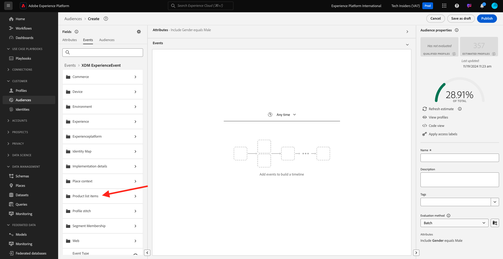

# 2.1.4 Création d’une audience - IU

Au cours de cet exercice, vous allez créer une audience en utilisant le créateur d’audiences Adobe Experience Platform.

Accédez à [Adobe Experience Platform](https://experience.adobe.com/platform). Une fois connecté, vous accédez à la page d’accueil de Adobe Experience Platform.


Avant de continuer, vous devez sélectionner un **sandbox**. L’environnement de test à sélectionner est nommé ``--aepSandboxName--``. Après avoir sélectionné l’[!UICONTROL sandbox] approprié, vous verrez le changement d’écran et vous êtes désormais dans votre [!UICONTROL sandbox] dédié.


Dans le menu de gauche, accédez à **Audiences**. Sur cette page, vous pouvez voir un aperçu de toutes les audiences existantes. Cliquez sur le bouton **+ Créer une audience** pour commencer à créer une audience.


Sélectionnez **Créer la règle** et cliquez sur **Créer**.


Une fois que vous êtes dans le nouveau créateur d’audiences, vous remarquez immédiatement l’option de menu **Attributs** et la référence **XDM Individual Profile**.


Étant donné que XDM est le langage qui alimente les activités d’expérience, XDM est également la base du créateur d’audiences. Toutes les données ingérées dans Platform doivent être mappées sur XDM. Par conséquent, toutes les données font partie du même modèle de données, quel que soit l’endroit d’où elles proviennent. Cela vous offre un grand avantage lors de la création d’audiences. Comme dans cette interface utilisateur du créateur d’audiences, vous pouvez combiner des données provenant de n’importe quelle origine dans le même workflow. Les audiences créées dans le créateur d’audiences peuvent être envoyées à des solutions telles qu’Adobe Target, Adobe Campaign et Adobe Audience Manager pour activation.

Créons une audience qui comprend tous les clients **masculin**.

Pour accéder à l’attribut gender , vous devez comprendre et connaître XDM.

Le genre est un attribut de Personne, qui se trouve sous Attributs. Pour y parvenir, vous allez commencer par cliquer sur **XDM Individual Profile**. Vous verrez alors ceci. Dans la fenêtre **XDM Individual Profile**, sélectionnez **Person**.


Vous verrez alors ceci. Dans **Person**, vous pouvez trouver l&#39;attribut **Gender**. Faites glisser l’attribut Genre sur le créateur d’audiences.


Vous pouvez désormais choisir le genre spécifique parmi les options préremplies. Dans ce cas, choisissons **Masculin**.


Après avoir sélectionné **Masculin**, vous pouvez obtenir une estimation de la population de l’audience en appuyant sur le bouton **Actualiser l’estimation** . Cela s’avère très utile pour un utilisateur chargé de la conception de parcours, de sorte qu’il puisse voir l’impact de certains attributs sur la taille de l’audience qui en résulte.


Vous verrez ensuite une estimation comme celle-ci :


Ensuite, vous devez affiner un peu votre audience. Vous devez créer une audience de tous les clients masculins qui ont consulté le produit **iPhone 15 Pro**.

Pour créer cette audience, vous devez ajouter un événement d’expérience. Vous pouvez trouver tous les événements d’expérience en cliquant sur l’icône **Événements** dans la barre de menus **Champs**. Vous verrez ensuite le noeud de niveau supérieur **XDM ExperienceEvents**. Cliquez sur **XDM ExperienceEvent**.


Accédez à **Éléments de liste de produits**.



Sélectionnez **Nom** et faites glisser et déposez l’objet **Nom** du menu de gauche sur le canevas du créateur d’audiences dans la section **Événements** .


Vous verrez alors :


Le paramètre de comparaison doit être **equals** et, dans le champ de saisie, saisissez **iPhone 15 Pro**.


Chaque fois que vous ajoutez un élément au créateur d’audiences, vous pouvez cliquer sur le bouton **Actualiser l’estimation** pour obtenir une nouvelle estimation de la population de votre audience.

Jusqu’à présent, vous avez uniquement utilisé l’interface utilisateur pour créer votre audience, mais il existe également une option de code pour créer une audience.

Lors de la création d’une audience, vous composez en fait une requête Profile Query Language (PQL). Pour visualiser le code PQL, vous pouvez cliquer sur le sélecteur **Affichage du code** dans le coin supérieur droit du créateur d’audiences.


Vous pouvez maintenant voir l’instruction PQL complète :

```sql
person.gender in ["male"] and CHAIN(xEvent, timestamp, [C0: WHAT(productListItems.exists(name.equals("iPhone 15 Pro", false)))])
```

Vous pouvez également prévisualiser un exemple des profils de clients qui font partie de cette audience en cliquant sur **Afficher les profils**.


Enfin, donnez un nom à votre audience,
définissez la **méthode d&#39;évaluation** sur **Streaming** et cliquez sur **Publish**.

Pour définir une convention d’affectation des noms, utilisez :

- `--aepUserLdap-- - Male customers with interest in iPhone 15 Pro`


Vous serez redirigé vers la page d’aperçu de l’audience.


Étape suivante : [2.1.5 Reportez-vous à votre profil client en temps réel en action dans le centre d’appels](./ex5.md)

[Revenir au module 2.1](./real-time-customer-profile.md)

[Revenir à tous les modules](../../../overview.md)
