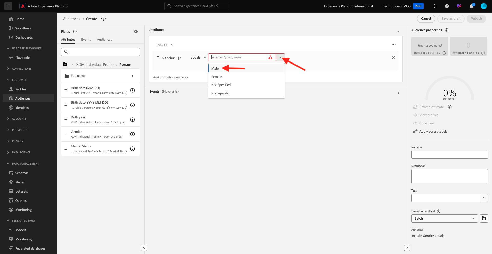

# 2.1.4 Création d’un segment - IU

Dans cet exercice, vous allez créer un segment à l’aide du créateur de segments de Adobe Experience Platform.

## Histoire

Accédez à [Adobe Experience Platform](https://experience.adobe.com/platform). Une fois connecté, vous accédez à la page d’accueil de Adobe Experience Platform.


Avant de continuer, vous devez sélectionner un **sandbox**. L’environnement de test à sélectionner est nommé ``--aepSandboxId--``. Pour ce faire, cliquez sur le texte **[!UICONTROL Production Prod]** dans la ligne bleue en haut de votre écran. Après avoir sélectionné l’[!UICONTROL sandbox] approprié, vous verrez le changement d’écran et vous êtes désormais dans votre [!UICONTROL sandbox] dédié.


Dans le menu de gauche, accédez à **Segments**. Sur cette page, vous pouvez voir un aperçu de tous les segments existants. Cliquez sur le bouton **+ Créer un segment** pour commencer à créer un segment.


Une fois que vous êtes dans le nouveau créateur de segments, vous remarquez immédiatement l’option de menu **Attributs** et la référence **XDM Individual Profile**.


Étant donné que XDM est le langage qui alimente les activités d’expérience, XDM est également la base du créateur de segments. Toutes les données ingérées dans Platform doivent être mappées sur XDM. Par conséquent, toutes les données font partie du même modèle de données, quel que soit l’endroit d’où elles proviennent. Cela vous offre un grand avantage lors de la création de segments. Comme dans cette interface utilisateur du créateur de segments, vous pouvez combiner des données provenant de n’importe quelle origine dans le même workflow. Les segments créés dans le créateur de segments peuvent être envoyés à des solutions telles qu’Adobe Target, Adobe Campaign et Adobe Audience Manager pour activation.

Créons un segment qui comprend tous les clients **masculin**.

Pour accéder à l’attribut gender , vous devez comprendre et connaître XDM.

Le genre est un attribut de Personne, qui se trouve sous Attributs. Pour y parvenir, vous allez commencer par cliquer sur **XDM Individual Profile**. Vous verrez alors ceci. Dans la fenêtre **XDM Individual Profile**, sélectionnez **Person**.


Vous verrez alors ceci. Dans **Person**, vous pouvez trouver l&#39;attribut **Gender**. Faites glisser l’attribut Genre sur le créateur de segments.


Vous pouvez désormais choisir le genre spécifique parmi les options préremplies. Dans ce cas, choisissons **Masculin**.



Après avoir sélectionné **Masculin**, vous pouvez obtenir une estimation de la population du segment en appuyant sur le bouton **Actualiser l’estimation** . Cela s’avère très utile pour un utilisateur chargé de la conception de parcours, de sorte qu’il puisse voir l’impact de certains attributs sur la taille du segment obtenue.


Vous verrez ensuite une estimation comme celle-ci :


Ensuite, vous devez affiner un peu votre segment. Vous devez créer un segment de tous les clients masculins qui ont consulté le produit **Proteus Fitness Jackshirt (Orange)**.

Pour créer ce segment, vous devez ajouter un événement d’expérience. Vous pouvez trouver tous les événements d’expérience en cliquant sur l’icône **Événements** dans la barre de menus **Champs**.


Vous verrez ensuite le noeud de niveau supérieur **XDM ExperienceEvents**. Cliquez sur **XDM ExperienceEvent**.


Accédez à **Éléments de liste de produits**.


Sélectionnez **Nom** et faites glisser et déposez l’objet **Nom** du menu de gauche sur le canevas du créateur de segments dans la section **Événements**.


Vous verrez alors :


Le paramètre de comparaison doit être **equals** et, dans le champ de saisie, saisissez **MONTANA WIND JACKET**.


Chaque fois que vous ajoutez un élément au créateur de segments, vous pouvez cliquer sur le bouton **Actualiser l’estimation** pour obtenir une nouvelle estimation de la population de votre segment.

Jusqu’à présent, vous avez uniquement utilisé l’interface utilisateur pour créer votre segment, mais il existe également une option de code pour créer un segment.

Lors de la création d’un segment, vous composez en fait une requête Profile Query Language (PQL). Pour visualiser le code PQL, vous pouvez cliquer sur le sélecteur **Affichage du code** dans le coin supérieur droit du créateur de segments.


Vous pouvez maintenant voir l’instruction PQL complète :

```sql
person.gender in ["male"] and CHAIN(xEvent, timestamp, [C0: WHAT(productListItems.exists(name.equals("MONTANA WIND JACKET", false)))])
```

Vous pouvez également prévisualiser un exemple des profils client qui font partie de ce segment, en cliquant sur **Afficher les profils**.


Enfin, attribuons un nom à votre segment et enregistrez-le.

Pour définir une convention d’affectation des noms, utilisez :

- `--demoProfileLdap-- - Male customers with interest in Montana Wind Jacket`


Cliquez ensuite sur le bouton **Enregistrer et fermer** pour enregistrer votre segment, puis revenez à la page d’aperçu du segment.


Vous pouvez maintenant poursuivre l’exercice suivant et créer un segment via l’API.

Étape suivante : [2.1.5 Création d’un segment - API](./ex5.md)

[Revenir au module 2.1](./real-time-customer-profile.md)

[Revenir à tous les modules](../../../overview.md)
