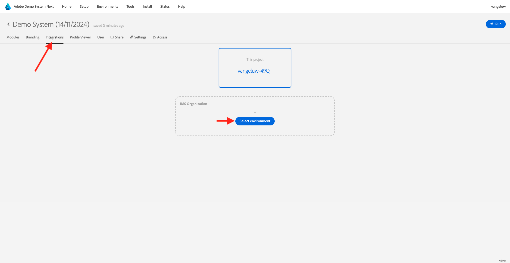

# 2.1.5 Consultez votre profil client en temps réel en action dans le centre d’appels

Dans cet exercice, l’objectif est de vous faire parcourir le parcours client et agir comme un vrai client.

Sur ce site web, nous avons implémenté Adobe Experience Platform. Chaque action est considérée comme un événement d’expérience et est envoyée à Adobe Experience Platform en temps réel, hydratant le profil client en temps réel.

Au cours d’un exercice précédent, vous avez commencé comme un client anonyme qui naviguait sur le site, et après quelques étapes, vous êtes devenu un client connu.

Lorsque ce même client récupère finalement son téléphone et appelle votre centre d’appels, il est essentiel que les informations d’autres canaux soient disponibles immédiatement, de sorte que l’expérience du centre d’appels puisse être pertinente et personnalisée.

## Utilisation de votre application CX

Accédez à [https://dsn.adobe.com](https://dsn.adobe.com). Une fois connecté avec votre Adobe ID, vous verrez ceci. Cliquez sur les 3 points **..** de votre projet d’application CX, puis cliquez sur **Modifier** pour l’ouvrir.

Dans votre projet d’application CX, accédez à **Intégrations**. Cliquez sur **Sélectionner un environnement**.

Sélectionnez la propriété Collecte de données Adobe Experience Platform qui a été créée dans Prise en main. Vous devez sélectionner la propriété dont le nom contient **(cx-app)**.

Vous verrez alors ceci. Cliquez sur **Exécuter**.

Ensuite, vous devez sélectionner l’une de vos identités et l’espace de noms correspondant, puis cliquer sur l’icône **search-icon**.

| Identité | Espace de noms |
|:-------------:| :---------------:|
| Identifiant Experience Cloud (ECID) | 79943948563923140522865572770524243489 |
| Identifiant Experience Cloud (ECID) | 70559351147248820114888181867542007989 |
| Email ID | woutervangeluwe+18112024-01@gmail.com |
| Identifiant du numéro de mobile | +32473622044+18112024-01 |

Vous verrez désormais les informations qui seraient idéalement affichées dans le centre d’appels, de sorte que les agents du centre d’appels disposent immédiatement de toutes les informations pertinentes lorsqu’ils parlent à un client.

Étape suivante : [Résumé et avantages](./summary.md)

[Revenir au module 2.1](./real-time-customer-profile.md)

[Revenir à tous les modules](../../../overview.md)
