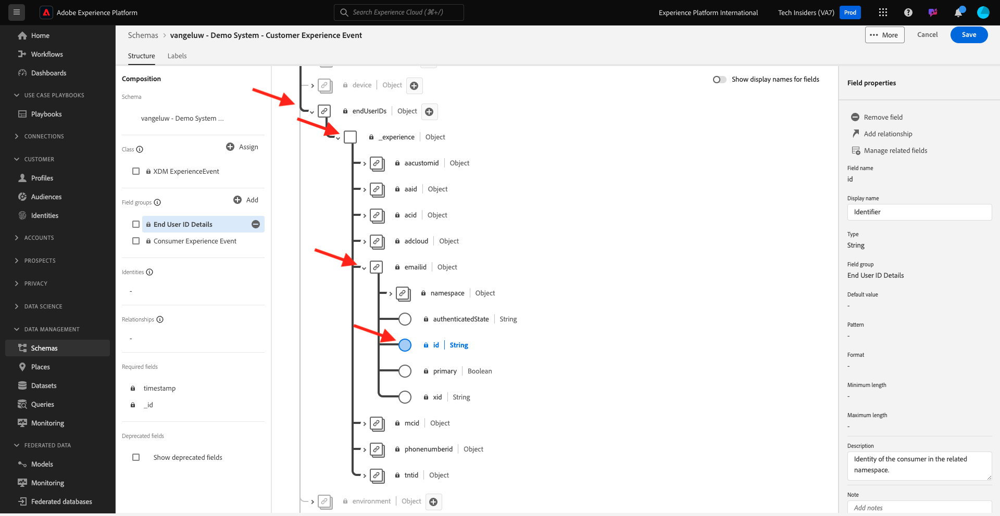
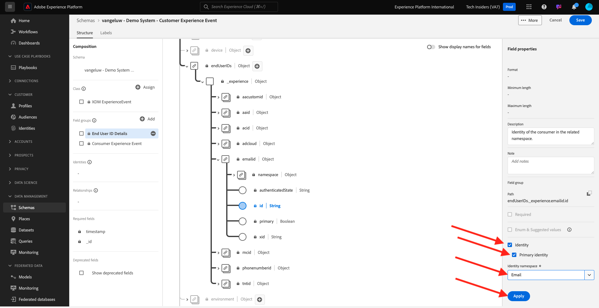
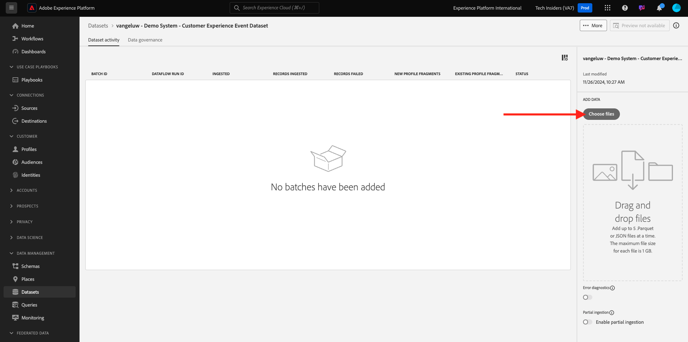
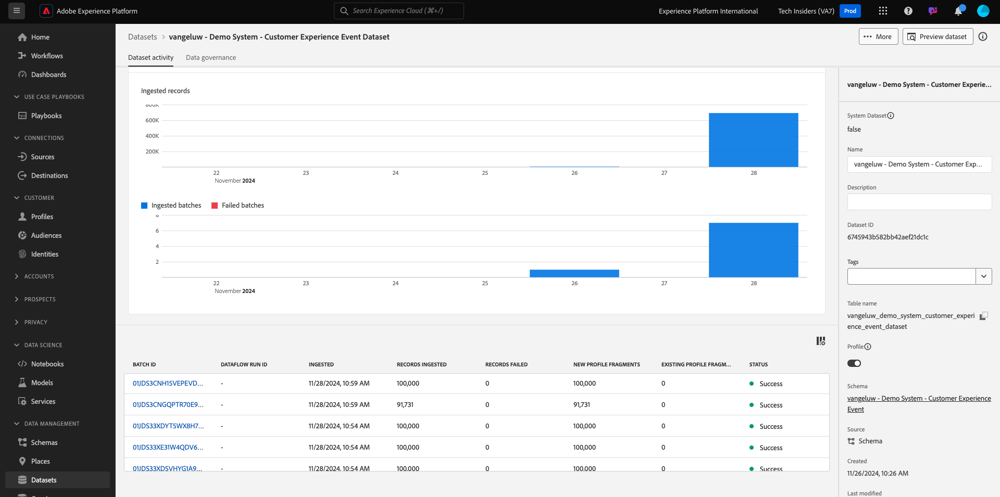

# 2.2.1 Customer AI - Préparation des données (ingestion)

Pour que les services intelligents découvrent des informations à partir de vos données d’événements marketing, les données doivent être enrichies sémantiquement et conservées dans une structure standard. Pour ce faire, les services intelligents utilisent les schémas XDM (Experience Data Model) d’Adobe.
En particulier, tous les jeux de données utilisés dans Intelligent Services doivent être conformes au schéma XDM **Consumer Experience Event**.

## Créer un schéma

Au cours de cet exercice, vous allez créer un schéma qui contient le **mixin Événement d’expérience client**, qui est requis par le service intelligent **Customer AI**.

Connectez-vous à Adobe Experience Platform en accédant à cette URL : [https://experience.adobe.com/platform](https://experience.adobe.com/platform).

Une fois connecté, vous accédez à la page d’accueil de Adobe Experience Platform.

Avant de continuer, vous devez sélectionner un **sandbox**. L’environnement de test à sélectionner est nommé ``--aepSandboxName--``. Après avoir sélectionné l’environnement de test approprié, l’écran change et vous êtes désormais dans votre environnement de test dédié.

Dans le menu de gauche, cliquez sur **Schémas** et accédez à **Parcourir**. Cliquez sur **Créer un schéma**.

Dans la fenêtre contextuelle, sélectionnez **Manuel** et cliquez sur **Sélectionner**.

Sélectionnez ensuite **Experience Event** et cliquez sur **Next**.

Vous devez maintenant fournir un nom pour votre schéma. Pour le nom de notre schéma, utilisez : `--aepUserLdap-- - Demo System - Customer Experience Event` et cliquez sur **Terminer**.

Vous verrez alors ceci. Cliquez sur **+ Ajouter** sous Groupes de champs.

Recherchez et sélectionnez les **groupes de champs** suivants à ajouter à ce schéma :

- Événement d’expérience du consommateur
- Informations sur l’identifiant de l’utilisateur final

Cliquez sur **Ajouter des groupes de champs**.

Vous verrez alors ceci. Cliquez sur le groupe de champs **Détails de l’ID utilisateur final**.

Accédez au champ **endUserIDs._experience.email.id**.

Dans le menu de droite pour le champ **endUserIDs._experience.emailid.id**, faites défiler l’écran vers le bas et cochez la case correspondant à **Identité**, cochez la case correspondant à **Identité de Principal** et sélectionnez l’ **espace de noms d’identité** de **Adresse électronique**. Cliquez sur **Appliquer**.

Accédez au champ **endUserIDs._experience.mcid.id**. Cochez la case correspondant à **Identity** et sélectionnez l’ **espace de noms d’identité** de **ECID**. Cliquez sur **Appliquer**.

Vous aurez alors ceci. Sélectionnez ensuite le nom de votre schéma. Vous devez maintenant activer votre schéma pour **Profile** en cliquant sur le bouton d’activation/désactivation **Profile** .

Vous verrez alors ceci. Cliquez sur **Activer**.

Vous devriez maintenant avoir ceci. Cliquez sur **Enregistrer** pour enregistrer votre schéma.

## Créer un jeu de données

Dans le menu de gauche, cliquez sur **Jeux de données** et accédez à **Parcourir**. Cliquez sur **Créer un jeu de données**.

Cliquez sur **Créer un jeu de données à partir du schéma**.

Dans l’écran suivant, sélectionnez le jeu de données que vous avez créé lors de l’exercice précédent, nommé **[!UICONTROL ldap - Demo System - Customer Experience Event]**. Cliquez sur **Suivant**.

Pour nommer votre jeu de données, utilisez `--aepUserLdap-- - Demo System - Customer Experience Event Dataset`. Cliquez sur **Terminer**.

Votre jeu de données est maintenant créé. Activez le bouton bascule **Profile** .

Cliquez sur **Activer**.

Vous devez maintenant disposer des éléments suivants :

Vous êtes maintenant prêt à commencer à ingérer des données d’événement d’expérience client et à utiliser le service Customer AI.

## Téléchargement des données de test d’événement d’expérience

Une fois que le **schéma** et le **jeu de données** sont configurés, vous êtes prêt à ingérer les données d’événement d’expérience. Comme Customer AI nécessite des données sur **2 trimestres au moins**, vous devrez ingérer des données préparées en externe.

Les données préparées pour les événements d’expérience doivent être conformes aux exigences et au schéma du [mixin XDM de l’événement d’expérience client](https://github.com/adobe/xdm/blob/797cf4930d5a80799a095256302675b1362c9a15/docs/reference/context/experienceevent-consumer.schema.md).

Téléchargez le fichier contenant des exemples de données à partir de cet emplacement : [https://dashboard.adobedemo.com/data](https://dashboard.adobedemo.com/data). Cliquez sur le bouton **Télécharger** .

Si vous ne pouvez pas accéder au lien ci-dessus, vous pouvez également télécharger le fichier à partir de cet emplacement : [https://aepmodule10.s3-us-west-2.amazonaws.com/retail-v1-dec2020-xl.json.zip](https://aepmodule10.s3-us-west-2.amazonaws.com/retail-v1-dec2020-xl.json.zip).

Vous avez maintenant téléchargé un fichier nommé **retail-v1-dec2020-xl.json.zip**. Placez le fichier sur le bureau de votre ordinateur et décompressez-le, après quoi vous verrez un fichier nommé **retail-v1.json**. Vous aurez besoin de ce fichier lors de l’exercice suivant.

## Ingestion des données de test d’événement d’expérience

Dans Adobe Experience Platform, accédez à **Jeux de données** et ouvrez votre jeu de données, appelé **[!UICONTROL ldap - Demo System - Customer Experience Event Dataset]**.

Dans votre jeu de données, cliquez sur **Choisir les fichiers** pour ajouter des données.

Dans la fenêtre contextuelle, sélectionnez le fichier **retail-v1.json** et cliquez sur **Ouvrir**.

Vous verrez ensuite les données importées et un nouveau lot est créé à l’état **Chargement**. Ne quittez pas cette page tant que le fichier n’a pas été chargé.

Une fois le fichier téléchargé, l’état du lot passe de **Chargement** à **Traitement**.

L’ingestion et le traitement des données peuvent prendre entre 10 et 20 minutes.

Une fois l’ingestion des données réussie, l’état du lot passe à **Success**.

Étape suivante : [2.2.2 Customer AI - Créer une instance (configurer)](./ex2.md)

[Revenir au module 2.2](./intelligent-services.md)

[Revenir à tous les modules](./../../../overview.md)
