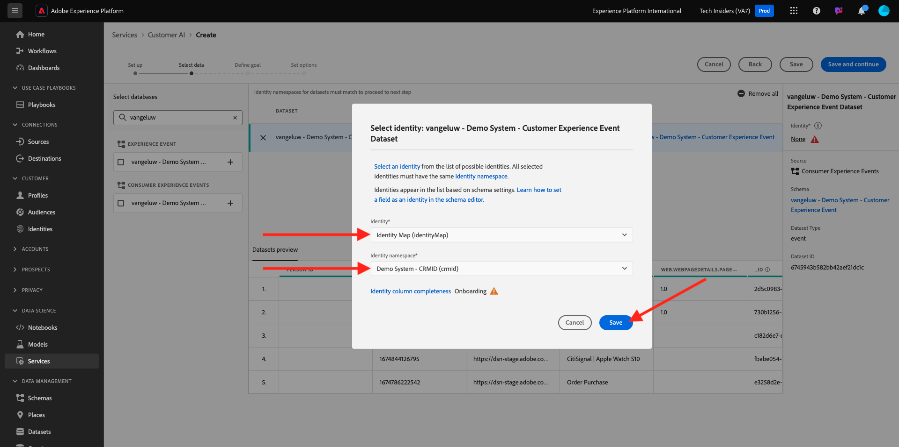
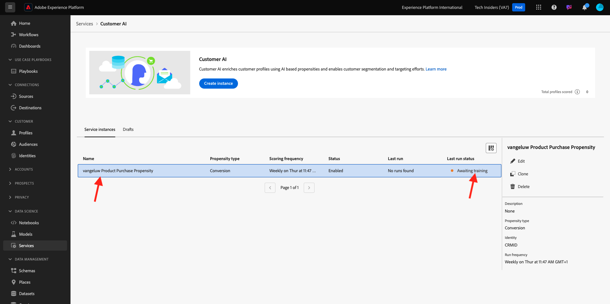

# 2.2.2 IA dédiée aux clients - Créer une instance (configurer)

Customer AI analyse les données d’événement d’expérience existantes pour le client afin de prévoir les taux d’attrition ou de conversion. La création d’une instance IA dédiée aux clients permet aux marketeurs de définir des objectifs et des mesures.

## Configurer une nouvelle instance IA dédiée aux clients

Dans Adobe Experience Platform, cliquez sur **Services** dans le menu de gauche. Le navigateur **Services** apparaît et affiche tous les services disponibles. Dans la carte de l’IA dédiée aux clients, cliquez sur **Ouvrir**.

Cliquez sur **Créer une instance**.

Tu verras ça.

Saisissez les détails requis pour l’instance IA dédiée aux clients :

- Nom : use `--aepUserLdap-- Product Purchase Propensity`
- Description : utilisez **prévoir la probabilité que les clients achètent un produit**
- Type de propension : sélectionnez **Conversion**

Cliquez sur **Enregistrer et continuer**.

Tu verras ça. Sélectionnez le jeu de données que vous avez créé dans l’exercice précédent et qui est nommé `--aepUserLdap-- - Demo System - Customer Experience Event Dataset`. Cliquez sur **Ajouter**.

Tu verras ça. vous devez définir le champ **Identité**. Cliquez sur **Aucun**.

Dans la fenêtre contextuelle, sélectionnez **Identity Map (identityMap)** puis sélectionnez l’espace de noms **Demo System - CRMID (crmId)**. Cliquez ensuite sur **Enregistrer**.

Cliquez sur **Enregistrer et continuer**.

Sélectionnez **Va se produire** dans votre jeu de données spécifique, puis définissez le champ **commerce.purchases.value** comme variable cible.

Ensuite, définissez votre planification pour qu’elle s’exécute **toutes les semaines** et définissez l’heure aussi proche que possible de votre heure actuelle. Assurez-vous que le bouton (bascule) **Activer les scores pour le profil** est activé. Cliquez sur **Enregistrer et continuer**.

Une fois l’instance configurée, vous pouvez la voir dans la liste du service IA dédiée aux clients et vous pouvez également prévisualiser le résumé des détails de configuration et d’exécution en cliquant sur la ligne de l’instance IA dédiée aux clients . Le panneau de résumé affiche également les détails de l’erreur si des erreurs ont été détectées.

>[!NOTE]
>
>Vous pouvez modifier n’importe quelle définition ou attribut tant que le statut de votre instance IA dédiée aux clients est **En attente de formation** ou **Erreur**

Une fois votre modèle exécuté, vous verrez ceci.

Étape suivante : [2.2.3 IA dédiée aux clients - Tableau de bord de notation et segmentation (prévoir et prendre des mesures)](./ex3.md)

[Retour au module 2.2](./intelligent-services.md)

[Revenir à tous les modules](./../../../overview.md)
