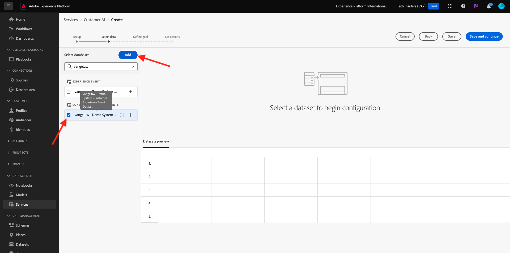
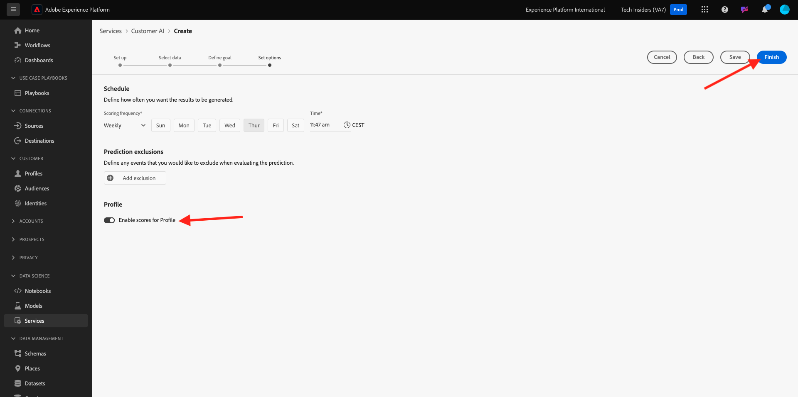
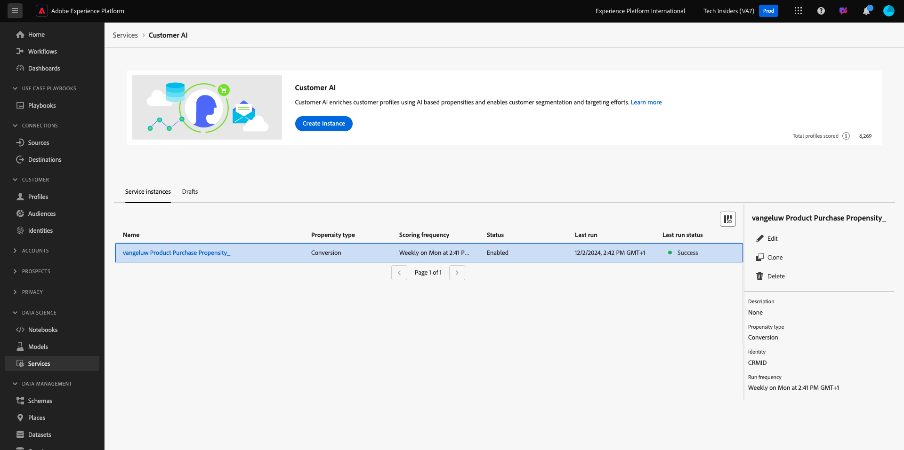

# 2.2.2 Customer AI - Création d’une instance (configuration)

Customer AI analyse les données d’événement d’expérience existantes pour le client afin de prévoir les taux d’attrition ou de conversion. La création d’une instance Customer AI permet aux marketeurs de définir des objectifs et des mesures.

## Configuration d’une nouvelle instance de Customer AI

Dans Adobe Experience Platform, cliquez sur **Services** dans le menu de gauche. Le navigateur **Services** apparaît et affiche tous les services disponibles. Dans la carte de Customer AI, cliquez sur **Ouvrir**.

Cliquez sur **Créer une instance**.

Vous verrez alors ceci.

Saisissez les détails requis pour l’instance Customer AI :

- Nom : use `--aepUserLdap-- Product Purchase Propensity`
- Description : utilisez : **Prédire la probabilité que les clients achètent un produit**
- Type de propension : sélectionnez **Conversion**

Cliquez sur **Enregistrer et continuer**.

Vous verrez alors ceci. Sélectionnez le jeu de données que vous avez créé lors de l’exercice précédent, nommé `--demoProfileLdap - Demo System - Customer Experience Event Dataset`. Cliquez sur **Ajouter**.

Vous verrez alors ceci. vous devez définir le champ **Identité**. Cliquez sur **Aucun**.

Dans la fenêtre contextuelle, sélectionnez **Identity Map (identityMap)**, puis sélectionnez l’espace de noms **Demo System - CRMID (crmId)**. Cliquez ensuite sur **Enregistrer**.

Cliquez sur **Enregistrer et continuer**.

Sélectionnez **Se produira** dans votre jeu de données spécifique et définissez le champ **commerce.achats.value** comme variable cible.

Définissez ensuite votre planning pour exécuter **Hebdomadairement** et définissez l’heure aussi près que possible de l’heure actuelle. Assurez-vous que la bascule **Activer les scores pour Profile** est activée. Cliquez sur **Enregistrer et continuer**.

Une fois l’instance configurée, vous pouvez la voir dans la liste des services de Customer AI et vous pouvez également prévisualiser le résumé des détails de configuration et d’exécution en cliquant sur la ligne de l’instance Customer AI. Le panneau de résumé affiche également les détails des erreurs en cas d’erreur.

>[!NOTE]
>
>Vous pouvez modifier n’importe quelle définition ou attribut tant que l’état de votre instance Customer AI est **En attente de formation** ou **Erreur**.

Une fois votre modèle exécuté, vous verrez ceci.

Étape suivante : [2.2.3 Customer AI - Tableau de bord de notation et segmentation (prévoir et prendre des mesures){1](./ex3.md)

[Revenir au module 2.2](./intelligent-services.md)

[Revenir à tous les modules](./../../../overview.md)
