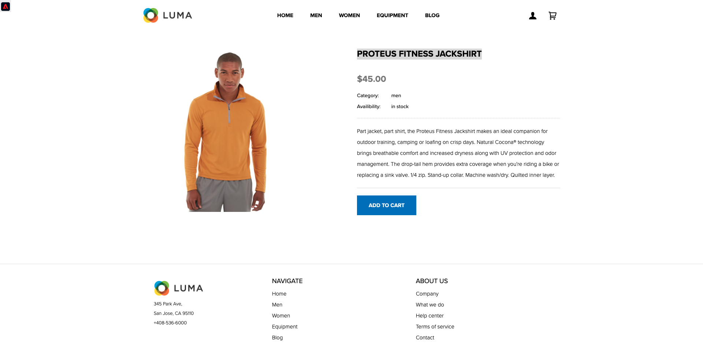
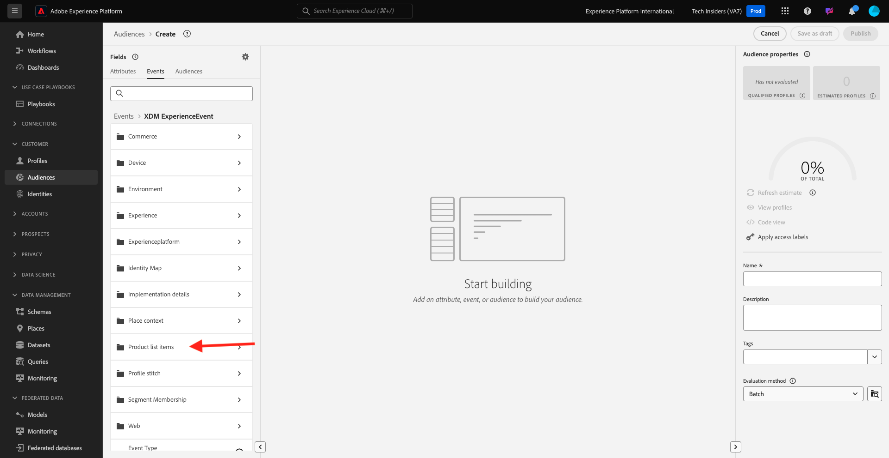

# 2.3.1 Création d’un segment

Dans cet exercice, vous allez créer un segment en utilisant le créateur de segments de Adobe Experience Platform.

## 2.3.1.1 Contexte

Dans le monde d&#39;aujourd&#39;hui, répondre au comportement d&#39;un client doit être en temps réel. L’utilisation d’un segment, à condition que le segment soit admissible en temps réel, constitue l’une des façons de répondre au comportement des clients en temps réel. Dans cet exercice, vous devez créer un segment, en tenant compte de l’activité réelle sur le site web que nous avons utilisé.

## 2.3.1.2 Identifier le comportement auquel vous souhaitez réagir

Accédez à [https://builder.adobedemo.com/projects](https://builder.adobedemo.com/projects). Une fois connecté avec votre Adobe ID, vous verrez ceci. Cliquez sur le projet de votre site web pour l’ouvrir.

Vous pouvez maintenant suivre le flux ci-dessous pour accéder au site web. Cliquez sur **Intégrations**.

Sur la page **Intégrations**, vous devez sélectionner la propriété de collecte de données qui a été créée dans l’exercice 0.1.

Vous verrez alors votre site web de démonstration ouvert. Sélectionnez l’URL et copiez-la dans le presse-papiers.

Ouvrez une nouvelle fenêtre de navigateur incognito.

Collez l’URL de votre site web de démonstration, que vous avez copiée à l’étape précédente. Vous serez alors invité à vous connecter à l’aide de votre Adobe ID.

Sélectionnez le type de compte et procédez à la connexion.

Votre site web est alors chargé dans une fenêtre de navigateur incognito. Pour chaque démonstration, vous devez utiliser une fenêtre de navigateur incognito actualisée pour charger l’URL de votre site web de démonstration.

Dans cet exemple, vous souhaitez répondre à un client spécifique qui consulte un produit spécifique.
Sur la page d’accueil **Luma**, accédez à **Men** et cliquez sur le produit **PROTEUS FITNESS JACKSHIRT**.

Ainsi, lorsque quelqu’un visite la page du produit pour **PROTEUS FITNESS JACKSHIRT**, vous souhaitez pouvoir agir. La première chose à faire est de définir un segment.

## 2.3.1.3 Création du segment

Accédez à [Adobe Experience Platform](https://experience.adobe.com/platform). Une fois connecté, vous accédez à la page d’accueil de Adobe Experience Platform.

Avant de continuer, vous devez sélectionner un **sandbox**. L’environnement de test à sélectionner est nommé ``--aepSandboxName--``. Pour ce faire, cliquez sur le texte **[!UICONTROL Production Prod]** dans la ligne bleue en haut de votre écran. Après avoir sélectionné l’[!UICONTROL sandbox] approprié, vous verrez le changement d’écran et vous êtes désormais dans votre [!UICONTROL sandbox] dédié.

Dans le menu de gauche, accédez à **Segments**, puis à **Parcourir** où vous pouvez voir un aperçu de tous les segments existants. Cliquez sur le bouton **Créer un segment** pour commencer à créer un segment.

Comme mentionné ci-dessus, vous devez créer un segment parmi tous les clients qui ont consulté le produit **PROTEUS FITNESS JACKSHIRT**.

Pour créer ce segment, vous devez ajouter un événement . Vous pouvez trouver tous les événements en cliquant sur l’icône **Événements** dans la barre de menus **Segments**.

Vous verrez ensuite le noeud de niveau supérieur **XDM ExperienceEvent**.

Pour rechercher les clients qui ont visité le produit **PROTEUS FITNESS JACKSHIRT**, cliquez sur **XDM ExperienceEvent**.

Faites défiler l’écran jusqu’à **Éléments de liste de produits** et cliquez dessus.

Sélectionnez **Nom** et faites glisser et déposez l’objet **Nom** du menu de gauche **Éléments de liste de produits** sur le canevas du créateur de segments dans la section **Événements**.

Le paramètre de comparaison doit être **equals** et, dans le champ de saisie, saisissez `PROTEUS FITNESS JACKSHIRT`.

Vos **règles d’événement** doivent maintenant ressembler à ceci. Chaque fois que vous ajoutez un élément au créateur de segments, vous pouvez cliquer sur le bouton **Actualiser l’estimation** pour obtenir une nouvelle estimation de la population de votre segment.

Enfin, attribuons un nom à votre segment et enregistrez-le.

Pour définir une convention d’affectation des noms, utilisez :

- `--aepUserLdap-- - Interest in PROTEUS FITNESS JACKSHIRT`

Le nom de votre segment doit se présenter comme suit :
`vangeluw - Interest in PROTEUS FITNESS JACKSHIRT`

Cliquez ensuite sur le bouton **Enregistrer et fermer** pour enregistrer votre segment.

Vous revenez maintenant à la page d’aperçu du segment.

Étape suivante : [2.3.2 Passez en revue la configuration de la destination DV360 à l’aide des destinations](./ex2.md)

[Revenir au module 2.3](./real-time-cdp-build-a-segment-take-action.md)

[Revenir à tous les modules](../../../overview.md)
