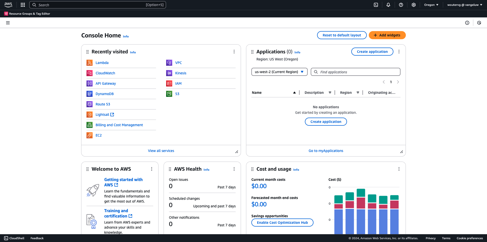
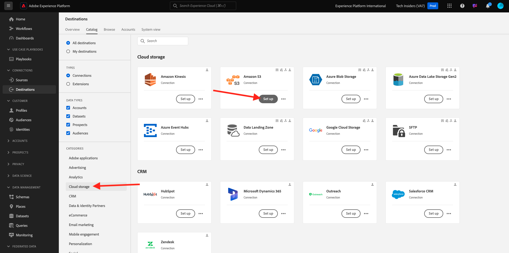
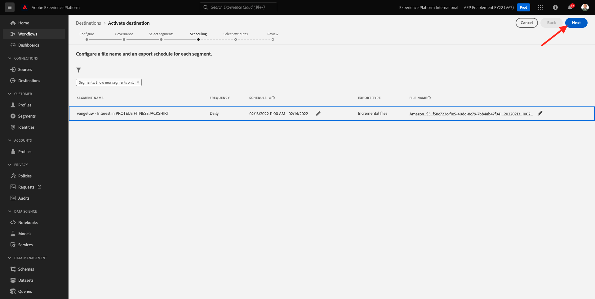

# 2.3.4 Action : envoyez votre segment à une destination S3

Adobe Experience Platform peut également partager des audiences vers des destinations de marketing par e-mail telles que Salesforce Marketing Cloud, Oracle Eloqua, Oracle Responsys et Adobe Campaign.

Vous pouvez utiliser le protocole FTP ou SFTP dans le cadre des destinations dédiées pour chacune de ces destinations de marketing par e-mail ou vous pouvez utiliser AWS S3 pour exchange des listes de clients entre Adobe Experience Platform et ces destinations de marketing par e-mail.

Dans ce module, vous allez configurer une telle destination en utilisant un compartiment AWS S3.

## 2.3.4.1 Création de votre compartiment S3

Accédez à [https://console.aws.amazon.com](https://console.aws.amazon.com) et connectez-vous avec le compte Amazon que vous avez créé précédemment.

Une fois connecté, vous serez redirigé vers la **console de gestion AWS**.

Dans le menu **Find Services**, recherchez **s3**. Cliquez sur le premier résultat de la recherche : **S3 - Stockage évolutif dans le cloud**.

Vous verrez ensuite la page d’accueil **Amazon S3**. Cliquez sur **Créer un compartiment**.

Dans l&#39;écran **Créer un compartiment**, vous devez configurer deux éléments :

- Nom : utilisez le nom `aepmodulertcdp--aepUserLdap--`. Par exemple, dans cet exercice, le nom du compartiment est **aepmoduertcdpvangeluw**
- Région : utilisez la région **UE (Francfort) eu-central-1**

Conservez tous les autres paramètres par défaut tels quels. Faites défiler l’écran vers le bas et cliquez sur **Créer un compartiment**.

Votre compartiment sera alors créé et redirigé vers la page d’accueil d’Amazon S3.

## 2.3.4.2 Définition des autorisations d’accès à votre compartiment S3

L’étape suivante consiste à configurer l’accès à votre compartiment S3.

Pour ce faire, accédez à [https://console.aws.amazon.com/iam/home](https://console.aws.amazon.com/iam/home).

L’accès aux ressources AWS est contrôlé par Amazon Identity and Access Management (IAM).

Vous allez maintenant voir cette page.

Dans le menu de gauche, cliquez sur **Utilisateurs**. L’écran **Utilisateurs** s’affiche alors. Cliquez sur **Ajouter des utilisateurs**.

Configurez ensuite votre utilisateur :

- Nom d’utilisateur : utilisez `s3_--aepUserLdap--_rtcdp` comme nom, donc dans cet exemple, le nom est `s3_vangeluw_rtcdp`.
- Type d’accès AWS : sélectionnez **Clé d’accès - Accès programmatique**.

Cliquez sur **Suivant : Autorisations**.

Cet écran des autorisations s’affiche alors. Cliquez sur **Joindre directement des stratégies existantes**.

Saisissez le terme de recherche **s3** pour afficher toutes les stratégies S3 associées. Sélectionnez la stratégie **AmazonS3FullAccess**. Cliquez sur **Suivant : Balises**.

Sur l’écran **Balises**, il n’est pas nécessaire de configurer quoi que ce soit. Cliquez sur **Suivant : Réviser**.

Vérifiez votre configuration. Cliquez sur **Créer un utilisateur**.

Votre utilisateur est maintenant créé et vos informations d’identification s’affichent pour accéder à votre environnement S3. C&#39;est la seule fois où vous verrez vos informations d&#39;identification, veuillez les noter.

Cliquez sur **Afficher** pour afficher votre clé d’accès secrète :

>[!IMPORTANT]
>
>Stockez vos informations d’identification dans un fichier texte sur votre ordinateur.
>
> - Accéder à l’ID de clé : ...
> - Clé d’accès secrète : ...
>
> Une fois que vous avez cliqué sur **Fermer**, vous ne verrez plus jamais vos informations d’identification !

Cliquez sur **Fermer**.

Vous avez maintenant créé un compartiment AWS S3 et vous avez créé un utilisateur avec les autorisations d’accès à ce compartiment.

## 2.3.4.3 Configuration de la destination dans Adobe Experience Platform

Accédez à [Adobe Experience Platform](https://experience.adobe.com/platform). Une fois connecté, vous accédez à la page d’accueil de Adobe Experience Platform.

Avant de continuer, vous devez sélectionner un **sandbox**. L’environnement de test à sélectionner est nommé ``--aepSandboxName--``. Pour ce faire, cliquez sur le texte **[!UICONTROL Production Prod]** dans la ligne bleue en haut de votre écran. Après avoir sélectionné l’[!UICONTROL sandbox] approprié, vous verrez le changement d’écran et vous êtes désormais dans votre [!UICONTROL sandbox] dédié.

Dans le menu de gauche, accédez à **Destinations**, puis à **Catalogue**. Vous verrez ensuite le **catalogue des destinations**.

Cliquez sur **Cloud Storage**, puis sur le bouton **Configurer** (ou sur **Activer les segments**, selon votre environnement) sur la carte **Amazon S3**.

Selon votre environnement, vous devrez peut-être cliquer sur **+ Configurer une nouvelle destination** pour commencer à créer votre destination.

Sélectionnez **Nouveau compte** comme Type de compte. Utilisez les informations d’identification S3 qui vous ont été fournies à l’étape précédente :

| Identifiant de la clé d’accès | Clé d’accès secrète |
|:-----------------------:| :-----------------------:|
| AKIA..... | Cm5Ln..... |

Cliquez sur **Se connecter à la destination**.

Vous verrez alors une confirmation visuelle que cette destination est maintenant connectée.

Vous devez fournir un nom et un dossier pour que Adobe Experience Platform puisse se connecter au compartiment S3.

Pour définir une convention d’affectation des noms, utilisez ce qui suit :

| Identifiant de la clé d’accès | Clé d’accès secrète |
|:-----------------------:| :-----------------------:|
| Nom | `AWS - S3 - --aepUserLdap--` |
| Description | `AWS - S3 - --aepUserLdap--` |
| Nom du compartiment | `aepmodulertcdp--aepUserLdap--` |
| Chemin du dossier | / |

Cliquez sur **Suivant**.

Vous pouvez désormais joindre une stratégie de gouvernance des données à votre nouvelle destination. Cliquez sur **Suivant**.

Dans la liste des segments, recherchez le segment que vous avez créé dans l’exercice 1 et sélectionnez-le. Cliquez sur **Suivant**.

Vous verrez alors ceci. Si vous le souhaitez, vous pouvez modifier le planning en cliquant sur l’icône **crayon** . **Créer une planification**.

Définissez votre planning de choix. Sélectionnez **Exporter les fichiers incrémentiels** et définissez la fréquence sur **Horaire** toutes les **3 heures**. Cliquez sur **Créer**.

Vous aurez alors ceci. Cliquez sur **Suivant**.

Vous pouvez désormais sélectionner des attributs pour l’exportation vers AWS S3. Cliquez sur **Ajouter un nouveau champ** et assurez-vous que le champ `--aepTenantId--.identification.core.ecid` est ajouté et marqué comme **Clé de déduplication**.

Vous pouvez éventuellement ajouter autant de champs que nécessaire.

Une fois tous les champs ajoutés, cliquez sur **Suivant**.

Vérifiez votre configuration. Cliquez sur **Terminer** pour terminer votre configuration.

Vous serez alors de retour à l’écran Activation de la destination et votre segment sera ajouté à cette destination.

Si vous souhaitez ajouter d’autres exportations de segments, vous pouvez cliquer sur **Activer les segments** pour redémarrer le processus et ajouter d’autres segments.

Étape suivante : [2.3.5 Take Action : envoyez votre segment à Adobe Target](./ex5.md)

[Revenir au module 2.3](./real-time-cdp-build-a-segment-take-action.md)

[Revenir à tous les modules](../../../overview.md)
