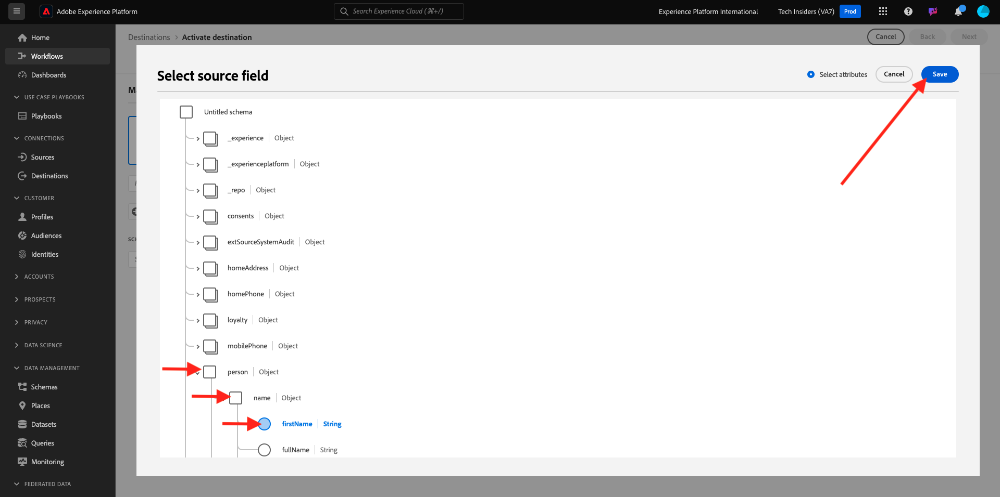

# 2.3.5 Action : envoyez votre audience à Adobe Target

Accédez à [Adobe Experience Platform](https://experience.adobe.com/platform). Une fois connecté, vous accédez à la page d’accueil de Adobe Experience Platform.


Avant de continuer, vous devez sélectionner un **sandbox**. L’environnement de test à sélectionner est nommé ``--aepSandboxName--``. Après avoir sélectionné l’[!UICONTROL sandbox] approprié, vous verrez le changement d’écran et vous êtes désormais dans votre [!UICONTROL sandbox] dédié.


## Vérification de la structure de données

La destination Adobe Target dans Real-Time CDP est connectée à la banque de données utilisée pour ingérer des données dans le réseau Edge d’Adobe. Si vous souhaitez configurer votre destination Adobe Target, vous devez d’abord vérifier si votre flux de données est déjà activé pour Adobe Target. Votre jeu de données a été configuré dans l’ [exercice 0.2 de création de votre flux de données](./../../../modules/gettingstarted/gettingstarted/ex2.md) et a été nommé `--aepUserLdap-- - Demo System Datastream`.

Dans le menu de gauche, faites défiler l’écran vers le bas et cliquez sur **Datastreams**. Dans les flux de données, recherchez votre flux de données nommé `--aepUserLdap-- - Demo System Datastream`. Cliquez sur votre flux de données pour l’ouvrir.


Vous verrez alors ceci, cliquez sur **...** en regard de **Adobe Experience Platform**, puis cliquez sur **Modifier**.


Cochez les cases correspondant à la **segmentation Edge** et aux **destinations Personalization**. Cliquez sur **Enregistrer**.


Cliquez ensuite sur **+ Ajouter un service**.


Sélectionnez le service **Adobe Target**. Cliquez sur **Enregistrer**.


Votre flux de données est maintenant configuré pour Adobe Target.


## Configuration de votre destination Adobe Target

Adobe Target est disponible en tant que destination depuis Real-Time CDP. Pour configurer votre intégration Adobe Target, accédez à **Destinations**, à **Catalogue**.

Cliquez sur **Personalization** dans le menu **Catégories** . Vous verrez ensuite la carte de destination **(v2) Adobe Target**.


Cliquez sur **Se connecter à la destination**.


Vous verrez alors ceci. Vous devez créer votre propre destination Adobe Target. Suivez les instructions suivantes :

- Nom : utilisez le nom `--aepUserLdap-- - Adobe Target v2  (Web)`.
- Identifiant de la banque de données : vous devez sélectionner la banque de données que vous avez configurée dans l’ [exercice 0.2 Création de la banque de données](./../../../modules/gettingstarted/gettingstarted/ex2.md). Le nom de votre flux de données doit être : `--aepUserLdap-- - Demo System Datastream`.
- Workspace : il est lié aux espaces de travail Adobe Target. S’il n’existe aucun espace de travail spécifique que vous devez utiliser, sélectionnez **Workspace par défaut**.

Cliquez sur **Suivant**.


Vous pouvez désormais sélectionner une stratégie de gouvernance des données (facultatif). Cliquez sur **Suivant**.


Dans la liste des audiences disponibles, sélectionnez l’audience que vous avez créée lors de l’exercice précédent [Créer une audience](./ex1.md), qui s’appelle `--aepUserLdap-- - Interest in Galaxy S24`. Cliquez ensuite sur **Suivant**.


Sur l’écran **Mapping**, vous pouvez mapper les attributs de profil pour qu’ils soient disponibles dans Adobe Target. Vous pouvez ainsi ajouter une couche supplémentaire de personnalisation sur votre site web. Cliquez sur **Ajouter un nouveau champ**.


Pour le nouveau champ, sélectionnez le champ **person.name.firstName**. Cliquez sur **Enregistrer**.



Vous aurez alors ceci. Cliquez sur **Suivant**.


Cliquez sur **Terminer**.


Votre audience est maintenant activée vers Adobe Target.


>[!IMPORTANT]
>
>Lorsque vous venez de créer votre destination Adobe Target dans Real-Time CDP, la mise en service de cette destination peut prendre jusqu’à une heure. Il s’agit d’un temps d’attente ponctuel, en raison de la configuration du serveur principal. Une fois la configuration initiale du temps d’attente d’une heure et du serveur principal terminée, les audiences nouvellement ajoutées envoyées à la destination Adobe Target seront disponibles pour le ciblage en temps réel.

## Configuration de votre activité Adobe Target basée sur les formulaires

Maintenant que votre audience Real-Time CDP est configurée pour être envoyée à Adobe Target, vous pouvez configurer votre activité de ciblage d’expérience dans Adobe Target. Dans cet exercice, vous allez configurer une activité d’après les formulaires.

Accédez à la page d’accueil de Adobe Experience Cloud en vous rendant sur [https://experiencecloud.adobe.com/](https://experiencecloud.adobe.com/). Cliquez sur **Target** pour l’ouvrir.


Sur la page d’accueil **Adobe Target**, vous verrez toutes les activités existantes. Cliquez sur **Créer une activité**, puis sur **Ciblage d’expérience**.


Sélectionnez **Web**, **Formulaire** et **Aucune restriction de propriété**. Cliquez sur **Créer**.


Vous vous trouvez maintenant dans le compositeur d’activité d’après les formulaires.


Pour le champ **LOCATION 1**, sélectionnez **target-global-mbox**.


L’audience par défaut est actuellement **Tous les visiteurs**. Cliquez sur le **3 points** en regard de **Tous les visiteurs** et cliquez sur **Changer d’audience**.


La liste des audiences disponibles s’affiche désormais. L’audience Adobe Experience Platform que vous avez créée précédemment et envoyée à Adobe Target fait désormais partie de cette liste. Sélectionnez l’audience que vous avez précédemment créée dans Adobe Experience Platform. Cliquez sur **Attribuer une audience**.


Votre audience Adobe Experience Platform fait désormais partie de cette activité de ciblage d’expérience.


Changeons maintenant l&#39;image du héros sur la page d&#39;accueil du site web. Cliquez pour ouvrir la liste déroulante en regard de **Contenu par défaut** et cliquez sur **Créer une offre d’HTML**.


Collez le code suivant.

```javascript
<script>document.querySelector("#SpectrumProvider > div.App > div > div.Page.home > main > div.Banner.Banner--alignment-right.Banner--verticalAlignment-middle.main-banner > div.Image > img").src="https://tech-insiders.s3.us-west-2.amazonaws.com/citisignal-new-hero.png"; document.querySelector("#SpectrumProvider > div.App > div > div.Page.home > main > div.Banner.Banner--alignment-right.Banner--verticalAlignment-middle.main-banner > div.Banner__content > div > div > h1").innerHTML="Hi there ";
document.querySelector("#SpectrumProvider > div.App > div > div.Page.home > main > div.Banner.Banner--alignment-right.Banner--verticalAlignment-middle.main-banner > div.Banner__content > div > div > div > div > p").innerHTML="What about 10% off of your next Galaxy S24 smartphone?";
</script>
```


Vous devez ensuite ajouter un jeton de personnalisation à partir des attributs de profil Adobe Experience Platform. Souvenez-vous que lorsque vous avez activé l’audience dans Adobe Target, vous sélectionnez également le champ **person.name.firstName** à partager avec Adobe Target. Pour récupérer le champ, sélectionnez la source **Adobe Experience Platform**, sélectionnez votre environnement de test (qui doit être `--aepSandboxName--`), puis sélectionnez l’attribut **person.name.firstName**.


Avant de cliquer sur le bouton **Ajouter** , veillez à accéder à la ligne où se trouve `... > h1").innerHTML="Hi there ";` et placez le curseur entre les crochets après le mot `there`, comme suit :

`... > h1").innerHTML="Hi there ";`

Cliquez ensuite sur le bouton **Ajouter** , qui doit ensuite ajouter le jeton, ce qui met à jour le code comme suit :

`... > h1").innerHTML="Hi there ${aep.person.name.firstName}";`

Cliquez sur **Suivant**.


Vous verrez ensuite la présentation de votre expérience avec la nouvelle image, pour le public sélectionné. Cliquez sur **Suivant**.


Cliquez sur le titre de votre activité dans le coin supérieur gauche pour la renommer, comme suit : `--aepUserLdap-- - RTCDP - XT (Form)`


Sur la page **Objectifs et paramètres** - , accédez à **Mesures d’objectif**. Définissez l’objectif Principal sur **Engagement** - **Temps passé sur le site**. Cliquez sur **Enregistrer et fermer**.


Vous vous trouvez maintenant sur la page **Aperçu de l’activité**. Vous devez toujours activer votre activité. Cliquez sur le champ **Inactif** et sélectionnez **Activer**.


Vous obtiendrez alors une confirmation visuelle que votre activité est maintenant active.


Votre activité est maintenant en ligne et peut être testée sur le site web de démonstration.

>[!IMPORTANT]
>
>Lorsque vous venez de créer votre destination Adobe Target dans Real-Time CDP, la mise en service de cette destination peut prendre jusqu’à une heure. Il s’agit d’un temps d’attente ponctuel, en raison de la configuration du serveur principal. Une fois la configuration initiale du temps d’attente d’une heure et du serveur principal terminée, les audiences Edge nouvellement ajoutées envoyées à la destination Adobe Target seront disponibles pour le ciblage en temps réel.

Si vous revenez maintenant à votre site web de démonstration et que vous visitez la page de produit de Galaxy S24, vous serez alors admissible pour l’audience que vous avez créée, et l’activité Adobe Target s’affichera sur la page d’accueil en temps réel.


Étape suivante : [2.3.6 External Audiences](./ex6.md)

[Revenir au module 2.3](./real-time-cdp-build-a-segment-take-action.md)

[Revenir à tous les modules](../../../overview.md)
