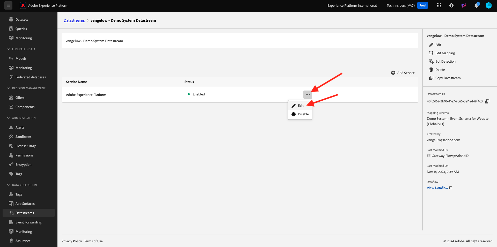
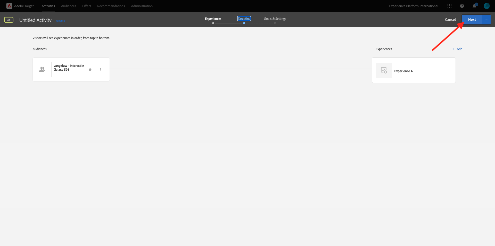

# 2.3.5 Action : envoyez votre segment à Adobe Target

Accédez à [Adobe Experience Platform](https://experience.adobe.com/platform). Une fois connecté, vous accédez à la page d’accueil de Adobe Experience Platform.


Avant de continuer, vous devez sélectionner un **sandbox**. L’environnement de test à sélectionner est nommé ``--aepSandboxName--``. Pour ce faire, cliquez sur le texte **[!UICONTROL Production Prod]** dans la ligne bleue en haut de votre écran. Après avoir sélectionné l’[!UICONTROL sandbox] approprié, vous verrez le changement d’écran et vous êtes désormais dans votre [!UICONTROL sandbox] dédié.


## 2.3.5.1 Vérification du flux de données

La destination Adobe Target dans Real-Time CDP est connectée à la banque de données utilisée pour ingérer des données dans le réseau Edge d’Adobe. Si vous souhaitez définir votre destination Adobe Target, vous devez d’abord vérifier si votre flux de données est déjà activé pour Adobe Target. Votre jeu de données a été configuré dans l’ [exercice 0.2 de création de votre flux de données](./../../../modules/gettingstarted/gettingstarted/ex2.md) et a été nommé `--aepUserLdap-- - Demo System Datastream`.

Accédez à [https://experience.adobe.com/#/data-collection/](https://experience.adobe.com/#/data-collection/), puis cliquez sur **Datastreams** ou **Datastreams (Beta)**.


Dans le coin supérieur droit de votre écran, sélectionnez le nom de votre environnement de test, qui doit être `--aepSandboxName--`.


Dans les flux de données, recherchez votre flux de données nommé `--aepUserLdap-- - Demo System Datastream`. Cliquez sur votre flux de données pour l’ouvrir.


Vous verrez alors ceci, cliquez sur **...** en regard de **Adobe Experience Platform**, puis cliquez sur **Modifier**.



Cochez les cases correspondant à la **segmentation Edge** et aux **destinations Personalization**. Cliquez sur **Enregistrer**.


Cliquez ensuite sur **+ Ajouter un service**.


Sélectionnez le service **Adobe Target**. Cliquez sur **Enregistrer**.


Votre flux de données est maintenant configuré pour Adobe Target.


## 2.3.5.2 Configuration de la destination Adobe Target

Adobe Target est disponible en tant que destination depuis Real-Time CDP. Pour configurer votre intégration Adobe Target, accédez à **Destinations**, à **Catalogue**.


Cliquez sur **Personalization** dans le menu **Catégories** . Vous verrez ensuite la carte de destination **Adobe Target**. Cliquez sur **Activer les segments** (ou **Configurer** en fonction de votre environnement).


Selon votre environnement, vous devrez peut-être cliquer sur **+ Configurer une nouvelle destination** pour commencer à créer votre destination.


Vous verrez alors ceci.


Dans l&#39;écran **Configurer une nouvelle destination**, vous devez configurer deux éléments :

- Nom : utilisez le nom `--aepUserLdap-- - Adobe Target (Web)`, qui doit ressembler à ceci : **vangeluw - Adobe Target (Web)**.
- Identifiant de la banque de données : vous devez sélectionner la banque de données que vous avez configurée dans l’ [exercice 0.2 Création de la banque de données](./../../../modules/gettingstarted/gettingstarted/ex2.md). Le nom de votre flux de données doit être : `--aepUserLdap-- - Demo System Datastream`.

Cliquez sur **Suivant**.


Dans l’écran suivant, vous pouvez éventuellement sélectionner une stratégie de gouvernance. Il n’est pas nécessaire d’en sélectionner une, dans ce cas, il n’est pas nécessaire d’en sélectionner une, alors cliquez sur **Créer**.


Votre destination est maintenant créée et s’affichera dans la liste. Sélectionnez votre destination et cliquez sur **Suivant** pour commencer à envoyer des segments vers votre destination.


Dans la liste des segments disponibles, sélectionnez le segment que vous avez créé dans [Exercice 6.1 Create a segment](./ex1.md), nommé `--aepUserLdap-- - Interest in PROTEUS FITNESS JACKSHIRT`. Cliquez ensuite sur **Suivant**.


Sur la page suivante, cliquez sur **Suivant**.


Cliquez sur **Terminer**.


Votre segment est maintenant activé vers Adobe Target.


>[!IMPORTANT]
>
>Lorsque vous venez de créer votre destination Adobe Target dans Real-Time CDP, la mise en service de cette destination peut prendre jusqu’à une heure. Il s’agit d’un temps d’attente ponctuel, en raison de la configuration du serveur principal. Une fois la configuration initiale du temps d’attente d’une heure et du serveur principal terminée, les segments de périphérie nouvellement ajoutés envoyés à la destination Adobe Target seront disponibles pour le ciblage en temps réel.

## 2.3.5.3 Configuration de votre activité Adobe Target basée sur les formulaires

Maintenant que votre segment Real-Time CDP est configuré pour être envoyé à Adobe Target, vous pouvez configurer votre activité de ciblage d’expérience dans Adobe Target. Dans cet exercice, vous allez configurer une activité d’après les formulaires.

Accédez à la page d’accueil de Adobe Experience Cloud en vous rendant sur [https://experiencecloud.adobe.com/](https://experiencecloud.adobe.com/). Cliquez sur **Target** pour l’ouvrir.


Sur la page d’accueil **Adobe Target**, vous verrez toutes les activités existantes.


Cliquez sur **+ Créer une activité** pour créer une activité.


Sélectionnez **Ciblage d’expérience**.


Sélectionnez **Form** et **No Property Restrictions**. Cliquez sur **Suivant**.


Vous vous trouvez maintenant dans le compositeur d’activité d’après les formulaires.


Pour le champ **LOCATION 1**, sélectionnez **target-global-mbox**.


L’audience par défaut est actuellement **Tous les visiteurs**. Cliquez sur le **3 points** en regard de **Tous les visiteurs** et cliquez sur **Changer d’audience**.


La liste des audiences disponibles s’affiche désormais. Le segment Adobe Experience Platform que vous avez créé précédemment et que vous avez envoyé à Adobe Target fait désormais partie de cette liste. Sélectionnez le segment que vous avez précédemment créé dans Adobe Experience Platform. Cliquez sur **Attribuer une audience**.


Votre segment Adobe Experience Platform fait désormais partie de cette activité de ciblage d’expérience.


Changeons maintenant l&#39;image du héros sur la page d&#39;accueil du site web. Cliquez pour ouvrir la liste déroulante en regard de **Contenu par défaut** et cliquez sur **Créer une offre d’HTML**.


Collez le code suivant. Cliquez ensuite sur **Suivant**.

```javascript
<script>document.querySelector("#home > div > div > div > div > div.banner_img.d-none.d-lg-block > img").src="https://parsefiles.back4app.com/hgJBdVOS2eff03JCn6qXXOxT5jJFzialLAHJixD9/ff92fdc3885972c0090ad5419e0ef4d4_Luma - Product - Proteus - Hero Banner.png"; document.querySelector(".banner_text > *").remove()</script>
```


Vous verrez ensuite la nouvelle expérience avec la nouvelle image, pour le public sélectionné.



Cliquez sur le titre de votre activité dans le coin supérieur gauche pour la renommer.


Pour le nom, veuillez utiliser :

- `--aepUserLdap-- - RTCDP - XT (Form)`


Cliquez sur **Suivant**.


Sur la page **Objectifs et paramètres** - , accédez à **Mesures d’objectif**.


Définissez l’objectif Principal sur **Engagement** - **Temps passé sur le site**.


Cliquez sur **Enregistrer et fermer**.


Vous vous trouvez maintenant sur la page **Aperçu de l’activité**. Vous devez toujours activer votre activité.


Cliquez sur le champ **Inactif** et sélectionnez **Activer**.


Vous obtiendrez alors une confirmation visuelle que votre activité est maintenant active.


Votre activité est maintenant en ligne et peut être testée sur le site web de démonstration.

>[!IMPORTANT]
>
>Lorsque vous venez de créer votre destination Adobe Target dans Real-Time CDP, la mise en service de cette destination peut prendre jusqu’à une heure. Il s’agit d’un temps d’attente ponctuel, en raison de la configuration du serveur principal. Une fois la configuration initiale du temps d’attente d’une heure et du serveur principal terminée, les segments de périphérie nouvellement ajoutés envoyés à la destination Adobe Target seront disponibles pour le ciblage en temps réel.

Si vous revenez maintenant à votre site web de démonstration et que vous visitez la page du produit pour PROTEUS FITNESS JACKSHIRT, vous serez immédiatement admissible pour le segment que vous avez créé et l’activité Adobe Target s’affichera sur la page d’accueil en temps réel.


Étape suivante : [2.3.6 External Audiences](./ex6.md)

[Revenir au module 2.3](./real-time-cdp-build-a-segment-take-action.md)

[Revenir à tous les modules](../../../overview.md)
