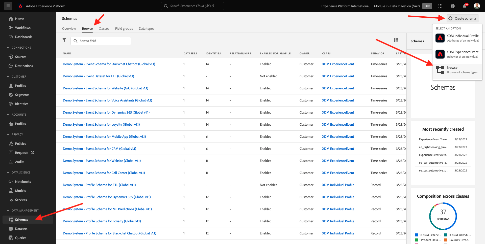
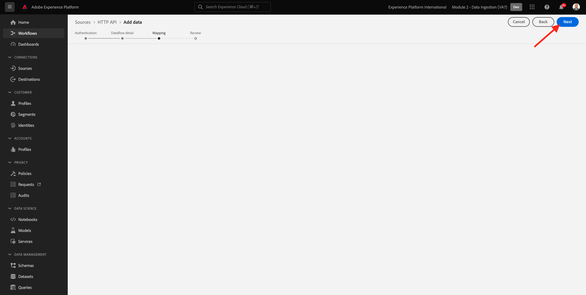

# 2.3.6 Audiences externes

Dans de nombreux cas, votre entreprise peut vouloir utiliser les audiences existantes d’autres applications pour enrichir le profil client dans Adobe Experience Platform.
Ces audiences externes peuvent avoir été définies en fonction d’un modèle de science des données ou à l’aide de plateformes de données externes.

La fonctionnalité d&#39;audiences externes de Adobe Experience Platform vous permet de vous concentrer sur l&#39;ingestion des audiences externes et leur activation sans avoir à redéfinir en détail la définition de l&#39;audience correspondante dans Adobe Experience Platform.

Le processus global se divise en trois grandes étapes :

- Importez les métadonnées d’audience externe : cette étape est destinée à ingérer les métadonnées d’audience externe, telles que le nom de l’audience, dans Adobe Experience Platform.
- Affectez l’appartenance à l’audience externe au profil client : cette étape est destinée à enrichir le profil client avec l’attribut d’appartenance aux audiences externes.
- Créer les audiences dans Adobe Experience Platform : cette étape est destinée à créer des audiences exploitables basées sur l’appartenance aux audiences externes.

## Métadonnées

Accédez à [Adobe Experience Platform](https://experience.adobe.com/platform). Une fois connecté, vous accédez à la page d’accueil de Adobe Experience Platform.


>[!IMPORTANT]
>
>L’environnement de test à utiliser pour cet exercice est ``--aepSandboxName--`` !

Avant de continuer, vous devez sélectionner un **sandbox**. L’environnement de test à sélectionner est nommé ``--aepSandboxName--``. Après avoir sélectionné l’[!UICONTROL sandbox] approprié, vous verrez le changement d’écran et vous êtes désormais dans votre [!UICONTROL sandbox] dédié.


Bien que les données d’audience définissent la condition pour qu’un profil fasse partie d’une audience, les métadonnées d’audience sont des informations sur l’audience telles que le nom, la description et l’état de l’audience. Les métadonnées d’audience externe étant stockées dans Adobe Experience Platform, vous devez utiliser un espace de noms d’identité pour ingérer les métadonnées dans Adobe Experience Platform.

## 2.3.6.1.1 Espace de noms d’identité pour les audiences externes

Un espace de noms d’identité a déjà été créé pour l’utilisation avec **Audiences externes**.
Pour afficher l’identité qui a déjà été créée, accédez à **Identités** et recherchez **Externe**. Cliquez sur l’élément &quot;Audiences externes&quot;.

Remarque :

- Le symbole d’identité **externalaudiences** sera utilisé dans les étapes suivantes pour faire référence à l’identité des audiences externes.
- Le type **Identifiant de non-personne** est utilisé pour cet espace de noms d’identité, car cet espace de noms n’est pas destiné à identifier les profils de client mais les audiences.


## 2.3.6.1.2 Création du schéma de métadonnées Audiences externes

Les métadonnées d’audiences externes sont basées sur le **schéma de définition d’audience**. Vous trouverez plus d’informations dans le [référentiel XDM Github](https://github.com/adobe/xdm/blob/master/docs/reference/classes/segmentdefinition.schema.md).

Dans le menu de gauche, accédez à Schémas. Cliquez sur **+ Créer un schéma**, puis sur **Parcourir**.



Pour attribuer une classe, recherchez **définition d’audience**. Sélectionnez la classe **Définition de l’audience** et cliquez sur **Attribuer une classe**.


Vous verrez alors ceci. Cliquez sur **Annuler**.


Vous verrez alors ceci. Sélectionnez le champ **_id**. Dans le menu de droite, faites défiler l’écran vers le bas et activez les cases à cocher **Identité** et **Identité par Principal** . Sélectionnez l’espace de noms d’identité **Audiences externes** . Cliquez sur **Appliquer**.


Sélectionnez ensuite le nom du schéma **Schéma sans titre**. Modifiez le nom en `--aepUserLdap-- - External Audiences Metadata`.


Activez le bouton bascule **Profile** et confirmez. Enfin, cliquez sur **Enregistrer**.


## 2.3.6.1.3 Création du jeu de données de métadonnées Audiences externes

Dans **Schémas**, accédez à **Parcourir**. Recherchez et cliquez sur le schéma `--aepUserLdap-- - External Audiences Metadata` que vous avez créé à l’étape précédente. Cliquez ensuite sur **Créer un jeu de données à partir d’un schéma**.


Pour le champ **Name**, saisissez `--aepUserLdap-- - External Audience Metadata`. Cliquez sur **Créer un jeu de données**.


Vous verrez alors ceci. N’oubliez pas d’activer la bascule **Profile** .


## 2.3.6.1.4 Création d’une connexion Source d’API HTTP

Ensuite, vous devez configurer l’API HTTP Source Connector que vous utiliserez pour ingérer les métadonnées dans le jeu de données.

Accédez à **Sources**. Dans le champ de recherche, saisissez **HTTP**. Cliquez sur **Ajouter des données**.


Renseignez les informations suivantes :

- **Type de compte** : sélectionnez **Nouveau compte**
- **Nom du compte** : saisissez `--aepUserLdap-- - External Audience Metadata`
- Cochez la case **Case compatible XDM**

Cliquez ensuite sur **Se connecter à la source**.


Vous verrez alors ceci. Cliquez sur **Suivant**.


Sélectionnez **Jeu de données existant** et dans le menu déroulant, recherchez et sélectionnez le jeu de données `--aepUserLdap-- - External Audience Metadata`.

Vérifiez les **détails du flux de données**, puis cliquez sur **Suivant**.


Vous verrez alors ceci.

L’étape **Mapping** de l’assistant est vide car vous ingérez une payload compatible XDM dans le connecteur Source de l’API HTTP. Aucun mappage n’est donc nécessaire. Cliquez sur **Suivant**.



À l’étape **Réviser**, vous pouvez éventuellement passer en revue les détails de connexion et de mappage. Cliquez sur **Terminer**.


Vous verrez alors ceci.


## 2.3.6.1.5 Ingestion des métadonnées d’audience externe

Dans l’onglet de présentation de Source Connector, cliquez sur **...**, puis sur **Copier la payload du schéma**.


Ouvrez l’application de l’éditeur de texte sur votre ordinateur et collez la charge utile que vous venez de copier, qui ressemble à ceci. Ensuite, vous devez mettre à jour l’objet **xdmEntity** dans cette payload.


L’objet **xdmEntity** doit être remplacé par le code ci-dessous. Copiez le code ci-dessous et collez-le dans votre fichier texte en remplaçant l’objet **xdmEntity** dans l’éditeur de texte.

```
"xdmEntity": {
    "_id": "--aepUserLdap---extaudience-01",
    "description": "--aepUserLdap---extaudience-01 description",
    "segmentIdentity": {
      "_id": "--aepUserLdap---extaudience-01",
      "namespace": {
        "code": "externalaudiences"
      }
    },
    "segmentName": "--aepUserLdap---extaudience-01 name",
    "segmentStatus": "ACTIVE",
    "version": "1.0"
  }
```

Vous devriez alors voir ceci :


Ouvrez ensuite une nouvelle fenêtre **Terminal**. Copiez tout le texte de votre éditeur de texte et collez-le dans la fenêtre du terminal.


Ensuite, appuyez sur **Entrée**.

Une confirmation de l’ingestion des données s’affiche alors dans la fenêtre Terminal :


Actualisez l’écran du connecteur HTTP API Source, où vous verrez maintenant que les données sont en cours de traitement :


## 2.3.6.1.6 Validation de l’ingestion des métadonnées des audiences externes

Une fois le traitement terminé, vous pouvez vérifier la disponibilité des données dans le jeu de données à l’aide de Query Service.

Dans le menu de droite, accédez à **Jeux de données** et sélectionnez le jeu de données `--aepUserLdap-- - External Audience Metadata` que vous avez créé précédemment.


Dans le menu de droite, accédez à Requêtes et cliquez sur **Créer une requête**.


Saisissez le code suivant, puis appuyez sur **Maj + ENTER** :

```
select * from --aepUserLdap--_external_audience_metadata
```

Dans les résultats de la requête, vous verrez les métadonnées de l’audience externe que vous avez ingérées.


## Appartenance à une audience

Les métadonnées d’audience externe étant disponibles, vous pouvez désormais ingérer l’appartenance à l’audience pour un profil client spécifique.

Vous devez maintenant préparer un jeu de données de profil enrichi par rapport au schéma d’appartenance à l’audience. Vous trouverez plus d’informations dans le [référentiel XDM Github](https://github.com/adobe/xdm/blob/master/docs/reference/datatypes/segmentmembership.schema.md).

### Création du schéma d’adhésion aux audiences externes

Dans le menu de droite, accédez à **Schémas**. Cliquez sur **Créer un schéma**, puis sur **XDM Individual Profile**.


Dans la fenêtre contextuelle **Ajouter des groupes de champs**, recherchez **Profile Core**. Sélectionnez le groupe de champs **Profile Core v2** .


Ensuite, dans la fenêtre contextuelle **Ajouter des groupes de champs**, recherchez **Appartenance au segment**. Sélectionnez le groupe de champs **Détails de l’appartenance au segment** . Cliquez ensuite sur **Ajouter des groupes de champs**.


Vous verrez alors ceci. Accédez au champ `--aepTenantId--.identification.core`. Cliquez sur le champ **crmId** . Dans le menu de droite, faites défiler l’écran vers le bas et cochez les cases **Identité** et **Identité par Principal** . Pour l’**espace de noms d’identité**, sélectionnez **Demo System - CRMID**.

Cliquez sur **Appliquer**.


Sélectionnez ensuite le nom du schéma **Schéma sans titre**. Dans le champ du nom d&#39;affichage, saisissez `--aepUserLdap-- - External Audiences Membership`.


Ensuite, activez le bouton d’activation/désactivation **Profile** et confirmez. Cliquez sur **Enregistrer**.


### Création du jeu de données d’adhésion aux audiences externes

Dans **Schémas**, accédez à **Parcourir**. Recherchez et cliquez sur le schéma `--aepUserLdap-- - External Audiences Membership` que vous avez créé à l’étape précédente. Cliquez ensuite sur **Créer un jeu de données à partir d’un schéma**.


Pour le champ **Name**, saisissez `--aepUserLdap-- - External Audiences Membership`. Cliquez sur **Créer un jeu de données**.


Vous verrez alors ceci. N’oubliez pas d’activer la bascule **Profile** .


### Création d’une connexion Source d’API HTTP


Ensuite, vous devez configurer l’API HTTP Source Connector que vous utiliserez pour ingérer les métadonnées dans le jeu de données.

Accédez à **Sources**. Dans le champ de recherche, saisissez **HTTP**. Cliquez sur **Ajouter des données**.


Renseignez les informations suivantes :

- **Type de compte** : sélectionnez **Nouveau compte**
- **Nom du compte** : saisissez `--aepUserLdap-- - External Audience Membership`
- Cochez la case **Case compatible XDM**

Cliquez ensuite sur **Se connecter à la source**.


Vous verrez alors ceci. Cliquez sur **Suivant**.


Sélectionnez **Jeu de données existant** et dans le menu déroulant, recherchez et sélectionnez le jeu de données `--aepUserLdap-- - External Audiences Membership`.

Vérifiez les **détails du flux de données**, puis cliquez sur **Suivant**.


Vous verrez alors ceci.

L’étape **Mapping** de l’assistant est vide car vous ingérez une payload compatible XDM dans le connecteur Source de l’API HTTP. Aucun mappage n’est donc nécessaire. Cliquez sur **Suivant**.


À l’étape **Réviser**, vous pouvez éventuellement passer en revue les détails de connexion et de mappage. Cliquez sur **Terminer**.


Vous verrez alors ceci.


### Ingestion des données d’adhésion d’audiences externes

Dans l’onglet de présentation de Source Connector, cliquez sur **...**, puis sur **Copier la payload du schéma**.


Ouvrez l’application de l’éditeur de texte sur votre ordinateur et collez la charge utile que vous venez de copier, qui ressemble à ceci. Ensuite, vous devez mettre à jour l’objet **xdmEntity** dans cette payload.


L’objet **xdmEntity** doit être remplacé par le code ci-dessous. Copiez le code ci-dessous et collez-le dans votre fichier texte en remplaçant l’objet **xdmEntity** dans l’éditeur de texte.

```
  "xdmEntity": {
    "_id": "--aepUserLdap---profile-test-01",
    "_experienceplatform": {
      "identification": {
        "core": {
          "crmId": "--aepUserLdap---profile-test-01"
        }
      }
    },
    "personID": "--aepUserLdap---profile-test-01",
    "segmentMembership": {
      "externalaudiences": {
        "--aepUserLdap---extaudience-01": {
          "status": "realized",
          "lastQualificationTime": "2022-03-05T00:00:00Z"
        }
      }
    }
  }
```

Vous devriez alors voir ceci :


Ouvrez ensuite une nouvelle fenêtre **Terminal**. Copiez tout le texte de votre éditeur de texte et collez-le dans la fenêtre du terminal.


Ensuite, appuyez sur **Entrée**.

Une confirmation de l’ingestion des données s’affiche alors dans la fenêtre Terminal :


Actualisez l’écran du connecteur HTTP API Source où, au bout de quelques minutes, vous verrez que les données sont en cours de traitement :


### Validation de l’ingestion des membres d’audiences externes

Une fois le traitement terminé, vous pouvez vérifier la disponibilité des données dans le jeu de données à l’aide de Query Service.

Dans le menu de droite, accédez à **Jeux de données** et sélectionnez le jeu de données `--aepUserLdap-- - External Audiences Membership ` que vous avez créé précédemment.


Dans le menu de droite, accédez à Requêtes et cliquez sur **Créer une requête**.


Saisissez le code suivant, puis appuyez sur **Maj + ENTER** :

```
select * from --aepUserLdap--_external_audiences_membership
```

Dans les résultats de la requête, vous verrez les métadonnées de l’audience externe que vous avez ingérées.


## Création d’un segment

Vous êtes maintenant prêt à agir sur les audiences externes.
Dans Adobe Experience Platform, l’action est réalisée en créant des segments, en renseignant les audiences respectives et en partageant ces audiences vers les destinations.
Vous allez maintenant créer un segment à l’aide de l’audience externe que vous venez de créer.

Dans le menu de gauche, accédez à **Segments** et cliquez sur **Créer un segment**.


Accédez à **Audiences**. Vous verrez alors ceci. Cliquez sur **Audiences externes**.


Sélectionnez l’audience externe que vous avez créée précédemment, appelée `--aepUserLdap---extaudience-01`. Faites glisser l’audience sur la zone de travail.


Attribuez un nom à votre segment, utilisez `--aepUserLdap-- - extaudience-01`. Cliquez sur **Enregistrer et fermer**.


Vous verrez alors ceci. Vous remarquerez également que le profil pour lequel vous avez ingéré l’adhésion au segment s’affiche désormais dans la liste de **Sample Profiles**.


Votre segment est maintenant prêt et peut être envoyé vers une destination pour activation.

## Visualiser votre profil client

Vous pouvez désormais également visualiser la qualification du segment sur votre profil client. Accédez à **Profils**, utilisez l’espace de noms d’identité **Demo System - CRMID** et fournissez l’identité `--aepUserLdap---profile-test-01`, que vous avez utilisée dans le cadre de l’exercice 6.6.2.4, puis cliquez sur **Afficher**. Cliquez ensuite sur l’ **ID de profil** pour ouvrir le profil.


Accédez à **Appartenance au segment**, où s’affiche votre audience externe.


Étape suivante : [2.3.7 Destinations SDK](./ex7.md)

[Revenir au module 2.3](./real-time-cdp-build-a-segment-take-action.md)

[Revenir à tous les modules](../../../overview.md)
