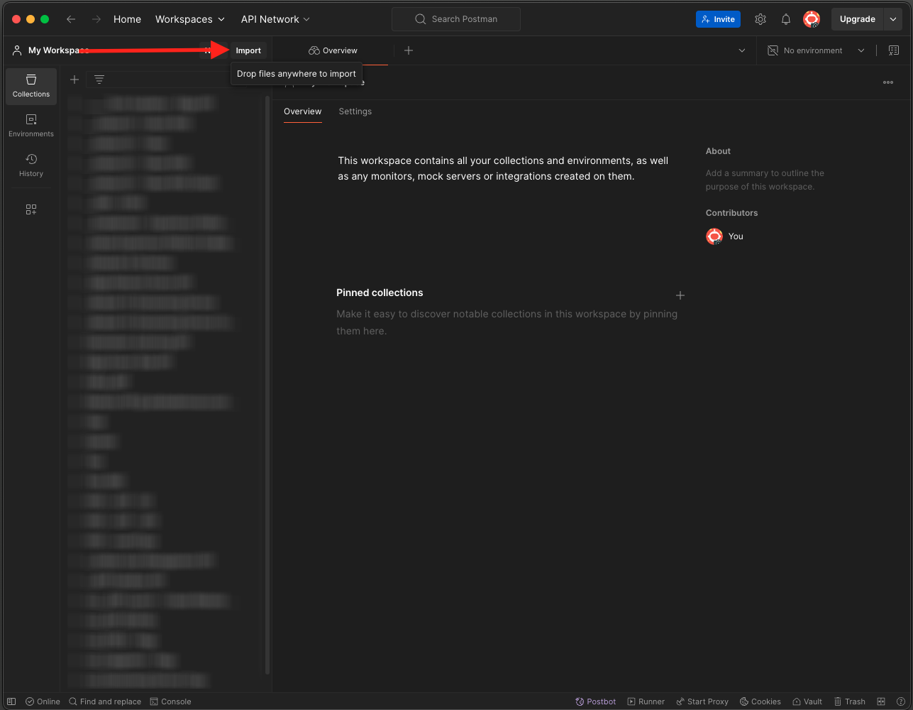
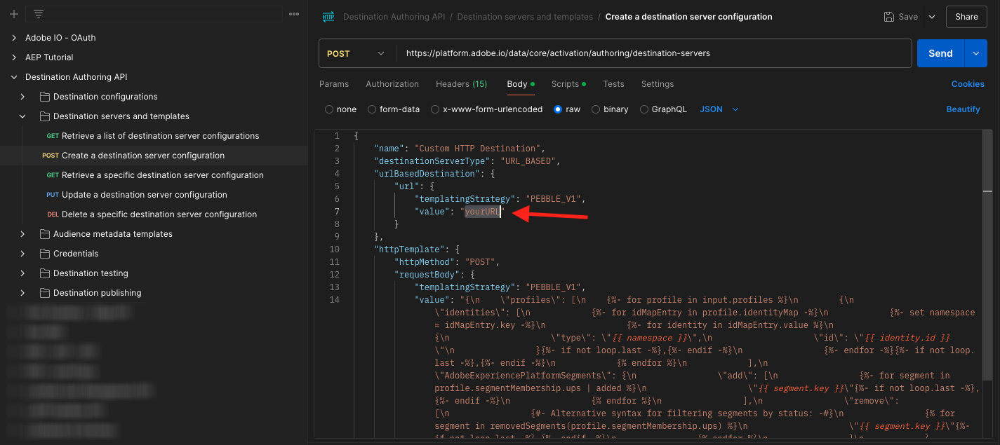
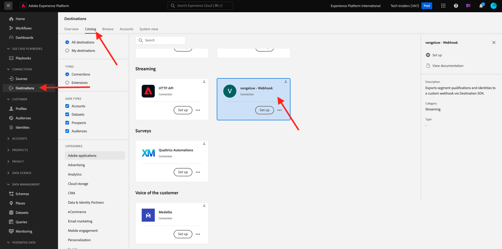

# SDK de destinations 2.3.7

## 2.3.7.1 Configuration de votre projet Adobe I/O

>[!IMPORTANT]
>
>Si vous avez créé votre projet Adobe I/O après décembre 2021, vous pouvez le réutiliser, ignorer cet exercice et passer immédiatement à l’exercice 6.7.2.
>
>Si vous avez créé votre projet Adobe I/O avant décembre 2021, créez un projet pour vous assurer qu’il est compatible avec l’API de création de destinations.

Dans cet exercice, vous utiliserez l’Adobe I/O de manière très intensive pour effectuer des requêtes sur les API de Platform. Suivez les étapes ci-dessous pour configurer l’Adobe I/O.

Accédez à [https://developer.adobe.com/console/home](https://developer.adobe.com/console/home)


Veillez à sélectionner l’instance Adobe Experience Platform appropriée dans le coin supérieur droit de votre écran. Votre instance est `--envName--`.


Cliquez sur **Créer un projet**.

 ou


Sélectionnez **+ Ajouter au projet** et sélectionnez **API**.


Vous verrez alors :


Cliquez sur l’icône **Adobe Experience Platform** .


Cliquez sur **API Experience Platform**.


Cliquez sur **Suivant**.


Vous pouvez désormais choisir de faire en sorte qu’Adobe I/O génère votre paire de clés de sécurité ou de télécharger une paire existante.

Sélectionnez **Option 1 - Générer une paire de clés**.


Cliquez sur **Générer la paire de clés**.


Vous verrez un compteur pendant environ 30 secondes.


Vous verrez alors ceci, et votre paire de clés générée sera téléchargée sous la forme d’un fichier zip : **config.zip**.

Décompressez le fichier **config.zip** sur votre bureau. Il contient 2 fichiers :


- **certificate_pub.crt** est votre certificat de clé publique. Du point de vue de la sécurité, il s’agit du certificat librement utilisé pour configurer des intégrations à des applications en ligne.
- **private.key** est votre clé privée. Ça ne devrait jamais, jamais être partagé avec qui que ce soit. La clé privée est ce que vous utilisez pour vous authentifier à votre implémentation d’API et est censée être un secret. Si vous partagez votre clé privée avec n’importe qui, il peut accéder à votre implémentation et utiliser l’API pour ingérer des données malveillantes dans Platform et extraire toutes les données qui se trouvent dans Platform.


Veillez à enregistrer le fichier **config.zip** dans un emplacement sécurisé, car vous en aurez besoin pour les étapes suivantes et pour un accès futur aux API Adobe I/O et Adobe Experience Platform.

Cliquez sur **Suivant**.


Vous devez maintenant sélectionner le **profil(s) produit(s)** pour votre intégration.

Sélectionnez les profils de produit requis.

**FYI** : dans votre instance Adobe Experience Platform, les profils de produit auront un nom différent. Vous devez sélectionner au moins un profil de produit avec les droits d’accès appropriés, qui sont configurés dans Adobe Admin Console.


Cliquez sur **Enregistrer l’API configurée**.


Vous verrez un compteur pendant quelques secondes.


Et ensuite, vous verrez votre intégration.


Cliquez sur le bouton **Télécharger pour Postman** , puis sur **Compte de service (JWT)** pour télécharger un environnement Postman (attendez que l’environnement soit téléchargé, ce qui peut prendre quelques secondes).


Faites défiler l’écran jusqu’à ce que vous voyiez **Compte de service (JWT)**, où vous trouverez tous les détails de votre intégration utilisés pour configurer l’intégration avec Adobe Experience Platform.


Votre projet d’E/S a actuellement un nom générique. Vous devez donner un nom convivial à votre intégration. Cliquez sur **Projet 1** (ou un nom similaire) comme indiqué


Cliquez sur **Modifier le projet**.


Saisissez un nom et une description pour votre intégration. Par convention, nous utiliserons `AEP API --demoProfileLdap--`. Remplacez ldap par votre ldap.
Par exemple, si votre ldap est vangeluw, le nom et la description de votre intégration deviennent vangeluw de l’API AEP.

Saisissez `AEP API --demoProfileLdap--` comme **Titre du projet**. Cliquez sur **Enregistrer**.


L’intégration de votre Adobe I/O est maintenant terminée.


## 2.3.7.2 Authentification Postman à Adobe I/O

Accédez à [https://www.getpostman.com/](https://www.getpostman.com/).

Cliquez sur **Commencer**.


Ensuite, téléchargez et installez Postman.


Après l’installation de Postman, démarrez l’application.

Dans Postman, il existe deux concepts : Environnements et Collections.

- L’environnement contient toutes vos variables d’environnement qui sont plus ou moins cohérentes. Dans l’environnement, vous trouverez des éléments tels que l’IMSOrg de notre environnement Platform, ainsi que des informations d’identification de sécurité telles que votre clé privée et d’autres. Le fichier d’environnement est celui que vous avez téléchargé lors de la configuration de l’Adobe I/O dans l’exercice précédent. Il s’appelle comme suit : **service.postman_environment.json**.

- La collection contient un certain nombre de requêtes d’API que vous pouvez utiliser. Nous utiliserons 2 collections
   - 1 collection pour l’authentification pour Adobe I/0
   - 1 Collection pour les exercices de ce module
   - 1 collection pour les exercices dans le module Real-Time CDP, pour la création de destination

Téléchargez le fichier [postman.zip](./../../../assets/postman/postman_profile.zip) sur votre bureau local.

Dans ce fichier **postman.zip**, vous trouverez les fichiers suivants :

- `_Adobe I-O - Token.postman_collection.json`
- `_Adobe Experience Platform Enablement.postman_collection.json`
- `Destination_Authoring_API.json`

Décompressez le fichier **postman.zip** et stockez ces 3 fichiers dans un dossier sur votre bureau, ainsi que dans l’environnement Postman téléchargé depuis Adobe I/O. Ce dossier doit contenir les 4 fichiers suivants :


Revenez à Postman. Cliquez sur **Importer**.



Cliquez sur **Télécharger des fichiers**.


Accédez au dossier de votre bureau dans lequel vous avez extrait les 4 fichiers téléchargés. Sélectionnez ces 4 fichiers en même temps et cliquez sur **Ouvrir**.


Après avoir cliqué sur **Ouvrir**, Postman vous présente un aperçu de l’environnement et des collections que vous êtes sur le point d’importer. Cliquez sur **Importer**.


Vous avez désormais tout ce dont vous avez besoin dans Postman pour commencer à interagir avec Adobe Experience Platform par le biais des API.

La première chose à faire est de vous assurer que vous êtes correctement authentifié. Pour être authentifié, vous devez demander un jeton d’accès.

Assurez-vous que l’environnement approprié est sélectionné avant d’exécuter une requête. Vous pouvez vérifier l’environnement actuellement sélectionné en vérifiant la liste déroulante Environnement dans le coin supérieur droit.

L’environnement sélectionné doit porter un nom similaire à celui-ci :


Cliquez sur l’icône **eye** , puis sur **Modifier** pour mettre à jour la clé privée dans le fichier d’environnement.


Vous verrez alors ceci. Tous les champs sont prérenseignés, à l’exception du champ **PRIVATE_KEY**.


La clé privée a été générée lorsque vous avez créé votre projet Adobe I/O. Il a été téléchargé sous la forme d’un fichier zip, nommé **config.zip**. Extrayez ce fichier zip sur votre bureau.


Ouvrez le dossier **config** et ouvrez le fichier **private.key** avec votre éditeur de texte de votre choix.


Vous verrez alors quelque chose qui ressemble à ça, copiez tout le texte dans le presse-papiers.


Revenez à Postman et collez la clé privée dans les champs en regard de la variable **PRIVATE_KEY**, pour les colonnes **VALEUR INITIALE** et **VALEUR ACTUELLE**. Cliquez sur **Enregistrer**.


Votre environnement et vos collections Postman sont maintenant configurés et fonctionnent. Vous pouvez désormais vous authentifier de Postman vers Adobe I/O.

Pour ce faire, vous devez charger une bibliothèque externe qui prendra en charge le cryptage et le décryptage de la communication. Pour charger cette bibliothèque, vous devez exécuter la requête avec le nom **INIT: Load Crypto Library for RS256**. Sélectionnez cette requête dans la **_Adobe I/O - collection de jetons** et elle s’affichera au milieu de votre écran.


Cliquez sur le bouton bleu **Send** . Au bout de quelques secondes, une réponse devrait s’afficher dans la section **Body** de Postman :


Une fois la bibliothèque de cryptage chargée, nous pouvons nous authentifier sur Adobe I/O.

Dans la **\_Adobe I/O - Collection de jetons**, sélectionnez la requête avec le nom **IMS: JWT Generate + Auth**. Là encore, les détails de la requête s’affichent au milieu de l’écran.


Cliquez sur le bouton bleu **Send** . Au bout de quelques secondes, une réponse devrait s’afficher dans la section **Body** de Postman :


Si votre configuration a réussi, vous devriez voir une réponse similaire contenant les informations suivantes :

| Clé | Valeur |
|:-------------:| :---------------:| 
| token_type | **bearer** |
| access_token | **eyJ4NXUiOiJpbXNfbmEx...QT7mqZkumN1tdsPEioOEl4087Dg** |
| expires_in | **86399973** |

Adobe I/O vous a donné un jeton **porteur**, avec une valeur spécifique (ce jeton d’accès très long) et une fenêtre d’expiration.

Le jeton que nous avons reçu est maintenant valide pendant 24 heures. Cela signifie qu’au bout de 24 heures, si vous souhaitez utiliser Postman pour vous authentifier sur Adobe I/O, vous devrez générer un nouveau jeton en exécutant à nouveau cette requête.

## 2.3.7.3 Définition du point de fin et du format

Pour cet exercice, vous aurez besoin d’un point de terminaison afin que, lorsqu’un segment est admissible, l’événement de qualification puisse être diffusé en continu vers ce point de terminaison. Dans cet exercice, vous utiliserez un exemple de point de terminaison à l’aide de [https://webhook.site/](https://webhook.site/). Accédez à [https://webhook.site/](https://webhook.site/), où vous trouverez quelque chose de similaire. Cliquez sur **Copier dans le presse-papiers** pour copier l’URL. Vous devrez spécifier cette URL lors de l’exercice suivant. L’URL dans cet exemple est `https://webhook.site/e0eb530c-15b4-4a29-8b50-e40877d5490a`.


En ce qui concerne le format, nous utiliserons un modèle standard qui diffusera les qualifications ou les qualifications de segments avec des métadonnées telles que les identifiants de client. Les modèles peuvent être personnalisés pour répondre aux attentes de points de terminaison spécifiques, mais dans cet exercice, nous réutiliserons un modèle standard, ce qui entraînera une payload comme celle-ci, qui sera diffusée en continu vers le point de terminaison .

```json
{
  "profiles": [
    {
      "identities": [
        {
          "type": "ecid",
          "id": "64626768309422151580190219823409897678"
        }
      ],
      "AdobeExperiencePlatformSegments": {
        "add": [
          "f58c723c-f1e5-40dd-8c79-7bb4ab47f041"
        ],
        "remove": []
      }
    }
  ]
}
```

## 2.3.7.4 Créer une configuration de serveur et de modèle

La première étape de la création de votre propre destination dans Adobe Experience Platform consiste à créer une configuration de serveur et de modèle.

Pour ce faire, accédez à **API de création de destination**, à **Serveurs et modèles de destination** et cliquez pour ouvrir la requête **POST - Créer une configuration de serveur de destination**. Vous verrez alors ceci. Sous **Headers**, vous devez mettre à jour manuellement la valeur de la clé **x-sandbox-name** et la définir sur `--aepSandboxId--`. Sélectionnez la valeur **{{SANDBOX_NAME}}**.


Remplacez-le par `--aepSandboxId--`.


Ensuite, accédez à **Body**. sélectionnez l’espace réservé **{{body}}**.


Vous devez maintenant remplacer l’espace réservé **{{body}}** par le code ci-dessous :

```json
{
    "name": "Custom HTTP Destination",
    "destinationServerType": "URL_BASED",
    "urlBasedDestination": {
        "url": {
            "templatingStrategy": "PEBBLE_V1",
            "value": "yourURL"
        }
    },
    "httpTemplate": {
        "httpMethod": "POST",
        "requestBody": {
            "templatingStrategy": "PEBBLE_V1",
            "value": "{\n    \"profiles\": [\n    \n        {\n            \"identities\": [\n            \n            \n                \n                {\n                    \"type\": \"{{ namespace }}\",\n                    \"id\": \"{{ identity.id }}\"\n                },\n                ,\n            \n            ],\n            \"AdobeExperiencePlatformSegments\": {\n                \"add\": [\n                \n                    \"{{ segment.key }}\",\n                \n                ],\n                \"remove\": [\n                {#- Alternative syntax for filtering segments by status: -#}\n                \n                    \"{{ segment.key }}\",\n                \n                ]\n            }\n        },\n    \n    ]\n}"
        },
        "contentType": "application/json"
    }
}
```

Après avoir collé le code ci-dessus, vous devez mettre à jour manuellement le champ **urlBasedDestination.url.value** et vous devez le définir sur l’URL du webhook que vous avez créé à l’étape précédente, `https://webhook.site/e0eb530c-15b4-4a29-8b50-e40877d5490a` dans cet exemple.



Après la mise à jour du champ **urlBasedDestiantion.url.value**, il doit ressembler à ceci. Cliquez sur **Envoyer**.


Après avoir cliqué sur **Envoyer**, votre modèle de serveur est créé. Dans le cadre de la réponse, un champ nommé **instanceId** s’affiche. Notez-le, car vous en aurez besoin à l’étape suivante. Dans cet exemple, **instanceId** est
`eb0f436f-dcf5-4993-a82d-0fcc09a6b36c`.


## 2.3.7.5 Création de votre configuration de destination

Dans Postman, sous **API de création de destination**, accédez à **Configurations de destination** et cliquez pour ouvrir la requête **POST - Créer une configuration de destination**. Vous verrez alors ceci. Sous **Headers**, vous devez mettre à jour manuellement la valeur de la clé **x-sandbox-name** et la définir sur `--aepSandboxId--`. Sélectionnez la valeur **{{SANDBOX_NAME}}**.


Remplacez-le par `--aepSandboxId--`.


Ensuite, accédez à **Body**. sélectionnez l’espace réservé **{{body}}**.


Vous devez maintenant remplacer l’espace réservé **{{body}}** par le code ci-dessous :

```json
{
    "name": "--demoProfileLdap-- - Webhook",
    "description": "Exports segment qualifications and identities to a custom webhook via Destination SDK.",
    "status": "TEST",
    "customerAuthenticationConfigurations": [
        {
            "authType": "BEARER"
        }
    ],
    "customerDataFields": [
        {
            "name": "endpointsInstance",
            "type": "string",
            "title": "Select Endpoint",
            "description": "We could manage several instances across the globe for REST endpoints that our customers are provisioned for. Select your endpoint in the dropdown list.",
            "isRequired": true,
            "enum": [
                "US",
                "EU",
                "APAC",
                "NZ"
            ]
        }
    ],
    "uiAttributes": {
        "documentationLink": "https://experienceleague.adobe.com/docs/experience-platform/destinations/home.html?lang=en",
        "category": "streaming",
        "connectionType": "Server-to-server",
        "frequency": "Streaming"
    },
    "identityNamespaces": {
        "ecid": {
            "acceptsAttributes": true,
            "acceptsCustomNamespaces": false
        }
    },
    "segmentMappingConfig": {
        "mapExperiencePlatformSegmentName": true,
        "mapExperiencePlatformSegmentId": true,
        "mapUserInput": false
    },
    "aggregation": {
        "aggregationType": "BEST_EFFORT",
        "bestEffortAggregation": {
            "maxUsersPerRequest": "1000",
            "splitUserById": false
        }
    },
    "schemaConfig": {
        "profileRequired": false,
        "segmentRequired": true,
        "identityRequired": true
    },
    "destinationDelivery": [
        {
            "authenticationRule": "NONE",
            "destinationServerId": "yourTemplateInstanceID"
        }
    ]
}
```


Après avoir collé le code ci-dessus, vous devez mettre à jour manuellement le champ **destinationDelivery. destinationServerId** et vous devez le définir sur l’ **instanceId** du modèle de serveur de destination que vous avez créé à l’étape précédente, qui était `eb0f436f-dcf5-4993-a82d-0fcc09a6b36c` dans cet exemple. Cliquez ensuite sur **Send**.


Vous verrez alors cette réponse.


Votre destination est maintenant créée dans Adobe Experience Platform. Allons-y et vérifions.

Accédez à [Adobe Experience Platform](https://experience.adobe.com/platform). Une fois connecté, vous accédez à la page d’accueil de Adobe Experience Platform.


Avant de continuer, vous devez sélectionner un **sandbox**. L’environnement de test à sélectionner est nommé ``--aepSandboxId--``. Pour ce faire, cliquez sur le texte **[!UICONTROL Production Prod]** dans la ligne bleue en haut de votre écran. Après avoir sélectionné l’[!UICONTROL sandbox] approprié, vous verrez le changement d’écran et vous êtes désormais dans votre [!UICONTROL sandbox] dédié.


Dans le menu de gauche, accédez à **Destinations**, cliquez sur **Catalogue** et faites défiler l’écran jusqu’à la catégorie **Diffusion en continu**. Vous verrez maintenant votre destination disponible là-bas.



## 2.3.7.6 Lier votre segment à votre destination

Dans **Destinations** > **Catalogue**, cliquez sur **Configurer** sur votre destination pour commencer à ajouter des segments à votre nouvelle destination.


Saisissez un jeton de support factice, tel que **1234**. Cliquez sur **Se connecter à la destination**.


Vous verrez alors ceci. Pour nommer votre destination, utilisez `--demoProfileLdap-- - Webhook`. Sélectionnez un point de terminaison de votre choix, dans cet exemple **EU**. Cliquez sur **Suivant**.


Vous pouvez éventuellement sélectionner une stratégie de gouvernance des données. Cliquez sur **Suivant**.


Sélectionnez le segment que vous avez créé précédemment, nommé `--demoProfileLdap-- - Interest in PROTEUS FITNESS JACKSHIRT`. Cliquez sur **Suivant**.


Vous verrez alors ceci. Veillez à mapper le **CHAMP SOURCE** `--aepTenantId--.identification.core.ecid` au champ `Identity: ecid`. Cliquez sur **Suivant**.


Cliquez sur **Terminer**.


Votre destination est maintenant en ligne. De nouvelles qualifications de segment seront diffusées à votre webhook personnalisé.


## 2.3.7.7 Test de l’activation de votre segment

Accédez à [https://builder.adobedemo.com/projects](https://builder.adobedemo.com/projects). Une fois connecté avec votre Adobe ID, vous verrez ceci. Cliquez sur le projet de votre site web pour l’ouvrir.


Vous pouvez maintenant suivre le flux ci-dessous pour accéder au site web. Cliquez sur **Intégrations**.


Sur la page **Intégrations**, vous devez sélectionner la propriété de collecte de données qui a été créée dans l’exercice 0.1.


Vous verrez alors votre site web de démonstration ouvert. Sélectionnez l’URL et copiez-la dans le presse-papiers.


Ouvrez une nouvelle fenêtre de navigateur incognito.


Collez l’URL de votre site web de démonstration, que vous avez copiée à l’étape précédente. Vous serez alors invité à vous connecter à l’aide de votre Adobe ID.


Sélectionnez le type de compte et procédez à la connexion.


Votre site web est alors chargé dans une fenêtre de navigateur incognito. Pour chaque démonstration, vous devez utiliser une fenêtre de navigateur incognito actualisée pour charger l’URL de votre site web de démonstration.


Sur la page d’accueil **Luma**, accédez à **Men** et cliquez sur le produit **PROTEUS FITNESS JACKSHIRT**.


Vous avez maintenant consulté la page du produit pour **PROTEUS FITNESS JACKSHIRT**, ce qui signifie que vous serez désormais admissible pour le segment que vous avez créé précédemment dans cet exercice.


Lorsque vous ouvrez la visionneuse de profils et accédez à **Segments**, vous verrez que le segment est admissible.


Revenez maintenant à votre webhook ouvert sur [https://webhook.site/](https://webhook.site/), où une nouvelle requête entrante doit apparaître, qui provient de Adobe Experience Platform et qui contient l’événement de qualification de segment.


Étape suivante : [Résumé et avantages](./summary.md)

[Revenir au module 2.3](./real-time-cdp-build-a-segment-take-action.md)

[Revenir à tous les modules](../../../overview.md)
