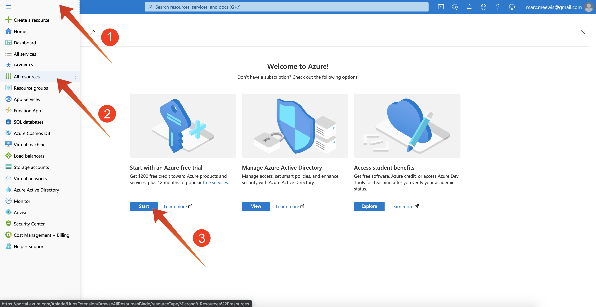

# 2.4.0 Configuration de votre environnement

## 2.4.0.1 Création d’un abonnement Azure

>[!NOTE]
>
>Si vous disposez déjà d’un abonnement Azure, vous pouvez ignorer cette étape. Poursuivez l’exercice 13.0.2 dans ce cas.

Accédez à [https://portal.azure.com](https://portal.azure.com) et connectez-vous à votre compte Azure. Si vous n’en avez pas, utilisez votre adresse électronique personnelle pour créer votre compte Azure.


Une fois la connexion établie, l’écran suivant s’affiche :


Cliquez sur dans le menu de gauche et sélectionnez **Toutes les ressources**. L’écran d’abonnement Azure s’affiche si vous n’êtes pas encore abonné. Dans ce cas, sélectionnez **Démarrer avec une version d’essai gratuite Azure**.



Remplissez le formulaire d&#39;abonnement Azure, fournissez votre téléphone mobile et votre carte de crédit pour l&#39;activation (vous aurez un tarif réduit pendant 30 jours et vous ne serez pas facturé, sauf si vous effectuez une mise à niveau) :


Lorsque le processus d’abonnement est terminé, vous pouvez procéder comme suit :


## 2.4.0.2 Installation de Visual Code Studio

Vous utiliserez Microsoft Visual Code Studio pour gérer votre projet Azure. Vous pouvez le télécharger via [ce lien](https://code.visualstudio.com/download). Suivez les instructions d’installation de votre système d’exploitation spécifique sur ce même site web.

## 2.4.0.3 Installation des extensions Visual Code

Installez les fonctions Azure pour Visual Studio Code depuis [https://marketplace.visualstudio.com/items?itemName=ms-azuretools.vscode-azurefunctions](https://marketplace.visualstudio.com/items?itemName=ms-azuretools.vscode-azurefunctions). Cliquez sur le bouton d’installation :


Installez le compte Azure et la connexion à Visual Studio Code à partir de [https://marketplace.visualstudio.com/items?itemName=ms-vscode.azure-account](https://marketplace.visualstudio.com/items?itemName=ms-vscode.azure-account). Cliquez sur le bouton d’installation :


## 2.4.0.4 Installation de node.js

>[!NOTE]
>
>Si node.js est déjà installé, vous pouvez ignorer cette étape. Poursuivez l’exercice 13.0.5 dans ce cas.

### macOS

Assurez-vous que [Homebrew](https://brew.sh/) est installé en premier. Suivez les instructions [ici](https://brew.sh/).


Une fois que vous avez installé Homebrew, exécutez la commande suivante :

```javascript
brew install node
```

### Windows

Téléchargez le [programme d&#39;installation Windows](https://nodejs.org/en/#home-downloadhead) directement sur le site Web [nodejs.org](https://nodejs.org/en/).

## 2.4.0.5 Vérification de la version de node.js

Pour ce module, la version 12 de node.js doit être installée. Toute autre version de node.js peut entraîner des problèmes avec l’exercice 13.5.

Avant de poursuivre, vérifiez maintenant votre version de node.js.

Exécutez cette commande pour vérifier la version de node.js :

```javascript
node -v
```

Si votre version est inférieure ou supérieure à 12, vous devez effectuer une mise à niveau ou une mise à niveau.

### Mise à niveau/rétrogradation de la version de node.js sur macOS

Assurez-vous que le package **n** est installé.

Pour installer le package **n**, exécutez la commande suivante :

```javascript
sudo npm install -g n
```

Si votre version est inférieure ou supérieure à la version 12, exécutez cette commande pour mettre à niveau ou rétrograder :

```javascript
sudo n 12.6.0
```

### Mise à niveau/rétrogradation de la version de node.js sous Windows

Désinstallez node.js de Windows > Panneau de Contrôle > Ajouter ou supprimer des programmes.

Installation de la version requise à partir du site web [nodejs.org](https://nodejs.org/en/).

## 2.4.0.6 Installer le package NPM : requête

Vous devez installer le package **request** dans le cadre de la configuration de node.js.

Pour installer le package **request**, exécutez la commande suivante :

```javascript
npm install request
```


Étape suivante : [2.4.1 Configuration de votre environnement Microsoft Azure EventHub](./ex1.md)

[Revenir au module 2.4](./segment-activation-microsoft-azure-eventhub.md)

[Revenir à tous les modules](./../../../overview.md)
