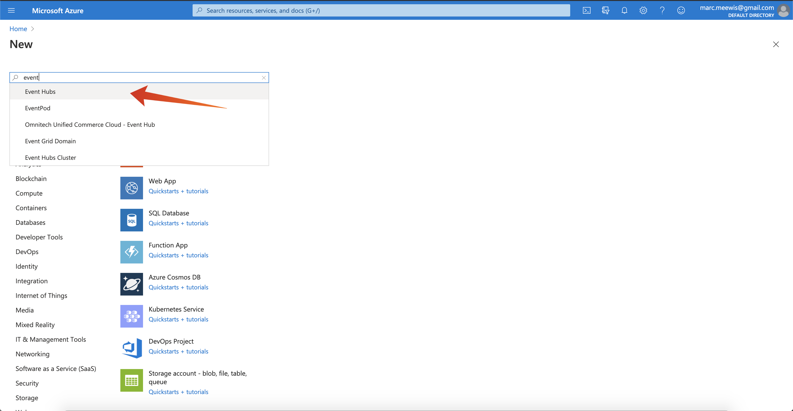
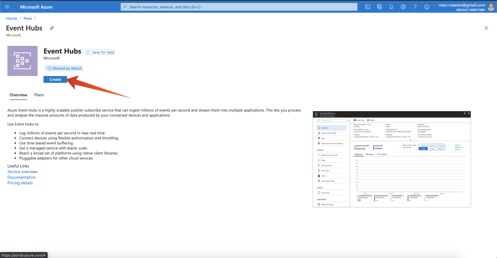

# 2.4.1 Configuration de votre environnement Microsoft Azure EventHub

Azure Event Hubs est un service de publication-abonnement hautement évolutif qui peut ingérer des millions d’événements par seconde et les diffuser dans plusieurs applications. Vous pouvez ainsi traiter et analyser les quantités massives de données produites par vos appareils et applications connectés.

## 2.4.1.1 Qu’est-ce que les centres d’événements Azure ?

Azure Event Hubs est une plateforme de diffusion en continu de données volumineuses et un service d’ingestion d’événements. Il peut recevoir et traiter des millions d’événements par seconde. Les données envoyées à un hub d’événements peuvent être transformées et stockées à l’aide de n’importe quel fournisseur d’analyses en temps réel ou d’adaptateurs de traitement par lot/stockage.

Event Hubs représente la **porte d’entrée** d’un pipeline d’événements, souvent appelé &quot;gestionnaire d’événements&quot; dans les architectures de solution. Un moteur d’événement est un composant ou un service qui se trouve entre les éditeurs d’événements (comme Adobe Experience Platform RTCDP) et les consommateurs d’événements pour découpler la production d’un flux d’événements de la consommation de ces événements. Event Hubs fournit une plateforme de diffusion en continu unifiée avec tampon de conservation du temps, découplant les producteurs d’événements des consommateurs d’événements.

## 2.4.1.2 Création d’un espace de noms Event Hubs

Accédez à [https://portal.azure.com/#home](https://portal.azure.com/#home) et sélectionnez **Créer une ressource**.

Dans l’écran de la ressource, saisissez **Event** dans la barre de recherche et sélectionnez **Event Hubs** dans la liste déroulante :

Cliquez sur **Créer** :

Si c’est la première fois que vous créez une ressource dans Azure, vous devez créer un **groupe de ressources**. Si vous avez déjà un groupe de ressources, vous pouvez le sélectionner (ou en créer un).

Sélectionnez **Créer**, nommez votre groupe `--aepUserLdap---aep-enablement`.

Effectuez le test des champs comme indiqué :

- Espace de noms : définissez votre espace de noms, il doit être unique, utilisez le modèle suivant `--aepUserLdap---aep-enablement`
- Emplacement : **West-Europe** fait référence au centre de données Azure à Amsterdam
- Niveau de prix : **De base**
- Unités de débit : **1**

Cliquez sur **Réviser + créer**.

Cliquez sur **Créer**.

Le déploiement de votre groupe de ressources peut prendre entre 1 et 2 minutes. En cas de réussite, l’écran suivant s’affiche :

## 2.4.1.3 Configuration de votre hub d’événements dans Azure

Accédez à [https://portal.azure.com/#home](https://portal.azure.com/#home) et sélectionnez **Toutes les ressources**.

Dans la liste des ressources, sélectionnez votre espace de noms `--aepUserLdap---aep-enablement` :

Dans l’écran de détails `--aepUserLdap---aep-enablement`, sélectionnez **Event Hubs** :

Cliquez sur **+ Event Hub**.

Utilisez `--aepUserLdap---aep-enablement-event-hub` comme nom et cliquez sur **Créer**.

Cliquez sur **Event Hubs** dans l’espace de noms de votre hub d’événements. Votre **Centre d’événements** devrait maintenant être répertorié. Si c’est le cas, vous pouvez passer à l’exercice suivant.

## 2.4.1.4 Configuration de votre compte Azure Storage

Pour déboguer votre fonction Azure Event Hub dans des exercices ultérieurs, vous devrez fournir un compte de stockage Azure dans le cadre de la configuration de votre projet Visual Studio Code. Vous allez maintenant créer ce compte Azure Storage.

Accédez à [https://portal.azure.com/#home](https://portal.azure.com/#home) et sélectionnez **Créer une ressource**.

Saisissez **storage** dans la recherche et sélectionnez **Compte de stockage** dans la liste.

Sélectionnez **Créer**.

Spécifiez votre **Groupe de ressources** (créé au début de cet exercice), utilisez `--aepUserLdap--aepstorage` comme nom de compte de stockage, sélectionnez **Stockage redondant localement (LRS)**, puis cliquez sur **Réviser + créer**.

Cliquez sur **Créer**.

La création de votre compte de stockage prendra quelques secondes :

Lorsque vous avez terminé, votre écran affiche le bouton **Accéder à la ressource**.

Cliquez sur **Microsoft Azure**.

Votre compte de stockage est maintenant visible sous **Ressources récentes**.

Étape suivante : [2.4.2 Configuration de votre destination Azure Event Hub dans Adobe Experience Platform](./ex2.md)

[Revenir au module 2.4](./segment-activation-microsoft-azure-eventhub.md)

[Revenir à tous les modules](./../../../overview.md)
