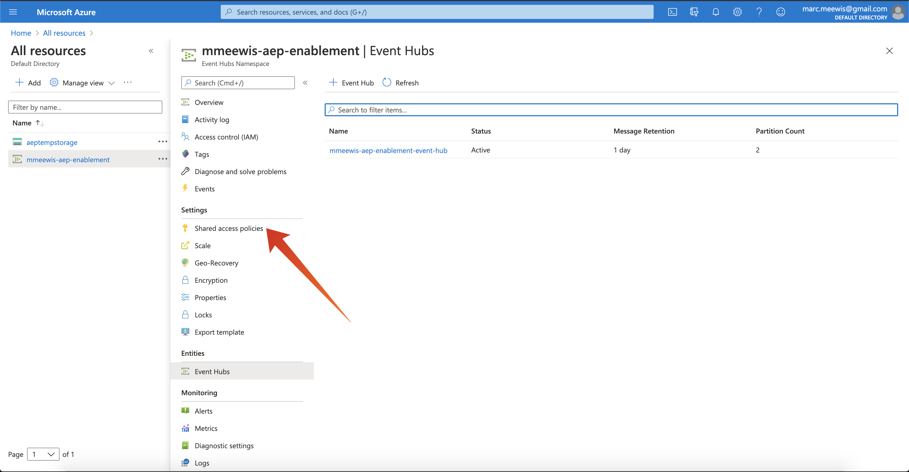

# 2.4.2 Configuration de votre destination Azure Event Hub dans Adobe Experience Platform

## 2.4.2.1 Identification des paramètres requis pour la connexion Azure

Pour définir une destination Event Hub dans Adobe Experience Platform, vous avez besoin de :

- Espace de noms des centres d’événements
- Centre d’événements
- Nom de clé Azure SAS
- Clé Azure SAS

Event Hub et EventHub namespace ont été définis dans l’exercice précédent : [Exercice 1 - Configurer Event Hub dans Azure](./ex1.md)

### Espace de noms des centres d’événements

Pour rechercher les informations ci-dessus dans Azure Portal, accédez à [https://portal.azure.com/#home](https://portal.azure.com/#home). Assurez-vous que vous utilisez le compte Azure approprié.

Sélectionnez **Toutes les ressources** dans Azure Portal :

### Centre d’événements

Recherchez une ressource avec le type de ressource **Espace de noms des centres d’événements**, si vous avez suivi les conventions d’affectation de noms utilisées dans l’exercice précédent, l’espace de noms des centres d’événements sera `--aepUserLdap---aep-enablement`. Prenez note, vous en aurez besoin dans le prochain exercice.

Cliquez sur le nom Espace de noms des centres d’événements pour obtenir les détails :

Sélectionnez **Centre d’événements** pour obtenir une liste des centres d’événements définis dans votre espace de noms des centres d’événements. Si vous avez respecté les conventions d’affectation de noms utilisées dans l’exercice précédent, vous trouverez un centre d’événements nommé `--aepUserLdap---aep-enablement-event-hub`. Prenez note, vous en aurez besoin dans le prochain exercice.

### Nom de clé SAS

Sélectionnez **Stratégies d’accès partagées** pour l’ **espace de noms des centres d’événements**

Une liste des stratégies d’accès partagées s’affiche. La clé SAS que nous recherchons est **RootManageSharedAccessKey**. Il s’agit du nom de la clé SAS. Écris-le !

### Valeur clé SAS

Cliquez sur **RootManageSharedAccessKey** pour obtenir la valeur de clé SAS. Appuyez sur l’icône **Copier dans le presse-papiers** pour copier la **clé de Principal** :

### Résumé des valeurs de destination

À ce stade, vous devez avoir identifié toutes les valeurs nécessaires pour définir la destination Azure Event Hub dans la plateforme de données clients en temps réel de Adobe Experience Platform.

| Nom de l’attribut de destination | Valeur d’attribut de destination | Exemple de valeur |
|---|---|---|
| sasKeyName | Nom de clé SAS | RootManageSharedAccessKey |
| sasKey | Valeur clé SAS | srREx9ShJG1Rv7f/... |
| espace de noms | Espace de noms des centres d’événements | `--aepUserLdap---aep-enablement` |
| eventHubName | Centre d’événements | `--aepUserLdap---aep-enablement-event-hub` |

## 2.4.2.2 Création d’une destination Azure Event Hub dans Adobe Experience Platform

Connectez-vous à Adobe Experience Platform en accédant à cette URL : [https://experience.adobe.com/platform](https://experience.adobe.com/platform).

Une fois connecté, vous accédez à la page d’accueil de Adobe Experience Platform.

Avant de continuer, vous devez sélectionner un **sandbox**. L’environnement de test à sélectionner est nommé ``--aepSandboxName--``. Après avoir sélectionné l’environnement de test approprié, l’écran change et vous êtes désormais dans votre environnement de test dédié.

Accédez à **Destinations**, puis à **Catalogue**.

Sélectionnez **Cloud Storage** et accédez à **Azure Event Hubs** et cliquez sur **Set up** ou **Configure** :

Renseignez les valeurs de destination que vous avez collectées lors de l’exercice précédent. Cliquez ensuite sur **Se connecter à la destination**.

Si vos informations d’identification étaient correctes, une confirmation s’affiche : **Connecté**.

Vous devez maintenant saisir le nom et la description au format `--aepUserLdap---aep-enablement`. Saisissez le **eventHubName** (voir l’exercice précédent, il ressemble à ceci : `--aepUserLdap---aep-enablement-event-hub`) et cliquez sur **Suivant**.

Cliquez sur **Enregistrer et quitter**.

Votre destination est maintenant créée et disponible dans Adobe Experience Platform.

Étape suivante : [2.4.3 Création d’un segment](./ex3.md)

[Revenir au module 2.4](./segment-activation-microsoft-azure-eventhub.md)

[Revenir à tous les modules](./../../../overview.md)
