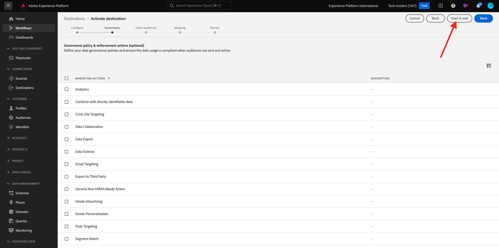

# 2.4.3 Configuration de votre destination Azure Event Hub dans Adobe Experience Platform

## Identification des paramètres de connexion Azure requis

Pour configurer une destination Event Hub dans Adobe Experience Platform, vous avez besoin de :

- Espace de noms des centres d’événements
- Centre d’événements
- Nom de clé Azure SAS
- Clé Azure SAS

Event Hub et l’espace de noms EventHub ont été définis dans l’exercice précédent : [Configurer Event Hub dans Azure](./ex2.md)

### Espace de noms des centres d’événements

Pour rechercher les informations ci-dessus dans Azure Portal, accédez à [https://portal.azure.com/#home](https://portal.azure.com/#home). Assurez-vous que vous utilisez le compte Azure approprié.

Cliquez sur **Toutes les ressources** dans votre portail Azure :

Recherchez votre **espace de noms des centres d’événements** dans la liste et cliquez dessus.

Le nom de votre **espace de noms des centres d’événements** est maintenant clairement visible. Elle doit être similaire à `--aepUserLdap---aep-enablement`.

### Centre d’événements

Sur la page **Espace de noms des centres d’événements**, cliquez sur **Entités > Hubs d’événements** pour obtenir une liste des centres d’événements définis dans l’espace de noms des centres d’événements. Si vous avez suivi les conventions d’affectation de noms utilisées dans l’exercice précédent, vous trouverez un centre d’événements nommé `--aepUserLdap---aep-enablement-event-hub`. Prenez note, vous en aurez besoin dans le prochain exercice.

### Nom de clé SAS

Sur la page **Espace de noms des centres d’événements**, cliquez sur **Paramètres > Stratégies d’accès partagées**. Une liste des stratégies d’accès partagées s’affiche. La clé SAS que nous recherchons est **RootManageSharedAccessKey**, qui est le nom de la clé **SAS. Écris-le !

### Valeur clé SAS

Cliquez ensuite sur **RootManageSharedAccessKey** pour obtenir la valeur de clé SAS. Appuyez sur l’icône **Copier dans le presse-papiers** pour copier la **clé de Principal**, dans ce cas `pqb1jEC0KLazwZzIf2gTHGr75Z+PdkYgv+AEhObbQEY=`.

### Résumé des valeurs de destination

À ce stade, vous devez avoir identifié toutes les valeurs nécessaires pour définir la destination Azure Event Hub dans la plateforme de données clients en temps réel de Adobe Experience Platform.

| Nom de l’attribut de destination | Valeur d’attribut de destination | Exemple de valeur |
|---|---|---|
| sasKeyName | Nom de clé SAS | RootManageSharedAccessKey |
| sasKey | Valeur clé SAS | pqb1jEC0KLazwZzIf2gTHGr75Z+PdkYgv+AEhObbQEY= |
| espace de noms | Espace de noms des centres d’événements | `--aepUserLdap---aep-enablement` |
| eventHubName | Centre d’événements | `--aepUserLdap---aep-enablement-event-hub` |

## Création d’une destination Azure Event Hub dans Adobe Experience Platform

Connectez-vous à Adobe Experience Platform en accédant à cette URL : [https://experience.adobe.com/platform](https://experience.adobe.com/platform).

Une fois connecté, vous accédez à la page d’accueil de Adobe Experience Platform.

Avant de continuer, vous devez sélectionner un **sandbox**. L’environnement de test à sélectionner est nommé ``--aepSandboxName--``. Après avoir sélectionné l’environnement de test approprié, l’écran change et vous êtes désormais dans votre environnement de test dédié.

Accédez à **Destinations**, puis à **Catalogue**. Sélectionnez **Cloud Storage**, accédez à **Azure Event Hubs** et cliquez sur **Configurer**.

Sélectionnez **Authentification standard**. Renseignez les détails de connexion que vous avez collectés dans l’exercice précédent. Cliquez ensuite sur **Se connecter à la destination**.

Si vos informations d’identification étaient correctes, une confirmation s’affiche : **Connecté**.

Vous devez maintenant saisir le nom et la description au format `--aepUserLdap---aep-enablement`. Saisissez le **eventHubName** (voir l’exercice précédent, il ressemble à ceci : `--aepUserLdap---aep-enablement-event-hub`) et cliquez sur **Suivant**.

Vous pouvez éventuellement sélectionner une stratégie de gouvernance des données. Cliquez sur **Enregistrer et quitter**.

Votre destination est maintenant créée et disponible dans Adobe Experience Platform.

Étape suivante : [2.4.4 Création d’une audience](./ex4.md)

[Revenir au module 2.4](./segment-activation-microsoft-azure-eventhub.md)

[Revenir à tous les modules](./../../../overview.md)
