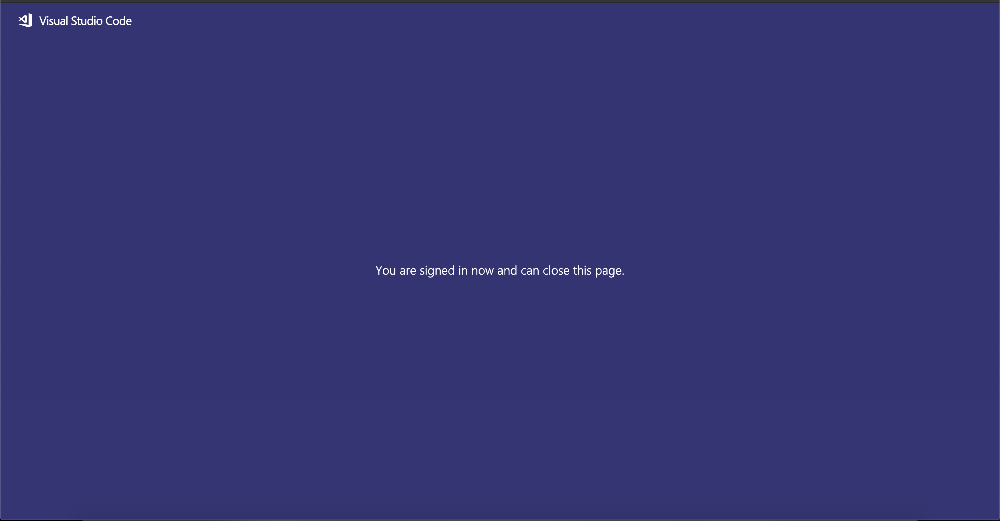

# 2.4.5 Création de votre projet Microsoft Azure

## 2.4.5.1 Prise en main des fonctions Azure Event Hub

Les fonctions Azure vous permettent d’exécuter de petits fragments de code (appelés **fonctions**) sans vous soucier de l’infrastructure de l’application. Avec les fonctions Azure, l’infrastructure cloud fournit tous les serveurs à jour dont vous avez besoin pour que votre application reste en cours d’exécution à grande échelle.

Une fonction est **déclenchée** par un type d’événement spécifique. Les déclencheurs pris en charge incluent la réponse aux modifications des données, la réponse aux messages (par exemple, les centres d’événements), l’exécution selon un calendrier ou le résultat d’une requête HTTP.

Azure Functions est un service informatique sans serveur qui vous permet d’exécuter du code déclenché par un événement sans avoir à configurer ou gérer explicitement l’infrastructure.

Azure Event Hubs s’intègre aux fonctions Azure pour une architecture sans serveur.

## 2.4.5.2 Ouverture de Visual Studio Code et ouverture de session sur Azure

Visual Studio Code facilite la tâche...

- définir et lier des fonctions Azure aux centres d’événements ;
- test local
- déployer vers Azure
- exécution de la fonction de journal distant

### Ouvrir Visual Studio Code

Pour ouvrir Visual Studio Code, saisissez **visuel** dans la recherche de votre système d’exploitation (recherche Spotlight sur OSX, recherche dans la barre des tâches de Windows). Si vous ne le trouvez pas, vous devez répéter les étapes décrites dans [Exercice 0 - Conditions préalables](./ex0.md).


### Connexion à Azure

Lorsque vous vous connectez à votre compte Azure que vous avez utilisé pour vous enregistrer dans [Exercice 0 - Conditions préalables](./ex0.md), Visual Studio Code vous permet de rechercher et de lier toutes les ressources Event Hub.

Cliquez sur l’icône **Azure** dans Visual Studio Code. Si vous ne disposez pas de cette option, il se peut qu’une erreur se soit produite lors de l’installation des extensions requises.

Sélectionnez ensuite **Se connecter à Azure** :


Vous serez redirigé vers votre navigateur pour vous connecter. N’oubliez pas de sélectionner le compte Azure que vous avez utilisé pour vous enregistrer.


Lorsque l’écran suivant s’affiche dans votre navigateur, vous êtes connecté à Visual Code Studio :



Revenez à Visual Code Studio (le nom de votre abonnement Azure s’affiche, par exemple **abonnement Azure 1**) :


## 2.4.5.3 Création d’un projet Azure

Lorsque vous passez le curseur de la souris sur **abonnement Azure 1**, un menu s’affiche au-dessus de la section, puis sélectionnez **Créer un nouveau projet...** :


Sélectionnez un dossier local de votre choix pour enregistrer le projet et cliquez sur **Sélectionner** :


Vous allez maintenant accéder à l’assistant de création de projet. Sélectionnez **Javascript** comme langue pour votre projet :


Sélectionnez **Azure Event Hub trigger** comme premier modèle de fonction de votre projet :


Saisissez un nom pour votre fonction, utilisez le format suivant `--demoProfileLdap---aep-event-hub-trigger` et appuyez sur Entrée :


Sélectionnez **Créer un nouveau paramètre d’application local** :


Sélectionnez un espace de noms du hub d’événements. Vous devriez voir le hub d’événements que vous avez défini dans l’ **exercice 2**. Dans cet exemple, l’espace de noms Event Hub est **vangeluw-aep-enablement** :


Sélectionnez votre hub d’événements. Vous devriez voir le hub d’événements que vous avez défini dans l’ **exercice 2**. Dans mon cas, il s’agit de **vangeluw-aep-enablement-event-hub** :


Sélectionnez **RootManageSharedAccessKey** comme stratégie de hub d’événements :


Saisissez pour utiliser **$Default** :


Sélectionnez **Ajouter à l’espace de travail** pour découvrir comment ouvrir votre projet :


Une fois le projet créé, cliquez sur **index.js** pour ouvrir le fichier dans l’éditeur :


La charge utile envoyée par Adobe Experience Platform à votre hub d’événements inclut les identifiants de segment :

```json
[{
"segmentMembership": {
"ups": {
"ca114007-4122-4ef6-a730-4d98e56dce45": {
"lastQualificationTime": "2020-08-31T10:59:43Z",
"status": "realized"
},
"be2df7e3-a6e3-4eb4-ab12-943a4be90837": {
"lastQualificationTime": "2020-08-31T10:59:56Z",
"status": "realized"
},
"39f0feef-a8f2-48c6-8ebe-3293bc49aaef": {
"lastQualificationTime": "2020-08-31T10:59:56Z",
"status": "realized"
}
}
},
"identityMap": {
"ecid": [{
"id": "08130494355355215032117568021714632048"
}]
}
}]
```

Remplacez le code du fichier index.js de votre code Visual Studio par le code ci-dessous. Ce code sera exécuté chaque fois que la plateforme CDP en temps réel envoie des qualifications de segment à votre destination Event Hub. Dans notre exemple, le code consiste simplement à afficher et à améliorer la charge utile reçue. Mais vous pouvez imaginer n&#39;importe quelle fonction pour traiter les qualifications de segmentation en temps réel.

```javascript
// Marc Meewis - Solution Consultant Adobe - 2020
// Adobe Experience Platform Enablement - Module 13

// Main function
// -------------
// This azure function is fired for each segment activated to the Adobe Exeperience Platform Real-time CDP Azure 
// Eventhub destination
// This function enriched the received segment payload with the name fo the segment. 
// You can replace this function with any logic that is require to process and deliver
// Adobe Experience Platform segments in real-time to any application or platform that 
// would need to act upon an AEP segment qualiification.
// 

module.exports = async function (context, eventHubMessages) {

    return new Promise (function (resolve, reject) {

        context.log('Message : ' + JSON.stringify(eventHubMessages, null, 2));

        resolve();

    });    

};
```

Le résultat doit se présenter comme suit :


## 2.4.5.4 Exécution du projet Azure

Il est maintenant temps de lancer votre projet. À ce stade, nous ne déploierons pas le projet vers Azure. Nous l’exécuterons localement en mode de débogage. Sélectionnez l’icône Exécuter , puis cliquez sur la flèche verte.


La première fois que vous exécuterez votre projet en mode de débogage, vous devrez joindre un compte de stockage Azure, puis cliquer sur **Sélectionner un compte de stockage**.


Dans la liste des comptes de stockage, sélectionnez celui que vous avez créé dans le cadre de la [13.1.4 Setup your Azure Storage Account](./ex1.md). Votre compte de stockage est nommé `--demoProfileLdap--aepstorage`, par exemple : **mmeewisaepstorage**.


Votre projet est maintenant opérationnel et répertorie les événements dans le centre d’événements. Au cours de l’exercice suivant, vous allez démontrer, sur le site web de démonstration de Luma, un comportement qui vous permettra d’accéder à ces segments. Par conséquent, vous recevrez une charge utile de qualification de segment dans le terminal de votre fonction de déclenchement Event Hub :


## 2.4.5.5 Arrêt du projet Azure

Pour arrêter votre projet, sélectionnez l’onglet **Terminal**, cliquez dans la fenêtre du terminal et appuyez sur **CMD-C** sur OSX ou **CTRL-C** sous Windows :


Étape suivante : [2.4.6 Scénario de bout en bout](./ex6.md)

[Revenir au module 2.4](./segment-activation-microsoft-azure-eventhub.md)

[Revenir à tous les modules](./../../../overview.md)
