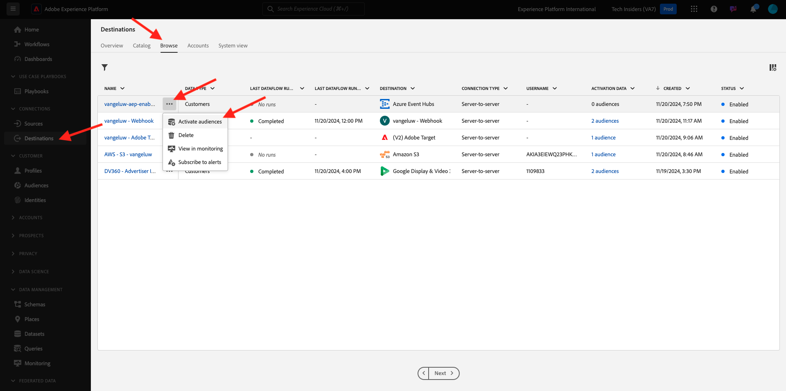
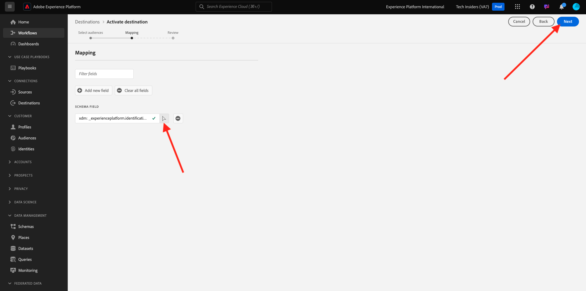

# 2.4.5 Activation de l’audience

## Ajout d’audience à la destination Azure Event Hub

Dans cet exercice, vous allez ajouter votre audience `--aepUserLdap-- - Interest in Plans` à votre destination `--aepUserLdap---aep-enablement` Azure Event Hub.

Connectez-vous à Adobe Experience Platform en accédant à cette URL : [https://experience.adobe.com/platform](https://experience.adobe.com/platform).

Une fois connecté, vous accédez à la page d’accueil de Adobe Experience Platform.

Avant de continuer, vous devez sélectionner un **sandbox**. L’environnement de test à sélectionner est nommé ``--aepSandboxName--``. Après avoir sélectionné l’environnement de test approprié, l’écran change et vous êtes désormais dans votre environnement de test dédié.

Accédez à **Destinations**, puis cliquez sur **Parcourir**. Vous verrez alors toutes les destinations disponibles. Recherchez votre destination et cliquez sur les 3 points**...** comme indiqué ci-dessous, puis cliquez sur **Activer les audiences**.

Vous verrez alors ceci. Recherchez votre audience à l’aide de votre LDAP et sélectionnez `--aepUserLdap-- - Interest in Plans` dans la liste des audiences.

Cliquez sur **Suivant**.

Cliquez sur **Ajouter un nouveau champ**, cliquez sur Parcourir le schéma et sélectionnez le champ `--aepTenantId--identification.core.ecid` (supprimez tout autre champ qui sera affiché automatiquement).

Cliquez sur **Suivant**.

Cliquez sur **Terminer**.

Votre audience est maintenant activée vers votre destination de centre d’événements Microsoft.

Étape suivante : [2.4.6 Création de votre projet Azure Microsoft](./ex6.md)

[Revenir au module 2.4](./segment-activation-microsoft-azure-eventhub.md)

[Revenir à tous les modules](./../../../overview.md)
