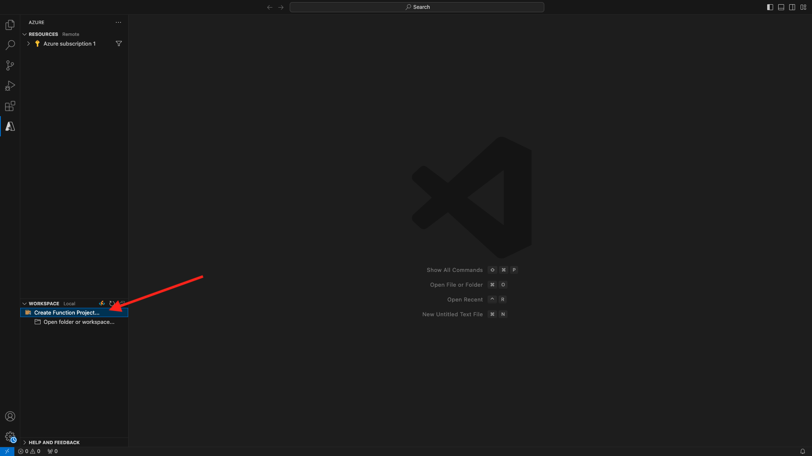

# 2.4.6 Création de votre projet Microsoft Azure

## Prise en main des fonctions Azure Event Hub

Les fonctions Azure vous permettent d’exécuter de petits éléments de code (appelés **fonctions**) sans vous soucier de l’infrastructure de l’application. Avec les fonctions Azure, l’infrastructure cloud fournit tous les serveurs à jour dont vous avez besoin pour que votre application reste en cours d’exécution à grande échelle.

Une fonction est **déclenchée** par un type d’événement spécifique. Les déclencheurs pris en charge incluent la réponse aux modifications des données, la réponse aux messages (par exemple, les centres d’événements), l’exécution selon un calendrier ou le résultat d’une requête HTTP.

Azure Functions est un service informatique sans serveur qui vous permet d’exécuter du code déclenché par un événement sans avoir à configurer ou gérer explicitement l’infrastructure.

Azure Event Hubs s’intègre aux fonctions Azure pour une architecture sans serveur.

## Ouvrez le code Visual Studio et connectez-vous à Azure

Visual Studio Code facilite la tâche...

- définir et lier des fonctions Azure aux centres d’événements ;
- test local
- déployer vers Azure
- exécution de la fonction de journal distant

### Ouvrir Visual Studio Code

### Connexion à Azure

Lorsque vous vous connectez à votre compte Azure que vous avez utilisé pour vous enregistrer dans l’exercice précédent, Visual Studio Code vous permet de rechercher et de lier toutes les ressources Event Hub.

Ouvrez Visual Studio Code et cliquez sur l’icône **Azure** .

Sélectionnez ensuite **Se connecter à Azure** :


Vous serez redirigé vers votre navigateur pour vous connecter. N’oubliez pas de sélectionner le compte Azure que vous avez utilisé pour vous enregistrer.

Lorsque l’écran suivant s’affiche dans votre navigateur, vous êtes connecté à Visual Code Studio :


Revenez à Visual Code Studio (le nom de votre abonnement Azure s’affiche, par exemple **abonnement Azure 1**) :


## Création d’un projet Azure

Cliquez sur **Créer un projet de fonction...** :



Sélectionnez un dossier local de votre choix pour enregistrer le projet et cliquez sur **Sélectionner** :


Vous allez maintenant accéder à l’assistant de création de projet. Cliquez sur **Javascript** comme langue pour votre projet :


Sélectionnez ensuite **Modèle v4**.


Sélectionnez **Azure Event Hub trigger** comme premier modèle de fonction de votre projet :


Saisissez un nom pour votre fonction, utilisez le format suivant `--aepUserLdap---aep-event-hub-trigger` et appuyez sur Entrée :


Sélectionnez **Créer un nouveau paramètre d’application local** :


Cliquez pour sélectionner l’espace de noms Event Hub que vous avez créé précédemment, appelé `--aepUserLdap---aep-enablement`.


Cliquez ensuite pour sélectionner le noeud d’événements que vous avez créé précédemment, nommé `--aepUserLdap---aep-enablement-event-hub`.


Cliquez pour sélectionner **RootManageSharedAccessKey** comme stratégie de hub d’événements :


Sélectionnez **Ajouter à l’espace de travail** pour découvrir comment ouvrir votre projet :


Vous pouvez alors recevoir un message comme celui-ci. Dans ce cas, cliquez sur **Oui, je fais confiance aux auteurs**.


Une fois le projet créé, cliquez sur **index.js** pour ouvrir le fichier dans l’éditeur :


La charge utile envoyée par Adobe Experience Platform à votre hub d’événements inclut les identifiants d’audience :

```json
[{
"segmentMembership": {
"ups": {
"ca114007-4122-4ef6-a730-4d98e56dce45": {
"lastQualificationTime": "2020-08-31T10:59:43Z",
"status": "realized"
},
"be2df7e3-a6e3-4eb4-ab12-943a4be90837": {
"lastQualificationTime": "2020-08-31T10:59:56Z",
"status": "realized"
},
"39f0feef-a8f2-48c6-8ebe-3293bc49aaef": {
"lastQualificationTime": "2020-08-31T10:59:56Z",
"status": "realized"
}
}
},
"identityMap": {
"ecid": [{
"id": "08130494355355215032117568021714632048"
}]
}
}]
```

Remplacez le code du fichier index.js de votre code Visual Studio par le code ci-dessous. Ce code sera exécuté chaque fois que la plateforme CDP en temps réel envoie les qualifications d’audience à votre destination Event Hub. Dans notre exemple, le code consiste simplement à afficher et à améliorer la charge utile reçue. Mais vous pouvez imaginer n&#39;importe quelle fonction pour traiter les qualifications des audiences en temps réel.

```javascript
// Marc Meewis - Solution Consultant Adobe - 2020
// Adobe Experience Platform Enablement - Module 2.4

// Main function
// -------------
// This azure function is fired for each audience activated to the Adobe Exeperience Platform Real-time CDP Azure 
// Eventhub destination
// This function enriched the received audience payload with the name of the audience. 
// You can replace this function with any logic that is require to process and deliver
// Adobe Experience Platform audiences in real-time to any application or platform that 
// would need to act upon an AEP audience qualification.
// 

module.exports = async function (context, eventHubMessages) {

    return new Promise (function (resolve, reject) {

        context.log('Message : ' + JSON.stringify(eventHubMessages, null, 2));

        resolve();

    });    

};
```

Le résultat doit se présenter comme suit :


## Exécution du projet Azure

Il est maintenant temps de lancer votre projet. À ce stade, nous ne déploierons pas le projet vers Azure. Nous l’exécuterons localement en mode de débogage. Sélectionnez l’icône Exécuter , puis cliquez sur la flèche verte.


La première fois que vous exécuterez votre projet en mode de débogage, vous devrez joindre un compte de stockage Azure, cliquer sur **Sélectionner le compte de stockage**, puis sélectionner le compte de stockage que vous avez créé précédemment, nommé `--aepUserLdap--aepstorage`.

Votre projet est maintenant opérationnel et répertorie les événements dans le centre d’événements. Au cours de l’exercice suivant, vous allez démontrer le comportement sur le site web de démonstration CitiSignal qui vous qualifiera pour les audiences. Par conséquent, vous recevrez une charge utile de qualification de l’audience dans le terminal de votre fonction de déclenchement Event Hub.


## Arrêter Azure Project

Pour arrêter votre projet, accédez à la liste **CALL STACK** dans VSC, cliquez sur la flèche de votre projet en cours d’exécution, puis cliquez sur **Arrêter**.


Étape suivante : [2.4.7 Scénario de bout en bout](./ex7.md)

[Revenir au module 2.4](./segment-activation-microsoft-azure-eventhub.md)

[Revenir à tous les modules](./../../../overview.md)
