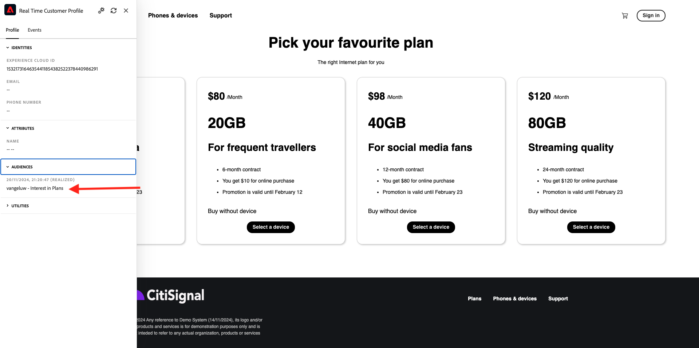

# 2.4.7 Scénario de bout en bout

## Démarrer le déclencheur Azure Event Hub

Pour afficher la charge utile envoyée par la plateforme de données clients en temps réel de Adobe Experience Platform à notre hub d’événements Azure lors de la qualification de l’audience, nous devons démarrer notre simple fonction de déclenchement Azure Event Hub. Cette fonction &quot;décharge&quot; simplement la charge utile vers la console dans Visual Studio Code. Mais rappelez-vous que cette fonction peut être étendue de quelque manière que ce soit pour s&#39;adapter à toutes sortes d&#39;environnements à l&#39;aide d&#39;API et de protocoles dédiés.

### Lancement de Visual Studio Code et démarrage du projet

Assurez-vous que votre projet Visual Studio Code est ouvert et en cours d’exécution.

Pour démarrer/arrêter/redémarrer votre fonction Azure dans Visual Studio Code, reportez-vous à l’exercice précédent.

Le **Terminal** de votre code Visual Studio doit mentionner quelque chose de similaire à ceci :

```code
[2024-11-20T20:07:12.316Z] Debugger listening on ws://127.0.0.1:9229/86c8e251-8e2f-4c65-a063-cda77edbf2ca
[2024-11-20T20:07:12.318Z] For help, see: https://nodejs.org/en/docs/inspector
[2024-11-20T20:07:12.343Z] Worker process started and initialized.
[2024-11-20T20:07:12.359Z] Debugger attached.

Functions:

        vangeluw-aep-event-hub-trigger: eventHubTrigger

For detailed output, run func with --verbose flag.
[2024-11-20T20:07:18.150Z] Host lock lease acquired by instance ID '000000000000000000000000000C19D8'.
```

## Charger votre site web Citi Signal

Accédez à [https://dsn.adobe.com](https://dsn.adobe.com). Une fois connecté avec votre Adobe ID, vous verrez ceci. Cliquez sur les 3 points **...** dans le projet de votre site web, puis cliquez sur **Exécuter** pour l’ouvrir.


Vous verrez alors votre site web de démonstration ouvert. Sélectionnez l’URL et copiez-la dans le presse-papiers.


Ouvrez une nouvelle fenêtre de navigateur incognito.


Collez l’URL de votre site web de démonstration, que vous avez copiée à l’étape précédente. Vous serez alors invité à vous connecter à l’aide de votre Adobe ID.


Sélectionnez le type de compte et procédez à la connexion.


Votre site web est alors chargé dans une fenêtre de navigateur incognito. Pour chaque exercice, vous devrez utiliser une fenêtre de navigateur incognito actualisée pour charger l’URL de votre site web de démonstration.


## Qualifier votre audience

Accédez à la page **Plans** . Cette action vous qualifiera pour l’audience `--aepUserLdap-- - Interest in Plans`.


Pour vérifier, ouvrez le panneau Visionneuse de profils . Vous devez maintenant être membre de `--aepUserLdap-- - Interest in Plans`. Si les appartenances à vos audiences ne sont pas encore mises à jour dans le panneau Visionneuse de profils, cliquez sur le bouton recharger .



Revenez à Visual Studio Code et regardez votre onglet **TERMINAL** , vous devriez voir une liste d’audiences pour votre **ECID** spécifique. Cette payload d’activation est diffusée vers votre centre d’événements dès que vous êtes admissible pour l’audience `--aepUserLdap-- - Interest in Plans`.


Lorsque vous regardez de plus près la charge utile de l’audience, vous pouvez voir que `--aepUserLdap-- - Interest in Plans` est en état **réalisé**.

```json
{
  "identityMap": {
    "ecid": [
      {
        "id": "36281682065771928820739672071812090802"
      }
    ]
  },
  "segmentMembership": {
    "ups": {
      "94db5aed-b90e-478d-9637-9b0fad5bba11": {
        "createdAt": 1732129904025,
        "lastQualificationTime": "2024-11-21T07:33:52Z",
        "mappingCreatedAt": 1732130611000,
        "mappingUpdatedAt": 1732130611000,
        "name": "vangeluw - Interest in Plans",
        "status": "realized",
        "updatedAt": 1732129904025
      }
    }
  }
}
```

Un état d’audience de **réalisé** signifie que votre profil fait partie de l’audience, tandis que l’état **exited** signifie que notre profil a été supprimé de l’audience.

Étape suivante : [Résumé et avantages](./summary.md)

[Revenir au module 2.4](./segment-activation-microsoft-azure-eventhub.md)

[Revenir à tous les modules](./../../../overview.md)
