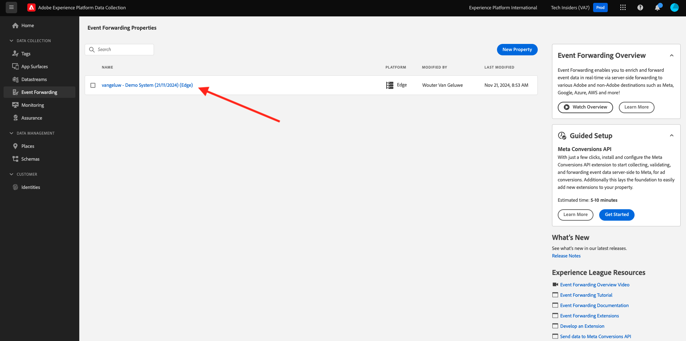

# 2.5.1 Création d’une propriété Transfert d’événement de collecte de données Adobe Experience Platform

>[!NOTE]
>
>L’extension mobile Adobe Experience Platform Edge se trouve actuellement dans BETA. L’utilisation de cette extension est effectuée sur invitation uniquement. Veuillez contacter votre responsable du succès client Adobe pour en savoir plus et accéder aux ressources de ce tutoriel.

## 2.5.1.1 Qu’est-ce qu’une propriété Transfert d’événement de collecte de données Adobe Experience Platform ?

En règle générale, lorsque des données sont collectées à l’aide de la collecte de données Adobe Experience Platform, elles sont collectées sur le **côté client**. **Côté client** est un environnement tel qu&#39;un site web ou une application mobile. Dans les modules 0 et 1, la configuration d’une propriété du client de collecte de données Adobe Experience Platform a fait l’objet de discussions approfondies et vous avez implémenté cette propriété du client de collecte de données Adobe Experience Platform sur votre site web et votre application mobile, de sorte que les données puissent y être collectées lorsqu’un client interagissait avec le site web et l’application mobile.

Lorsque ces données d’interaction sont collectées par la propriété Client de collecte de données Adobe Experience Platform, une demande est envoyée par le site web ou l’application mobile à Edge de l’Adobe. Edge est l’environnement de collecte de données d’Adobe et le point d’entrée des données de parcours de navigation dans l’écosystème d’Adobe. À partir d’Edge, les données collectées sont ensuite envoyées aux applications telles que Adobe Experience Platform, Adobe Analytics, Adobe Audience Manager ou Adobe Target.

Avec l’ajout d’une propriété Transfert d’événement de collecte de données Adobe Experience Platform, il est désormais possible de configurer une propriété Collecte de données Adobe Experience Platform qui écoute les données entrantes sur Edge. Lorsque la propriété Transfert d’événement de collecte de données Adobe Experience Platform qui s’exécute sur Edge voit les données entrantes, elle peut les utiliser et les transférer ailleurs. Cet autre emplacement peut désormais être un webhook externe non Adobe, ce qui permet d’envoyer ces données à par exemple, votre lac de données de votre choix, une application de prise de décision ou toute autre application ayant la capacité d’ouvrir un webhook.

La configuration d’une propriété Transfert d’événement de collecte de données Adobe Experience Platform semble familière à une propriété client, avec la possibilité de configurer des éléments de données et des règles comme par le passé avec les propriétés du client de collecte de données Adobe Experience Platform. Toutefois, la manière dont les données seront accessibles et utilisées sera légèrement différente, selon votre cas d’utilisation.

Commençons par créer la propriété Transfert d’événement de collecte de données Adobe Experience Platform.

## 2.5.1.2 Création d’une propriété Transfert d’événement de collecte de données Adobe Experience Platform

Accédez à [https://experience.adobe.com/#/data-collection/](https://experience.adobe.com/#/data-collection/). Dans le menu de gauche, cliquez sur **Transfert d’événement**. Vous verrez ensuite un aperçu de toutes les propriétés de transfert d’événement de collecte de données Adobe Experience Platform disponibles. Cliquez sur le bouton **New Property** .

Vous devez maintenant saisir un nom pour la propriété Transfert d’événement de collecte de données Adobe Experience Platform. Pour la convention d’affectation des noms, utilisez `--demoProfileLdap-- - Demo System (DD/MM/YYYY) (Edge)`. Par exemple, dans cet exemple, le nom est **vangeluw - Demo System (22/02/2022) (Edge)**. Cliquez sur **Enregistrer**.

Vous revenez alors dans la liste des propriétés de transfert d’événement de collecte de données Adobe Experience Platform. Cliquez sur pour ouvrir la propriété que vous venez de créer.

## 2.5.1.2 Configuration de l’extension Adobe Cloud Connector

Dans le menu de gauche, accédez à **Extensions**. Vous verrez que l’extension **Core** est déjà configurée.

Accédez à **Catalog**. Vous verrez l’extension **Adobe Cloud Connector**. Cliquez sur **Installer** pour l’installer.

L’extension sera alors ajoutée. Il n’y a aucune configuration à faire à cette étape. Vous serez renvoyé à la présentation des extensions installées.

## 2.5.1.3 Déploiement de la propriété Transfert d’événement de collecte de données Adobe Experience Platform

Dans le menu de gauche, accédez à **Flux de publication**. Cliquez sur **Ajouter une bibliothèque**.

Saisissez le nom **Main**, sélectionnez l’environnement **Développement (développement)** et cliquez sur **+ Ajouter toutes les ressources modifiées**.

Vous verrez alors ceci. Cliquez sur **Enregistrer et générer pour le développement**.

Votre bibliothèque sera alors créée, ce qui peut prendre entre 1 et 2 minutes.

Enfin, votre bibliothèque sera créée et prête.

Étape suivante : [2.5.2 Mettre à jour votre flux de données pour rendre les données disponibles pour la propriété de transfert des événements de collecte de données](./ex2.md)

[Revenir au module 2.5](./aep-data-collection-ssf.md)

[Revenir à tous les modules](./../../../overview.md)
